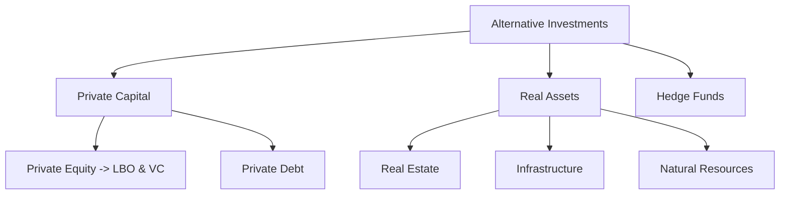
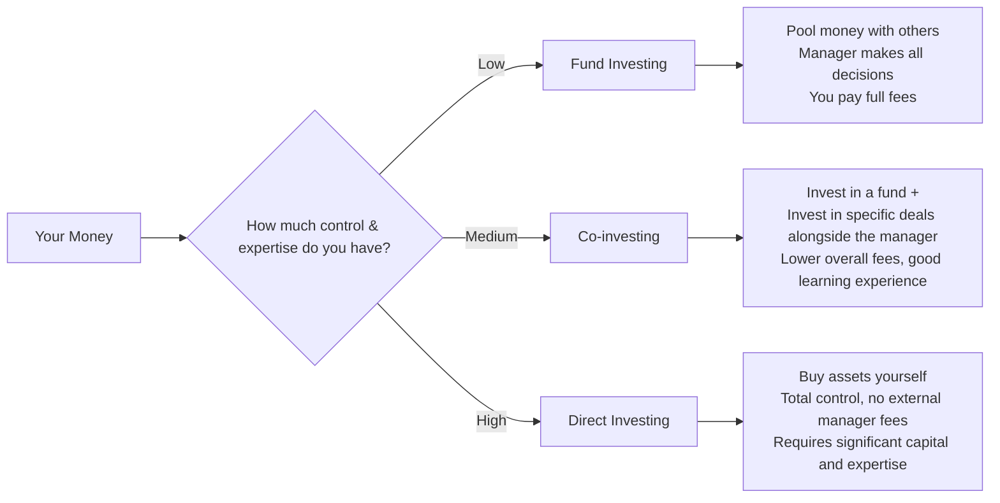

## 🌟 Reading 76: Alternative Investment Features, Methods, and Structures

This reading provides the foundational knowledge for the entire alternative investments topic. It's crucial to understand these core concepts as they reappear in later readings on specific asset types.

-----

###  🤔 What Are Alternative Investments?

Alternative investments are any assets that aren't **traditional investments** (i.e., publicly traded long-only stocks, bonds, and cash). Think of them as the more exotic, less-common items on the investment menu.

The main reasons investors add them to a portfolio are:

  * **Diversification:** Their returns often have a **low correlation** with traditional stock and bond markets. This can lower a portfolio's overall risk. 📉
  * **Higher Return Potential:** Due to factors like illiquidity, complexity, and market inefficiencies, they can offer higher returns than traditional assets. 💰

**Key Features Compared to Traditional Investments:**

  * **Less Liquid:** You can't sell them as easily as a share of Reliance Industries.
  * **Longer Time Horizons:** These are not for short-term trading.
  * **Specialized Managers:** Requires deep expertise; you're paying for skill.
  * **Higher Fees:** Often come with complex and high fee structures.
  * **Less Regulation & Transparency:** Information isn't as readily available as it is for public companies.

-----

###  📂 Categories of Alternative Investments

Here's a simple breakdown of the main categories:



  * **Private Capital:** Investing directly in private companies.
      * **Private Equity:**
          * **Leveraged Buyouts (LBOs):** Using significant debt to buy a mature public company and take it private. The goal is to restructure, improve operations, and sell it for a profit.
          * **Venture Capital (VC):** Providing capital to young, high-growth startups in exchange for equity. Think of early investments in companies like Flipkart or Zomato. This is high-risk, high-reward.
      * **Private Debt:** Lending money directly to companies, often when traditional banks won't. This can include loans to startups (venture debt) or struggling companies (distressed debt).
  * **Real Assets:** Tangible assets with intrinsic value.
      * **Real Estate:** Investing in physical properties like commercial office space in BKC, Mumbai, or residential complexes in Gurgaon.
      * **Infrastructure:** Investing in essential long-term assets like airports, toll roads, or ports. Think of investments made by GMR Group in airports or Adani Group in ports.
      * **Natural Resources:** Includes commodities like oil and gold, as well as productive land like farmland and timberland.
  * **Hedge Funds:** Private investment pools for wealthy, accredited investors. They use complex strategies (like short selling, leverage, and derivatives) to generate returns.

-----

###  💼 How to Invest: Methods of Entry

There are three main ways an investor can gain exposure to alternative investments.



  * **Fund Investing:** The most common method. You give your money to a fund manager (e.g., a PE fund) who pools it with other investors' money and makes the investments. It's hands-off for you.
  * **Co-investing:** A hybrid approach. You invest in a fund, and the manager gives you the option to *also* invest directly in some of the deals the fund makes. This gives you more control and can lower your average fees.
  * **Direct Investing:** For the big players. A large family office or sovereign wealth fund might buy a company or a building directly, without a fund structure. This offers the most control and avoids management fees but requires a dedicated, expert team.

-----

###  🏗️ Structures and Compensation (Very Testable\!)

This is where the money is made—for both the investor and the manager. Understanding this section is critical for the exam.

#### Ownership Structure

Most funds are set up as a **Limited Partnership (LP)**.

  * **General Partner (GP):** The fund manager. They make all investment decisions and have unlimited liability. Think of them as the driver of the car. 🏎️
  * **Limited Partners (LPs):** The investors. They provide the capital but have no say in management and their liability is limited to their investment. They are the passengers. 🙋‍♂️

#### Compensation & Fee Structures

Fees typically have two parts: a management fee and a performance fee.

1.  **Management Fee:** A fixed annual fee to cover the fund's operating costs.

      * For hedge funds, it's typically a percentage of **Assets Under Management (AUM)**.
      * **<mark>EXAM TIP:</mark> For Private Equity funds, the management fee is calculated on *committed capital*, not the amount actually invested.** Committed capital is the total amount an LP agrees to invest, which the GP "draws down" over time. The uninvested portion is called **dry powder**. This structure incentivizes the GP to be patient and find good deals, not just invest quickly.

2.  **Performance Fee (Incentive Fee or Carried Interest):** The GP's share of the profits. This is where things get interesting.

      * **Hurdle Rate (Preferred Return):** A minimum rate of return that the LPs must earn before the GP can start taking a performance fee. For example, the fund must generate at least an 8% return before the GP gets their 20% cut.

      * **Hard Hurdle vs. Soft Hurdle:** This distinction is a classic exam question\!

          * **Hard Hurdle:** The GP only gets a performance fee on returns *above* the hurdle rate.
          * **Soft Hurdle:** If the hurdle rate is met, the GP gets a performance fee on the *entire* return.

        <!-- end list -->

        ```mermaid
        graph TD;
            A{Fund Return = 12%<br>Hurdle = 8%<br>Incentive Fee = 20%};
            A --> B{Is hurdle met? Yes -> 12% > 8%};
            B --> C[<b>Hard Hurdle</b><br>Fee = 20% of -> 12% - 8%<br>Fee = 20% of 4% = <b>0.8%</b>];
            B --> D[<b>Soft Hurdle</b><br>Fee = 20% of 12%<br>Fee = <b>2.4%</b>];
        ```

        ***Real-World Example (Hard vs. Soft Hurdle):*** Imagine you hire a tutor who promises to help you score above 80 on a test.

          * **Hard Hurdle:** You pay them a bonus only for the marks you get *above 80*. If you score 92, you pay a bonus based on 12 marks.
          * **Soft Hurdle:** If you score above 80, you pay them a bonus based on your *entire score* of 92. The soft hurdle is much more lucrative for the tutor (the GP).

      * **High-Water Mark:** This ensures you don't pay a performance fee for the same gains twice. The GP only earns a fee if the fund's value exceeds its previous highest value. If the fund value goes up, then down, then up again, the GP can only charge a fee on the gains above the previous peak.

      * **Waterfall:** This defines the order in which profits are distributed between the GP and LPs.

          * **<mark>EXAM TIP:</mark> American (Deal-by-deal) Waterfall:** The GP gets their performance fee each time an individual investment is sold. This is **better for the GP** because they get paid sooner.
          * **<mark>EXAM TIP:</mark> European (Whole-of-fund) Waterfall:** The GP only gets paid after the LPs have received back their *entire* initial investment plus the hurdle rate. This is **safer and better for the LPs**.

      * **Clawback Provision:** A safety net for LPs, especially with an American waterfall. If a GP gets paid performance fees on early successful deals, but later deals lose money, this provision allows LPs to "claw back" the previously paid fees to make up for the losses.

-----

###  📝 Formulas and Calculations Used in This Reading

While there are no standard algebraic formulas in Reading 76, the fee calculation logic is crucial.

  * **Management Fee (Private Equity):**
    $Fee = Management\ Fee\ \% \times Committed\ Capital$
  * **Performance Fee (Hard Hurdle):**
    $Fee = Performance\ Fee\ \% \times (Total\ Return - Hurdle\ Rate)$
    *(Only if Total Return > Hurdle Rate)*
  * **Performance Fee (Soft Hurdle):**
    $Fee = Performance\ Fee\ \% \times Total\ Return$
    *(Only if Total Return > Hurdle Rate)*

-----

###  🚀 Quick Exam-Day Pointers

On exam day, if you see a question on Reading 76, focus on these key distinctions:

  * **LBO vs. VC:** LBOs are for mature companies using debt; VCs are for young startups using equity.
  * **Committed Capital:** PE management fees are based on this, not just invested capital.
  * **Hard vs. Soft Hurdle:** Hard is on returns *above* the hurdle; Soft is on the *entire* return. Remember the tutor example.
  * **American vs. European Waterfall:** American is deal-by-deal (favors GP); European is whole-fund (favors LP).
  * **Clawback & High-Water Mark:** Both are mechanisms to protect the Limited Partners (LPs).