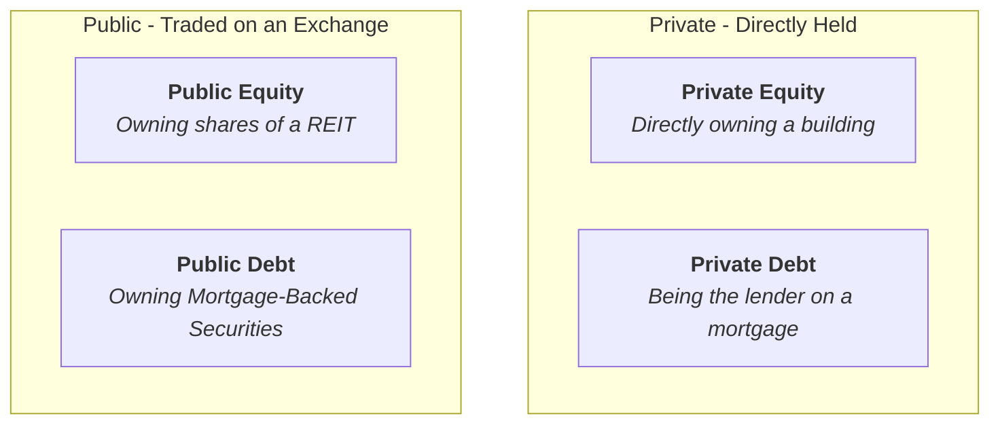
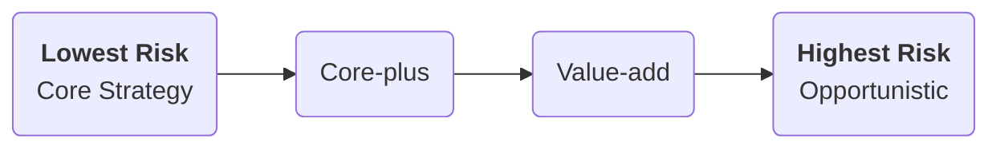

## 🌟 Reading 79: Real Estate and Infrastructure

This reading introduces tangible, physical assets. Understanding the key classifications—especially the Real Estate Quadrant and the Greenfield/Brownfield distinction for infrastructure—is vital for the exam.

-----

###  🏢 Part 1: Real Estate

Real estate investments can provide returns from two sources: income from rent and potential for price appreciation.

#### The Real Estate Investment Quadrant

**<mark>EXAM TIP:</mark>** This is a fundamental concept. Investments are classified along two dimensions: **Public vs. Private** and **Debt vs. Equity**.

  * **Direct Investment (Private):**
      * **Pros:** 👍 Full control over the property, potential tax benefits (like depreciation), and good diversification from stocks/bonds.
      * **Cons:** 👎 Highly illiquid, requires huge capital, needs active management, and high concentration risk (all your money in one or two properties).
  * **Indirect Investment (Public):**
      * **Pros:** 👍 Liquid (you can sell shares easily), professionally managed, and provides diversification across many properties.
      * **Cons:** 👎 No direct control, and returns (especially for REITs) have a higher correlation with the stock market, which reduces diversification benefits.

#### Focus on REITs (Real Estate Investment Trusts)

REITs are a very popular way to invest in real estate. Think of them as mutual funds for properties. They own and operate a portfolio of real estate and are traded on stock exchanges. In India, examples include **Embassy Office Parks REIT** and **Mindspace Business Parks REIT**.

**<mark>EXAM TIP:</mark>** Know the risk spectrum of REIT investment strategies.

1.  **Core Strategy:** The safest. Invests in high-quality, stable, fully leased properties in prime locations. Generates stable, bond-like income. (e.g., Owning a Class A office building in Mumbai's BKC with a 10-year lease to a major bank).
2.  **Core-plus Strategy:** A little more risk. Might involve minor property improvements or modest redevelopment.
3.  **Value-add Strategy:** Higher risk. Buys properties that need significant redevelopment to increase their value. (e.g., Buying an old, poorly-managed shopping mall in Pune and completely renovating it).
4.  **Opportunistic Strategy:** The highest risk and most equity-like. Involves complex projects like developing new properties from the ground up, buying distressed assets, or speculating on market turnarounds.

-----

###  🏗️ Part 2: Infrastructure

Infrastructure refers to the essential, long-lived physical assets that a society needs to function. This includes everything from roads and airports to utility grids and schools.

#### Greenfield vs. Brownfield Investments

**<mark>EXAM TIP:</mark>** This is the most important concept in this section. You will almost certainly be tested on the difference.

  * **Greenfield Investments 🌱:** Funding and building a **brand-new** project from scratch.

      * **Mnemonic:** Think of building on a "green field" of empty land.
      * **Characteristics:** High risk (construction delays, cost overruns), no initial cash flow, but high potential for growth and returns.
      * ***Indian Example:*** The development of the new Navi Mumbai International Airport. It's a massive project being built from the ground up.

  * **Brownfield Investments 🏭:** Investing in an **existing**, operational asset.

      * **Mnemonic:** Think of a developed "brown" industrial site that already exists.
      * **Characteristics:** Lower risk, stable and predictable cash flows (from tolls, fees, etc.), but lower growth potential.
      * ***Indian Example:*** A private equity fund buying a stake in an existing, operational toll road on the Mumbai-Pune Expressway. The road is already built and generating revenue.
      * A **secondary-stage** investment is the least risky type of brownfield, involving a fully operational asset that needs no further development.

#### Investment Characteristics

  * **Cash Flows:** Very stable and long-term due to long-term contracts, high barriers to entry, and often, inelastic demand (people always need electricity and transport).
  * **Correlation:** Low correlation with equities and bonds, making it a powerful portfolio diversifier.
  * **Key Risks:**
      * **Regulatory Risk:** Governments can change rules, tolls, or contract terms.
      * **Construction Risk:** Specific to greenfield projects.
      * **Operational Risk:** Things can go wrong in the day-to-day running of the asset.
  * **Suitable for:** Investors with very long time horizons who need to match long-term liabilities, such as **pension funds** and **sovereign wealth funds**.

-----

###  📝 Formulas and Calculations Used in This Reading

This reading is purely descriptive. There are **no formulas** you need to memorize. Your focus should be on understanding the classifications, characteristics, and key distinctions.

-----

###  🚀 Quick Exam-Day Pointers

For Reading 79, lock in these three key concepts:

1.  **The Real Estate Quadrant:** Be able to classify an investment as Public/Private and Equity/Debt.
2.  **REIT Strategy Risk Spectrum:** Know the order from safest to riskiest: **Core → Core-plus → Value-add → Opportunistic**.
3.  **Greenfield vs. Brownfield:** This is a guaranteed concept. **Greenfield = NEW.** **Brownfield = EXISTING.** Know their different risk and return profiles.