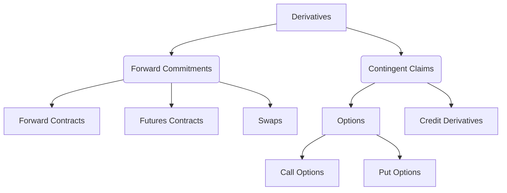

## Reading 67: Forward Commitment and Contingent Claim Features and Instruments

### **LOS 67.a: Define forward contracts, futures contracts, swaps, options (calls and puts), and credit derivatives and compare their basic characteristics.**

This LOS introduces the fundamental building blocks of the derivatives world. We can classify them into two broad categories, which we will explore later in this reading: **Forward Commitments** and **Contingent Claims**.

#### 1\. Forward Contracts

A **forward contract** is a private, customized agreement between two parties to buy or sell an asset at a specified price on a future date.

  * **Customized**: The terms (asset, quantity, date, price) are all negotiated between the two parties.
  * **Private (OTC)**: They don't trade on an exchange.
  * **Counterparty Risk**: Because it's a private agreement, there is a significant risk that one party might default on its obligation.

#### 2\. Futures Contracts

A **futures contract** is a standardized forward contract that trades on an organized exchange (like the NSE in India).

  * **Standardized**: The exchange sets all terms, so all contracts for a given asset and month are identical.
  * **Exchange-Traded**: Traded publicly, providing transparency.
  * **No Counterparty Risk**: The exchange's clearinghouse guarantees every trade.
  * **Marked-to-Market**: Gains and losses are settled in cash every single day. This daily settlement process, along with margin requirements, is how the exchange prevents defaults.

Here's a key comparison for the exam:

| Feature | Forward Contract | Futures Contract |
| :--- | :--- | :--- |
| **Trading Venue** | Private (Over-the-Counter) | Public Exchange (e.g., NSE) |
| **Standardization** | Customized | Standardized |
| **Counterparty Risk**| High | Virtually None (due to clearinghouse) |
| **Liquidity** | Low | High |
| **Settlement** | Single payment at expiration | Daily cash settlement (Mark-to-Market) |

#### 3\. Swaps

A **swap** is an agreement between two parties to exchange a series of cash flows over a period of time. Think of it as a series of forward contracts bundled together. The most common type is an "interest rate swap," where one party pays a fixed interest rate and receives a floating rate from the other party, based on a notional principal amount, 3174].

#### 4\. Options (Calls and Puts)

An **option** gives the **buyer** the **right, but not the obligation**, to buy or sell an underlying asset at a predetermined price on or before a specified date, 2966]. This is the critical difference from forwards and futures, which are obligations.

  * **Call Option**: The right to **buy** the underlying asset. You would want the asset's price to go **up**.
  * **Put Option**: The right to **sell** the underlying asset. You would want the asset's price to go **down**.
  * **Premium**: The buyer pays a price to the seller (writer) for this right, called the option premium.

#### 5\. Credit Derivatives

A **credit derivative** is a contract that transfers credit risk from one party to another. The most common example is a **Credit Default Swap (CDS)**, which acts like an insurance policy on a bond. The buyer pays regular premiums, and the seller agrees to pay out if the bond's issuer defaults.

Here's a Mermaid diagram to help visualize the family of derivatives:



-----

Would you like to proceed to the next LOS on calculating option profits and values?

### **LOS 67.b: Determine the value at expiration and profit from a long or a short position in a call or put option.**

This is a very practical and frequently tested area. The key is to distinguish between an option's **value at expiration** (its intrinsic worth) and the **profit** from the trade, which must account for the initial premium paid or received.

Let's use an example: a stock option on **Tata Consultancy Services (TCS)**.

  * Current TCS Stock Price (S): Let's assume various prices at expiration.
  * Exercise Price (X): **₹3,500**
  * Call Premium (c): **₹100**
  * Put Premium (p): **₹80**

#### Call Options

A call option gives the buyer the right to buy TCS at ₹3,500.

**1. Long Call (Buyer)**
You buy the call, hoping the price of TCS goes up. Your maximum loss is the ₹100 premium you paid.

  * **Value at Expiration** = $Max(0, S - X)$
  * **Profit** = Value at Expiration - Call Premium
  * **Breakeven** = Exercise Price + Premium = ₹3,500 + ₹100 = **₹3,600**

**2. Short Call (Seller/Writer)**
You sell the call, hoping the price of TCS stays below ₹3,500. Your maximum gain is the ₹100 premium you received. Your potential loss is unlimited.

  * **Profit** = Call Premium - Value at Expiration

**Profit/Loss Diagram for a Call Option:**

```mermaid
xychart-beta
  title "Call Option Profit/Loss -Exercise Price = ₹3,500"
  x-axis "TCS Stock Price at Expiration" [3300, 3400, 3500, 3600, 3700, 3800]
  y-axis "Profit / Loss (₹)" [-200, -100, 0, 100, 200, 300]
  line "Long Call" [
    {x: 3300, y: -100},
    {x: 3400, y: -100},
    {x: 3500, y: -100},
    {x: 3600, y: 0},
    {x: 3700, y: 100},
    {x: 3800, y: 200}
  ]
  line "Short Call" [
    {x: 3300, y: 100},
    {x: 3400, y: 100},
    {x: 3500, y: 100},
    {x: 3600, y: 0},
    {x: 3700, y: -100},
    {x: 3800, y: -200}
  ]
```

#### Put Options

A put option gives the buyer the right to sell TCS at ₹3,500.

**1. Long Put (Buyer)**
You buy the put, hoping the price of TCS goes down. Your maximum loss is the ₹80 premium you paid.

  * **Value at Expiration** = $Max(0, X - S)$
  * **Profit** = Value at Expiration - Put Premium
  * **Breakeven** = Exercise Price - Premium = ₹3,500 - ₹80 = **₹3,420**

**2. Short Put (Seller/Writer)**
You sell the put, hoping the price of TCS stays above ₹3,500. Your maximum gain is the ₹80 premium you received. Your loss is substantial if the stock price falls.

  * **Profit** = Put Premium - Value at Expiration

**Profit/Loss Diagram for a Put Option:**

```mermaid
xychart-beta
  title "Put Option Profit/Loss (Exercise Price = ₹3,500)"
  x-axis "TCS Stock Price at Expiration" [3200, 3300, 3420, 3500, 3600, 3700]
  y-axis "Profit / Loss (₹)" [-300, -200, -100, 0, 100, 200]
  line "Long Put" [
    {x: 3200, y: 220},
    {x: 3300, y: 120},
    {x: 3420, y: 0},
    {x: 3500, y: -80},
    {x: 3600, y: -80},
    {x: 3700, y: -80}
  ]
  line "Short Put" [
    {x: 3200, y: -220},
    {x: 3300, y: -120},
    {x: 3420, y: 0},
    {x: 3500, y: 80},
    {x: 3600, y: 80},
    {x: 3700, y: 80}
  ]
```

-----

Would you like to move on to the final LOS for this reading, which contrasts the two major types of derivatives?

### **LOS 67.c: Contrast forward commitments with contingent claims.**

This is a fundamental concept in derivatives. All the instruments we've discussed fall into one of these two categories, 3010].

#### Forward Commitments

A **forward commitment** is a contract that creates an **obligation** for both parties to transact in the future. It's a "we *will* do this" agreement. The value of the contract at initiation is zero for both parties.

  * **Key Feature**: Both parties are locked into the transaction. There is no choice.
  * **Examples**:
      * **Forward Contracts**
      * **Futures Contracts**
      * **Swaps** 

#### Contingent Claims

A **contingent claim** is a contract where the payoff is *contingent* on a future event. It gives one party the **right**, not the obligation, to transact. The other party has the obligation if the right is exercised. The buyer of this right pays a premium at the start.

  * **Key Feature**: One party has a choice to make, depending on whether the outcome is favorable.
  * **Examples**:
      * **Options** (Calls and Puts)
      * **Credit Derivatives** (like a CDS, which only pays out *if* a default event occurs) 

**Exam Tip:** The easiest way to distinguish them is to ask: "Does a party have a choice to act?" If yes, it's a contingent claim. If no (both are obligated), it's a forward commitment.

This decision-making process can be visualized as follows:

```mermaid
graph TD
    subgraph Forward Commitment (e.g., Forward Contract)
        A[Start] --> B{Settlement Date Arrives};
        B --> C[Buyer MUST Buy, Seller MUST Sell];
    end

    subgraph Contingent Claim (e.g., Call Option)
        D[Start] --> E{Settlement Date Arrives};
        E --> F{Is Price > Exercise Price?};
        F -- Yes --> G[Buyer CHOOSES to Exercise];
        F -- No --> H[Buyer CHOOSES to Let Expire];
    end
```

-----

### Final Summary for Reading 67

#### Formulas Used in This Reading

  * **Call Option Value at Expiration** = $Max(0, \\text{Spot Price at Expiration} - \\text{Exercise Price})$
  * **Put Option Value at Expiration** = $Max(0, \\text{Exercise Price} - \\text{Spot Price at Expiration})$
  * **Profit for Long Position (Buyer)** = Value at Expiration - Premium Paid
  * **Profit for Short Position (Seller)** = Premium Received - Value at Expiration
  * **Breakeven for Call Option** = Exercise Price + Premium
  * **Breakeven for Put Option** = Exercise Price - Premium

#### Quick Exam-Day Pointers

  * **Forwards vs. Futures**: Remember that futures are standardized, exchange-traded, and have no counterparty risk due to daily marking-to-market and a central clearinghouse. Forwards are customized, private (OTC), and have significant counterparty risk.
  * **Obligation vs. Right**: This is the core difference between the two main classes of derivatives. Forward commitments (forwards, futures, swaps) are **obligations**. Contingent claims (options, CDS) provide a **right** to one party.
  * **Option Profit/Loss**: Don't forget to subtract the premium when calculating profit for a buyer, and to add it when calculating profit for a seller. The maximum loss for an option *buyer* is always the premium they paid. The maximum profit for an option *seller* is the premium they received.
  * **Call vs. Put**: A **Call** is a bet on the price **going up**. A **Put** is a bet on the price **going down**.