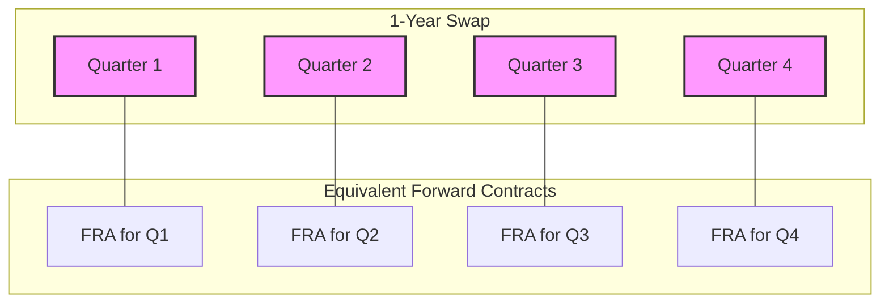

### **Swaps vs. a Series of Forward Contracts (LOS 72.a) 🤝**

An interest rate swap can be understood in two powerful ways: as a package of forward contracts or as a combination of two different bonds.

#### **1. A Swap as a Bundle of Forwards**

Think of an interest rate swap as a series of Forward Rate Agreements (FRAs) bundled together. In a swap, you agree to exchange a fixed interest payment for a floating one over multiple periods. This is economically the same as entering into a separate FRA for each of those periods, all with the same fixed rate.

**🇮🇳 Indian Example:** Imagine Infosys enters a 1-year swap to pay a fixed rate and receive the floating MIBOR quarterly on a notional amount of ₹50 crore. This is like simultaneously entering into four separate FRAs:

  * An FRA that settles in 3 months.
  * An FRA that settles in 6 months.
  * An FRA that settles in 9 months.
  * An FRA that settles in 12 months.

All four FRAs would be based on the same fixed rate agreed upon in the swap.

#### **2. A Swap as a Combination of Bonds**

This is the most intuitive way to think about swap valuation. A swap is equivalent to buying one type of bond and selling another.

  * **Fixed-Rate Payer (Receives Floating):** This position is the same as being **short a fixed-rate bond** (you have an obligation to make fixed payments) and **long a floating-rate note (FRN)** (you are entitled to receive floating payments).
  * **Floating-Rate Payer (Receives Fixed):** This position is the same as being **long a fixed-rate bond** and **short an FRN**.

> **💡 Exam Tip:** This bond analogy is the key to understanding swap valuation on the exam. If you can remember that a swap is just a portfolio of two bonds, the valuation logic becomes much simpler.

-----

### **The Price vs. The Value of a Swap (LOS 72.b) ⚖️**

It is critical not to confuse the price of a swap with its value.

#### **Price of a Swap**

The **"price"** of a swap is simply the **fixed interest rate** specified in the contract. This rate, often called the **par swap rate**, is carefully calculated at the start to ensure the contract is fair for both parties.

#### **Value of a Swap**

The **value** of a swap is its net worth at any given point in time.

  * **At Initiation:** The swap rate is set so that the present value of the fixed payments equals the present value of the expected floating payments. Therefore, the initial value of a swap is **zero**.
  * **During its Life:** As market interest rates change, the expected future floating payments will change, causing the value of the swap to move away from zero.
      * If interest rates **rise**, the floating payments will be higher than originally expected. This benefits the person receiving floating (the fixed-rate payer), and the swap will have a **positive value** for them.
      * If interest rates **fall**, the floating payments will be lower. This hurts the fixed-rate payer, and the swap will have a **negative value** for them.

Valuing the swap is straightforward using the bond analogy:

`Value of the Swap = Value of the Asset You Own - Value of the Liability You Owe`

For a **fixed-rate payer**:
`Value = Value of the FRN - Value of the Fixed-Rate Bond`

> ⭐ **Exam Highlight:** A huge shortcut for valuation is knowing that on any coupon reset date, the value of a floating-rate note (FRN) is always equal to its par value (e.g., ₹10 crore). So, on a reset date, the valuation for a fixed-rate payer simplifies to:
>
> `Value = Par Value - Current Market Value of the Fixed-Rate Bond`

-----

### **Formulas Used in This Reading 🧮**

While this reading focuses on concepts, the valuation framework is expressed as:

1.  **Swap Value (Fixed-Rate Payer's Perspective):**
    $$\text{Value}_{\text{swap}} = \text{PV}(\text{Expected Floating Payments}) - \text{PV}(\text{Fixed Payments})$$
    

2.  **Swap Value using Bond Analogy (Fixed-Rate Payer's Perspective):**
    $$\text{Value}_{\text{swap}} = \text{Value}_{\text{FRN}} - \text{Value}_{\text{Fixed-Rate Bond}}$$

-----

### **Quick Exam-Day Pointer ✅**

  * The **price** of a swap is the **fixed rate**.
  * The **value** of a swap starts at **zero**.
  * **Valuation Secret:** A swap is just a portfolio of two bonds (one long, one short).
  * For a fixed-rate payer, `Value = Value(FRN) - Value(Fixed Bond)`.
  * Remember the shortcut: On a reset date, the `Value(FRN) = Par`. This makes calculations much faster\!