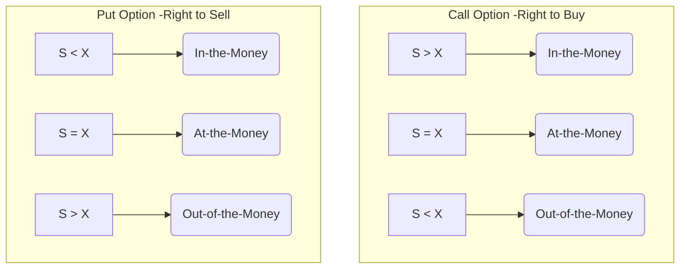

## MODULE 73.1: Option Valuation

This module dives into the fundamental building blocks of an option's price and the key factors that influence its value.

### ✅ LOS 73.a: Explain the exercise value, moneyness, and time value of an option.

An option's price, or **premium**, isn't just a random number; it's composed of two distinct parts: its **exercise value** and its **time value**. To understand these, we first need to grasp the concept of **moneyness**.

#### Moneyness: Is Your Option a Winner Right Now? 🏆

**Moneyness** tells you whether exercising your option *right now* would result in a positive payoff. An option can be in one of three states:

1.  **In-the-Money (ITM):** Exercising the option would be profitable (ignoring the premium paid).
2.  **At-the-Money (ATM):** The underlying asset's price is equal to the exercise price. No profit or loss on exercise.
3.  **Out-of-the-Money (OTM):** Exercising the option would result in a loss. You wouldn't do it\!

Here’s a simple breakdown where S = Stock Price and X = Exercise Price:

**Indian Context Example:**
Imagine you have a call option on Reliance Industries (RIL) with an **exercise price (X)** of ₹3,000.

  * If RIL is currently trading at **S = ₹3,100**, your call option is **₹100 in-the-money**.
  * If RIL is trading at **S = ₹2,950**, your call option is **₹50 out-of-the-money**.
  * If RIL is trading at **S = ₹3,000**, your call option is **at-the-money**.

#### Exercise Value (Intrinsic Value)

This is the value an option would have if it were exercised immediately. It's simply the amount by which an option is in-the-money. **Crucially, the exercise value can never be negative**—if an option is OTM, its exercise value is zero because you would simply not exercise it.

  * **Call Exercise Value** = $Max(0, S - X)$
  * **Put Exercise Value** = $Max(0, X - S)$

#### Time Value

Why would anyone pay for an OTM option that has an exercise value of zero? The answer is **time value**. This is the portion of the option premium that reflects the possibility that the option's value will increase before it expires. It's essentially the "hope" value.

The formula that ties everything together is:
$$\text{Option Premium} = \text{Exercise Value} + \text{Time Value}$$
At expiration, there is no time left, so the **time value is zero**. The option's price becomes equal to its exercise value.

**<mark>EXAM TIP:</mark> 📝**
For the CFA Level 1 exam, you must be able to instantly identify an option's moneyness and calculate its exercise value and time value from its premium. This is a foundational concept that gets tested frequently.

-----

### ✅ LOS 73.b: Contrast the use of arbitrage and replication concepts in pricing forward commitments and contingent claims.

While both **forward commitments** (like forwards and futures) and **contingent claims** (like options) are priced using **no-arbitrage** principles, the application is different.

  * **Forward Commitments:** These are priced so that their **value at initiation is zero** for both parties. The pricing is based on replicating the payoff by buying the underlying asset and financing it at the risk-free rate (the cost of carry).
  * **Contingent Claims (Options):** Options have a **positive value at initiation**, which is the premium paid by the buyer. Their payoffs are one-sided (e.g., a call option buyer can't lose more than the premium). Because of this asymmetry, simple cost-of-carry replication doesn't work. Instead, we use no-arbitrage rules to establish **price boundaries** (upper and lower limits) for option values.

#### Option Price Boundaries

These boundaries define the "rules" for option prices. If an option's price falls outside these boundaries, a risk-free arbitrage profit is possible.

| Option Type | Lower Bound (Minimum Value) | Upper Bound (Maximum Value) |
| :--- | :--- | :--- |
| **European Call** | $c_0 \ge Max[0, S_0 - X(1 + R_f)^{-T}]$ | $c_0 \le S_0$ |
| **European Put** | $p_0 \ge Max[0, X(1 + R_f)^{-T} - S_0]$ | $p_0 \le X(1 + R_f)^{-T}$ |

**Key Intuition:**

  * A call option gives you the right to buy the stock, so its value can **never exceed the stock's price itself**.
  * A put option gives you the right to sell a stock for price X. Even if the stock price drops to zero, the most you can get is X, and you only get it at expiration. So, its value can **never exceed the present value of the exercise price**.
  * The lower bounds ensure that the option is worth at least its exercise value, after accounting for the time value of money on the exercise price.

**<mark>EXAM TIP:</mark> 📝**
You are unlikely to be asked to derive these bounds on the exam. However, you should **memorize the formulas for the bounds** and understand the logic behind them. A common question might test whether you can identify if an option is mispriced based on these rules.

-----

Ready to explore the factors that drive option values?

### ✅ LOS 73.c: Identify the factors that determine the value of an option and describe how each factor affects the value of an option.

Six primary factors influence the price of an option. Understanding their impact is absolutely critical.

| Factor | Change | Impact on Call Value | Impact on Put Value | Why? |
| :--- | :--- | :--- | :--- | :--- |
| 1. **Underlying Price ($S_0$)** | ⬆️ | ⬆️ Increase | ⬇️ Decrease | A higher stock price makes the right to **buy** (call) more valuable and the right to **sell** (put) less valuable. |
| 2. **Exercise Price ($X$)** | ⬆️ | ⬇️ Decrease | ⬆️ Increase | A higher exercise price makes it harder for a call to be ITM (less valuable) but easier for a put to be ITM (more valuable). |
| 3. **Time to Expiration ($T$)** | ⬆️ | ⬆️ Increase | ⬆️ Increase\* | More time provides more opportunity for favorable price moves. (\*There's a rare exception for deep ITM European puts). |
| 4. **Volatility ($\sigma$)** | ⬆️ | ⬆️ Increase | ⬆️ Increase | **Crucial\!** Higher volatility increases the chance of extreme price moves. This is good for both calls and puts because payoffs are unlimited/large on one side and losses are capped at the premium. |
| 5. **Risk-Free Rate ($R_f$)** | ⬆️ | ⬆️ Increase | ⬇️ Decrease | A higher risk-free rate lowers the present value of the future exercise price. This is good for a call (you pay less in today's money) and bad for a put (you receive less in today's money). |
| 6. **Carrying Costs/Benefits** (e.g., Dividends) | ⬆️ (e.g., higher dividend) | ⬇️ Decrease | ⬆️ Increase | A stock's price is expected to drop by the dividend amount, which hurts the call's value but helps the put's value. |

**Indian Context Example (Volatility):**
Think about options on Infosys (INFY) versus options on Adani Enterprises (ADANIENT). Historically, Adani stocks have shown higher volatility. Therefore, all else being equal, an option on ADANIENT would be more expensive than a similar option on INFY because there's a greater perceived chance of a large price swing.

**<mark>EXAM TIP:</mark> 📝**
**This table is pure gold for the exam.** Questions asking "what happens to a call/put value if X increases?" are extremely common. Memorize this table and the logic behind each relationship. The effect of volatility is a particularly important and frequently tested concept.

-----

### 📜 Formula Summary for Reading 73

  * **Call Exercise Value:** $Max(0, S - X)$
  * **Put Exercise Value:** $Max(0, X - S)$
  * **Option Premium:** $\text{Option Premium} = \text{Exercise Value} + \text{Time Value}$
  * **Lower Bound (European Call):** $c_0 \ge Max[0, S_0 - X(1 + R_f)^{-T}]$
  * **Upper Bound (European Call):** $c_0 \le S_0$
  * **Lower Bound (European Put):** $p_0 \ge Max[0, X(1 + R_f)^{-T} - S_0]$
  * **Upper Bound (European Put):** $p_0 \le X(1 + R_f)^{-T}$

### 🎯 Quick Exam-Day Pointers

  * **Moneyness is from the buyer's perspective.** A call is ITM if $S > X$; a put is ITM if $S < X$.
  * An option's premium is its **intrinsic value (exercise value) + time value**. At expiration, time value is ZERO.
  * **Volatility is good for options\!** Higher volatility increases the value of *both* calls and puts because it increases the probability of a large payoff. Your loss is always capped at the premium.
  * **Interest rates and calls move together.** Higher $R_f$ = higher call value.
  * **Interest rates and puts move opposite.** Higher $R_f$ = lower put value.
  * Remember the price bounds. An option's price can't be just anything; it must live within its no-arbitrage boundaries.