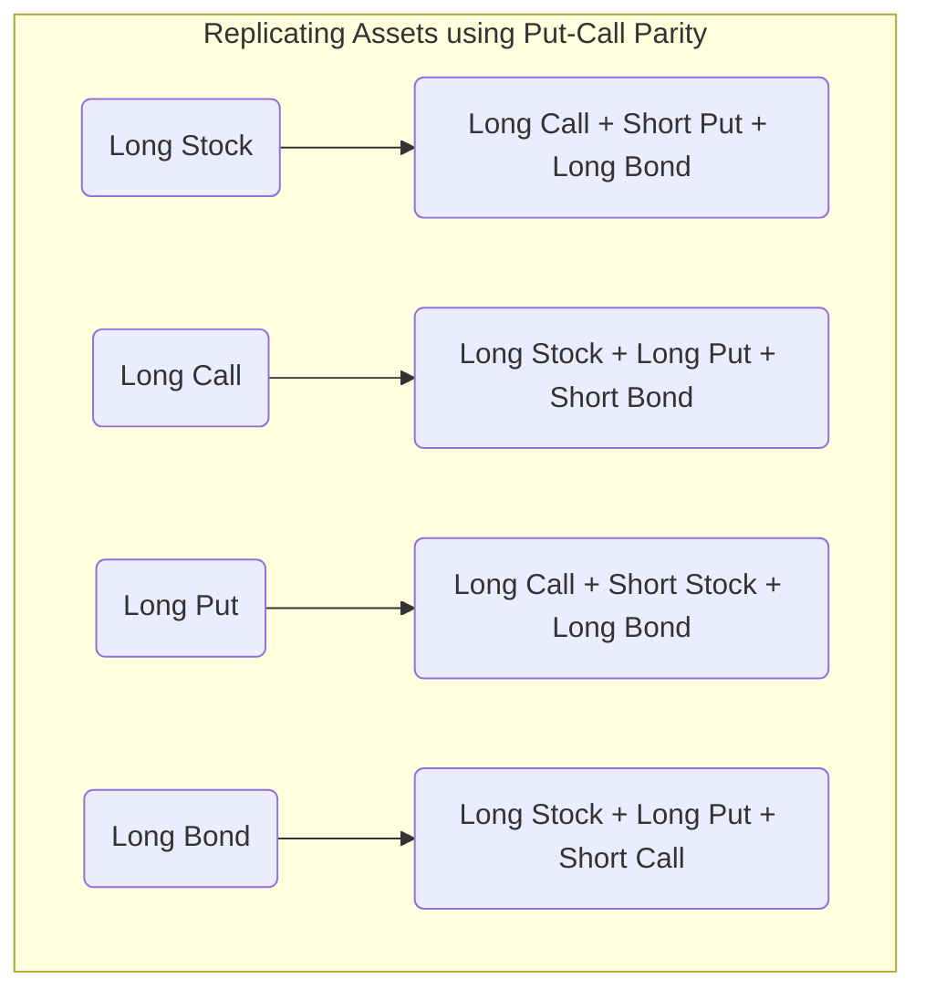

## MODULE 74.1: Put-Call Parity

This module introduces one of the most fundamental and powerful no-arbitrage relationships in derivatives pricing. It's a concept that connects the prices of puts, calls, the underlying asset, and risk-free borrowing/lending.

### ✅ LOS 74.a: Explain put–call parity for European options.

**Put-call parity** is a cornerstone equation that shows the precise relationship between the price of a European call option and a European put option with the **same underlying asset, exercise price (X), and expiration date (T)**. ⚖️

The relationship is built on the principle that if two different portfolios have the exact same payoffs at expiration, they must have the exact same price today. If they don't, a risk-free arbitrage profit is possible.

To derive this, we create two special portfolios:

1.  **Fiduciary Call 📞+💰:** This portfolio consists of:

      * A long **call** option.
      * A risk-free, zero-coupon **bond** that pays the exercise price ($X$) at expiration.
      * **Payoff at Expiration:** If the stock price ($S_T$) is above X, the call is exercised, and the payoff is $(S_T - X) + X = S_T$. If $S_T$ is below X, the call expires worthless, and the payoff is just from the bond, which is $X$. So, the payoff is **Max($S_T$, X)**.

2.  **Protective Put 🛡️+📈:** This portfolio consists of:

      * A long **put** option.
      * A long position in the underlying **stock**.
      * **Payoff at Expiration:** If the stock price ($S_T$) is below X, the put is exercised, and the payoff is $(X - S_T) + S_T = X$. If $S_T$ is above X, the put expires worthless, and the payoff is just the value of the stock, which is $S_T$. So, the payoff is also **Max($S_T$, X)**.

Since both portfolios have identical payoffs, their values today must be equal. This gives us the famous **put-call parity equation**:

$$c_0 + X(1 + R_f)^{-T} = p_0 + S_0$$

Where:

  * $c_0$ = price of the European call today
  * $X(1 + R_f)^{-T}$ = price of the risk-free bond today (present value of X)
  * $p_0$ = price of the European put today
  * $S_0$ = price of the underlying stock today

**Exam Tip 📝**
**This is one of the most important formulas in Level 1 Derivatives.** You MUST memorize it and be comfortable with its algebraic rearrangements. It's tested very frequently, both directly and indirectly.

#### Synthetic Equivalents ⛓️

The real power of put-call parity is that if you have three of the assets, you can perfectly replicate the payoff of the fourth one. This is called creating a **synthetic** position.

By rearranging the main formula, we can create:

  * **Synthetic Stock:** $S_0 = c_0 - p_0 + X(1 + R_f)^{-T}$
  * **Synthetic Call:** $c_0 = p_0 + S_0 - X(1 + R_f)^{-T}$
  * **Synthetic Put:** $p_0 = c_0 - S_0 + X(1 + R_f)^{-T}$
  * **Synthetic Bond:** $X(1 + R_f)^{-T} = p_0 + S_0 - c_0$

**Indian Context Example (Arbitrage):**
Suppose for Nifty 50 options expiring in 3 months:

  * Nifty Spot ($S_0$) = 23,500
  * 23,500 Strike Call ($c_0$) = ₹700
  * 23,500 Strike Put ($p_0$) = ₹500
  * Risk-free rate ($R_f$) = 7% per year.

Let's check if parity holds.

Value of Fiduciary Call side: $c_0 + X(1 + R_f)^{-T} = 700 + 23,500(1.07)^{-0.25} = 700 + 23,099 = \text{₹23,799}$

Value of Protective Put side: $p_0 + S_0 = 500 + 23,500 = \text{₹24,000}$

The protective put side is overpriced\! An arbitrageur would **sell the expensive side (protective put) and buy the cheap side (fiduciary call)**.

  * **Sell:** Short the stock (sell Nifty futures) and sell the put.
  * **Buy:** Buy the call and buy the risk-free bond (invest cash).
    This series of trades would lock in a risk-free profit.

-----

Ready to see how this relationship works with forward contracts?

### ✅ LOS 74.b: Explain put–call forward parity for European options.

This is a simple but elegant extension of the main parity relationship. What if instead of holding the actual stock, our portfolio was based on a **forward contract**?

First, we need to create a **synthetic underlying asset** using a forward. How can we do that?

  * Enter a **long forward contract** to buy the asset at price $F_0(T)$ at time T. (Cost today = 0)
  * Buy a **risk-free bond** that will be worth $F_0(T)$ at time T. (Cost today = $F_0(T)(1+R_f)^{-T}$)

At expiration (T), the bond matures, giving you exactly enough cash to fulfill your forward contract and buy the asset. The payoff is the asset itself, $S_T$.
So, the value of this synthetic asset today is simply the present value of the forward price: $F_0(T)(1+R_f)^{-T}$.

Now, we just take the original put-call parity equation:
$c_0 + X(1 + R_f)^{-T} = p_0 + S_0$

And we **replace the stock ($S_0$) with our synthetic stock**:
$$p_0 + F_0(T)(1+R_f)^{-T} = c_0 + X(1+R_f)^{-T}$$

This is the **put-call-forward parity** relationship. It connects the prices of puts and calls to the **forward price** of the underlying, rather than the spot price.

**Exam Tip 📝**
This is less common on the exam than standard put-call parity, but it's straightforward. Just remember the key substitution: replace $S_0$ with the present value of the forward price, $F_0(T)(1+R_f)^{-T}$.

-----

### 📜 Formula Summary for Reading 74

  * **Put-Call Parity:** $c_0 + X(1 + R_f)^{-T} = p_0 + S_0$
  * **Put-Call-Forward Parity:** $p_0 + F_0(T)(1+R_f)^{-T} = c_0 + X(1+R_f)^{-T}$

### 🎯 Quick Exam-Day Pointers

  * **Memorize the Put-Call Parity formula: $c_0 + X(1 + R_f)^{-T} = p_0 + S_0$**. You should be able to write it down from memory in seconds.
  * Be able to **algebraically rearrange** the formula to solve for any of the four components ($c_0, p_0, S_0, X(1+R_f)^{-T}$).
  * Remember the names of the two portfolios: **Fiduciary Call** (call + bond) and **Protective Put** (put + stock). They have identical payoffs, which is the foundation of the relationship.
  * If the two sides of the equation are not equal, an arbitrage opportunity exists. The strategy is always **"Buy Low, Sell High"**.
  * For put-call-forward parity, just remember to swap out the spot price ($S_0$) for the present value of the forward price ($F_0(T)(1+R_f)^{-T}$).