## MODULE 75.1: Binomial Model for Option Values

This module introduces a foundational method for pricing options: the **binomial model**. It simplifies the complex reality of asset price movements into a simple, two-path scenario, yet it provides powerful insights into the logic of option valuation through no-arbitrage principles. 🌳

### ✅ LOS 75.a: Explain how to value a derivative using a one-period binomial model.

The **one-period binomial model** assumes that over a single period, the price of an underlying asset will move from its current value ($S_0$) to one of two possible future values: an **up-move** ($S^+$) or a **down-move** ($S^-$).

We can determine the price of an option today ($c_0$ or $p_0$) without knowing the *actual* probability of the up or down move. Instead, we use a **no-arbitrage approach** by constructing a perfect hedge.

#### The Hedging Approach (No-Arbitrage Method)

The goal is to create a portfolio consisting of the underlying stock and the option that has the **exact same value** at expiration, regardless of whether the stock price goes up or down. Because this portfolio's future value is certain, its present value can be found by discounting at the risk-free rate.

**Step-by-Step Valuation of a Call Option:**

Let's use an example. We want to value a one-period European call option on State Bank of India (SBIN).

  * **Current Stock Price ($S_0$):** ₹850
  * **Exercise Price ($X$):** ₹860
  * **Up-Move Stock Price ($S^+$):** ₹935 (+10%)
  * **Down-Move Stock Price ($S^-$):** ₹765 (-10%)
  * **Risk-Free Rate ($R_f$):** 2% for the period

**1. Calculate Option Payoffs at Expiration:**
First, we map out the possible outcomes for the stock and the call option.

  * Up-Move Call Value ($c^+$): $Max(0, S^+ - X) = Max(0, 935 - 860) = \\text{₹75}$
  * Down-Move Call Value ($c^-$): $Max(0, S^- - X) = Max(0, 765 - 860) = \\text{₹0}$

```mermaid
graph TD
    subgraph Binomial Tree
        S0(Stock = ₹850) --> S_up(Stock = ₹935);
        S0 --> S_down(Stock = ₹765);
        C0(Call = ?) --> C_up(Call = ₹75);
        C0 --> C_down(Call = ₹0);
    end
```

<!-- end list -->

**2. Calculate the Hedge Ratio (h):**
The **hedge ratio (h)** is the number of shares you need to hold for each option you write (sell) to create a riskless portfolio.
$$h = \frac{c^+ - c^-}{S^+ - S^-} = \frac{75 - 0}{935 - 765} = \frac{75}{170} \approx 0.4412$$
This means if you buy 0.4412 shares of SBIN for every 1 call option you sell, your portfolio's value will be the same in either future state.

**3. Calculate the Certain Payoff of the Hedged Portfolio:**
Let's check this. The value of our portfolio at expiration will be $hS - c$.

  * Value if stock goes up: $(0.4412 \times 935) - 75 = 412.5 - 75 = \\text{₹337.5}$
  * Value if stock goes down: $(0.4412 \times 765) - 0 = \\text{₹337.5}$
    The future payoff is certain: ₹337.5.

**4. Discount the Payoff to Find the Portfolio's Present Value:**
Because the payoff is risk-free, we discount it using the risk-free rate.
$$V_0 = \frac{V^+}{(1 + R_f)} = \frac{337.5}{1.02} = \text{₹330.88}$$

**5. Solve for the Call Option Price ($c_0$):**
The initial cost of setting up the portfolio was $V_0 = hS_0 - c_0$. We can now solve for the unknown call price.
$$330.88 = (0.4412 \times 850) - c_0$$$$330.88 = 375.02 - c_0$$$$c_0 = 375.02 - 330.88 = \text{₹14.14}$$
The no-arbitrage price of the call option today is **₹14.14**.

**Exam Tip 📝**
The exam will likely test your understanding of the process rather than just formula memorization. Practice the 5 steps: (1) Find Payoffs, (2) Find Hedge Ratio, (3) Find Portfolio Future Value, (4) Find Portfolio Present Value, (5) Solve for Option Price.

-----

Are you ready to learn about the risk-neutral approach to the same problem?

### ✅ LOS 75.b: Describe the concept of risk neutrality in derivatives pricing.

This is an alternative, often quicker, way to solve the same problem. It relies on a powerful idea called **risk neutrality**.

**What is Risk Neutrality? 🤔**
Imagine a world where investors are indifferent to risk. In this world, they don't demand a risk premium for holding risky assets. Therefore, the expected return on *any* asset (including our stock) must be the **risk-free rate**. This isn't how the real world works, but it's a clever mathematical trick that simplifies option pricing.

We calculate "pseudo-probabilities" for the up and down moves, called **risk-neutral probabilities**, that force the stock's expected return to equal the risk-free rate.

#### The Risk-Neutral Probability Approach

**Step-by-Step Valuation using Risk-Neutral Probabilities:**

Using the same SBIN example:

**1. Calculate Risk-Neutral Probabilities ($\\pi$):**
The formula for the risk-neutral probability of an up-move is:
$$\pi_{up} = \frac{(1 + R_f) - d}{u - d}$$Where $u = S^+/S_0 = 935/850 = 1.10$ and $d = S^-/S_0 = 765/850 = 0.90$.$$\pi_{up} = \frac{(1.02) - 0.90}{1.10 - 0.90} = \frac{0.12}{0.20} = 0.60$$
The probability of a down-move is simply $\\pi_{down} = 1 - \\pi_{up} = 1 - 0.60 = 0.40$.

**2. Calculate the Expected Payoff of the Option:**
Using these probabilities, find the expected value of the call option at expiration.
$$E(\text{Payoff}) = (\pi_{up} \times c^+) + (\pi_{down} \times c^-)$$
$$E(\text{Payoff}) = (0.60 \times ₹75) + (0.40 \times ₹0) = \text{₹45}$$

**3. Discount the Expected Payoff at the Risk-Free Rate:**
Since we used risk-neutral probabilities, we can discount this expected payoff using the risk-free rate to find the option's value today.
$$c_0 = \frac{E(\text{Payoff})}{(1 + R_f)} = \frac{45}{1.02} = \text{₹44.12}$$

Wait, this value (₹44.12) is different from the one calculated before (₹14.14). Let me recheck the calculations.

  * Hedge Ratio: (75 - 0) / (935 - 765) = 75 / 170 = 0.441176
  * Portfolio Value (Up): 0.441176 \* 935 - 75 = 412.5 - 75 = 337.5
  * Portfolio Value (Down): 0.441176 \* 765 - 0 = 337.5
  * PV of Portfolio: 337.5 / 1.02 = 330.882
  * Initial Portfolio: V0 = h\*S0 - c0 => 330.882 = 0.441176 \* 850 - c0 => 330.882 = 375 - c0 => c0 = 375 - 330.882 = **44.118**

Ah, there was a calculation error in my previous explanation of the hedging approach. My apologies. Let me correct the text.

**Corrected Step 5 of the Hedging Approach:**
The initial cost of setting up the portfolio was $V_0 = hS_0 - c_0$. We can now solve for the unknown call price.
$$330.88 = (0.4412 \times 850) - c_0$$$$330.88 = 375.02 - c_0$$$$c_0 = 375.02 - 330.88 = \text{₹44.14}$$
The no-arbitrage price of the call option today is **₹44.14**.

The two methods now produce the same result (slight rounding difference). This is a critical insight: **both the hedging method and the risk-neutral probability method are built on the same no-arbitrage foundation and will always give the same answer.**

**Exam Tip 📝**
The risk-neutral method is often faster for calculations on the exam. The key is understanding *why* you can discount at the risk-free rate. It's because the probabilities are specifically calibrated to remove any risk premium, making the risk-free rate the appropriate discount rate for the expected payoff.

-----

### 📜 Formula Summary for Reading 75

  * **Hedge Ratio (h):** $h = \\frac{\\text{Payoff}*{up} - \\text{Payoff}*{down}}{\\text{Price}*{up} - \\text{Price}*{down}}$
  * **Hedged Portfolio Value:** $V_0 = \\frac{hS^+ - c^+}{1 + R_f}$ or $V_0 = \\frac{hS^- - c^-}{1 + R_f}$
  * **Call Option Price (Hedge Method):** $c_0 = hS_0 - V_0$
  * **Risk-Neutral Probability of Up-Move ($\\pi_{up}$):** $\\pi_{up} = \\frac{(1 + R_f) - d}{u - d}$ (where u and d are the up/down factors)
  * **Option Price (Risk-Neutral Method):** $c_0 = \\frac{(\\pi_{up} \times c^+) + (\\pi_{down} \times c^-)}{1 + R_f}$

### 🎯 Quick Exam-Day Pointers

  * The binomial model is a tool to find a **no-arbitrage** option price.
  * You can use two methods: **hedging** or **risk-neutral probabilities**. They always give the same answer.
  * The **hedge ratio (h)** is the number of shares per option needed to create a risk-free (perfectly hedged) portfolio.
  * **Risk-neutral probabilities** are *not* real-world probabilities. They are artificial constructs that allow us to discount expected future payoffs at the risk-free rate.
  * For the Level 1 exam, focus on understanding the *process* of both methods. The risk-neutral approach is usually computationally faster if the probabilities are given.