### **Reading 1: Introduction to Financial Statement Analysis**

#### **Overview Diagram**

```mermaid
flowchart TD
    A["📊 Financial Statement Analysis<br/>Foundation Reading"] --> B["🔄 6-Phase Framework<br/>Structured Analysis Process"]
    A --> C["📋 Information Sources<br/>Data Collection Methods"]
    A --> D["📝 Reporting Systems<br/>Global Standards"]
    
    classDef mainNode fill:#e3f2fd,stroke:#0d47a1,stroke-width:4px,color:#000
    classDef phaseNode fill:#f3e5f5,stroke:#4a148c,stroke-width:3px,color:#000
    
    class A mainNode
    class B,C,D phaseNode
```

#### **6-Phase Framework Detail**

```mermaid
flowchart TD
    B["🔄 6-Phase Framework"] --> B1["1️⃣ Purpose & Context<br/>Define Analysis Goals"]
    B --> B2["2️⃣ Collect Data<br/>Gather Information"]
    B --> B3["3️⃣ Process Data<br/>Calculate & Adjust"]
    B --> B4["4️⃣ Analyze & Interpret<br/>Extract Insights"]
    B --> B5["5️⃣ Conclusions & Recommendations<br/>Form & Communicate Results"]
    B --> B6["6️⃣ Follow-Up<br/>Monitor & Update"]
    
    classDef phaseNode fill:#f3e5f5,stroke:#4a148c,stroke-width:3px,color:#000
    classDef sourceNode fill:#e8f5e8,stroke:#1b5e20,stroke-width:3px,color:#000
    
    class B phaseNode
    class B1,B2,B3,B4,B5,B6 sourceNode
```

#### **Information Sources Detail**

```mermaid
flowchart TD
    C["📋 Information Sources"] --> C1["🏛️ Regulatory Filings<br/>Official Documents"]
    C --> C2["📄 Financial Statement Notes<br/>Accounting Details"]
    C --> C3["💬 Management Commentary<br/>MD&A Insights"]
    C --> C4["✅ Auditor Reports<br/>Independent Opinions"]
    
    C1 --> C11["🌐 IOSCO Standards<br/>Global Securities Regulation"]
    C1 --> C12["📑 SEC Forms<br/>10-K, 10-Q, 8-K"]
    C1 --> C13["🗳️ Proxy Statement<br/>DEF-14A"]
    
    C4 --> C41["✅ Unqualified Opinion<br/>Clean Report"]
    C4 --> C42["⚠️ Qualified Opinion<br/>Some Issues"]
    C4 --> C43["❌ Adverse Opinion<br/>Material Misstatements"]
    C4 --> C44["❓ Disclaimer of Opinion<br/>Unable to Opine"]
    
    classDef phaseNode fill:#f3e5f5,stroke:#4a148c,stroke-width:3px,color:#000
    classDef sourceNode fill:#e8f5e8,stroke:#1b5e20,stroke-width:3px,color:#000
    classDef detailNode fill:#fff3e0,stroke:#e65100,stroke-width:2px,color:#000
    
    class C phaseNode
    class C1,C2,C3,C4 sourceNode
    class C11,C12,C13,C41,C42,C43,C44 detailNode
```

#### **Reporting Systems Detail**

```mermaid
flowchart TD
    D["📝 Reporting Systems"] --> D1["🇺🇸 U.S. GAAP<br/>American Standards"]
    D --> D2["🌍 IFRS<br/>International Standards"]
    D --> D3["🇮🇳 Ind AS<br/>Indian Standards"]
    
    D1 --> D11["📏 Rules-based<br/>Detailed Guidelines"]
    D1 --> D12["📦 Allows LIFO<br/>Inventory Method"]
    D1 --> D13["🚫 Prohibits Write-down Reversals<br/>Conservative Approach"]
    
    D2 --> D21["💡 Principles-based<br/>Conceptual Framework"]
    D2 --> D22["🚫 Prohibits LIFO<br/>Not Permitted"]
    D2 --> D23["✅ Permits Write-down Reversals<br/>Under Conditions"]
    
    D3 --> D31["🔗 Converged with IFRS<br/>Aligned Standards"]
    
    classDef phaseNode fill:#f3e5f5,stroke:#4a148c,stroke-width:3px,color:#000
    classDef sourceNode fill:#e8f5e8,stroke:#1b5e20,stroke-width:3px,color:#000
    classDef detailNode fill:#fff3e0,stroke:#e65100,stroke-width:2px,color:#000
    
    class D phaseNode
    class D1,D2,D3 sourceNode
    class D11,D12,D13,D21,D22,D23,D31 detailNode
```

This reading serves as the foundation for the entire topic area. It introduces the "why" and "how" of financial statement analysis, setting the stage for the more technical readings that follow.

#### **1. The Financial Statement Analysis Framework**

**Detailed Explanation:**
Financial statement analysis is not just about calculating a bunch of ratios. It's a structured process designed to answer specific questions and support economic decisions. The CFA curriculum presents a six-phase framework:

1.  **Phase 1: Articulate the Purpose and Context of the Analysis:** Before you even look at a number, you must define your goal. Are you deciding whether to buy a stock (equity analysis), lend money to the company (credit analysis), assign a credit rating, or evaluate a merger? Your purpose will dictate your approach.
2.  **Phase 2: Collect Data:** Gather the necessary information. This includes the company's annual and interim financial reports, management's discussion and analysis (MD&A), press releases, and filings with regulatory bodies. You should also look at industry and economic data to understand the broader environment.
3.  **Phase 3: Process Data:** This is the number-crunching phase. Here, you'll make adjustments to the financial statements, calculate ratios, and prepare common-size statements or graphs.
4.  **Phase 4: Analyze/Interpret the Data:** This is where analysis truly happens. You turn the processed data into meaningful information. The goal is to answer the questions you defined in Phase 1. For example, a high debt ratio isn't just a number; it's an indicator of financial risk that needs interpretation.
5.  **Phase 5: Develop and Communicate Conclusions and Recommendations:** Based on your analysis, you form a conclusion or recommendation (e.g., "Buy," "Sell," "Hold," or assign a credit rating) and communicate it, typically through a research report. This report must be clear, well-supported, and distinguish between facts and opinions.
6.  **Phase 6: Follow-Up:** The process doesn't end with the report. You must periodically review and update your analysis as new information becomes available to see if your initial conclusions are still valid.

**Indian Context Example:**
Imagine you are an equity analyst at HDFC Securities, and your manager asks you to analyze **Tata Consultancy Services (TCS)**.
* **Phase 1 (Purpose):** Your goal is to determine if TCS stock is a "Buy" for clients seeking long-term growth. You need to assess its profitability, growth prospects, and compare it to its main competitor, Infosys.
* **Phase 2 (Data Collection):** You download TCS's annual reports from their website, their filings from the SEBI (Securities and Exchange Board of India) website, listen to their quarterly investor calls, and gather industry reports on the Indian IT sector from NASSCOM.
* **Phase 3-6:** You would then process this data (calculating ratios like net profit margin), analyze it (comparing TCS's margin trends to Infosys's), communicate your findings in a research report, and update it every quarter when new results are released.

> **CFA Exam Tip:**
> For the exam, **memorize the six steps of the framework in order**. You are more likely to be tested on the sequence of the steps or the activities performed in a specific step rather than minute details. For instance, a question might ask, "In which phase of the financial statement analysis framework would an analyst calculate financial ratios?" The answer is "Process Data."

---

#### **2. Sources of Information for Financial Statement Analysis**

**Detailed Explanation:**
Analysts use a wide variety of information sources beyond just the annual report.

* **Regulatory Filings:** These are critical and standardized sources.
    * **International Organization of Securities Commissions (IOSCO):** This is not a regulator itself but an international body of securities commissions that sets global standards for securities regulation. Its core objectives are protecting investors, ensuring fair and transparent markets, and reducing systemic risk.
    * **Securities and Exchange Commission (SEC) in the U.S.:** The SEC requires specific filings that are a goldmine for analysts.
        * **Form 10-K:** The annual report filed with the SEC. It is often more detailed and less of a marketing document than the company's glossy annual report to shareholders.
        * **Form 10-Q:** Quarterly report.
        * **Form 8-K:** Reports major corporate events like acquisitions or management changes.
        * **Proxy Statement (Form DEF-14A):** Contains information on management compensation, board member details, and items for shareholder vote.
* **Financial Statement Notes and Supplementary Information:** The notes (or footnotes) are an integral part of the financial statements. They provide crucial details about the accounting methods, assumptions, and estimates used. For example, the notes will explain the company's revenue recognition policy or the useful lives assumed for its assets.
* **Management Commentary (MD&A):** This section provides management's perspective on the company's performance, position, and future outlook. It's an excellent place to understand the story behind the numbers, including trends, risks, and uncertainties. However, be aware that this section is typically unaudited and can be biased.
* **Auditor's Reports:** An independent auditor provides an opinion on whether the financial statements are presented fairly in accordance with the applicable accounting standards.
    * **Unqualified (or "Clean") Opinion:** This is the best-case scenario, meaning the auditor found no material misstatements.
    * **Qualified Opinion:** The auditor found some material misstatement, but it's not pervasive to the overall statements.
    * **Adverse Opinion:** The financial statements are materially misstated and misleading. This is a major red flag.
    * **Disclaimer of Opinion:** The auditor is unable to express an opinion for some reason, such as a limitation of scope.

**Indian Context Example:**
An analyst covering **Reliance Industries Ltd. (RIL)** would use these sources:
* **SEBI Filings:** The primary source would be the annual and quarterly reports RIL files with SEBI and the stock exchanges (NSE/BSE). The Annual Report contains the financial statements, MD&A, and the auditor's report.
* **Auditor's Report:** The auditor's report for RIL would be checked to ensure it's an unqualified opinion. Any "Key Audit Matters" highlighted by the auditor would be examined closely. For example, the auditor might discuss the complexity of valuing RIL's massive oil and gas assets.
* **MD&A:** This section in RIL's annual report would offer insights into the performance of its different segments like O2C (Oil to Chemicals), Retail, and Digital Services (Jio).

> **CFA Exam Tip:**
> * Know the different types of audit opinions. An **unqualified opinion is the most desirable**.
> * Understand that the **MD&A is not audited** and can contain management's biased perspective.
> * Remember that financial statement **notes are a required and integral part** of the financial statements. Questions often test on where you would find specific information (e.g., information on accounting policies is found in the notes).

---

#### **3. Alternative Financial Reporting Systems**

**Detailed Explanation:**
While there is a push for global convergence, there are still differences between major accounting standards, primarily **International Financial Reporting Standards (IFRS)** and **U.S. Generally Accepted Accounting Principles (U.S. GAAP)**. An analyst must be aware of these differences when comparing companies that report under different standards.

**Key Differences:**
| Basis for Comparison | U.S. GAAP | IFRS |
| :--- | :--- | :--- |
| **Developed by** | Financial Accounting Standards Board (FASB) | International Accounting Standards Board (IASB) |
| **Approach** | More "Rules-based" | More "Principles-based" |
| **Inventory Valuation** | Allows FIFO, Weighted Average, and **LIFO** | Allows FIFO and Weighted Average; **Prohibits LIFO** |
| **Reversal of Write-downs** | **Prohibited** for inventory and PP&E | **Permitted** for inventory and PP&E under certain conditions |
| **Development Costs** | Generally **expensed**, with some exceptions for software | **Capitalized** if certain criteria are met |

**Indian Context Example:**
Indian companies use **Ind AS (Indian Accounting Standards)**, which are largely converged with IFRS. So, an analyst comparing **Infosys (which reports under Ind AS/IFRS)** with a U.S.-based competitor like **Accenture (which reports under U.S. GAAP)** needs to be mindful of these differences. For instance, if Accenture uses LIFO for any part of its inventory (unlikely for a service firm, but a good example), its reported profit margins might not be directly comparable to Infosys's during periods of changing costs.

> **CFA Exam Tip:**
> The differences between IFRS and U.S. GAAP are a **highly testable topic**. The prohibition of LIFO under IFRS is a classic exam question. Also, remember the differences in how impairment loss reversals and development costs are treated.

***

### **Reading 1: Summary**

#### **List of Formulas Used**
There are no specific formulas introduced in this introductory reading.

#### **Quick Exam-Day Pointer**
* Know the **6 steps of the Financial Statement Analysis Framework** in order.
* The **auditor's report** provides an opinion on the fairness of financial statements. An **unqualified opinion** is the most favorable.
* The **MD&A** is management's view and is **unaudited**.
* **Financial statement notes** are essential for understanding the accounting policies and estimates used.
* Be aware of the key differences between **IFRS and U.S. GAAP**, especially regarding LIFO inventory, impairment reversals, and development costs.