### **Reading 10: Financial Reporting Quality**

This reading is about being a skeptical and discerning user of financial statements. It explores the difference between high-quality and low-quality reporting, the motivations for managing earnings, and the warning signs analysts should look for.
#### **Financial Reporting Quality Overview Diagram**
#### **Reporting vs. Earnings Quality Detail**

```mermaid
flowchart TD
    B["🎯 Reporting vs. Earnings Quality"] --> B1["Financial Reporting Quality<br/>Compliant, Decision-Useful, Transparent"]
    B --> B2["Earnings Quality<br/>Sustainable, Adequate Return"]
    B --> B3["Low Reporting Quality<br/>Biased, Non-Compliant, Fraudulent"]
    B --> B4["Low Earnings Quality<br/>Unsustainable, Inflated by One-Time Events"]

    classDef detailNode fill:#fff3e0,stroke:#e65100,stroke-width:2px,color:#000
    class B,B1,B2,B3,B4 detailNode
```

#### **Motivations & Mechanisms for Low-Quality Reporting Detail**

#### **Warning Signs & Detection Detail**

```mermaid
flowchart TD
    A["📑 Financial Reporting Quality<br/>Module 10 Overview"] --> B["🎯 Reporting vs. Earnings Quality"]
    A --> C["⚠️ Motivations & Mechanisms for Low-Quality Reporting"]
    A --> D["🚩 Warning Signs & Detection"]

    classDef mainNode fill:#e3f2fd,stroke:#0d47a1,stroke-width:4px,color:#000
    classDef topicNode fill:#f3e5f5,stroke:#4a148c,stroke-width:3px,color:#000

    class A mainNode
    class B,C,D topicNode
```

#### **1. Financial Reporting Quality vs. Quality of Reported Results**

**Detailed Explanation:**
It's crucial to distinguish between two concepts of "quality":

1.  **Financial Reporting Quality:** This refers to the quality of the **information** itself. High-quality reporting is compliant with accounting standards (GAAP/IFRS), is decision-useful (relevant and faithfully representative), and transparent. Low-quality reporting can range from being biased to being outright fraudulent.
2.  **Quality of Reported Results (or Earnings Quality):** This refers to the quality of the **earnings or cash flow** being reported. High-quality earnings are sustainable (i.e., they are expected to recur in the future) and provide an adequate return on investment. Low-quality earnings might be inflated by aggressive accounting choices or come from one-time events.

You can have high reporting quality but low earnings quality (e.g., a company accurately reports a large loss from a sustainable business line). The worst case is low reporting quality, which makes it impossible to assess the true quality of the underlying earnings.

**Spectrum of Financial Reporting Quality:**
The quality of reporting can be seen on a spectrum:
1.  High Quality: Compliant with GAAP, decision-useful, sustainable earnings.
2.  Acceptable: Compliant with GAAP, decision-useful, but earnings may not be sustainable.
3.  Biased Reporting: Within GAAP, but choices are made to be aggressive (boost current earnings) or conservative (defer earnings).
4.  Earnings Management: Deliberate choices to influence reported earnings, either through real actions (e.g., delaying R&D) or accounting choices (e.g., changing estimates).
5.  Non-Compliant Accounting: Departures from GAAP.
6.  Fictitious Transactions: Fraud.

**Indian Context Example:**
The case of **Satyam Computer Services** in 2009 is a classic Indian example of the lowest point on the spectrum: fraudulent reporting. The company fabricated revenue and bank balances for years. This was an issue of extremely low **financial reporting quality**. An analyst looking at the fraudulent statements would have been unable to determine the true (and very poor) **quality of the company's actual earnings**.

> **<mark>EXAM TIP:</mark>:**
> Understand the difference between financial reporting quality (about the information) and earnings quality (about the earnings themselves). High-quality reporting is a prerequisite for being able to assess earnings quality.

---

#### **2. Motivations and Mechanisms for Low-Quality Reporting**

**Detailed Explanation:**
* **Motivations (The "Why"):**
    * **Meet or Beat Forecasts:** The pressure to meet analysts' consensus earnings estimates is a powerful motivator.
    * **Compensation:** Executive bonuses are often tied to reported earnings or stock price performance.
    * **Avoid Debt Covenant Violations:** Loan agreements often require a company to maintain certain financial ratios (e.g., a minimum interest coverage ratio).
    * **Mask Poor Performance:** Management may try to hide deteriorating business fundamentals.
* **Conditions (The "How"):** The "fraud triangle" suggests three conditions are often present for low-quality reporting:
    1.  **Opportunity:** Weak internal controls, an ineffective board of directors, or complex accounting rules that allow for manipulation.
    2.  **Motivation/Pressure:** The reasons listed above.
    3.  **Rationalization:** The ability for management to justify their actions to themselves (e.g., "we're just smoothing things out," or "everyone does it").
* **Disciplining Mechanisms:**
    * **Regulators (like SEBI or the SEC):** Enforce reporting standards.
    * **Auditors:** Provide independent verification.
    * **Private Contracting:** Lenders and investors can write covenants and other clauses into contracts to protect themselves.

> **<mark>EXAM TIP:</mark>:**
> Be aware of the common motivations for earnings management, especially pressure to meet earnings targets and bonus incentives.

---

#### **3. Detecting Manipulation and Warning Signs**

**Detailed Explanation:**
Analysts can look for several red flags that might indicate low-quality reporting or earnings management.

* **Revenue Recognition Issues:**
    * Aggressive policies (e.g., recognizing revenue on shipment for long-delivery-cycle products).
    * **Accounts Receivable growing faster than Revenue:** A major red flag that could signal channel stuffing or fictitious sales.
* **Inventory Issues:**
    * **Inventory growing faster than Revenue:** Could signal obsolete inventory that needs to be written down.
    * A declining inventory turnover ratio.
* **Capitalization Policies:** Overly aggressive capitalization of costs to delay expense recognition (as in the WorldCom case).
* **Cash Flow vs. Net Income:**
    * A persistent gap where **Net Income is consistently higher than Cash Flow from Operations**. This suggests that earnings are not being converted into cash and may be of low quality.
* **Use of Non-GAAP Measures:** While sometimes useful, companies can use "adjusted" or "pro forma" earnings to exclude real expenses and paint an overly rosy picture. Always check the reconciliation back to the GAAP/IFRS number.
* **Fourth-Quarter Surprises:** A company that consistently has a blowout fourth quarter to meet its annual targets may be managing earnings.

**Indian Context Example:**
An analyst notices that an Indian retail company's **accounts receivable are growing at 30% per year, while its sales are only growing at 10%**. This is a significant warning sign. It could mean the company is extending very liberal credit terms to boost sales, or worse, it might be booking sales that are not genuine. The analyst would then scrutinize the company's cash flow from operations to see if the reported profits are turning into cash.

> **<mark>EXAM TIP:</mark>:**
> The relationship between revenue, accounts receivable, inventory, and CFO is a critical area for exam questions. Be ready to identify warning signs from a set of data. The most common red flags are:
> * **Receivables growing faster than sales.**
> * **Net income consistently higher than CFO.**

***

### **Reading 10: Summary**

#### **List of Formulas Used**
There are no specific formulas in this conceptual reading, but the analysis relies on ratios covered in previous readings, such as:
* Receivables Turnover and Days Sales Outstanding (DSO)
* Inventory Turnover and Days of Inventory on Hand (DOH)
* The ratio of CFO to Net Income

#### **Quick Exam-Day Pointer**
* Distinguish between **Financial Reporting Quality** (the report) and **Earnings Quality** (the results).
* **Aggressive** accounting boosts current results; **Conservative** accounting defers them.
* Know the motivations for earnings management (bonuses, meeting forecasts, debt covenants).
* **Major Warning Signs:**
    * Revenue growing slower than receivables.
    * Net Income consistently growing faster than Cash Flow from Operations.
    * Overly optimistic accounting estimates (e.g., long useful lives for assets).
    * Frequent use of non-GAAP measures that exclude recurring costs.
