Excellent, Vipin. Let's move on to the second reading. This is where we start getting into the heart of a company's performance by dissecting the **Income Statement**.

### **Reading 2: Analyzing Income Statements**

Think of the Income Statement as a company's report card for a specific period (a quarter or a year). It shows `Revenues - Expenses = Net Income`. Our goal here is to understand not just the final number, but the *quality* and *sustainability* of that number.
#### **Income Statement Analysis Overview Diagram**

```mermaid
flowchart TD
    A["📈 Income Statement Analysis"] --> B["🟦 Revenue Recognition<br/>5-Step Model"]
    A --> C["🟧 Expense Recognition<br/>Matching Principle & Capitalization"]
    A --> D["🟨 Non-Recurring Items & Accounting Changes"]
    A --> E["🟩 Earnings Per Share (EPS)"]
    A --> F["🟪 Common-Size Analysis & Profitability Ratios"]

    classDef mainNode fill:#e3f2fd,stroke:#0d47a1,stroke-width:4px,color:#000
    classDef topicNode fill:#f3e5f5,stroke:#4a148c,stroke-width:3px,color:#000

    class A mainNode
    class B,C,D,E,F topicNode
```

#### **Revenue Recognition Detail**

```mermaid
flowchart TD
    B["🟦 Revenue Recognition"] --> B1["1️⃣ Identify Contract(s)"]
    B --> B2["2️⃣ Identify Performance Obligations"]
    B --> B3["3️⃣ Determine Transaction Price"]
    B --> B4["4️⃣ Allocate Price to Obligations"]
    B --> B5["5️⃣ Recognize Revenue<br/>Upfront or Over Time"]
    B --> B6["Principal vs. Agent"]
    B6 --> B61["Principal: Recognize Gross Revenue"]
    B6 --> B62["Agent: Recognize Commission Only"]

    classDef detailNode fill:#fff3e0,stroke:#e65100,stroke-width:2px,color:#000
    class B,B1,B2,B3,B4,B5,B6,B61,B62 detailNode
```

#### **Expense Recognition Detail**

```mermaid
flowchart TD
    C["🟧 Expense Recognition"] --> C1["Matching Principle"]
    C --> C2["Capitalize vs. Expense"]
    C2 --> C21["Capitalize: Asset, Depreciate/Amortize"]
    C2 --> C22["Expense: Immediate Impact"]
    C --> C3["Impact on Financial Statements"]
    C3 --> C31["Capitalizing: Higher Profit, Assets, Equity"]
    C3 --> C32["Expensing: Lower Profit, Assets, Equity"]

    classDef detailNode fill:#fff3e0,stroke:#e65100,stroke-width:2px,color:#000
    class C,C1,C2,C21,C22,C3,C31,C32 detailNode
```

#### **Non-Recurring Items & Accounting Changes Detail**

```mermaid
flowchart TD
    D["🟨 Non-Recurring Items & Accounting Changes"] --> D1["Discontinued Operations"]
    D1 --> D11["Reported Separately, Net of Tax"]
    D --> D2["Unusual/Infrequent Items"]
    D2 --> D21["Shown Separately, Before Tax"]
    D --> D3["Changes in Accounting Policy"]
    D3 --> D31["Principle: Retrospective Restatement"]
    D3 --> D41["Estimate: Prospective Application"]

    classDef detailNode fill:#fff3e0,stroke:#e65100,stroke-width:2px,color:#000
    class D,D1,D2,D3,D4,D11,D21,D31,D41 detailNode
```

#### **Earnings Per Share (EPS) Detail**

#### **Common-Size Analysis & Profitability Ratios Detail**

```mermaid
flowchart TD
    F["🟪 Common-Size Analysis & Profitability Ratios"] --> F1["Common-Size Income Statement"]
    F1 --> F11["Express Each Line as % of Revenue"]
    F --> F2["Profitability Ratios"]
    F2 --> F21["Gross Profit Margin = Gross Profit / Revenue"]
    F2 --> F22["Operating Profit Margin = Operating Profit / Revenue"]
    F2 --> F23["Net Profit Margin = Net Income / Revenue"]

    classDef detailNode fill:#fff3e0,stroke:#e65100,stroke-width:2px,color:#000
    class F,F1,F11,F2,F21,F22,F23 detailNode
```

-----

### **Module 1: Revenue Recognition (The Top Line)**

Revenue is the lifeblood of a company. How and when a company reports this revenue is critically important and heavily scrutinized. Both IFRS and US GAAP now use a converged, principles-based 5-step model.

Click to expand and explore Revenue Recognition

-----

**Core Principle:** Revenue is recognized when a company satisfies a performance obligation by transferring a promised good or service to a customer. [cite: 74] The amount recognized is what the company *expects to be entitled to receive*. [cite: 74, 76]

**The 5-Step Model for Recognizing Revenue:**

1.  **Identify the contract(s) with a customer.** [cite: 76] A contract is an agreement that creates enforceable rights and obligations. [cite: 76]
2.  **Identify the performance obligations in the contract.** A performance obligation is a promise to transfer a *distinct* good or service. [cite: 76]
3.  **Determine the transaction price.** This is the amount of consideration a company expects to receive. [cite: 76]
4.  **Allocate the transaction price to the performance obligations.** If a contract has multiple performance obligations, the price is allocated based on their standalone selling prices.
5.  **Recognize revenue when (or as) the entity satisfies a performance obligation.** [cite: 76]

<!-- end list -->

  * **Real-World Example (Indian Context):** Let's take **Tata Consultancy Services (TCS)** signing a ₹10 crore, 3-year contract with SBI.

      * **Step 1:** The signed contract exists.
      * **Step 2:** The contract involves building a software platform (obligation 1), providing implementation support (obligation 2), and offering post-implementation maintenance for 2 years (obligation 3). These are distinct performance obligations.
      * **Step 3:** The transaction price is ₹10 crore.
      * **Step 4:** TCS allocates the ₹10 crore price to the three obligations. Let's say ₹5 cr for the software, ₹1 cr for implementation, and ₹4 cr for maintenance.
      * **Step 5:** TCS recognizes the ₹5 cr when the software is built and transferred, the ₹1 cr as implementation is completed, and the ₹4 cr over the 2-year maintenance period. It does *not* recognize the full ₹10 cr on day one.

  * **Principal versus Agent:** This is a key distinction.

      * **Principal:** The company controls the good or service before it's transferred to the customer. It recognizes the *gross* amount of the sale as revenue.
      * **Agent:** The company arranges for another party to provide the good or service. It recognizes only its *commission or fee* as revenue.
      * **Real-World Example (Indian Context):** Think of **Flipkart**.
          * When it sells a product from its own "SmartBuy" brand, it is the **principal**. If it sells a phone for ₹10,000, it records ₹10,000 in revenue.
          * When a third-party seller uses Flipkart's platform to sell the same phone for ₹10,000, Flipkart is the **agent**. It might earn a 15% commission (₹1,500). Flipkart records only ₹1,500 as revenue, not the full ₹10,000.
      * **Implications:** An agent has lower revenue but a much higher profit margin percentage. An analyst must understand the mix of principal vs. agent sales to forecast margins correctly.

  * **CFA Exam Tip:** You must know the 5 steps in the revenue recognition model. Questions will test your conceptual understanding, not just rote memorization. They might describe a scenario and ask you when revenue should be recognized.

-----

-----

### **Module 2: Expense Recognition (The Costs)**

Just as important as recognizing revenue is recognizing the costs incurred to generate that revenue. The core idea here is the **Matching Principle**.

Click to expand and explore Expense Recognition

-----

  * **Matching Principle:** This principle dictates that expenses should be recognized in the same period as the revenues they helped generate. [cite: 74, 82] For example, the cost of the goods you sold this year should be expensed this year. [cite: 82]

  * **Capitalize vs. Expense:** This is one of the most important judgments management makes.

      * **Capitalize:** If an expenditure is expected to provide a benefit for *more than one* accounting period, its cost is recorded as an asset on the balance sheet (capitalized) and then expensed over its useful life via depreciation or amortization. [cite: 83]
          * **Indian Context:** When **Reliance Industries** builds a new refinery for ₹50,000 crore, that cost is capitalized as Property, Plant, & Equipment (PPE). A portion of that cost is then expensed as depreciation each year for many years.
      * **Expense:** If an expenditure benefits only the *current* period, it is expensed immediately on the income statement. [cite: 83]
          * **Indian Context:** The salary paid to the manager of a **Big Bazaar** store for the month of July is expensed in July.

  * **Impact on Financial Statements & Ratios:**

      * **Capitalizing:** Leads to **higher** profits, **higher** assets, and **higher** equity in the current period. Cash Flow from Operations (CFO) is also higher because the cash paid is classified as a Cash Flow from Investing (CFI) outflow. However, future profits will be lower due to ongoing depreciation expense.
      * **Expensing:** Leads to **lower** profits, **lower** assets, and **lower** equity in the current period. CFO is lower. However, future profits will be higher as there is no future depreciation.

  * **CFA Exam Tip:** Exam questions frequently ask you to compare two companies based on their accounting choices. A company that capitalizes aggressively will appear more profitable and have a stronger balance sheet (e.g., lower debt-to-assets ratio) in the short run than a company that expenses costs. You need to be able to identify and analyze the impact of these choices.

-----

-----

### **Module 3: Non-Recurring Items & Accounting Changes**

A key task for an analyst is to separate sustainable performance from one-off events to better predict the future.

Click to expand and explore Non-Recurring Items

-----

  * **Discontinued Operations:** When a company sells or shuts down a major part of its business, the profits or losses from that segment are reported separately on the income statement, *net of taxes*, after income from continuing operations. [cite: 75, 101]

      * **Indian Context:** If the **Tata Group** were to sell its entire stake in Tata Steel, the profit or loss from Tata Steel's operations for the year, and the gain/loss on the sale itself, would be shown separately as a "discontinued operation." This allows an analyst to easily see the performance of the remaining Tata Group businesses.

  * **Unusual or Infrequent Items:** These are events that are material but still considered part of the company's normal business activities. [cite: 99] Examples include costs from a major restructuring (like shutting down a few factories) or a gain from selling an old office building. These are shown separately on the income statement but *before tax* and within income from continuing operations. [cite: 99]

  * **Changes in Accounting Policies:**

      * When a company changes an accounting *principle* (e.g., switches inventory method), it must apply the change **retrospectively**. [cite: 101] This means restating all prior period financial statements shown in the annual report as if the new policy had always been used. [cite: 102] This preserves comparability.
      * When a company changes an accounting *estimate* (e.g., changes the estimated useful life of a machine from 10 years to 12 years), the change is applied **prospectively**. [cite: 103] Only current and future financial statements are affected. No restatement of past results is done.

-----

-----

### **Module 4: Earnings Per Share (EPS)**

EPS is probably the single most-watched number for a public company. It represents the amount of profit allocated to each outstanding share of common stock.

Click to expand and explore EPS

-----

  * **Simple vs. Complex Capital Structure:**

      * A company has a **simple** capital structure if it only has common stock and non-convertible debt/preferred stock. [cite: 81]
      * It has a **complex** capital structure if it has potentially dilutive securities outstanding—like stock options, warrants, or convertible bonds/preferred stock—that could turn into common shares and dilute the ownership of existing shareholders. [cite: 81]

  * **Basic EPS:** This is the straightforward calculation for all companies.

      * **Formula:** `(Net Income - Preferred Dividends) / Weighted Average Number of Common Shares Outstanding` [cite: 82]
      * The numerator is the income available to common shareholders. Preferred dividends are subtracted because they are paid before common shareholders get anything.
      * The denominator is the average number of shares that were outstanding during the period, weighted by the time they were outstanding.

  * **Diluted EPS:** This is a "what-if," more conservative measure required for companies with complex capital structures.

      * **Concept:** It calculates EPS as if all dilutive securities were exercised or converted into common shares. [cite: 81] By definition, **Diluted EPS ≤ Basic EPS**.
      * **Antidilutive Securities:** If the conversion of a security would *increase* EPS (e.g., if the interest saved on converting a bond is higher than the EPS dilution), that security is "antidilutive" and is ignored in the calculation of Diluted EPS. [cite: 89]

  * **CFA Exam Tip:** You must know the Basic EPS formula. For Diluted EPS, the exam is more likely to test your conceptual understanding (what it represents, which securities are dilutive, the effect on the numerator/denominator) than complex calculations. For example, converting a bond adds the after-tax interest expense back to the numerator and adds the new shares to the denominator.

-----

-----

### **Module 5: Common-Size Analysis & Profitability Ratios**

This module brings us back to the tools we use to analyze the income statement numbers.

Click to expand and explore Common-Size Analysis & Ratios

-----

  * **Common-Size Income Statement:** An incredibly useful tool where every line item is expressed as a percentage of total revenue. [cite: 75, 114] This removes the effect of size, making it easy to compare companies and to spot trends over time. [cite: 114]

      * **Indian Context:** We could compare **HUL** and **Dabur**. We might find that HUL has a gross margin of 53% while Dabur's is 49%. This could lead us to investigate differences in their product mix or supply chain efficiency. We might also see that Dabur spends 12% of its revenue on advertising, while HUL spends 10%, reflecting different brand-building strategies.

  * **Key Profitability Ratios (Return on Sales):**

      * **Gross Profit Margin** = `Gross Profit / Revenue`. [cite: 117] This shows the basic profitability of the product itself before other expenses. A higher margin is better.
      * **Operating Profit Margin** = `Operating Profit / Revenue`. [cite: 118] This shows how well the company manages its entire business operations.
      * **Net Profit Margin** = `Net Income / Revenue`. [cite: 117] This is the "bottom line" margin, showing how much of every rupee of sales is left for shareholders after all expenses, including interest and taxes, are paid.

-----

-----

### **Key Formulas for Analyzing Income Statements**

  * **Basic EPS** = `(Net Income – Preferred Dividends) / Weighted Average Common Shares Outstanding` [cite: 82]
  * **Diluted EPS (for Convertible Debt)** = `[Net Income + After-tax Interest on Debt – Preferred Dividends] / [Weighted Avg. Shares + New Shares from Conversion]` [cite: 109]
  * **Diluted EPS (for Convertible Preferred Stock)** = `Net Income / [Weighted Avg. Shares + New Shares from Conversion]` [cite: 108]
  * **Gross Profit Margin** = `Gross Profit / Revenue` [cite: 117]
  * **Operating Profit Margin** = `Operating Income / Revenue` [cite: 118]
  * **Net Profit Margin** = `Net Income / Revenue` [cite: 117]

### **Quick Exam-Day Pointers**

  * Remember the **5-step revenue recognition model** (Identify contract, obligations, price, allocate, recognize).
  * **Capitalize vs. Expense** is a critical concept. Capitalizing boosts current profit and assets but lowers future profit. Expensing does the opposite.
  * Always distinguish between **continuing and discontinued operations**. Forecasts should be based on continuing operations.
  * **Basic EPS** uses income available to common shareholders. **Diluted EPS** is the "what-if" lower-bound EPS. Diluted ≤ Basic.
  * When a question asks you to compare two companies, immediately think of using **common-size analysis** or ratios to remove size effects.

We've now covered the income statement in detail. This reading is dense but extremely important for the exam. Review these concepts carefully.

When you're comfortable, let me know, and we'll move on to the **"Analyzing Balance Sheets"**.