### **Reading 4: Analyzing Statements of Cash Flows I**

The Statement of Cash Flows (SCF) explains the change in a company's cash balance from the beginning to the end of a period by categorizing all cash transactions into three buckets: Operating, Investing, and Financing.
#### **Statement of Cash Flows Analysis Overview Diagram**

```mermaid
flowchart TD
    A["💵 Statement of Cash Flows Analysis"] --> B["🟦 Linkages Between Financial Statements"]
    A --> C["🟧 Preparing the SCF (Sections & Methods)"]
    A --> D["🟨 Converting Indirect to Direct CFO"]
    A --> E["🟩 IFRS vs. US GAAP Differences"]

    classDef mainNode fill:#e3f2fd,stroke:#0d47a1,stroke-width:4px,color:#000
    classDef topicNode fill:#f3e5f5,stroke:#4a148c,stroke-width:3px,color:#000

    class A mainNode
    class B,C,D,E topicNode
```

#### **Linkages Between Financial Statements Detail**

```mermaid
flowchart TD
    B["🟦 Linkages"] --> B1["Beginning Cash (Prior Balance Sheet)"]
    B --> B2["Cash Inflows & Outflows (SCF)"]
    B --> B3["Ending Cash (Current Balance Sheet)"]
    B --> B4["Accrual vs. Cash Bridge"]
    B4 --> B41["Working Capital Changes<br/>(Receivables, Inventory, Payables)"]

    classDef detailNode fill:#fff3e0,stroke:#e65100,stroke-width:2px,color:#000
    class B,B1,B2,B3,B4,B41 detailNode
```

#### **Preparing the SCF (Sections & Methods) Detail**

#### **Converting Indirect to Direct CFO Detail**

```mermaid
flowchart TD
    D["🟨 Converting Indirect to Direct CFO"] --> D1["Cash Collected from Customers = Revenue – ΔAccounts Receivable"]
    D --> D2["Cash Paid to Suppliers = COGS + ΔInventory – ΔAccounts Payable"]
    D --> D3["Other Direct Cash Payments"]

    classDef detailNode fill:#fff3e0,stroke:#e65100,stroke-width:2px,color:#000
    class D,D1,D2,D3 detailNode
```

#### **IFRS vs. US GAAP Differences Detail**

-----

### **Module 1: Linkages Between the Financial Statements**

This module reinforces a crucial concept: the financial statements are not standalone documents; they are deeply interconnected.

Click to expand and understand the linkages

-----

  * **The Core Link:** The SCF is the bridge for the cash account between two balance sheets. The logic is simple and foolproof:
    `Beginning Cash + All Cash Inflows – All Cash Outflows = Ending Cash`

      * The **Beginning Cash** comes from the prior period's Balance Sheet.
      * The **Cash Inflows & Outflows** are detailed in the current period's Statement of Cash Flows.
      * The **Ending Cash** must equal the cash balance on the current period's Balance Sheet.

  * **The Accrual vs. Cash Bridge (The Working Capital Link):** The SCF also explains the difference between Net Income (from the Income Statement) and the actual change in cash. This difference is largely captured by changes in the working capital accounts on the Balance Sheet.

      * **Real-World Example (Indian Context):** Let's say **Zomato** reports ₹100 crores in revenue for a quarter (an accrual number from the Income Statement). However, its cash balance only went up by ₹70 crores from its operations. Where is the missing ₹30 crores?
          * The answer lies on the Balance Sheet. It's likely that Zomato's **Accounts Receivable** (money owed by customers and partners) increased by ₹30 crores. They *earned* the revenue, but they haven't *collected the cash* yet. The SCF captures this difference. This is a fundamental linkage you must understand.

-----

-----

### **Module 2: Preparing the Statement of Cash Flows**

This module gets into the "how-to" of building the statement. There are three sections, and the accounting for the Operating section has two different methods.

Click to expand and explore the SCF sections and methods

-----

**The Three Sections of the SCF:**

1.  **Cash Flow from Operating Activities (CFO):** Cash flows from the principal revenue-producing activities of the company. Think of this as the cash generated by the company's core business. For **Hindustan Unilever (HUL)**, this is the cash from selling soap and shampoo.

2.  **Cash Flow from Investing Activities (CFI):** Cash flows from the purchase and sale of long-term assets and other investments. For **Reliance Industries**, this would include the cash spent building a new factory (a cash outflow) or the cash received from selling an old building (a cash inflow).

3.  **Cash Flow from Financing Activities (CFF):** Cash flows from transactions with the owners and creditors of the company. This includes issuing stock or bonds (inflow), repaying debt (outflow), paying dividends (outflow), and buying back stock (outflow).

**Two Methods for Reporting CFO:**

This is a **critical** area for the exam. The choice of method *only* affects the presentation of the CFO section. CFI and CFF are always presented the same way (using the direct method).

  * **The Indirect Method (Used by >95% of companies):**

      * **Logic:** Starts with **Net Income** and adjusts it to arrive at CFO. It reconciles the accrual-based net income to the cash-based CFO.
      * **The Recipe:**
        1.  **Start with Net Income.**
        2.  **Add back non-cash charges.** The most common is **Depreciation & Amortization**. These were subtracted as expenses on the income statement, but no cash was actually paid, so we add them back.
        3.  **Adjust for changes in working capital accounts.** This is the trickiest part. Remember these simple rules:
              * **Assets and Cash move in opposite directions:** An increase in an operating asset (like inventory or receivables) means the company used cash to buy it, so you **subtract** the increase from Net Income.
              * **Liabilities and Cash move in the same direction:** An increase in an operating liability (like accounts payable) means the company received goods but hasn't paid cash yet, which is like a source of cash, so you **add** the increase to Net Income.

  * **The Direct Method (The Intuitive Way):**

      * **Logic:** Presents CFO as a mini income statement on a cash basis. It shows the actual cash received and paid out.
      * **Example Line Items:**
          * Cash received from customers
          * Cash paid to suppliers
          * Cash paid to employees
          * Cash paid for interest & taxes
      * **Why it's better for analysts but rarely used:** It gives more insight into the company's cash-generating ability. However, companies don't have to provide it, and the indirect method is easier to prepare from existing accounting records.

  * **CFA Exam Tip:** You **must** be able to calculate CFO using the indirect method. A typical exam question will give you a Net Income figure and a list of changes in balance sheet accounts and ask you to compute CFO. Master the rules for adjusting for working capital changes.

-----

-----

### **Module 3: Converting Indirect CFO to Direct CFO**

Even though companies rarely report using the direct method, an analyst can create an approximate version using data from the income statement and balance sheet. This gives you a more granular view.

Click to expand and learn the conversion

-----

Here are the key formulas to calculate the major components of a direct method CFO statement:

  * **Cash Collected from Customers:**
    `= Revenue – (Increase in Accounts Receivable)`
    *or*
    `= Revenue + (Decrease in Accounts Receivable)`

  * **Cash Paid to Suppliers:**
    `= Cost of Goods Sold + (Increase in Inventory) – (Increase in Accounts Payable)`

      * **Logic for this formula:**
        1.  Start with COGS (the expense).
        2.  Add the increase in inventory (you must have bought more than you sold, which is a cash use).
        3.  Subtract the increase in accounts payable (you didn't pay cash for all your purchases, which is a cash source).

  * **CFA Exam Tip:** You are unlikely to be asked to do a full conversion on the exam, but you could very well be asked to calculate a single component, especially "Cash Collected from Customers" or "Cash Paid to Suppliers". Memorize these two formulas.

-----

-----

### **Module 4: IFRS vs. US GAAP Differences**

This is a major topic for the exam. The key difference lies in the **flexibility** that IFRS allows for certain items.

Click to expand and see the key differences

-----

This table is one of the most important things to memorize for the SCF section of the exam.

| Cash Flow Item      | US GAAP Classification            | IFRS Classification                  |
| ------------------- | --------------------------------- | ------------------------------------ |
| **Interest Paid** | **Operating (CFO)** - *Always* | Operating (CFO) **or** Financing (CFF) |
| **Interest Received** | **Operating (CFO)** - *Always* | Operating (CFO) **or** Investing (CFI) |
| **Dividends Paid** | **Financing (CFF)** - *Always* | Operating (CFO) **or** Financing (CFF) |
| **Dividends Received**| **Operating (CFO)** - *Always* | Operating (CFO) **or** Investing (CFI) |

  * **How to Remember:** US GAAP is rigid and has a single rule for each. IFRS is more flexible, allowing companies to choose the classification that they feel best reflects their business model. For example, a bank might classify interest paid as CFO because it's part of its core operations, while a manufacturing company might classify it as CFF because it relates to its debt financing.

  * **Taxes:** Under US GAAP, taxes paid are always CFO. Under IFRS, they are generally CFO, but can be allocated between CFO, CFI, and CFF if the tax can be directly tied to an investing or financing activity (e.g., tax paid on the gain from selling a factory).

  * **CFA Exam Tip:** You will almost certainly get a question on this. They will describe a company reporting under IFRS that classified, for example, dividends paid as CFF, and ask what the impact on CFO would have been if they reported under US GAAP (in this case, CFO would be the same, since US GAAP also classifies dividends paid as CFF). They could also ask the reverse. Know this table inside and out.

-----

-----

### **Key Formulas for Analyzing Statements of Cash Flows I**

  * **CFO (Indirect Method) =** `Net Income + Non-Cash Charges – Working Capital Investment`
      * Working Capital Investment = `Change in Operating Assets - Change in Operating Liabilities`
  * **Cash Collected from Customers =** `Revenue – Change in Accounts Receivable`
  * **Cash Paid to Suppliers =** `COGS + Change in Inventory – Change in Accounts Payable`

### **Quick Exam-Day Pointers**

  * **Indirect CFO is key:** Know how to adjust Net Income for non-cash charges (like depreciation) and changes in working capital.
  * **Working Capital Rules:**
      * Assets & Cash: Opposite directions (`↑` Asset, `↓` Cash).
      * Liabilities & Cash: Same direction (`↑` Liability, `↑` Cash).
  * **Memorize the IFRS vs. US GAAP table** for interest and dividends. It's a very common source of questions.
  * Don't get confused: **CFI and CFF** are calculated the same way under both the direct and indirect methods. The method choice only impacts the **CFO** section.

You're making great progress, Vipin. We've covered the mechanics of the Statement of Cash Flows.

Once you feel ready, tell me to proceed, and we'll tackle the next reading: **"Analyzing Statements of Cash Flows II"**, where we will learn how to interpret these numbers and calculate key cash-based ratios.