### **Reading 8: Topics in Long-Term Liabilities and Equity**

This reading delves into some of the more complex liabilities and equity items on the balance sheet: leases, pensions, and share-based compensation. These are significant items for many companies and require careful analysis.
#### **Long-Term Liabilities & Equity Overview Diagram**
#### **Leases Detail**

```mermaid
flowchart TD
    B["🏠 Leases"] --> B1["Lessee: ROU Asset & Lease Liability"]
    B --> B2["IFRS: Single Model (Finance Lease)"]
    B2 --> B21["Depreciation & Interest Expense"]
    B --> B3["U.S. GAAP: Dual Model"]
    B3 --> B31["Finance Lease: Depreciation & Interest"]
    B3 --> B32["Operating Lease: Single Lease Expense"]

    classDef detailNode fill:#fff3e0,stroke:#e65100,stroke-width:2px,color:#000
    class B,B1,B2,B3 detailNode
    class B21,B31,B32 detailNode
```

#### **Postemployment Benefits (Pensions) Detail**

```mermaid
flowchart TD
    C["👥 Postemployment Benefits"] --> C1["Defined Contribution Plan"]
    C1 --> C11["Simple Accounting"]
    C1 --> C12["Employee Bears Risk"]
    C --> C2["Defined Benefit Plan"]
    C2 --> C21["Complex Accounting"]
    C2 --> C22["Employer Bears Risk"]
    C2 --> C23["Funded Status = Plan Assets - PBO"]
    C2 --> C24["Net Pension Asset/Liability"]

    classDef detailNode fill:#fff3e0,stroke:#e65100,stroke-width:2px,color:#000
    class C,C1,C2 detailNode
    class C11,C12,C21,C22,C23,C24 detailNode
```

#### **Share-Based Compensation Detail**

```mermaid
flowchart TD
    D["🎁 Share-Based Compensation"] --> D1["Stock Grants & Options"]
    D --> D2["Expense = Fair Value at Grant Date"]
    D --> D3["Recognized Over Vesting Period"]
    D --> D4["Non-Cash Expense (Added Back in CFO)"]

    classDef detailNode fill:#fff3e0,stroke:#e65100,stroke-width:2px,color:#000
    class D,D1,D2,D3,D4 detailNode
```

```mermaid
flowchart TD
    A["� Long-Term Liabilities & Equity<br/>Module 8 Overview"] --> B["🏠 Leases (IFRS vs. U.S. GAAP)"]
    A --> C["👥 Postemployment Benefits (Pensions)"]
    A --> D["🎁 Share-Based Compensation"]

    classDef mainNode fill:#e3f2fd,stroke:#0d47a1,stroke-width:4px,color:#000
    classDef topicNode fill:#f3e5f5,stroke:#4a148c,stroke-width:3px,color:#000

    class A mainNode
    class B,C,D topicNode
```

#### **1. Leases**

**Detailed Explanation:**
A lease is a contract that conveys the right to use an asset for a period in exchange for consideration.
* **Lessee:** The party using the asset.
* **Lessor:** The party owning the asset.

Under both IFRS and U.S. GAAP, for leases longer than 12 months, the lessee must recognize a **Right-of-Use (ROU) Asset** and a **Lease Liability** on its balance sheet. This is a significant change from older rules where some leases were "off-balance-sheet." The initial value of the asset and liability is the present value of the future lease payments.

**Lessee Accounting Differences (IFRS vs. U.S. GAAP):**
* **IFRS:** Uses a single model. All leases are treated like finance leases on the income statement. The lessee reports **depreciation expense** on the ROU asset and **interest expense** on the lease liability separately.
* **U.S. GAAP:** Uses a dual model.
    * **Finance Lease:** Treated the same as under IFRS (separate depreciation and interest expense).
    * **Operating Lease:** The lessee reports a single **"lease expense"** line item on the income statement, which is typically straight-lined over the lease term. On the cash flow statement, the entire lease payment is classified as an operating outflow (CFO).

For a **finance lease** (under both standards), the principal portion of the lease payment is a financing outflow (CFF) and the interest portion is an operating outflow (CFO). This difference in classification has a significant impact on key metrics like EBITDA and CFO.

**Indian Context Example:**
Most Indian retailers, like **Shoppers Stop**, do not own their store locations; they lease them. Under Ind AS (based on IFRS), for each store lease, Shoppers Stop must record a Right-of-Use Asset and a Lease Liability on its balance sheet. On its income statement, it will show depreciation on the ROU asset and interest expense on the liability. This increases assets, liabilities, and makes metrics like EBITDA appear higher (since depreciation and interest are excluded).

> **<mark>EXAM TIP:</mark>:**
> The most important takeaway is the impact of lease accounting on financial statements. For a lessee, putting leases on the balance sheet increases assets and liabilities. The IFRS vs. U.S. GAAP difference in income statement presentation for an operating lease is a key testable point. Under U.S. GAAP, an operating lease results in a single lease expense, which is an operating expense. Under IFRS, it results in depreciation and interest expense, which are often classified below operating profit. This means **EBITDA will be higher under IFRS than under U.S. GAAP for an identical operating lease.**

---

#### **2. Postemployment and Share-Based Compensation**

**Detailed Explanation:**

**Pension Plans:**
* **Defined Contribution Plan:** The company contributes a defined amount (e.g., 5% of salary) to an employee's retirement account. The company has no further obligation. The accounting is simple: the contribution is the pension expense for the period. The employee bears the investment risk.
* **Defined Benefit Plan:** The company promises a defined benefit to the employee upon retirement (e.g., 2% of final salary for each year of service). The company bears the investment and actuarial risk.
    * The accounting is complex. Companies must report the **funded status** of the plan on their balance sheet.
    * **Funded Status = Fair Value of Plan Assets - Present Value of Defined Benefit Obligation (PBO)**
    * If Assets > PBO -> Net Pension Asset (overfunded)
    * If Assets < PBO -> Net Pension Liability (underfunded)
    * Changes in the funded status are recognized in both the income statement (as pension expense) and Other Comprehensive Income (OCI).

**Share-Based Compensation:**
This is compensation given to employees in the form of equity, like stock grants or stock options.
* The goal is to align employee interests with those of shareholders.
* The cost of this compensation must be recognized as an **expense** on the income statement.
* The expense is based on the **fair value of the award at the grant date**.
* This compensation expense is recognized over the **vesting period** of the award.
* This is a **non-cash expense**, so it is added back to net income when calculating CFO (indirect method).

**Indian Context Example:**
* Many large, established Indian companies like **State Bank of India (SBI)** have **defined benefit pension plans** for their long-serving employees, resulting in significant pension liabilities on their balance sheets.
* Indian tech companies like **Infosys** and startups extensively use **Employee Stock Options (ESOPs)**. Infosys must estimate the fair value of the ESOPs it grants each year and recognize this amount as a compensation expense on its income statement over the years the options vest.

> **<mark>EXAM TIP:</mark>:**
> For pensions, understand the difference between Defined Contribution (simple accounting, employee bears risk) and Defined Benefit (complex accounting, employer bears risk). Know that the **funded status** of a DB plan is reported on the balance sheet. For share-based compensation, remember that it is a **non-cash expense** based on the **fair value at the grant date**, and it's allocated over the **vesting period**.

***

### **Reading 8: Summary**

#### **List of Formulas Used**
1.  **Funded Status of a Defined Benefit Pension Plan:**
    $$\text{Funded Status} = \text{Fair Value of Plan Assets} - \text{Present Value of Defined Benefit Obligation}$$

#### **Quick Exam-Day Pointer**
* For lessees, both IFRS and U.S. GAAP require a **Right-of-Use Asset and a Lease Liability** on the balance sheet.
* For an **operating lease** under U.S. GAAP, the lessee reports a single "lease expense" in operating expenses. For all leases under IFRS, the lessee reports separate depreciation and interest expense. This leads to **higher EBITDA under IFRS** for an operating lease.
* **Defined Contribution Pension:** Simple accounting, employee bears investment risk.
* **Defined Benefit Pension:** Complex accounting, employer bears investment risk. The **funded status** is reported on the balance sheet.
* **Share-based compensation** is a **non-cash expense**. The cost is measured at the grant date fair value and recognized over the vesting period.
