### **Reading 9: Analysis of Income Taxes**

This reading deals with the complexities of accounting for income taxes. The tax expense shown on the income statement is often different from the actual cash taxes paid to the government due to differences between accounting rules and tax laws.
#### **Income Tax Analysis Overview Diagram**
#### **Accounting Profit vs. Taxable Income Detail**

```mermaid
flowchart TD
    B["🔀 Accounting Profit vs. Taxable Income"] --> B1["Accounting Profit<br/>(Pretax Income)"]
    B --> B2["Taxable Income"]
    B --> B3["Income Tax Expense"]
    B --> B4["Taxes Payable"]
    B --> B5["Permanent Differences"]
    B --> B6["Temporary Differences<br/>Origin of DTA/DTL"]

    classDef detailNode fill:#fff3e0,stroke:#e65100,stroke-width:2px,color:#000
    class B,B1,B2,B3,B4,B5,B6 detailNode
```

#### **Deferred Tax Assets & Liabilities Detail**

#### **Tax Rates & Disclosures Detail**

```mermaid
flowchart TD
    D["📈 Tax Rates & Disclosures"] --> D1["Statutory Tax Rate"]
    D --> D2["Effective Tax Rate = Tax Expense / Pretax Income"]
    D --> D3["Cash Tax Rate = Cash Taxes Paid / Pretax Income"]
    D --> D4["Tax Reconciliation Note"]

    classDef detailNode fill:#fff3e0,stroke:#e65100,stroke-width:2px,color:#000
    class D,D1,D2,D3,D4 detailNode
```

```mermaid
flowchart TD
    A["🧾 Income Tax Analysis<br/>Module 9 Overview"] --> B["🔀 Accounting Profit vs. Taxable Income"]
    A --> C["📊 Deferred Tax Assets & Liabilities"]
    A --> D["📈 Tax Rates & Disclosures"]

    classDef mainNode fill:#e3f2fd,stroke:#0d47a1,stroke-width:4px,color:#000
    classDef topicNode fill:#f3e5f5,stroke:#4a148c,stroke-width:3px,color:#000

    class A mainNode
    class B,C,D topicNode
```

#### **1. Differences between Accounting Profit and Taxable Income**

**Detailed Explanation:**
* **Accounting Profit (Pretax Income):** The profit reported on the income statement before tax, calculated according to accounting standards (IFRS or U.S. GAAP).
* **Taxable Income:** The income calculated according to the tax code of a jurisdiction, on which the company's tax obligation is based.
* **Income Tax Expense:** The tax reported on the income statement. It includes both the current tax payable and changes in deferred taxes.
* **Taxes Payable:** The actual liability to the government for taxes in the current period based on taxable income.

Differences between accounting profit and taxable income can be:
1.  **Permanent Differences:** These are items that are part of accounting profit but never part of taxable income, or vice-versa. They do not reverse.
    * *Example:* Fines or penalties may be an expense for accounting but are not tax-deductible.
2.  **Temporary Differences:** These are differences that will reverse in a future period. They are the origin of deferred tax assets and liabilities.
    * *Example:* Using accelerated depreciation for tax and straight-line for accounting. You get a larger tax deduction now, but a smaller one later.

#### **2. Deferred Tax Assets and Liabilities**

**Detailed Explanation:**
Temporary differences give rise to deferred tax items on the balance sheet.

* **Deferred Tax Liability (DTL):**
    * **Arises when:** You pay less tax to the government now than what is shown as tax expense on your income statement. This means you will have to pay more tax in the future.
    * **Common Cause:** `Carrying Amount of Asset > Tax Base of Asset`. The classic example is using accelerated depreciation for tax and straight-line for accounting. The carrying amount (book value) of the asset will be higher than its tax base in the early years, creating a DTL.
* **Deferred Tax Asset (DTA):**
    * **Arises when:** You pay more tax to the government now than what is shown as tax expense on your income statement. This means you will get a tax benefit (pay less tax) in the future.
    * **Common Cause:** `Carrying Amount of Asset < Tax Base of Asset`. An example is when a company has to write down the value of an asset for accounting purposes, but the tax authority doesn't allow the deduction until the asset is sold.
    * **Valuation Allowance:** A company must assess if it is likely to have enough future taxable income to actually use its DTAs. If realization is not likely, it must create a **valuation allowance**, which is a contra-asset account that reduces the DTA on the balance sheet. An increase in the valuation allowance increases tax expense.

**Indian Context Example:**
Suppose an Indian company, **Mahindra & Mahindra**, buys a new factory machine. For its tax filings, it uses an accelerated depreciation method allowed by the Indian Income Tax Act to get a larger tax deduction upfront. For its annual report to shareholders, it uses the straight-line method over the machine's useful life. In the early years, the tax deduction will be greater than the accounting depreciation expense. This temporary difference creates a **Deferred Tax Liability** on Mahindra's balance sheet.

> **CFA Exam Tip:**
> This is a conceptually challenging topic. Focus on the core drivers.
> * **DTL:** Pay less tax now, pay more later. Often caused by `Carrying Amount of Asset > Tax Base`.
> * **DTA:** Pay more tax now, pay less later. Often caused by `Carrying Amount of Asset < Tax Base`.
> * A **valuation allowance** reduces a DTA and signals that management is not confident about future profitability.
> * **Changes** in tax rates require companies to re-measure their DTAs and DTLs, with the adjustment flowing through the income statement.

---

#### **3. Tax Rates and Disclosures**

**Detailed Explanation:**
* **Statutory Tax Rate:** The official tax rate in the company's home country.
* **Effective Tax Rate:** The rate you get by dividing the **Income Tax Expense** on the income statement by the **Pretax Income**. This rate is often different from the statutory rate due to permanent differences, tax credits, and different tax rates in foreign jurisdictions.
* **Cash Tax Rate:** The rate you get by dividing the **Cash Taxes Paid** by the **Pretax Income**.

**Tax Reconciliation:**
Companies are required to provide a reconciliation in the notes that explains the difference between the tax expense they would have had at the statutory rate and their actual reported income tax expense (their effective tax rate). This reconciliation is very useful for analysts as it shows the impact of permanent differences and foreign tax rates.

**Indian Context Example:**
An Indian company like **Wipro** has a statutory tax rate in India, but it earns revenue all over the world in countries with different tax rates. Its **effective tax rate** will be a blend of the tax rates in all the jurisdictions it operates in, weighted by the amount of profit it earns in each. The reconciliation in its annual report will show how its effective tax rate is derived from the Indian statutory rate, with adjustments for foreign tax differentials and other items.

> **CFA Exam tip:**
> The tax reconciliation note is a key area. An exam question might ask you to explain why a company's effective tax rate is lower than its statutory rate. The answer would be found in the reconciliation (e.g., due to earning income in low-tax countries or receiving tax credits).

***

### **Reading 9: Summary**

#### **List of Formulas Used**
1.  **Income Tax Expense:**
    $$\text{Income Tax Expense} = \text{Taxes Payable} + \Delta\text{DTL} - \Delta\text{DTA}$$
    *Where ΔDTL is the change in Deferred Tax Liabilities and ΔDTA is the change in Deferred Tax Assets.*

2.  **Effective Tax Rate:**
    $$\text{Effective Tax Rate} = \frac{\text{Income Tax Expense}}{\text{Pretax Income}}$$

#### **Quick Exam-Day Pointer**
* **Permanent differences** affect the effective tax rate but do not create DTA/DTL.
* **Temporary differences** create DTA/DTL and reverse over time.
* The classic cause of a **DTL** is accelerated depreciation for tax and straight-line for books.
* A **DTA** represents a future tax benefit. A **valuation allowance** reduces the DTA if it's unlikely to be realized.
* The **tax reconciliation** in the notes explains the difference between the statutory and effective tax rates and is a key area for analysis.
