## 🚀 Module 1: Multiple Regression 📈

### 🎯 Introduction

Welcome back, Quant Warrior! At Level 1, you learned to fight with a single sword (Simple Linear Regression). Now, as a financial detective 🕵️‍♂️, you face the chaos of the real market where returns are a storm of variables. **Multiple regression** is your advanced weapon, allowing you to model a single variable (like returns) using several other variables at once. This reading is your guide to building, testing, and understanding these models, ensuring the clues you find are reliable and not just random noise.

-----

### Part 1: The Multiple Regression Model 🏗️

The goal of MLR is to explain the variation in a Dependent Variable (\\(Y\\)) using the variation in several Independent Variables (\\(X_1, X_2, \dots\\)).

#### 1.1 The Master Equation

\\[Y_i = b_0 + b_1X_{1i} + b_2X_{2i} + \dots + b_kX_{ki} + \epsilon_i\\]

- **\\(Y_i\\)**: The Dependent Variable we're trying to explain (e.g., Portfolio Returns).
- **\\(b_0\\)**: The **Intercept**, or the baseline value of \\(Y\\) if all independent variables were zero.
- **\\(b_j\\)**: The **partial slope coefficient**. This is the secret sauce! It tells us the change in \\(Y\\) for a one-unit change in \\(X_j\\), *holding all other variables constant*.
- **\\(\epsilon_i\\)**: The Error Term, representing the part of \\(Y\\) that our model can't explain.

💡 **CFA Exam Tip (Samurai Insight) ✍️:** The concept of a **partial slope coefficient** is critical. The exam will test if you understand that \\(b_1\\) is the effect of \\(X_1\\) *alone*, with the effects of all other Xs stripped out. For example, in `Returns = 0.02 - 5.0(BondYield) - 2.1(CreditSpread)`, a 1-unit increase in Credit Spreads decreases Returns by 2.1%, *assuming Bond Yields do not change*.

-----

### Part 2: The Regression Process 🗺️

Before you engage, you must choose your weapon. The model choice depends on the nature of your Dependent Variable (\\(Y\\)).

```mermaid
graph TD
    A["Step 1: Specify Model<br/>🎯 Choose variables"] --> B["Step 2: Estimate Parameters<br/>⚙️ Use OLS"]
    B --> C["Step 3: Test Assumptions<br/>🕵️‍♀️ Diagnostics"]
    C -- "❌ Violated" --> D["Step 4a: Correct Model<br/>🛠️ Apply Fixes"]
    D -- "Re-evaluate" --> B
    C -- "✅ Met" --> E["Step 5: Test Significance<br/>📊 F-test, t-tests"]
    E --> F["Step 6: Interpret Model<br/>📈 Analyze & Predict"]
```

This is an iterative loop. A good analyst constantly questions the model, tests its limits, and refines it.

-----

### Part 3: The 5 Immutable Laws (Assumptions) of MLR 🏛️

For our statistical tests (t-tests, F-tests) to be valid, five assumptions must hold.

**💡 MNEMONIC: "L.I.N.E. M"**
- **L**inearity: The relationship between Y and the Xs is linear.
- **I**ndependence: The error terms (\\(\epsilon_i\\)) are independent of each other.
- **N**ormality: The error terms are normally distributed.
- **E**qual Variance (Homoskedasticity): The variance of the error terms is constant.
- **M**ulticollinearity (No Perfect): The independent variables are not perfectly correlated.

1.  **Linearity**: The model must be linear in its parameters (\\(b_j\\)).
2.  **Independence**: Error for one observation is unrelated to the error for another. (The enemy here is **serial correlation**).
3.  **Normality**: Errors are normally distributed. (Most important for small samples).
4.  **Homoskedasticity (Equal Variance)**: The errors have the same variance across all levels of the independent variables. (The enemy is **heteroskedasticity**).
5.  **No Perfect Multicollinearity**: The independent variables should not be perfectly related.

💡 **CFA Exam Tip ✍️:** Know the *consequences* of violations. **Heteroskedasticity** doesn't bias your coefficient estimates (\\(b_j\\)), but it makes your standard errors wrong, leading to unreliable t-tests. **Multicollinearity** makes individual coefficients unreliable, but it doesn't hurt the model's overall predictive power.

-----

### Part 4: Diagnostic Tools - Detective Work 🕵️‍♀️

We use the **residuals** (the \\(\epsilon_i\\) estimates from our model) to check the assumptions.

| Assumption Violation | Diagnostic Tool | What to Look For |
| :--- | :--- | :--- |
| **Non-linearity** | Residuals vs. Predicted Plot | A clear, systematic pattern (e.g., a U-shape). |
| **Heteroskedasticity** | Residuals vs. Predicted Plot | A funnel or cone shape (fan-out or fan-in). |
| **Serial Correlation** | Durbin-Watson Statistic | A value significantly different from 2. |
| **Non-normality** | Normal Q-Q Plot | Residuals systematically deviating from the 45-degree line. |
| **Multicollinearity** | Variance Inflation Factor (VIF) | A VIF greater than 5 or 10 is a common red flag 🚩. |

Here’s a visual clue for heteroskedasticity:
<pre data-lang="vega-lite">
{
  "$schema": "https://vega.github.io/schema/vega-lite/v5.json",
  "title": "Diagnostic: Homoskedasticity vs. Heteroskedasticity",
  "data": {
    "values": [
      {"Predicted_Y": 1, "Residual": 0.5, "Type": "Homoskedastic (Assumption Met)"},
      {"Predicted_Y": 2, "Residual": -0.4, "Type": "Homoskedastic (Assumption Met)"},
      {"Predicted_Y": 3, "Residual": 0.6, "Type": "Homoskedastic (Assumption Met)"},
      {"Predicted_Y": 4, "Residual": -0.5, "Type": "Homoskedastic (Assumption Met)"},
      {"Predicted_Y": 5, "Residual": 0.3, "Type": "Homoskedastic (Assumption Met)"},
      {"Predicted_Y": 6, "Residual": -0.6, "Type": "Homoskedastic (Assumption Met)"},
      {"Predicted_Y": 7, "Residual": 0.4, "Type": "Homoskedastic (Assumption Met)"},
      {"Predicted_Y": 8, "Residual": -0.3, "Type": "Homoskedastic (Assumption Met)"},
      {"Predicted_Y": 1, "Residual": 0.1, "Type": "Heteroskedastic (Assumption Violated)"},
      {"Predicted_Y": 2, "Residual": -0.2, "Type": "Heteroskedastic (Assumption Violated)"},
      {"Predicted_Y": 3, "Residual": 0.5, "Type": "Heteroskedastic (Assumption Violated)"},
      {"Predicted_Y": 4, "Residual": -0.8, "Type": "Heteroskedastic (Assumption Violated)"},
      {"Predicted_Y": 5, "Residual": 1.2, "Type": "Heteroskedastic (Assumption Violated)"},
      {"Predicted_Y": 6, "Residual": -1.5, "Type": "Heteroskedastic (Assumption Violated)"},
      {"Predicted_Y": 7, "Residual": 2.5, "Type": "Heteroskedastic (Assumption Violated)"},
      {"Predicted_Y": 8, "Residual": -3.0, "Type": "Heteroskedastic (Assumption Violated)"}
    ]
  },
  "mark": {"type": "point", "tooltip": true},
  "encoding": {
    "column": {"field": "Type", "header": {"titleOrient": "bottom", "labelFontSize": 12}},
    "x": {"field": "Predicted_Y", "type": "quantitative", "title": "Predicted Value of Y"},
    "y": {"field": "Residual", "type": "quantitative", "title": "Residual Error"},
    "color": {"field": "Type", "legend": null}
  }
}
</pre>
A fan-shaped pattern in a residual vs. predicted plot indicates that the error variance is not constant.

-----

### Part 5: Practical Fixes for Assumption Violations 🛠️

When you find a problem, you fix it. You don't throw the whole model out.

-   **Heteroskedasticity** → The most common and easiest fix is to use **heteroskedasticity-robust standard errors** (often called robust SEs or White SEs). This corrects the standard errors without changing the coefficient estimates.
-   **Serial Correlation** → Similarly, use standard errors robust to both heteroskedasticity and serial correlation, like the **Newey-West** standard errors.
-   **Multicollinearity** → The simplest fix is to drop one of the highly correlated independent variables.
-   **Non-normality / Non-linearity** → Try transforming the variables. For example, using the natural log of Y or X (log-lin, lin-log, log-log models).

-----

### 🎯 Quick Exam-Day Pointers (Samurai Summary)

*   **Partial Slopes are King:** \\(b_1\\) is the change in \\(Y\\) per unit of \\(X_1\\), **holding all else constant**.
*   **Know Your Assumptions & Violations:** Use the "LINE-M" mnemonic. Be ready to identify violations from charts (residual plots) and stats (VIF, D-W).
*   **Know the Fixes:** Heteroskedasticity? Use robust standard errors. Serial Correlation? Use Newey-West. Multicollinearity? Drop a variable.
*   **Discrete Y variable?** If the output is a category (0 or 1), use **Logistic Regression**, not Linear.
*   **Consequences Matter Most:** The exam cares less about definitions and more about what happens *when things go wrong*. (e.g., "If heteroskedasticity is present, are coefficient estimates biased?" Answer: No, but their t-stats are unreliable).

