## 🚀 Module 2: Evaluating Regression Model Fit and Interpreting Model Results 📊

### 🎯 Introduction

Welcome back, **Quant Warrior**\! 🥋 In Module 1, we built the engine (the Multiple Regression Model). Now, in Module 2, we need to pop the hood and see if that engine actually runs.

It's not enough to just run a regression; you need to know if it's **reliable**, if you've included too much "junk" data, or if you can actually use it to predict the future. Think of this module as your **Quality Control** phase. We will move beyond simple $R^2$ and learn how to penalize models for being too complex, how to test groups of variables simultaneously, and how to forecast with precision. Let's dive in\! 🕵️‍♂️

-----

### Part 1: Goodness of Fit - The Battle of the R-Squares 🥊

In Simple Linear Regression (Level 1), we loved **Coefficient of Determination (\\(R^2\\))**. It told us the % of variation explained by the model. But in **Multiple Regression**, \\(R^2\\) has a fatal flaw: it's a "people pleaser." 

  * **The Problem:** If you add *any* variable to a model—even a useless one like "Phase of the Moon"—\\(R^2\\) will either stay the same or go up. It never goes down. 
  * **The Consequence:** This leads to **Overfitting**. You might have a high \\(R^2\\), but the model is just memorizing noise, not learning patterns. 

#### 1.1 Adjusted \\(R^2\\) (\\(\bar{R}^2\\))

Enter the **Adjusted \\(R^2\\)**. This is the strict teacher who penalizes you for adding unnecessary variables. It adjusts for the degrees of freedom. 

\\[\\bar{R}^2 = 1 - \\left[ \\left( \\frac{n - 1}{n - k - 1} \\right) (1 - R^2) \\right]\\]

Where:

  * \\(n\\) = number of observations
  * \\(k\\) = number of independent variables

💡 **CFA Exam Tip ✍️:** When do you gain from adding a variable?
The Adjusted \\(R^2\\) will **increase** only if the new variable's **t-statistic is greater than 1.0** (absolute value). If \\(|t| < 1.0\\), Adjusted \\(R^2\\) decreases. 

#### 1.2 Visualizing the Trade-off

This chart illustrates how regular \\(R^2\\) keeps climbing, while Adjusted \\(R^2\\) eventually drops if we add "junk" variables.

<pre data-lang="vega-lite">
{
"$schema": "https://vega.github.io/schema/vega-lite/v5.json",
"title": "R-Squared vs. Adjusted R-Squared",
"width": "container",
"height": 400,
"data": {
"values": [
{"Variables": 1, "Value": 0.50, "Metric": "R-Squared"},
{"Variables": 1, "Value": 0.49, "Metric": "Adj R-Squared"},
{"Variables": 2, "Value": 0.60, "Metric": "R-Squared"},
{"Variables": 2, "Value": 0.58, "Metric": "Adj R-Squared"},
{"Variables": 3, "Value": 0.65, "Metric": "R-Squared"},
{"Variables": 3, "Value": 0.62, "Metric": "Adj R-Squared"},
{"Variables": 4, "Value": 0.66, "Metric": "R-Squared"},
{"Variables": 4, "Value": 0.60, "Metric": "Adj R-Squared"},
{"Variables": 5, "Value": 0.665, "Metric": "R-Squared"},
{"Variables": 5, "Value": 0.58, "Metric": "Adj R-Squared"}
]
},
"mark": {"type": "line", "point": true, "tooltip": true},
"encoding": {
"x": {"field": "Variables", "type": "ordinal", "title": "Number of Independent Variables"},
"y": {"field": "Value", "type": "quantitative", "title": "Goodness of Fit", "scale": {"domain": [0.4, 0.7]}},
"color": {"field": "Metric", "type": "nominal"}
}
}
</pre>

-----

### Part 2: Model Selection (AIC & BIC) 🏆

When comparing multiple models (e.g., Model A has 3 variables, Model B has 5), we use Information Criteria. These metrics balance **Fit** (SSE) vs. **Complexity** (number of variables).

**The Golden Rule:** For both AIC and BIC, **LOWER IS BETTER**. 

#### 2.1 The Contenders

1.  **AIC (Akaike’s Information Criterion):**
      * Use when the goal is **Prediction**. 
2.  **BIC (Schwarz’s Bayesian Information Criterion):**
      * Use when the goal is **Goodness of Fit** (finding the "true" model).
      * BIC imposes a **heavier penalty** for adding variables than AIC. It prefers simpler (parsimonious) models. 

**💡 MNEMONIC: "AIC for Action, BIC for Best"**

  * **A**IC = **A**ction (Predicting/Forecasting)
  * **B**IC = **B**est Fit (Parsimonious/Conservative)

-----

### Part 3: Testing Joint Hypotheses (The F-Test) 🧪

Sometimes you want to test if a **group** of variables matters.

  * *Example:* Does the "Fama-French" set of variables (Size + Value) actually add value to a model that already has Market Return? 

To do this, we compare two models using an **F-Test**:

1.  **Unrestricted Model:** The Big Model (contains all variables). 
2.  **Restricted Model:** The Small Model (we force the coefficients of the variables we are testing to be zero—effectively removing them). 

#### 3.1 The Nested F-Statistic Formula

We check if the Sum of Squared Errors (SSE) increases significantly when we remove the variables.

\\[F = \\frac{(SSE_{restricted} - SSE_{unrestricted}) / q}{SSE_{unrestricted} / (n - k - 1)}\\]

Where:

  * \\(q\\) = number of restrictions (variables removed)
  * \\(n - k - 1\\) = degrees of freedom of the Unrestricted model

If the **F-Stat > Critical Value**, the omitted variables **WERE** important. We reject the null (that they are zero). 

```mermaid
graph TD
    A["Start: Compare Big vs. Small Model"] --> B["Calculate F-Statistic<br/>((SSE_res - SSE_un) / q) / MSE_un"]
    B --> C{"Is F-Calc > F-Critical?"}
    C -- "Yes" --> D["Reject Null<br/>🚫 Coefficients are NOT zero"]
    D --> E["Conclusion:<br/>The variables add value.<br/>Keep the Big Model. ✅"]
    C -- "No" --> F["Fail to Reject Null<br/>🤷 Coefficients are zero"]
    F --> G["Conclusion:<br/>The variables are useless.<br/>Use the Restricted Model. 📉"]
```

#### 3.2 Decision Flowchart

-----

### Part 4: Forecasting with Multiple Regression 🔮

The ultimate goal is often prediction. The formula looks just like the regression equation, but we plug in our **forecasted** independent variables (\\(X\\)s).

#### 4.1 The Formula

\\[\\hat{Y} = \\hat{b}_0 + \\hat{b}_1 X_1 + \\hat{b}_2 X_2 + \\dots + \\hat{b}_k X_k\\]

**Crucial Note:** You must use the **intercept** (\\(\hat{b}_0\\)) and **all** coefficients in the calculation, even if their individual t-statistics were low, because the model was estimated using them all together. 

#### 4.2 Uncertainty in Forecasting

When we predict \\(\hat{Y}\\), we are dealing with two sources of uncertainty (error):

1.  **Model Error:** The regression model isn't perfect (the residuals).
2.  **Sampling Error:** We estimated the coefficients (\\(b\\)'s) using a sample, not the population. 

Because we have to account for *both* errors, the **Prediction Interval** (for a single new observation) is always **WIDER** than the Confidence Interval (for the mean). 

-----

### Part 5: Quick Exam-Day Pointers 🎯

### 🎯 Quick Exam-Day Pointers

  * **Adj \\(R^2\\) vs \\(R^2\\):** Standard \\(R^2\\) never drops. Adj \\(R^2\\) drops if you add a "weak" variable (t-stat < 1).
  * **Model Selection:** If asked to pick the "best" model for *forecasting*, pick the lowest **AIC**. If asked for the "correct" model (goodness of fit), pick the lowest **BIC**.
  * **Interpretation:** Slope coefficients in multiple regression are "partial" slopes. They measure change in Y holding **all other X's constant**.
  * **F-Test Logic:** If the SSE of the Restricted Model is much *higher* than the Unrestricted Model, it means removing those variables caused a huge error. Therefore, those variables were important (Reject Null).
  * **Forecasting:** Don't forget the intercept\! And remember, prediction intervals are wide because they account for the error term + coefficient uncertainty.

