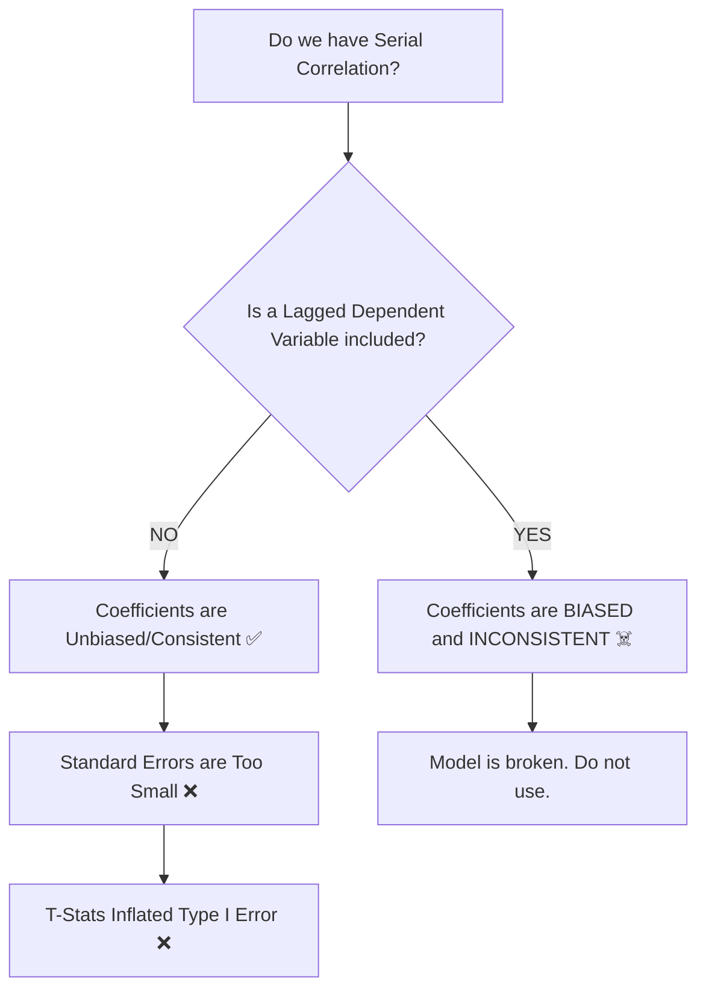

## 🚀 Module 3: Model Misspecification ⚠️

### 🎯 Introduction

Welcome back, **Quant Warrior**\! 🥋 In the previous modules, we built regression models and tested their fit. But what happens when the model is fundamentally broken?

Module 3 is about **Diagnostics**. Think of yourself as a doctor 🩺. A model might look healthy on the outside (good $R^2$), but it could be suffering from internal diseases like **Heteroskedasticity**, **Serial Correlation**, or **Multicollinearity**.

If you miss these diseases, your trading signals will be wrong, your t-statistics will lie to you, and your portfolio will suffer. Let's learn how to diagnose and cure these ailments\! 💊

-----

### Part 1: Principles of Model Specification 🏗️

Before we fix specific errors, we must know what a "healthy" model looks like. A correctly specified model must:

1.  **Be grounded in economic logic:** Don't just data mine. 🧠
2.  **Be Parsimonious:** Use the fewest variables necessary. Simple is strong. 💪
3.  **Have independent errors:** No patterns in the residuals.
4.  **Have the correct functional form:** Linear vs. Log-linear.

#### 1.1 Common Misspecifications

  * **Omitted Variable Bias:** You forgot an important variable. This biases the coefficients of the variables you *did* include.
  * **Inappropriate Transformation:** Trying to fit a straight line to a curved relationship.
  * **Data Pooling:** Combining data that shouldn't be combined (e.g., pre-2008 crisis and post-2008 crisis) without testing for structural breaks.

-----

### Part 2: Heteroskedasticity (The "Changing Variance") 📉

**Heteroskedasticity** occurs when the variance of the residuals ($\epsilon$) is **NOT constant**. Ideally, we want Homoskedasticity (constant variance).

  * **Unconditional Heteroskedasticity:** Variance changes, but not based on the independent variables ($X$). This causes no major problems. 😴
  * **Conditional Heteroskedasticity:** Variance changes **based on the value of X**. This is the enemy\! 😡

#### 2.1 Visualizing the Problem

In the chart below, notice how the dots (errors) fan out as X increases. This is the classic "cone" shape of heteroskedasticity.

<pre data-lang="vega-lite">
{
"$schema": "https://vega.github.io/schema/vega-lite/v5.json",
"title": "Visualizing Heteroskedasticity (The Cone Shape)",
"width": 600,
"height": 400,
"data": {
"sequence": {"start": 1, "stop": 100, "as": "x"}
},
"transform": [
{"calculate": "datum.x * 0.5 + (random() - 0.5) * datum.x", "as": "y"}
],
"mark": "point",
"encoding": {
"x": {"field": "x", "type": "quantitative", "title": "Independent Variable (X)"},
"y": {"field": "y", "type": "quantitative", "title": "Residuals (Errors)"}
}
}
</pre>

#### 2.2 Consequences & Detection

💡 **CFA Exam Tip ✍️:**
**Conditional Heteroskedasticity** creates a specific chain of destruction:

1.  Standard Errors (SE) are **Underestimated** (too small).
2.  t-statistics are **Inflated** (too big).
3.  You conclude variables are significant when they are **NOT** (Type I Error).
    *Note: The Coefficients ($\hat{b}$) themselves are consistent/unbiased, but you can't trust the testing.*

**Detection: The Breusch-Pagan (BP) Test** 
Regress the squared residuals ($\epsilon^2$) on the independent variables.

  * $H_0$: No Conditional Heteroskedasticity (Homoskedastic).
  * If the $R^2$ of this new regression is high, we have a problem.

**Correction:**
Use **Robust Standard Errors** (also called **White-corrected** standard errors). These adjust the SEs up, fixing the t-stats.

-----

### Part 3: Serial Correlation (Autocorrelation) 🔗

**Serial Correlation** means the error term today is correlated with the error term from yesterday. This is very common in **Time Series** data.

#### 3.1 Consequences

The damage depends on whether your model includes a **Lagged Dependent Variable** (e.g., using yesterday's return to predict today's return).

#### 3.2 Detection

1.  **Durbin-Watson (DW) Test:** 
      * Tests for first-order serial correlation.
      * \\(DW \approx 2\\): No correlation (Good).
      * \\(DW < 2\\): Positive Serial Correlation (Bad/Common).
2.  **Breusch-Godfrey (BG) Test:** 
      * More robust. Can test for higher orders of correlation.

#### 3.3 Correction

Use **Hansen-White** (or Newey-West) Standard Errors. These correct for *both* Serial Correlation AND Heteroskedasticity.

-----

### Part 4: Multicollinearity (The Copycats) 👯

**Multicollinearity** occurs when two or more independent variables are highly correlated (e.g., predicting sales using "GDP" and "National Income"—they are basically the same thing).

#### 4.1 The Classic Symptom

**💡 MNEMONIC: "The Paradox"**
If you see a model with a **High $R^2$** and significant F-statistic, BUT **none of the individual t-statistics are significant**, you have Multicollinearity.
*The variables fight each other for credit, inflating their standard errors.*

#### 4.2 Detection: Variance Inflation Factor (VIF)

We calculate VIF for each variable.

\\[VIF_j = \frac{1}{1 - R^2_j}\\]

  * **VIF > 5**: Investigate.
  * **VIF > 10**: Serious problem. 🚨

**Correction:** Drop one of the correlated variables.

-----

### Part 5: Quick Exam-Day Pointers 🎯

### 🎯 Quick Exam-Day Pointers

  * **Heteroskedasticity:**
      * **Detect:** Breusch-Pagan.
      * **Effect:** Low SE -> High t-stat -> False Significance.
      * **Fix:** White-Corrected (Robust) SE.
  * **Serial Correlation:**
      * **Detect:** Durbin-Watson (DW < 2 is bad).
      * **Effect:** Low SE -> High t-stat -> False Significance.
      * **Fix:** Hansen-White (Newey-West) SE.
  * **Multicollinearity:**
      * **Detect:** VIF > 10. High $R^2$ but Low t-stats.
      * **Effect:** Inflated SE -> Low t-stat -> Variables look insignificant.
      * **Fix:** Drop a variable.
  * **Consistency:** Serial correlation + Lagged Dependent Variable = **Invalid/Inconsistent Coefficients**. This is the only case where the coefficients themselves are broken.

