## 🚀 Module 4: Extensions of Multiple Regression 🧩

### 🎯 Introduction

Greetings, **Quant Warrior**\! 🥋 You have mastered the basics of building and diagnosing models. Now, in Module 4, we unlock the "Special Moves" of regression.

Real-world data isn't always just numbers like "Stock Price" or "GDP." Sometimes it's categories like "Tech Sector vs. Energy Sector" or "Default vs. No Default." And sometimes, a single data point acts like a sumo wrestler, throwing your whole model off balance.

This module teaches you how to handle **Influential Data**, incorporate **Qualitative Variables** (Dummy Variables), and predict **Probabilities** (Logistic Regression). Let's expand your arsenal\! ⚔️

-----

### Part 1: Influence Analysis (The Troublemakers) 🕵️‍♂️

Not all data points are created equal. Some are quiet citizens; others are loud and influential. We need to identify the ones that are distorting our reality.

#### 1.1 The Two Culprits

1.  **High-Leverage Points (Extreme X):** These are observations with weirdly extreme independent variable values (e.g., a company with massive debt when everyone else has none). They exert "leverage" on the regression line.
2.  **Outliers (Extreme Y):** These are observations with large residuals—the model's prediction was way off (e.g., a company that went bankrupt when the model predicted huge profits).

#### 1.2 Detection Metrics

How do we catch them? We use specific forensic tools.

**1. Leverage Statistic \\(h_{ii}\\):**
Measures how far an observation's \\(X\\) values are from the mean of \\(X\\).

  * **Rule of Thumb:** Potentially influential if \\(h_{ii} > \frac{3(k+1)}{n}\\).

**2. Studentized Residuals \\(t^*\\):**
Measures how big the residual is relative to the standard error.

  * **Test:** Compare \\(t^*\\) to the critical t-value. If \\(|t^*| > t_{crit}\\), it's an outlier.

```mermaid
graph TD
    A[Start: Inspect Data Points] --> B{Is X value extreme?}
    B -- Yes --> C[Check Leverage h_ii Rule: > 3k+1/n]
    C --> D{High Leverage?}
    D -- Yes --> E[⚠️ High-Leverage Point Could tilt the line!]
    B -- No --> F{Is Y value weird?}
    F -- Yes --> G[Check Studentized Residual t*]
    G --> H{Is absolute t* > t-critical?}
    H -- Yes --> I[⚠️ Outlier Model missed this one!]
    E --> J[Cooks Distance Combines both]
    I --> J
```

#### 1.3 The Influence Detection Flowchart

-----

### Part 2: Dummy Variables (The On/Off Switches) 💡

Regression loves numbers, but what about categories? "Month of the Year," "Industry Sector," or "Democratic vs. Republican"? We use **Dummy Variables** (0 or 1) to translate these into math.

**The Golden Rule:** To distinguish between \\(n\\) categories, you use \\(n-1\\) dummy variables to avoid the "Dummy Variable Trap" (Perfect Multicollinearity). The category left out is the **Base Case** (Intercept).

#### 2.1 Intercept Dummies (Parallel Worlds)

An **Intercept Dummy** shifts the regression line up or down. It assumes the *relationship* (slope) is the same, but the *starting point* differs.

  * *Equation:* \\(Y_i = b_0 + d_0D_i + b_1X_i\\)
  * If \\(D=0\\): Intercept is \\(b_0\\).
  * If \\(D=1\\): Intercept is \\(b_0 + d_0\\).

#### 2.2 Slope Dummies (Interaction Terms)

A **Slope Dummy** (or Interaction Term) changes the *steepness* of the line. It means the sensitivity to \\(X\\) is different for that category.

  * *Equation:* \\(Y_i = b_0 + b_1X_i + d_1(D_i \times X_i)\\)
  * If \\(D=0\\): Slope is \\(b_1\\).
  * If \\(D=1\\): Slope is \\(b_1 + d_1\\).

#### 2.3 Visualizing Dummy Effects

The chart below shows how Dummies can shift the line (Intercept Dummy) or rotate it (Slope Dummy).

<pre data-lang="vega-lite">
{
"$schema": "https://vega.github.io/schema/vega-lite/v5.json",
"title": "Visualizing Dummy Variables",
"width": 600,
"height": 400,
"data": {
"sequence": {"start": 0, "stop": 10, "step": 0.5, "as": "X"}
},
"transform": [
{"calculate": "2 + 1 * datum.X", "as": "Base Case (D=0)"},
{"calculate": "(2 + 3) + 1 * datum.X", "as": "Intercept Shift (d0=3)"},
{"calculate": "2 + (1 + 0.5) * datum.X", "as": "Slope Shift (d1=0.5)"}
],
"fold": ["Base Case (D=0)", "Intercept Shift (d0=3)", "Slope Shift (d1=0.5)"],
"mark": "line",
"encoding": {
"x": {"field": "X", "type": "quantitative"},
"y": {"field": "value", "type": "quantitative", "title": "Y Value"},
"color": {"field": "key", "type": "nominal", "title": "Scenario"}
}
}
</pre>

-----

### Part 3: Qualitative Dependent Variables (Logistic Regression) 🔮

What if \\(Y\\) isn't a number like "Profit," but a state like "Default / No Default" or "Acquired / Not Acquired"?

We *could* use linear regression (Linear Probability Model), but it's messy. It might predict a probability of 1.5 or -0.2, which is impossible. Instead, we use **Logistic Regression (Logit)**.

#### 3.1 The Logit Model

We model the **Log Odds** (the natural log of the odds ratio) as a linear function.

\\[\ln \left( \frac{P}{1-P} \right) = b_0 + b_1X_1 + \dots + \epsilon\\]

  * **Probability \\(P\\):** \\(\frac{1}{1 + e^{-(b_0 + b_1X)}}\\)
  * **Interpretation:** The coefficients describe the change in the **log odds** of the event occurring, not the probability directly.

#### 3.2 Estimation Method

Unlike standard regression which uses **Ordinary Least Squares (OLS)**, Logistic Regression uses **Maximum Likelihood Estimation (MLE)**. The computer tries to find the coefficients that make the observed outcomes "most likely".

-----

### Part 4: Quick Exam-Day Pointers 🎯

### 🎯 Quick Exam-Day Pointers

  * **Leverage vs. Outliers:** Leverage is about **extreme X** (inputs). Outliers are about **extreme Y** (residuals/outputs).
  * **Dummy Trap:** Always use **n-1** dummies for **n** categories. If you have "Quarter 1, 2, 3, 4," use **3** dummies. The intercept represents Quarter 4.
  * **Slope Dummy:** Think "Interaction." It captures if the *sensitivity* to a variable changes based on a category (e.g., "Do tech stocks react differently to interest rates than utility stocks?").
  * **Logit Coefficients:** Remember, the coefficients in a Logit model change the **Log Odds**, not the direct probability. A positive coefficient increases the probability, but the relationship is non-linear (S-curve).

