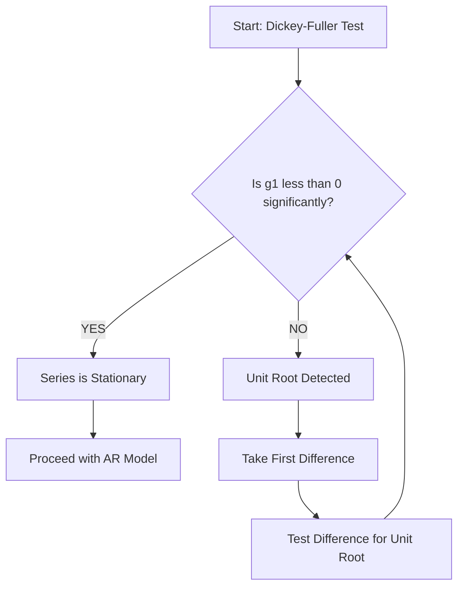

## 🚀 Module 5: Time-Series Analysis ⏳

### 🎯 Introduction

Welcome to the time chamber, **Quant Warrior**\! 🥋 In regression, we usually look at snapshots in time (cross-sectional data). But in **Time-Series**, we look at movies—data that evolves over time (like stock prices, GDP, or inflation).

This module is crucial because financial data almost always has a time component. The rules of the game change here. Residuals love to stick together (serial correlation), trends can fool you into seeing relationships that don't exist, and volatility tends to cluster. Master this, and you master the fourth dimension of investing\! 🕰️

-----

### Part 1: Trend Models (Linear vs. Log-Linear) 📈

When we see a plot moving up or down over time, our first instinct is to fit a trend line.

#### 1.1 Linear Trend Model

Use this when the data grows by a **constant amount** each period (e.g., sales increase by \\$1M every year).

\\[y_t = b_0 + b_1t + \epsilon_t\\]

  * **Interpretation:** \\(b_1\\) is the constant dollar change per period.

#### 1.2 Log-Linear Trend Model

Use this when the data grows by a **constant percentage/rate** each period (e.g., inflation or stock indexes). This is exponential growth.

\\[\ln(y_t) = b_0 + b_1t + \epsilon_t\\]

  * **Interpretation:** The growth rate is \\(e^{b_1} - 1\\). If \\(b_1 = 0.05\\), the series grows at \\(\\approx 5\%\\) per period.

#### 1.3 Visualizing Growth

Notice how the **Linear Trend** (Blue) increases by a constant amount, while the **Log-Linear Trend** (Red) curves upward because it increases by a constant *percentage* (compound growth).

<pre data-lang="vega-lite">
{
"$schema": "https://vega.github.io/schema/vega-lite/v5.json",
"title": "Linear vs. Log-Linear (Exponential) Trends",
"width": "container",
"height": 400,
"data": {
"sequence": {"start": 0, "stop": 20, "step": 1, "as": "Time"}
},
"transform": [
{"calculate": "10 + 2 * datum.Time", "as": "Linear Trend"},
{"calculate": "10 * exp(0.1 * datum.Time)", "as": "Log-Linear Trend"},
{"fold": ["Linear Trend", "Log-Linear Trend"]}
],
"mark": {"type": "line", "point": true, "tooltip": true},
"encoding": {
"x": {"field": "Time", "type": "quantitative", "title": "Time Period"},
"y": {"field": "value", "type": "quantitative", "title": "Value"},
"color": {"field": "key", "type": "nominal", "title": "Trend Type"},
"tooltip": [
{"field": "Time", "type": "quantitative", "title": "Time"},
{"field": "value", "type": "quantitative", "title": "Value", "format": ".2f"},
{"field": "key", "type": "nominal", "title": "Type"}
]
}
}
</pre>

-----

### Part 2: Autoregressive (AR) Models 🔁

Trend models often fail because they leave patterns in the residuals (serial correlation). Enter the **Autoregressive (AR)** model. Instead of using "time" \\(t\\) as the independent variable, we use **past values** of the variable itself.

#### 2.1 The AR(1) Model

An AR(1) model predicts today's value \\(x_t\\) using yesterday's value \\(x_{t-1}\\).

\\[x_t = b_0 + b_1x_{t-1} + \epsilon_t\\]

  * **Condition for Stationarity:** The absolute value of the slope coefficient must be less than 1 \\(|b_1| < 1\\). If \\(b_1 = 1\\), you have a **Random Walk** (Unit Root) and the model explodes\! 💥 

#### 2.2 Covariance Stationarity

To use an AR model, the time series **MUST** be Covariance Stationary. This means the "physics" of the data don't change over time.

**💡 MNEMONIC: "Mean-Var-Cov"**
To be Stationary, a series needs:

1.  Constant **Mean** across all periods.
2.  Constant **Variance** across all periods.
3.  Constant **Covariance** with itself at fixed lags.

-----

### Part 3: Diagnostics & Mean Reversion 🕵️‍♂️

#### 3.1 Checking for Serial Correlation

You cannot use the Durbin-Watson test for AR models\! It is invalid when lagged variables are involved. Instead, you must check the **Autocorrelations of the Residuals**.

  * **The Test:** Calculate the t-statistic for the residual autocorrelations.
  * **The Goal:** You want ALL residual autocorrelations to be statistically **insignificant** (not different from zero). If they are significant, your model is incomplete (you need to add more lags, e.g., move from AR(1) to AR(2)).

#### 3.2 Mean Reversion

If a series is stationary, it always pulls back to its long-run average.

\\[\text{Mean Reverting Level} = \frac{b_0}{1 - b_1}\\]

  * If current value > Mean Level \\(\rightarrow\\) Predicted to **Fall**.
  * If current value < Mean Level \\(\rightarrow\\) Predicted to **Rise**.

**Visualizing Mean Reversion:** Notice how the series (blue) fluctuates but always gets pulled back to the mean level (red dashed line).

<pre data-lang="vega-lite">
{
"$schema": "https://vega.github.io/schema/vega-lite/v5.json",
"title": "Mean Reversion (Stationary Series)",
"width": "container",
"height": 400,
"data": {
"sequence": {"start": 0, "stop": 100, "as": "t"}
},
"transform": [
{"calculate": "sin(datum.t / 5) * 10 + 50 + (random() - 0.5) * 5", "as": "Value"},
{"calculate": "50", "as": "Mean Level"}
],
"layer": [
{
"mark": {"type": "line", "point": true, "tooltip": true},
"encoding": {
"x": {"field": "t", "type": "quantitative", "title": "Time"},
"y": {"field": "Value", "type": "quantitative", "scale": {"domain": [30, 70]}, "title": "Series Value"},
"tooltip": [
{"field": "t", "type": "quantitative", "title": "Time"},
{"field": "Value", "type": "quantitative", "title": "Value", "format": ".2f"},
{"field": "Mean Level", "type": "quantitative", "title": "Mean Level"}
]
}
},
{
"mark": {"type": "rule", "color": "red", "strokeDash": [4, 4], "size": 2},
"encoding": {
"y": {"field": "Mean Level", "type": "quantitative"}
}
}
]
}
</pre>

-----

### Part 4: Random Walks & Unit Roots 🚶‍♂️

A **Random Walk** is a series where the best prediction for tomorrow is simply today's value. It has no "memory" of a mean to return to.

#### 4.1 The Random Walk Equation

\\[x_t = x_{t-1} + \epsilon_t\\]
(This is just an AR(1) model where \\(b_0 = 0\\) and \\(b_1 = 1\\))

Because \\(b_1 = 1\\), the Mean Reverting Level is undefined (dividing by zero). It is **NOT Stationary**. You cannot run a standard regression on it.

#### 4.2 The Fix: First Differencing

If you have a Unit Root (Random Walk), you must transform the data. You take the **First Difference** \\(y_t = x_t - x_{t-1}\\). This usually creates a stationary series that you *can* model.

#### 4.3 Testing for Unit Roots (Dickey-Fuller)

How do you know if you have a Unit Root? Use the **Dickey-Fuller Test**.

  * **Null Hypothesis \\(H_0\\):** \\(g_1 = 0\\) (Series has a Unit Root / Non-stationary).
  * **Alternative \\(H_a\\):** \\(g_1 < 0\\) (Series does not have a Unit Root / Stationary).
  * **Exam Tip:** If you **Fail to Reject**, you have a Unit Root problem.

-----

### Part 5: Volatility & Seasonality 🎢

#### 5.1 Seasonality

If data shows regular patterns (e.g., retail sales spiking in December), you have Seasonality.

  * **Detection:** Significant autocorrelation at the seasonal lag (e.g., Lag 4 for quarterly data, Lag 12 for monthly data).
  * **The Fix:** Add a lagged term for that season (e.g., add \\(x_{t-4}\\) to the model).

#### 5.2 ARCH Models (Volatility Clustering)

Sometimes the *variance* (volatility) of the errors changes over time. This is **Autoregressive Conditional Heteroskedasticity (ARCH)**.

  * **The Concept:** Big shocks are followed by big shocks; calm periods are followed by calm periods.
  * **The Test:** Regress squared residuals \\(\hat{\epsilon}^2_t\\) on lagged squared residuals \\(\hat{\epsilon}^2_{t-1}\\). If the slope is significant, you have ARCH.
  * **Forecasting Volatility:** \\(\hat{\sigma}^2_{t+1} = a_0 + a_1 \hat{\epsilon}^2_t\\).

**Visualizing Volatility Clustering:**

<pre data-lang="vega-lite">
{
"$schema": "https://vega.github.io/schema/vega-lite/v5.json",
"title": "Volatility Clustering (ARCH Effect)",
"width": "container",
"height": 300,
"data": {
"values": [
{"t": 1, "v": 0.5}, {"t": 2, "v": -0.4}, {"t": 3, "v": 0.3}, {"t": 4, "v": 0.2},
{"t": 5, "v": 4.5}, {"t": 6, "v": -5.2}, {"t": 7, "v": 3.8}, {"t": 8, "v": -4.1},
{"t": 9, "v": 0.2}, {"t": 10, "v": -0.3}, {"t": 11, "v": 0.1}, {"t": 12, "v": 0.4},
{"t": 13, "v": -0.2}, {"t": 14, "v": 0.1}, {"t": 15, "v": 6.0}, {"t": 16, "v": -5.5}
]
},
"mark": {"type": "bar", "tooltip": true},
"encoding": {
"x": {"field": "t", "type": "ordinal", "title": "Time Period"},
"y": {"field": "v", "type": "quantitative", "title": "Residual Value"},
"color": {
"condition": {"test": "abs(datum.v) > 2", "value": "red"},
"value": "blue"
},
"tooltip": [
{"field": "t", "type": "ordinal", "title": "Time"},
{"field": "v", "type": "quantitative", "title": "Residual", "format": ".2f"},
{"calculate": "abs(datum.v) > 2 ? 'High Volatility' : 'Low Volatility'", "title": "Period Type"}
]
}
}
</pre>

#### 5.3 Cointegration

What if you have two series that *both* have unit roots (e.g., GDP and Investment)?

  * **Rule:** You generally *cannot* regress one on the other (Spurious Regression).
  * **Exception:** If they are **Cointegrated** (they share a long-term relationship and don't drift apart), you CAN regress them. Use the Engle-Granger test to verify.

-----

### Part 6: Quick Exam-Day Pointers 🎯

### 🎯 Quick Exam-Day Pointers

  * **AR vs. Random Walk:** Check the slope coefficient \\(b_1\\). If \\(b_1 < 1\\), it's AR (Stationary). If \\(b_1 = 1\\), it's a Random Walk (Non-Stationary).
  * **Diagnostics Flow:** Run AR model \\(\rightarrow\\) Check Residual Autocorrelations. If significant, add lags. If seasonal lag is significant, add seasonal term.
  * **Unit Root Test:** Remember, the Null Hypothesis is "We have a problem" (Unit Root exists). You *want* to reject the null to proceed with regression.
  * **RMSE:** When comparing models out-of-sample, pick the one with the **lowest Root Mean Squared Error (RMSE)**.
  * **Cointegration:** If two series *both* have unit roots, you can only regress them if they are **Cointegrated** (share a long-term relationship). If not, the regression is spurious (fake)..

