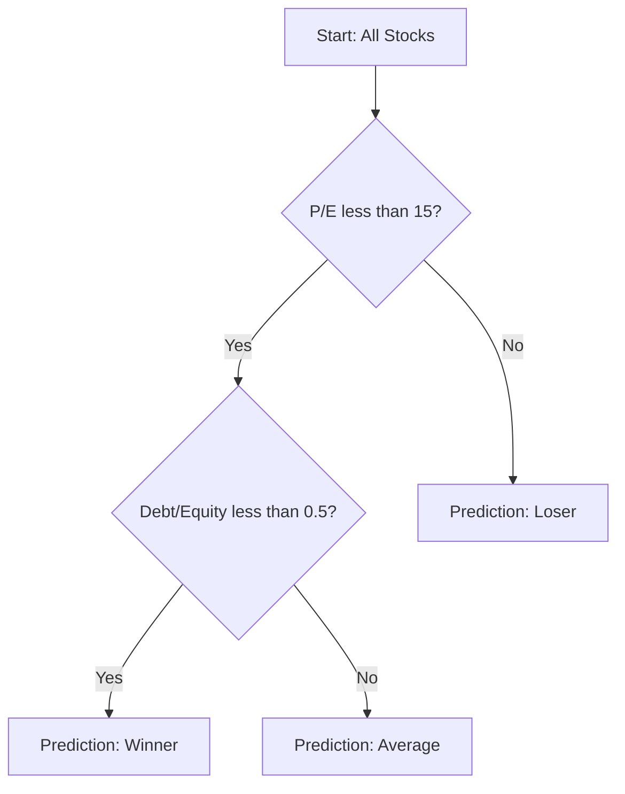
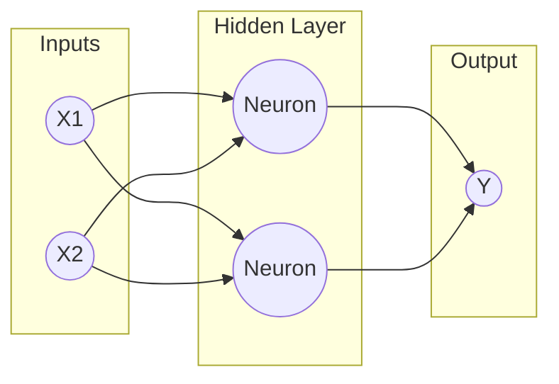

## 🚀 Module 6: Machine Learning 🤖

### 🎯 Introduction

Welcome to the frontier of finance, **Quant Warrior**\! 🥋 You have mastered traditional regression, but the world is changing. Data is exploding in **Volume, Variety, and Velocity** (the 3 Vs). Traditional statistics can struggle here.

Enter **Machine Learning (ML)**. Unlike traditional stats, which assumes a structure and tries to fit data to it, ML lets the data speak for itself. It "learns" patterns to automate decision-making. In this module, we will explore how algorithms can predict defaults, classify winning stocks, and even read CEO facial expressions. Let's upgrade your toolkit\! 🛠️

-----

### Part 1: The Machine Learning Landscape 🗺️

Machine learning isn't just one thing. It's divided into tribes based on how the algorithms learn.

#### 1.1 Supervised vs. Unsupervised Learning

  * **Supervised Learning:** The "Teacher" approach. We have labeled data (inputs \(X\) and correct outputs \(Y\)). The model learns to map \(X \rightarrow Y\).
      * *Examples:* Regression (predicting a number), Classification (predicting a category like "Default/No Default").
  * **Unsupervised Learning:** The "Explorer" approach. We have inputs \(X\), but **no labels** (no \(Y\)). The model explores the data to find hidden structures.
      * *Examples:* Clustering (grouping similar stocks), Dimension Reduction (simplifying complex data).
  * **Deep Learning:** Uses Neural Networks to model complex non-linear relationships (e.g., image recognition).
  * **Reinforcement Learning:** An agent learns by trial and error (rewards vs. punishments).

**💡 MNEMONIC: "S.U.R.D."**
The types of Machine Learning:

  * **S**upervised (Has a Teacher/Target)
  * **U**nsupervised (No Teacher/Target)
  * **R**einforcement (Rewards/Punishments)
  * **D**eep Learning (Neural Nets)

-----

### Part 2: Generalization & Overfitting (The Core Challenge) 🧠

The goal of ML is **Generalization**: the ability to predict well on *new*, unseen data (out-of-sample).

  * **Overfitting:** The model learns the training data *too* well, memorizing noise instead of the signal. It has **High Variance** (changes drastically with new data).
  * **Underfitting:** The model is too simple to capture the pattern. It has **High Bias** (erroneous assumptions).

#### 2.1 The Fitting Curve (Bias-Variance Trade-off)

As model complexity increases, training error drops (bias decreases), but eventually, testing error spikes (variance increases). We want the "Goldilocks" zone in the middle.

<pre data-lang="vega-lite">
{
"$schema": "https://vega.github.io/schema/vega-lite/v5.json",
"title": "The Bias-Variance Trade-off",
"width": "container",
"height": 400,
"data": {
"values": [
{"Complexity": 1, "Error": 0.9, "Type": "Bias (Underfitting)"},
{"Complexity": 2, "Error": 0.7, "Type": "Bias (Underfitting)"},
{"Complexity": 3, "Error": 0.4, "Type": "Bias (Underfitting)"},
{"Complexity": 4, "Error": 0.2, "Type": "Bias (Underfitting)"},
{"Complexity": 5, "Error": 0.1, "Type": "Bias (Underfitting)"},
{"Complexity": 1, "Error": 0.2, "Type": "Variance (Overfitting)"},
{"Complexity": 2, "Error": 0.25, "Type": "Variance (Overfitting)"},
{"Complexity": 3, "Error": 0.4, "Type": "Variance (Overfitting)"},
{"Complexity": 4, "Error": 0.7, "Type": "Variance (Overfitting)"},
{"Complexity": 5, "Error": 1.0, "Type": "Variance (Overfitting)"},
{"Complexity": 1, "Error": 1.1, "Type": "Total Error (Out-of-Sample)"},
{"Complexity": 2, "Error": 0.95, "Type": "Total Error (Out-of-Sample)"},
{"Complexity": 3, "Error": 0.8, "Type": "Total Error (Out-of-Sample)"},
{"Complexity": 4, "Error": 0.9, "Type": "Total Error (Out-of-Sample)"},
{"Complexity": 5, "Error": 1.1, "Type": "Total Error (Out-of-Sample)"}
]
},
"mark": {"type": "line", "point": true, "tooltip": true},
"encoding": {
"x": {"field": "Complexity", "type": "ordinal", "title": "Model Complexity"},
"y": {"field": "Error", "type": "quantitative", "title": "Error Rate"},
"color": {"field": "Type", "type": "nominal", "title": "Error Type"},
"tooltip": [
{"field": "Complexity", "type": "ordinal", "title": "Complexity Level"},
{"field": "Error", "type": "quantitative", "title": "Error", "format": ".2f"},
{"field": "Type", "type": "nominal", "title": "Type"}
]
}
}
</pre>

#### 2.2 How to Prevent Overfitting

1.  **Regularization (Penalized Regression):** Force the model to keep coefficients small.
2.  **Cross-Validation (K-Fold):** Split data into \(K\) parts. Train on \(K-1\), test on 1. Repeat \(K\) times. This ensures every data point is used for testing.

-----

### Part 3: Supervised Algorithms (The Toolkit) 🧰

When we have labeled data (Regression or Classification), we use these tools.

#### 3.1 Penalized Regression (LASSO)

Standard regression minimizes Squared Residuals. **LASSO** minimizes Squared Residuals **PLUS** a penalty for the size of the coefficients.

\\[ \text{Minimize: } \sum (Y - \hat{Y})^2 + \lambda \sum |\hat{b}| \\]

  * **\(\lambda\) (Lambda):** The penalty strength.
  * **Result:** LASSO shrinks unimportant coefficients to **ZERO**, automatically selecting features.

#### 3.2 Support Vector Machines (SVM)

Used for Classification (e.g., Default vs. Solvent). SVM finds the **Hyperplane** (boundary) that creates the **widest margin** separating the two classes.

#### 3.3 K-Nearest Neighbor (KNN)

A simple, non-parametric method. To classify a new point, look at its "K" nearest neighbors. If most are "Winners," the new point is a "Winner."

  * **Note:** You must choose "K" carefully. Too small = High Variance (noise). Too large = High Bias (diluted).

#### 3.4 CART (Classification and Regression Trees)

Creates a flowchart (decision tree) to classify data.

  * It creates binary splits (Yes/No) at nodes to maximize the separation of classes.

<!-- end list -->

#### 3.5 Ensemble Learning (Random Forest)

Single trees are noisy. **Ensemble Learning** combines many models to reduce noise.

  * **Random Forest:** Builds many trees using **Bagging** (Bootstrap Aggregating—training on random subsets of data). The final prediction is the **majority vote** of all the trees. It is robust against overfitting.

-----

### Part 4: Unsupervised Algorithms (The Explorers) 🧭

When we have no target label, we use these to find structure.

#### 4.1 Principal Component Analysis (PCA)

Reduces the number of variables (Dimension Reduction). It creates new, uncorrelated composite variables (**Eigenvectors**) that explain the most variance in the data.

  * **Scree Plot:** Used to decide how many components to keep. The "elbow" shows where adding components yields diminishing returns.

<pre data-lang="vega-lite">
{
"$schema": "https://vega.github.io/schema/vega-lite/v5.json",
"title": "Scree Plot (Variance Explained)",
"width": "container",
"height": 400,
"data": {
"values": [
{"Component": "PC1", "Variance": 0.55},
{"Component": "PC2", "Variance": 0.20},
{"Component": "PC3", "Variance": 0.11},
{"Component": "PC4", "Variance": 0.05},
{"Component": "PC5", "Variance": 0.03}
]
},
"mark": {"type": "bar", "tooltip": true},
"encoding": {
"x": {"field": "Component", "type": "nominal", "sort": null, "title": "Principal Component"},
"y": {"field": "Variance", "type": "quantitative", "title": "% Variance Explained"},
"tooltip": [
{"field": "Component", "type": "nominal", "title": "Component"},
{"field": "Variance", "type": "quantitative", "title": "Variance", "format": ".2%"}
]
}
}
</pre>

#### 4.2 Clustering (K-Means vs. Hierarchical)

1.  **K-Means:**
      * Partitions data into **k** non-overlapping clusters.
      * **Limitation:** You must specify **k** (number of clusters) in advance.
2.  **Hierarchical Clustering:**
      * Builds a hierarchy of clusters (Agglomerative = Bottom-up; Divisive = Top-down).
      * **Visualized with:** A **Dendrogram** (tree diagram showing relationships).

-----

### Part 5: Neural Networks & Deep Learning 🧠

Modeled after the biological brain. Useful for complex, non-linear tasks (e.g., Image Recognition, Natural Language Processing).

#### 5.1 Structure

  * **Input Layer:** The features \(X\).
  * **Hidden Layers:** Where the "learning" happens. Nodes apply a summation and a non-linear **Activation Function** (like a dimmer switch).
  * **Output Layer:** The prediction \(Y\).

<!-- end list -->

  * **Deep Learning (DNNs):** Neural Nets with *many* (20+) hidden layers.
  * **Reinforcement Learning:** An agent performs actions in an environment to maximize rewards (e.g., AlphaGo, trading bots).

-----

### Part 6: Quick Exam-Day Pointers 🎯

### 🎯 Quick Exam-Day Pointers

  * **Bias vs. Variance:** High Bias = Underfitting (Model too simple). High Variance = Overfitting (Model too complex).
  * **LASSO:** Best for **feature selection** (shrinks coefficients to zero).
  * **Random Forest:** Best for **stability** (reduces variance by averaging many trees).
  * **PCA:** Used to handle **Multicollinearity** (creates uncorrelated inputs).
  * **Supervised vs. Unsupervised:** Ask "Do we have a Y variable (Target)?" If yes \(\rightarrow\) Supervised. If no \(\rightarrow\) Unsupervised.
  * **One-Hot Encoding:** The method to convert categorical variables (like "Red, Blue") into binary numbers (0, 1) for ML models.

