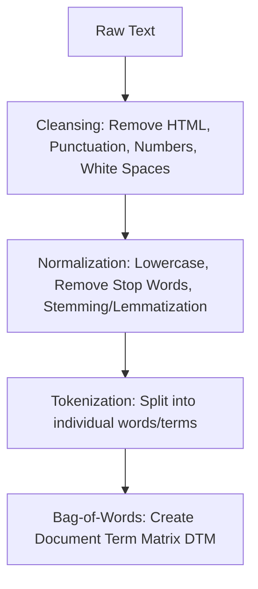
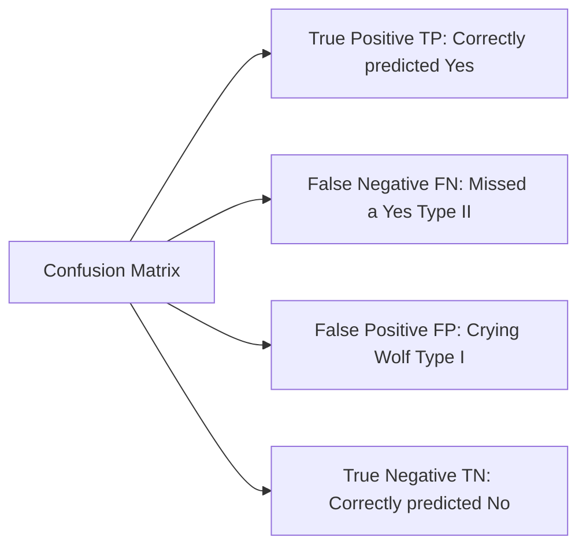

## 🚀 Module 7: Big Data Projects 🗄️

### 🎯 Introduction

Welcome to the data lab, **Quant Warrior**\! 🧪 In previous modules, we learned the *theory* of ML. Now, in Module 7, we roll up our sleeves and do the actual work: **Data Wrangling**.

Real-world data is messy. It's full of typos, missing values, and html tags. This module is about the "Plumbing" of Data Science—how to take raw, ugly data (especially **Text**) and transform it into a clean matrix that an algorithm can understand. We also dive deep into **evaluating** classifiers using Confusion Matrices and ROC Curves. Let's scrub that data\! 🧼

-----

### Part 1: The 4 Vs of Big Data 🌊

Before we process it, we must define it. Big Data is defined by the **4 Vs**:

1.  **Volume:** The sheer amount (Petabytes, Exabytes).
2.  **Velocity:** The speed of creation (Tweets per second, Latency).
3.  **Variety:** Different sources (Structured vs. Unstructured/Text/Image).
4.  **Veracity:** The trustworthiness (Quality/Credibility) of the data. ⚠️ *Critical for finance.*

-----

### Part 2: Data Preparation (Wrangling) 🧹

Data prep is 80% of the work. It has two main stages: **Cleansing** and **Preprocessing**.

#### 2.1 Structured Data (Tables)

  * **Cleansing:** Fixing errors (Incomplete, Invalid, Inaccurate).
  * **Preprocessing:**
      * **Imputation:** Filling missing values (e.g., with the mean).
      * **Winsorization:** Capping extreme outliers (e.g., replacing the top 1% values with the 99th percentile value) to prevent them from skewing the model.
      * **Scaling:** Normalization (0 to 1) or Standardization (Z-score) so big numbers don't dominate small ones.

#### 2.2 Unstructured Data (Text) 📜

Text is messy. We need a pipeline to turn "sentences" into "numbers."

  * **Stemming:** Chopping off endings (e.g., "Investing", "Invested" \(\rightarrow\) "Invest"). Crude but fast.
  * **Lemmatization:** Converting to the root word (e.g., "Better" \(\rightarrow\) "Good"). Smarter but slower.
  * **N-Grams:** Grouping words that belong together (e.g., "New York" is 1 token, not 2).

-----

### Part 3: Text Exploration & Selection 🔍

Once we have tokens (words), we need to decide which ones matter. We can't feed 100,000 words into a model.

#### 3.1 Feature Selection Tools

1.  **Term Frequency (TF):** How often does a word appear?
      * *High TF:* Likely noise (e.g., "the", "and"). Remove.
      * *Low TF:* Too rare to be useful. Remove.
2.  **Document Frequency (DF):** In how many *documents* does the word appear?
      * If a word appears in 100% of documents, it has **zero** predictive power.
3.  **Chi-Square \(\chi^2\):** Tests independence. Does the word "Default" appear significantly more often in "Bad" reports than "Good" reports?

\\[\text{TF-IDF} = \text{Term Frequency} \times \log\left(\frac{1}{\text{Document Frequency}}\right)\\]

**Interpretation:** High TF-IDF means a word is **frequent in this document** but **rare elsewhere**. These are the most important keywords.

-----

### Part 4: Model Performance Evaluation 📉

This is the most testable section. How do we know if our Classifier (e.g., "Buy" vs. "Sell") is good?

#### 4.1 The Confusion Matrix

#### 4.2 Key Metrics

  * **Precision:** Of all the times you *predicted* Yes, how often were you right? \(TP / (TP+FP)\). *Crucial when False Positives are costly (e.g., spam filter).*
  * **Recall:** Of all the *actual* Yeses, how many did you find? \(TP / (TP+FN)\). *Crucial when False Negatives are costly (e.g., cancer detection).*
  * **F1 Score:** The harmonic mean of Precision and Recall. The best single metric for uneven classes.

#### 4.3 ROC Curve & AUC

The **Receiver Operating Characteristic (ROC)** curve plots **True Positive Rate** (Recall) vs. **False Positive Rate**.

  * **AUC (Area Under Curve):** A single number score.
      * 0.5 = Random Guessing (Bad).
      * 1.0 = Perfect Model (God Mode).
      * **The more "convex" (bowed out to the top-left), the better.**

<pre data-lang="vega-lite">
{
"$schema": "https://vega.github.io/schema/vega-lite/v5.json",
"title": "ROC Curves: Model Performance Comparison",
"width": 600,
"height": 400,
"data": {
"values": [
{"FPR": 0, "TPR": 0, "Model": "Random Guessing (AUC=0.5)"},
{"FPR": 1, "TPR": 1, "Model": "Random Guessing (AUC=0.5)"},
{"FPR": 0, "TPR": 0, "Model": "Good Model (AUC=0.8)"},
{"FPR": 0.2, "TPR": 0.7, "Model": "Good Model (AUC=0.8)"},
{"FPR": 0.5, "TPR": 0.9, "Model": "Good Model (AUC=0.8)"},
{"FPR": 1, "TPR": 1, "Model": "Good Model (AUC=0.8)"},
{"FPR": 0, "TPR": 0, "Model": "Excellent Model (AUC=0.95)"},
{"FPR": 0.1, "TPR": 0.9, "Model": "Excellent Model (AUC=0.95)"},
{"FPR": 0.2, "TPR": 0.98, "Model": "Excellent Model (AUC=0.95)"},
{"FPR": 1, "TPR": 1, "Model": "Excellent Model (AUC=0.95)"}
]
},
"mark": {"type": "line", "point": true, "tooltip": true},
"encoding": {
"x": {"field": "FPR", "type": "quantitative", "title": "False Positive Rate (1 - Specificity)"},
"y": {"field": "TPR", "type": "quantitative", "title": "True Positive Rate (Recall)"},
"color": {"field": "Model", "type": "nominal", "title": "Model Type"},
"tooltip": [
{"field": "FPR", "type": "quantitative", "title": "False Positive Rate", "format": ".2f"},
{"field": "TPR", "type": "quantitative", "title": "True Positive Rate", "format": ".2f"},
{"field": "Model", "type": "nominal", "title": "Model"}
]
}
}
</pre>

-----

### Part 5: Quick Exam-Day Pointers 🎯

### 🎯 Quick Exam-Day Pointers

  * **Precision vs. Recall:** Remember, **Precision** hates False Positives (Spam). **Recall** hates False Negatives (Cancer).
  * **F1 Score:** Use this when you have **Class Imbalance** (e.g., 99% of transactions are legit, 1% are fraud). Accuracy is misleading here (a model that says "Legit" every time has 99% accuracy but is useless). F1 Score fixes this.
  * **Winsorization vs. Trimming:** **Trimming** *deletes* extreme data (you lose data). **Winsorization** *caps* extreme data (you keep the data point but reduce its magnitude).
  * **One-Hot Encoding:** The standard way to turn categorical data ("Red", "Blue") into numbers (1, 0) for regression.
  * **Veracity:** The "4th V" of big data. In finance, trusting the source is as important as the volume.

