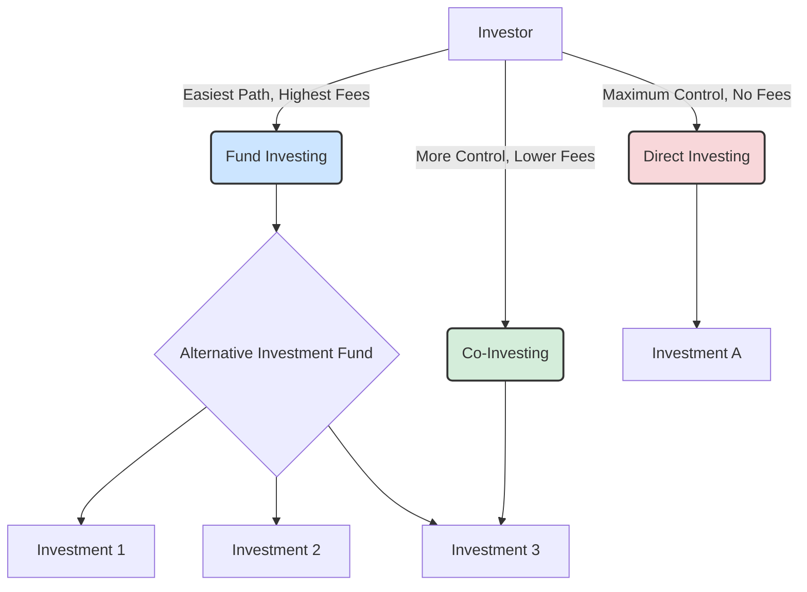
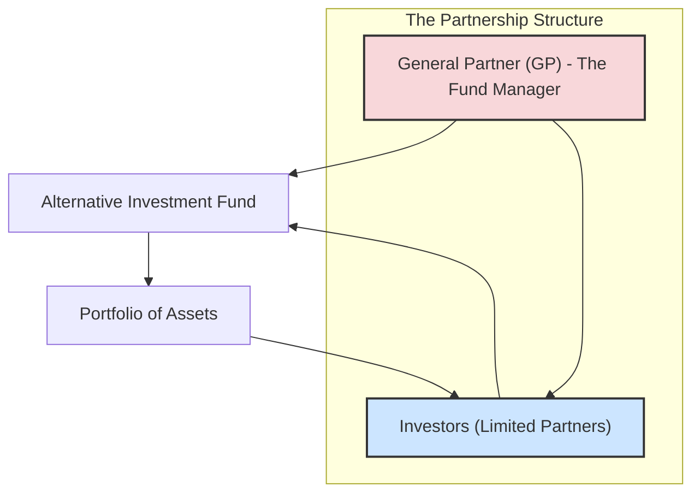

## Reading 76: Alternative Investment Features, Methods, and Structures 🚀

### 🎯 Introduction

Welcome to the exciting world of Alternative Investments! Think of traditional investments like stocks (e.g., Reliance Industries, Apple) and bonds as shopping at a big supermarket. The products are standardized, prices are clear, and you can buy or sell them easily.

**Alternative investments**, on the other hand, are like commissioning a bespoke piece of art or a custom-built car. They are unique, less common, and require specialized knowledge. They might be illiquid (harder to sell quickly) and take a long time to pay off, but they offer the potential for higher returns and powerful diversification benefits that you just can't get from the supermarket. Let's dive in!

-----

### Part 1: What Are Alternative Investments & What Makes Them Different? 🤔 (LOS 76.a)

Alternative investments are anything that isn't a traditional investment (public stocks, bonds, or cash). Their key features set them apart:

  * **Illiquidity** 💧: Often can't be sold quickly at a fair price.
  * **Long Time Horizons** ⏳: These aren't short-term plays; think years, not months.
  * **Specialized Knowledge** 🧠: Requires deep expertise to analyze and manage. Think about valuing a private startup vs. analyzing Infosys's public financials.
  * **Low Correlation** 📉📈: Their prices don't always move in the same direction as the main stock or bond markets, which is great for **diversification**.
  * **Complex Structures** 🏗️: Use unique legal and fee structures, like limited partnerships.

#### 1.1 Categories of Alternative Investments

Let's break down the main types you'll encounter.

##### 1.1.1 Private Capital

  * **Private Equity (PE)** 💼: Buying ownership (equity) in private companies.
    * **Leveraged Buyouts (LBOs)**: A PE firm (like KKR or Blackstone) uses a lot of borrowed money (leverage) to buy a mature company (like when Dell was taken private). The goal is to improve its operations and sell it for a profit later.
    * **Venture Capital (VC)**: Providing capital to early-stage, high-growth-potential startups. Think of VC firms like Sequoia or Accel India funding the next Zomato or Flipkart in their infancy. This is higher risk but has explosive return potential. 🚀
  * **Private Debt** 💳: Lending money directly to private companies, often when traditional banks won't. This can include **distressed debt**, which is buying the debt of companies in or near bankruptcy, hoping for a profitable turnaround.

##### 1.1.2 Real Assets

  * **Real Estate** 🏢: Investing in property. This isn't just buying a flat! It includes large-scale commercial properties (office parks like DLF Cyber City), residential complexes, and industrial warehouses. A popular way to invest is through a **Real Estate Investment Trust (REIT)**, like the Brookfield India REIT, which trades on the stock exchange.
  * **Infrastructure** 🌉: Funding essential public-use facilities. Think toll roads, airports, and power plants. The **Mumbai Trans Harbour Sea Link** is a great Indian example, often funded through a **Public-Private Partnership (PPP)**.
  * **Natural Resources** 🌳:
    * **Farmland & Timberland**: Investing in land used for agriculture or forestry.
    * **Commodities**: Raw materials like oil, gold, and copper. You don't usually store barrels of oil in your house; instead, you invest through futures contracts.
  * **Digital Assets** 💻: A new frontier! This includes **cryptocurrencies** (like Bitcoin) and **tokens** (like NFTs).

##### 1.1.3 Hedge Funds

  * **What they do**: They are private investment pools that use complex strategies to generate returns.
  * **Key Tools**:
    * **Leverage**: Borrowing money to amplify potential returns (and risks!).
    * **Derivatives**: Using instruments like options and futures.
    * **Short Selling**: Betting that a security's price will fall.

A hedge fund might invest in plain old stocks and bonds, but their flexible mandate allows them to use these powerful tools in ways that a typical mutual fund cannot.

💡 CFA Exam Tip ✍️:The exam loves to test the *distinguishing features* of alternatives. Remember: **illiquidity**, **long horizons**, **low correlation**, and the need for **specialized knowledge** are what set them apart from traditional investments.

-----

### Part 2: How Can You Invest in Alternatives? Paths to Entry 🗺️ (LOS 76.b)

You can't just log into your Zerodha or Fidelity account and buy a stake in a private company. Access is different. There are three main paths, each with its own trade-offs.

#### 2.1 Investment Methods

##### 2.1.1 Fund Investing 펀드 투자

  * **How it works**: You contribute capital to a fund (e.g., a Private Equity fund), and the fund's manager identifies, selects, and manages the investments on your behalf.
  * **Analogy**: It's like buying an all-inclusive tour package. You pay the fee, and the tour company handles all the logistics and planning. ✈️
  * **Who it's for**: Investors with limited capital, experience, or time.
  * **Pros**: Access to expert managers, instant diversification.
  * **Cons**: Highest fees, no control over individual investment decisions.

##### 2.1.2 Co-Investing 공동 투자

  * **How it works**: You are already an investor in a fund. The fund manager finds a great deal but offers you the chance to invest *additional* capital directly into that specific deal, alongside the fund.
  * **Analogy**: You're on the tour, but the guide offers you a special side-excursion that you can choose to join for an extra (but lower) fee. 🧗
  * **Who it's for**: Experienced fund investors who want more control and want to build their expertise.
  * **Pros**: More control over specific investments, lower fees than the main fund, great learning experience.
  * **Cons**: Requires more effort and due diligence from you.

##### 2.1.3 Direct Investing 직접 투자

  * **How it works**: You invest directly in an asset (like a startup or an infrastructure project) without using an intermediary fund.
  * **Analogy**: You plan, book, and execute your entire vacation from scratch—every flight, hotel, and activity. You're in complete control. 🗺️
  * **Who it's for**: Large, highly sophisticated investors like sovereign wealth funds (e.g., Singapore's GIC) or massive pension funds.
  * **Pros**: Maximum control and flexibility, no management or performance fees paid to an external manager.
  * **Cons**: Requires immense in-house expertise, resources, and capital.

💡 CFA Exam Tip ✍️:Understand the trade-off here: As you move from Fund Investing to Direct Investing, your **control increases** and your **fees decrease**, but the required **expertise and capital increase** dramatically.

-----

### Part 3: The Nuts and Bolts: Ownership and Fee Structures 🔩💰 (LOS 76.c)

This is where things get really unique. The structures are designed to align the interests of the manager and the investors over a long period.

#### Ownership Structure: The LP/GP Model

Most alternative investment funds are set up as a **Limited Partnership**. It's a simple but powerful structure.

  * **General Partner (GP)**: The fund manager. They are the expert making the investment decisions. They have **unlimited liability**, meaning they are personally on the hook if things go disastrously wrong.
  * **Limited Partners (LPs)**: The investors. They provide the capital but have a passive role. Their liability is **limited** to the amount of money they invested. To become an LP, you usually need to be an **accredited investor** (a term defined by regulators like SEBI in India or the SEC in the US, signifying a certain level of wealth and sophistication).
  * **Side Letters**: Sometimes, a large LP might negotiate special terms with the GP that aren't in the main partnership agreement. This is done via a **side letter**. A common clause is a "**most favored nation**" clause, which ensures that if the GP gives a better deal to another LP later, the original LP gets that better deal too.

#### 3.2 Compensation Structure: More Than Just a Fee

This is a critical, and highly testable, area. The classic model is called "**Two and Twenty**".

  * **Management Fee (the "Two")**: An annual fee paid to the GP to cover the costs of running the fund.
    * For **Hedge Funds**, it's typically 1-2% of **Assets Under Management (AUM)**.
    * For **Private Equity**, it's typically 1-2% of **Committed Capital**. This is a key difference! **Committed capital** is the total amount LPs have *promised* to the fund, even if the GP hasn't called for all of it yet. This incentivizes the GP to be selective and not just invest quickly to grow AUM.
  * **Performance Fee (the "Twenty")**: The GP's share of the profits. This is also called **carried interest** or an **incentive fee**. It's usually 20% of the profits, but it's not that simple! It's often subject to a **hurdle rate**.

##### 3.2.1 The Hurdle Rate and Catch-Up

A **hurdle rate** is a minimum rate of return the fund must achieve before the GP can start earning a performance fee. Think of it as the LPs saying, "We don't pay you for performance until we've gotten our minimum expected return."

###### Hard Hurdle

The GP's performance fee is calculated *only* on the returns **in excess of** the hurdle rate. It's tougher for the GP.

**Example:** Fund Return $(r) = 18\%$, Hurdle Rate $(r_h) = 8\%$, Performance Fee $(p) = 20\%$

**Calculation:**
- Excess Return $= r - r_h = 10\%$
- GP's Fee $= p \times \text{Excess Return} = 2\%$  
- LP Keeps $= r_h + (r - r_h - \text{GP's Fee}) = 16\%$

###### Soft Hurdle

Once the hurdle rate is cleared, the GP's performance fee is calculated on the *entire* return. It's more generous for the GP. Often includes a **catch-up clause**.

**Example:** Fund Return $(r) = 18\%$, Hurdle Rate $(r_h) = 8\%$, Performance Fee $(p) = 20\%$

**Calculation:**
- GP's Fee $= p \times r = 3.6\%$
- LP Keeps $= r - \text{GP's Fee} = 14.4\%$

**Catch-up mechanism:** The first 8% goes to the LP. Then, the next chunk of profits goes 100% to the GP until they have "caught up" to their 20% share of the total profits generated so far. After that, remaining profits are split 80/20.

##### 3.2.2 High-Water Mark & Clawback Provision

These are two crucial mechanisms to protect investors (LPs).

  * **High-Water Mark (HWM)** 🌊: Primarily used by **hedge funds**. A GP cannot earn a performance fee on gains that are simply recovering prior losses. The fund's value must exceed its previous peak before the GP can take a performance fee again.
    * *Year 1*: Fund goes from `$100` to `$120`. HWM is now `$120`. GP gets a fee.
    * *Year 2*: Fund drops to `$110`. No fee for the GP.
    * *Year 3*: Fund goes up to `$118`. Still below the `$120` HWM, so *still no performance fee!*
    * *Year 4*: Fund goes up to `$130`. The GP can only take a fee on the profit *above* the `$120` HWM (i.e., on the `$10` gain). The new HWM is `$130`.
  * **Clawback Provision** ↩️: Primarily used in **private equity**. PE funds realize gains over many years. A clawback allows LPs to reclaim performance fees paid to a GP on early, successful deals if later deals in the same fund turn out to be losers, dragging down the fund's overall profitability. This ensures the GP is rewarded based on the entire fund's performance, not just the early wins.

##### 3.2.3 Profit Distribution: The Waterfall 🏞️

A **waterfall** dictates the order in which profits are distributed between the GP and LPs.

###### American Waterfall (Deal-by-Deal)

The GP can collect carried interest after *each individual deal* is profitably exited, even if other deals in the portfolio are still unrealized or might end up as losses.

  * **Favors**: The **GP**, as they get paid sooner.
  * **Risk**: Makes the **clawback provision** extremely important for LPs.

###### European Waterfall (Whole-of-Fund)

The GP gets paid only after *all* LPs have received their entire initial capital back *plus* their preferred return (hurdle rate) from the *entire fund's* pool of investments.

  * **Favors**: The **LPs** investors, as it's much more protective of their capital and returns.
  * **Risk**: Less risky for LPs.

💡 CFA Exam Tip ✍️:The fee structures are a BIG deal for the exam. Master the difference between **hard vs. soft hurdles** and be able to calculate them. Also, remember: **High-Water Mark is for Hedge Funds**, and **Clawback is for Private Equity**. Finally, know that the **American waterfall favors the GP**, while the **European waterfall favors the LPs**.

-----

### 🧪 Formula Summary

**GP Performance Fee with a Hard Hurdle (no catch-up):**

$$r_{GP} = \max[0, p(r - r_h)]$$

Where:
  * $r_{GP}$ = General Partner's rate of return from the performance fee
  * $p$ = Performance fee percentage (e.g., 20% or 0.20)
  * $r$ = The fund's total return for the period
  * $r_h$ = The hard hurdle rate

-----
#### 3.3 Global & Local Context 🌍

* **Global Example:** Sovereign wealth funds like Singapore's GIC often use direct investing for infrastructure projects worldwide, leveraging their expertise and capital.
* **Indian Example:** The Brookfield India REIT provides Indian investors access to commercial real estate, while private equity deals like Blackstone's investments in Indian companies showcase the LP/GP structure in action.

-----

### 🎯 Quick Exam-Day Pointers

* **What makes Alts special?**
  * Illiquidity, long time horizons, specialized knowledge, and low correlation with traditional markets.
* **Investment Methods:**
  * Fund Investing (easiest, high fees) → Co-Investing → Direct Investing (most control, no fees, expert-level).
* **Key Structure:**
  * Limited Partnership (LP/GP). GP manages (unlimited liability), LPs invest (limited liability).
* **PE vs. HF Fees:**
  * PE management fees are on **Committed Capital**. HF fees are on **AUM**. This is a classic exam question!
* **Investor Protections:**
  * **High-Water Mark (HWM)** is for hedge funds to prevent paying for the same gains twice.
  * **Clawback** is for private equity to reclaim fees if the total fund underperforms.
* **Waterfalls:**
  * **American** (deal-by-deal) is good for the **GP**. **European** (whole-of-fund) is good for the **LPs**.

