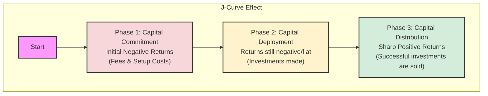

# Reading 77: Alternative Investment Performance and Returns 📊

### 🎯 Introduction

Hey there, future charterholder! Let's talk about performance. Measuring the return on a stock like * **J-Curve explained**: Initial negative returns from fees & investments, followed by strong positive returns as assets mature and are sold.
* **Key Metrics**: **IRR** is king for PE/Real Estate because it accounts for *timing*. **MOIC** is a simple but flawed shortcut because it *ignores timing*.
* **Valuation**: **Level 3** assets ("mark-to-model") can lead to artificially **smoothed returns** and understated risk.
* **HWM Calculation**: The most important rule! No performance fee is paid until the fund's value (net of fees) exceeds its previous highest point.
* **Index Biases**: **Survivorship bias** (losers are removed) and **backfill bias** (only winners report their history) make hedge fund index returns look artificially high.Bank is like checking the score of a live cricket match—the numbers are public, updated constantly on your screen, and easy to understand.

But measuring the performance of an alternative investment? That's more like judging a complex, multi-year science experiment. 🧪 The results come in phases, the inputs are unique, and you need special tools and a lot of patience to figure out if it was truly a success. This reading gives us those tools. Let's get started!

-----

### Part 1: Why Is Measuring Performance So Tricky? 🧐

Appraising the performance of alternative investments is a different ball game compared to traditional assets. Here are the main reasons why:

  * **Unique Life Cycles & Cash Flows** 🔄: Unlike buying a stock, which is a one-time purchase, investments in private equity involve capital being invested (**capital calls**) and returned (**distributions**) at different times over many years. This leads to the famous **J-Curve Effect**.
  * **Use of Leverage** ⚖️: Hedge funds and private equity often borrow money (**leverage**) to magnify returns. This also magnifies losses, making risk assessment more complex.
  * **Difficult Valuations** ❓: How do you value a private startup that has no public market price? It's tough\! This reliance on estimates can lead to **smoothed returns**.
  * **Complex Fee Structures** 💸: As we saw in the last reading, fees aren't simple percentages. They involve hurdles, high-water marks, and clawbacks, all of which affect the final return to the investor.

#### The J-Curve Effect

For illiquid funds like private equity, don't expect positive returns from day one! The performance typically follows a J-shape.

  * **Why does it happen?** In the early years, the fund is paying management fees and making investments, but the underlying companies haven't generated significant value yet. This results in initial paper losses. As the companies mature and are sold off profitably, the returns shoot up dramatically.

#### Valuation: The Fair Value Hierarchy

Since many alternative assets don't trade on an open market, we need a framework to estimate their value. This is the **Fair Value Hierarchy**.

##### **Level 1**

  * **Inputs**: Quoted prices in active markets for *identical* assets.
  * **Simplicity**: Easiest and most reliable.
  * **Example**: The price of a Tata Motors share on the NSE. You can see it in real-time. ✅

##### **Level 2**

  * **Inputs**: Observable inputs *other than* quoted prices. This includes prices for *similar* assets.
  * **Simplicity**: A bit more complex; requires some modeling.
  * **Example**: Valuing a corporate bond that doesn't trade often by looking at the yields of similar bonds from other companies with the same credit rating and maturity. 🏢

##### **Level 3**

  * **Inputs**: Unobservable inputs. We have to use our own models and assumptions.
  * **Simplicity**: Most complex and subjective.
  * **Example**: Valuing an early-stage private startup like CRED. You need to build a discounted cash flow (DCF) model based on many assumptions about its future growth. ⚠️

The use of **Level 3** inputs can lead to **smoothed returns**. Because valuations are based on models and updated infrequently (e.g., quarterly), the reported performance appears less volatile than it really is. This can be misleading!

#### Key Performance Metrics: IRR vs. MOIC

Because of the weird timing of cash flows, we need special metrics.

##### **Internal Rate of Return (IRR)**

  * **What it is**: The discount rate that makes the net present value (NPV) of all cash flows (initial investments and later distributions) equal to zero.
  * **Pros ✅**: The preferred metric for private equity and real estate because it fully accounts for the *timing* of cash flows. Time is money!
  * **Cons ❌**: Can be complex to calculate and involves assumptions about the reinvestment rate of cash flows.

##### **Multiple of Invested Capital (MOIC)**

  * **What it is**: A simple, intuitive measure. It's also known as the money multiple.
  * **Pros ✅**: Super easy to calculate and understand. If you're told you got a "2x MOIC," you know you doubled your money.
  * **Cons ❌**: Its biggest flaw is that it **completely ignores the time value of money**. A 2x MOIC over 2 years is fantastic. A 2x MOIC over 20 years is terrible.
  * **Formula**:
    $$\text{MOIC} = \frac{\text{Realized Value} + \text{Unrealized Value}}{\text{Total Invested Capital}}$$
> [\!TIP]
> **CFA Exam Tip ✍️:** The exam will test your understanding of why traditional performance metrics don't work well for alternatives. Remember the **J-Curve** conceptually. For metrics, know the critical difference: **IRR considers the timing of cash flows, while MOIC does not.**

-----

### Part 2: The Investor's Bottom Line: Calculating Returns After Fees 셈하기

Now for the fun part: the math\! Understanding how fees impact an investor's net return is crucial. Let's walk through a multi-year example.

**Scenario**: You invest in a hedge fund with **$100 million** of initial capital.

* **Management Fee**: 2% of year-end AUM.
* **Performance Fee**: 20%, calculated *net of management fees*.
* **Hurdle Rate**: 5% hard hurdle.
* **High-Water Mark (HWM)**: Applies.

#### Year 1: A Great Year! 📈

* **Gross Return**: The fund has a great year and grows by 30% to **$130 million** (before fees).
* **Step 1: Calculate Management Fee**
    * $130M × 2% = **$2.6M**
* **Step 2: Check Hurdle Rate**
    * The hurdle amount is $100M × 5% = $5M.
    * The gross profit is $30M. Since this is way above the hurdle, a performance fee can be charged.
* **Step 3: Calculate Performance Fee (on profit *above* hurdle and *net of* management fee)**
    * Profit: $130M (End Value) - $100M (Start Value) = $30M
    * Profit after Management Fee: $30M - $2.6M = $27.4M
    * Profit subject to hurdle: $130M (End Value) - $2.6M (Mgmt Fee) - $105M (Start Value + Hurdle) = $22.4M
    * Performance Fee = $22.4M × 20% = **$4.48M**
* **Step 4: Calculate Net Return to Investor**
    * Total Fees = $2.6M + $4.48M = $7.08M
    * Net Profit to Investor = $30M (Gross Profit) - $7.08M (Total Fees) = $22.92M
    * **Investor Net Return**: $22.92M / $100M = **22.92%**
    * End-of-Year Value (New HWM): $100M + $22.92M = **$122.92M**

#### Year 2: A Down Year... 📉

* **Gross Performance**: The fund value declines from $130M to **$110 million**. The starting value for the investor is the HWM of $122.92M.
* **Step 1: Calculate Management Fee**
    * $110M × 2% = **$2.2M**
* **Step 2: Check for Performance Fee**
    * The fund's value declined. It's also below the **High-Water Mark** of $122.92M.
    * **Performance Fee = $0**. You don't get paid for losing money!
* **Step 3: Calculate Net Return to Investor**
    * Total Fees = $2.2M
    * End Value for Investor = $110M - $2.2M = $107.8M
    * Loss for Investor = $122.92M (Start Value) - $107.8M (End Value) = $15.12M
    * **Investor Net Return**: -$15.12M / $122.92M = **-12.30%**
    * The **High-Water Mark remains at $122.92M**.

#### Year 3: A Recovery... but is it enough? 📊

* **Gross Performance**: The fund value recovers from $110M to **$128 million**.
* **Step 1: Calculate Management Fee**
    * $128M × 2% = **$2.56M**
* **Step 2: Check for Performance Fee (this is the key step!)**
    * The fund value after management fees is $128M - $2.56M = $125.44M.
    * This is *still below* the **High-Water Mark of $122.92M from Year 1**. Even though the fund made money this year, it hasn't made back all the previous losses for the original investor.
    * **Performance Fee** = A-ha! It's not zero. The fee is charged on gains *above the HWM*. So, fee is based on ($125.44M - $122.92M) = $2.52M.
    * Performance Fee = $2.52M × 20% = **$0.504M**
* **Step 3: Calculate Net Return to Investor**
    * Total Fees = $2.56M + $0.504M = $3.064M
    * End Value for Investor = $128M - $3.064M = $124.936M
    * Net Profit for Investor = $124.936M - $107.8M (Start of Year 3) = $17.136M
    * **Investor Net Return**: $17.136M / $107.8M = **15.89%**
    * New High-Water Mark: **$124.936M**

#### Index Biases: Is the Data Too Good to Be True?

When you look at hedge fund index performance, take it with a grain of salt. The reported numbers are often inflated due to two key biases:

##### **Survivorship Bias**

  * **What it is**: Hedge fund indexes are built from data that funds voluntarily report. When a fund performs poorly and shuts down, it stops reporting and is dropped from the index.
* **The Effect**: The index now only contains the "survivors," making the average performance look much better than it was in reality because all the losers have been removed. It's like judging a singing competition after all the bad singers have been voted off! 🎤

##### **Backfill Bias**

  * **What it is**: A new hedge fund manager might launch several small funds privately. After a year or two, they see which one had the best performance. They then start reporting *that* successful fund's data to an index provider and "backfill" its amazing (but selectively chosen) history.
  * **The Effect**: This incubation process makes the index's historical data look incredible, because it only includes the pre-selected winners. 🏆

-----

### 🧪 Formula Summary

* **Leveraged Return ($r_L$)**:

  $$r_L = r + \frac{V_b}{V_c}(r - r_b)$$

  Where:
  * $r_L$ = Leveraged rate of return
  * $r$ = Return on the cash investment
  * $V_b$ = Amount of borrowed funds
  * $V_c$ = Amount of cash (equity) invested
  * $r_b$ = Borrowing rate

* **Multiple of Invested Capital (MOIC)**:

  $$\text{MOIC} = \frac{\text{Realized Value} + \text{Unrealized Value}}{\text{Total Amount of Invested Capital}}$$

-----

> [\!IMPORTANT]
>
> ### 🎯 Quick Exam-Day Pointers
>
>   * **J-Curve explained**: Initial negative returns from fees & investments, followed by strong positive returns as assets mature and are sold.
>   * **Key Metrics**: **IRR** is king for PE/Real Estate because it accounts for *timing*. **MOIC** is a simple but flawed shortcut because it *ignores timing*.
>   * **Valuation**: **Level 3** assets ("mark-to-model") can lead to artificially **smoothed returns** and understated risk.
>   * **HWM Calculation**: The most important rule\! No performance fee is paid until the fund's value (net of fees) exceeds its previous highest point.
>   * **Index Biases**: **Survivorship bias** (losers are removed) and **backfill bias** (only winners report their history) make hedge fund index returns look artificially high.