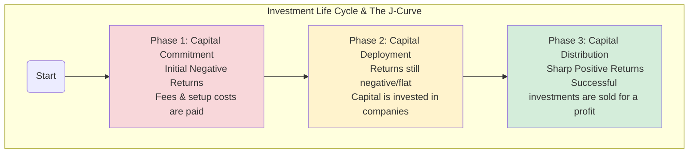

## Reading 77: Alternative Investments – Performance & Valuation

### 🎯 Introduction

Measuring the return on a stock like HDFC Bank is like checking a live cricket score—the numbers are public, updated constantly, and easy to understand.

But measuring the performance of an alternative investment? That's more like judging a complex, multi-year science experiment 🧪. The results come in phases, the inputs are unique, and you need special tools to figure out if it was a success. This reading gives us those tools, focusing on the unique challenges and calculations for alternatives.

-----

### Part 1: Why Is Measuring Performance So Tricky? (LOS 77.a)

Appraising the performance of alternative investments is a different ball game for several key reasons:

* 🔄 **Unique Life Cycles & Cash Flows**  
  * Investments in private equity involve capital being invested (**capital calls**) and returned (**distributions**) at different, unpredictable times over many years. This leads to the famous **J-Curve Effect**.
* ⚖️ **Use of Leverage**  
  * Hedge funds and private equity often borrow money to magnify returns. This also magnifies losses, making risk assessment more complex.
* ❓ **Difficult Valuations**  
  * Many alternative assets don't have public market prices, so they must be valued using estimates. This can lead to **smoothed returns**, where performance appears less volatile than it really is.
* 💸 **Complex Fee Structures**  
  * Fees aren't simple percentages; they can vary by investor and over time, affecting the final return.

#### 1.1 The J-Curve Effect

For illiquid funds like private equity, returns are typically negative in the early years before turning positive, creating a "J" shape on a graph.

#### 1.2 Valuation: The Fair Value Hierarchy

Because many alternative assets don't trade on an open market, we use a framework to estimate their value:

* **Level 1** 🟢: Quoted prices for **identical** assets in active markets. This is the most reliable.  
  * *Example*: The share price of Reliance Industries on the NSE.
* **Level 2** 🟡: Observable inputs for **similar** assets.  
  * *Example*: Valuing a corporate bond that doesn't trade often by looking at the yields of similar bonds.
* **Level 3** 🔴: Unobservable inputs; valuation is based on a manager's own models and assumptions. This is the most subjective.  
  * *Example*: Valuing a private Indian startup. This reliance on "mark-to-model" accounting can lead to **smoothed returns** and understated volatility.

#### 1.3 Key Performance Metrics: IRR vs. MOIC

Due to the irregular timing of cash flows, we need special metrics.

##### 1.3.1 Internal Rate of Return (IRR)

* **What it is**: The discount rate that makes the net present value (NPV) of all cash flows equal to zero.
* **Pros ✅**: The preferred metric for private equity and real estate because it fully **accounts for the timing of cash flows**.
* **Cons ❌**: It's more complicated to calculate and involves assumptions about reinvestment rates.

##### 1.3.2 Multiple of Invested Capital (MOIC)

* **What it is**: A simple, intuitive measure also known as the money multiple.
* **Pros ✅**: Very easy to calculate and understand. A 2x MOIC means you doubled your money.
* **Cons ❌**: Its biggest flaw is that it **completely ignores the time value of money**. A 2x return over 2 years is fantastic; a 2x return over 15 years is not.

#### 1.4 Global & Local Context 🌍

* **Global Example:** U.S. private equity funds often show a pronounced J-curve, with early losses due to fees and slow capital deployment, followed by strong gains as investments mature.
* **Indian Example:** Indian venture capital funds also experience the J-curve, but the timing and magnitude may differ due to local market dynamics and regulatory factors.

💡 CFA Exam Tip ✍️: 
Master the logic for IRR and MOIC. IRR is superior for timing, MOIC is intuitive but ignores time value. Know the J-curve phases and why Level 3 assets can distort reported returns.

-----

### Part 2: The Investor's Bottom Line – Calculating Returns After Fees (LOS 77.b)

This is where the rubber meets the road. Calculating the final return an investor receives requires navigating complex fee arrangements and fund rules.

#### 2.1 Liquidity Provisions: Getting Your Money Out

Unlike mutual funds, you can't just redeem your money from a hedge fund or PE fund overnight:

* 🔐 **Lockup Period**: The minimum time you must hold your investment before you can request a withdrawal.
* ⏰ **Notice Period**: The amount of time (e.g., 30-90 days) you must give the manager *before* you can redeem your funds.
* 🚪 **Gate**: A provision allowing the fund manager to limit redemptions during periods of market stress to avoid a fire sale of assets.

#### 2.2 Custom Fee Arrangements

Not all investors pay the same fees:

* 👑 **Founders Class Shares**: Early investors in a new fund are often offered a lower fee structure (e.g., "1.5 and 10" instead of "2 and 20") to entice them to invest.
* ⚖️ **"Either/or" Fees**: A structure where the manager receives either a lower management fee OR a higher performance fee, whichever is greater in a given year.

#### 2.3 The Waterfall: How Profits Are Distributed

In private equity, a **waterfall** dictates the order in which profits are distributed.

##### 2.3.1 American Waterfall (Deal-by-Deal)

* The GP can collect carried interest after **each individual deal** is profitably exited.
  * **Favors**: The **GP** 👨‍💼, as they get paid sooner.
  * **Risk for LP**: Makes the **clawback provision** extremely important, as the GP might get paid for early wins even if the total fund ends up losing money.

##### 2.3.2 European Waterfall (Whole-of-Fund)

* The GP gets paid only after **all LPs have received their entire initial capital back plus their preferred return** from the entire fund's pool of investments.
  * **Favors**: The **LPs** investors, as it's much safer and aligns interests with the fund's overall success.

#### 2.4 Index Biases: Is the Data Too Good to Be True?

Hedge fund index performance often looks better than reality due to two key biases:

* 💀 **Survivorship Bias**: When a fund performs poorly and shuts down, it's removed from the index. The index is left with only the "survivors," making the average performance look artificially high.
* 📈 **Backfill Bias**: A manager starts a new fund. If it does well, they begin reporting its performance to an index and "backfill" its amazing (but selectively chosen) history. The index's historical data gets inflated with these pre-selected winners.

#### 2.5 Global & Local Context 🌍

* **Global Example:** European PE funds often use the whole-of-fund waterfall, protecting LPs, while U.S. funds may use deal-by-deal, favoring GPs.
* **Indian Example:** Indian hedge funds may have longer lockup periods and stricter gates due to local regulations.

💡 CFA Exam Tip ✍️: 
Fee calculations involving a **High-Water Mark (HWM)** and **hurdle rates** are very common on the exam. Practice the step-by-step logic. The order of operations matters! Also, be able to define and differentiate **Survivorship Bias** from **Backfill Bias**.

-----

### 🧪 Formula Summary

**Leveraged Return ($r_L$):**  
$$r_L = r + \frac{V_b}{V_c}(r - r_b)$$

Where:  
- $r_L$ = Leveraged rate of return  
- $r$ = Return on the unleveraged assets  
- $V_b$ = Amount of borrowed funds  
- $V_c$ = Amount of cash (equity) capital invested  
- $r_b$ = Borrowing rate

**Multiple of Invested Capital (MOIC):**  
$$\text{MOIC} = \frac{\text{Realized Value} + \text{Unrealized Value}}{\text{Total Invested Capital}}$$

**GP Fee with High-Water Mark ($R_{GP}$):**  
$$R_{GP} = (P_t \times r_m) + \max[0, (P_t - P_{HWM}) \times p]$$

Where:  
- $P_t$ = Fund value at the end of period *t*  
- $r_m$ = Management fee rate  
- $P_{HWM}$ = The fund's peak value at the end of any previous period, net of fees  
- $p$ = Performance fee rate

-----

### 🎯 Quick Exam-Day Pointers

* **J-Curve:**  
  * Early costs/fees → ⬇️ Negative returns → Later gains → ⬆️ Positive returns
* **Valuation:**  
  * 🔴 **Level 3** assets are "Mark-to-Model," which can lead to artificially **smoothed returns** and understated risk
* **IRR vs. MOIC:**  
  * ⏰ **IRR** is superior because it accounts for the *timing* of cash flows; **MOIC** does not
* **Fee Calculation Logic:**  
  * 💰 Master the order of operations for calculating net return, especially how the **High-Water Mark (HWM)** works. A fund must exceed its prior peak value before performance fees are paid on new profits
* **Waterfalls:**  
  * 🌊 **American** (deal-by-deal) favors the **GP**; **European** (whole-of-fund) favors the **LP**
* **Index Biases:**  
  * 📊 Remember that **Survivorship** and **Backfill** biases make hedge fund index returns look better than they really are

