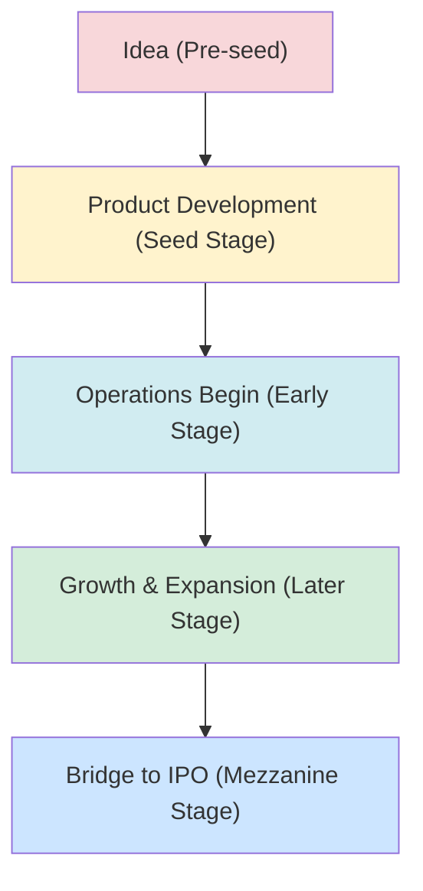

# Reading 78: Investments in Private Capital: Equity and Debt 💼

### 🎯 Introduction

Alright, let's venture off the beaten path  * **PE Value Creation =** Making the business better (operational improvements) + Using debt smartly (leverage).
  * **PE Exits:** **Trade Sale** (quick & strategic), **IPO** (high valuation but costly & slow), **SPAC** (faster than IPO, fixed price).
  * **Private Debt Hierarchy (Risk ↑, Return ↑):** Senior Direct Lending → **Mezzanine Debt** (junior rank + equity kickers like warrants) → Distressed Debt.
  * **Vintage Year:** The year a fund *starts* investing. It's the most important factor for comparing fund performance. Diversifying across them is a must!
  * Private capital offers diversification because its returns are not perfectly correlated with public stocks and bonds.nk of public markets (stocks and bonds on the NSE or NYSE) as a well-lit, six-lane highway—it's fast, efficient, and everyone can use it. **Private Capital**, however, is like going off-roading in a powerful 4x4. 🏞️ It's a journey for skilled drivers (investors), it's definitely riskier, and you're navigating uncharted territory. But, it can lead you to spectacular, undiscovered destinations in the form of superior returns. This reading is our map and GPS for that journey, exploring both the equity (ownership) and debt (lending) sides of this exclusive world.

-----

### Part 1: Private Equity - The Ownership Game 👑

**Private Equity (PE)** is simply owning a piece of a company that isn't listed on a public stock exchange. PE managers are active owners; they roll up their sleeves and get involved to create value. The two main strategies are LBOs and VC.

#### Key PE Strategies: LBOs vs. VC

##### **Leveraged Buyouts (LBOs)**

  * **What it is**: A PE firm uses a large amount of borrowed money (**leverage**) to buy a mature, stable, but perhaps underperforming, company. It's like buying a house with a big mortgage.
  * **The Goal**: Improve the company's operations, cut costs, boost profits, and then sell it a few years later for a hefty gain. Value creation comes from making the business better, not just financial engineering.
  * **Example 🌍**: A classic global example is the PE firm KKR's buyout of RJR Nabisco. In India, think of a PE firm acquiring a well-established family-owned manufacturing business to professionalize its management and expand its reach.
  * **Variations**:
      * **Management Buyout (MBO)**: The *existing* management team partners with the PE firm to buy the company.
      * **Management Buy-in (MBI)**: The PE firm brings in a *new* management team to run the company.

##### **Venture Capital (VC)**

  * **What it is**: Investing in young, high-risk, high-growth potential startups. This is the fuel for innovation!
  * **The Goal**: To identify and nurture the "next big thing" from its infancy and achieve an exponential return when the company goes public or is acquired.
  * **Example 🇮🇳**: Think of early-stage investors like Accel or Sequoia Capital providing the initial funding for companies like Flipkart, Ola, or Zomato when they were just an idea on a PowerPoint slide.
  * **VC Stages**: VC funding is provided in rounds as the startup grows.

<!-- end list -->

#### The Grand Finale: Private Equity Exit Strategies

A PE investment isn't forever. The whole point is to exit at a higher valuation. The exit strategy is critical and chosen based on market conditions.

##### **Trade Sale**

  * **What it is**: Selling the portfolio company to a "strategic buyer," usually a larger competitor in the same industry.
  * **Pros ✅**: Often the fastest and simplest exit. The strategic buyer might pay a premium for expected synergies.
  * **Cons ❌**: The universe of potential buyers can be small, and the existing management might resist being sold to a rival.

##### **Initial Public Offering (IPO)**

  * **What it is**: The classic "going public" by listing the company's shares on a stock exchange like the NSE or NYSE.
  * **Pros ✅**: Can achieve the highest valuation and provides a lot of public visibility for the company.
  * **Cons ❌**: Very expensive, slow, and requires tons of regulatory disclosures. The PE firm may be subject to a **lockup period**, unable to sell its shares for some time after the IPO.

##### **SPAC**

  * **What it is**: A **Special Purpose Acquisition Company (SPAC)** is a "blank check" company that is already publicly traded. The PE firm sells its portfolio company by having it merge with the SPAC.
  * **Pros ✅**: Much faster than a traditional IPO with a more certain valuation fixed in advance.
  * **Cons ❌**: Can be more dilutive for existing shareholders due to warrants, and has faced increased regulatory scrutiny recently.

##### **Other Exits**

  * **Secondary Sale**: Selling the company to *another* PE firm.
  * **Recapitalization**: The company takes on more debt to pay a large dividend to the PE firm. This is a way to get some cash back without a full exit.
  * **Write-off/Liquidation**: The unfortunate end for a failed investment. 🪦

> [\!TIP]
> **CFA Exam Tip ✍️:** Know the key differences between **LBO** (mature companies, high debt, operational improvements) and **VC** (startups, high growth, nurturing innovation). Also, be ready to compare and contrast the main exit strategies: **Trade Sale, IPO, and SPAC**.

-----

### Part 2: Private Debt - The Modern Moneylender 💰

When companies can't get loans from traditional banks, they turn to the **private debt** market. Investors in private debt act like lenders, providing capital in exchange for regular interest payments and the return of their principal.

#### Categories of Private Debt

Private debt isn't one-size-fits-all. It ranges from safer senior loans to riskier, higher-return strategies.

| Category | Who It's For | Seniority in Capital Structure | Key Features |
| :--- | :--- | :--- | :--- |
| **Direct Lending** | Mature, stable companies needing capital for growth or acquisitions. | **Senior & Secured** (first in line to get paid) | Similar to a bank loan, with fixed payment schedules. Can include **leveraged loans**. |
| **Venture Debt** | Early-stage startups that already have VC equity funding. | Senior, but risky due to the company's stage. | A way for founders to get more funding without giving up more equity. |
| **Mezzanine Debt** | Companies in buyouts or expansion phases. | **Subordinated** (behind senior debt but ahead of equity) | A hybrid of debt and equity. It's riskier, so it demands higher interest rates and often comes with equity "kickers" like **warrants** (the right to buy equity later). |
| **Distressed Debt** | Companies in or near bankruptcy. | Varies, but the goal is to control the company through its debt. | High-risk, high-reward. Investors aim to profit from a successful restructuring. Think of buying Jet Airways' bonds at a deep discount, betting on a turnaround. |

-----

### Part 3: Putting It All Together: Diversification Benefits 🧺

So, why add this complex and illiquid asset class to a portfolio? The main goal is **diversification** and the potential for higher risk-adjusted returns.

#### Vintage Year Diversification

This is a hugely important concept in private capital. The **vintage year** is the year a fund starts making its investments.

  * **Why it matters**: A fund that started in 2009 (post-GFC crash) could buy assets cheaply and likely performed fantastically. A fund with a 2007 vintage, which invested right at the market peak, likely struggled.
  * **The Strategy**: Investors don't just invest in one fund. They practice **vintage year diversification** by committing capital to different funds across multiple years (e.g., a 2023 vintage, a 2024 vintage, etc.). This averages out the timing luck and reduces the risk of being overly exposed to a single market cycle. 🗓️

#### Portfolio Diversification

Private capital returns are correlated with public markets, but not perfectly (correlation is less than 1). This means they still provide valuable diversification benefits.

  * They offer exposure to different risk premiums that you can't get in public markets, like the **illiquidity premium**.
  * The risk-return spectrum is wide, allowing investors to choose their desired level of risk, from safer **Infrastructure Debt** all the way up to high-octane **Private Equity**.

> [\!TIP]
> **CFA Exam Tip ✍️:** Remember that **vintage year** is crucial for comparing PE fund performance and that **diversifying across vintage years** is a key risk management strategy for LPs. Also, understand the hierarchy of private debt: Direct Lending is the safest, and Mezzanine/Distressed are the riskiest.

-----

### 🧪 Formula Summary

This reading is highly conceptual. No new formulas are introduced! 🎉

-----

> [\!IMPORTANT]
>
> ### 🎯 Quick Exam-Day Pointers
>
>   * **PE Value Creation =** Making the business better (operational improvements) + Using debt smartly (leverage).
>   * **PE Exits:** **Trade Sale** (quick & strategic), **IPO** (high valuation but costly & slow), **SPAC** (faster than IPO, fixed price).
>   * **Private Debt Hierarchy (Risk ↑, Return ↑):** Senior Direct Lending → **Mezzanine Debt** (junior rank + equity kickers like warrants) → Distressed Debt.
>   * **Vintage Year:** The year a fund *starts* investing. It's the most important factor for comparing fund performance. Diversifying across them is a must\!
>   * Private capital offers diversification because its returns are not perfectly correlated with public stocks and bonds.