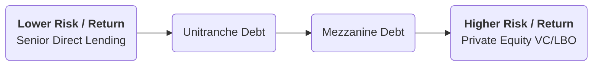

## 🌟 Reading 78: Investments in Private Capital: Equity and Debt

This reading takes a closer look at the "Private Capital" slice of the alternative investments pie. We'll explore how investors either own a piece of private companies (**Private Equity**) or lend money to them (**Private Debt**). The companies a fund invests in are known as its **portfolio companies**.

-----

###  🚀 Part 1: Private Equity (PE)

Private equity is all about taking an ownership stake in companies that are not listed on a public stock exchange.

#### Key Types of Private Equity Funds

1.  **Leveraged Buyout (LBO) Funds:** This is the largest segment of PE. LBOs involve buying 100% of a mature company, often using a significant amount of debt (leverage) to finance the purchase. After the buyout, the company is taken private. The PE firm then works to improve its operations, cash flow, and profitability before aiming to sell it a few years later.

      * **Management Buyout (MBO):** The company's *existing* management team partners with the PE fund in the buyout.
      * **Management Buy-in (MBI):** The PE fund brings in a *new*, external management team to run the company.

2.  **Venture Capital (VC) Funds:** 벤처 캐피털(VC) 펀드: VC is the high-stakes world of funding startups and early-stage businesses with high growth potential. These investments are very risky—many fail, but one big success can provide enormous returns. VCs take an active role, often taking board seats to help guide the young company.

    **<mark>EXAM TIP:</mark>** You must know the stages of VC investing. It's a very common exam topic.

    ```mermaid
    graph TD;
      A[Formative Stage<br/>Idea & Early Development] --> B(Angel Investing<br/>Idea stage, funding from individuals);
      B --> C(Seed Stage<br/>Product development, first time VCs invest);
      C --> D(Early Stage/Start-up<br/>Funding for initial commercial sales);
      A --> E[Later Stage<br/>Expansion Capital];
      E --> F[Mezzanine Stage<br/>Pre-IPO Financing];
    ```

    ***Real-World VC Example (The Journey of a Startup):*** Think of a company like Swiggy.

      * It started with an idea (**Angel Investing**).
      * Then it raised money to build its app and sign up restaurants (**Seed Stage**).
      * As it grew, it raised larger and larger rounds of funding to expand to new cities (**Later Stage/Expansion**).
      * Finally, before its IPO, it might raise one last round of private capital to strengthen its finances (**Mezzanine Stage**).

#### PE Exit Strategies: The Payday 💰

How does a PE fund get its money back? By "exiting" the investment.

1.  **Trade Sale:** Sell the portfolio company to a competitor or another strategic buyer. This is often the quickest and most common exit. (e.g., Walmart buying Flipkart).
2.  **Public Listing (IPO):** Sell shares of the company to the public on a stock exchange. This can lead to the highest valuation but is complex and costly. (e.g., the Zomato IPO).
3.  **Secondary Sale:** Sell the company to *another* private equity firm.
4.  **Recapitalization:** The portfolio company takes on new debt and uses the proceeds to pay a large dividend to the PE fund. This allows the fund to get some money back without selling the company.
5.  **Write-off / Liquidation:** The investment failed, and the fund shuts it down, taking the loss.

-----

###  🏦 Part 2: Private Debt

Instead of buying a piece of the company, private debt funds act like a specialized bank, lending money directly to businesses.

#### Key Types of Private Debt

  * **Direct Lending:** Making a senior, secured loan directly to a company.
  * **Venture Debt:** Risky lending to startups that are already backed by VC firms but aren't yet profitable. It's less dilutive for the founders than raising more equity.
  * **Mezzanine Debt:** A hybrid of debt and equity. It is a subordinated loan (ranking below senior debt) that often comes with an "equity kicker" like warrants or conversion rights to compensate for its higher risk.
  * **Distressed Debt:** Buying the debt of a company that is in or near bankruptcy. The goal is to profit from the company's recovery or restructuring. (e.g., buying the bonds of a struggling airline like Jet Airways, hoping a turnaround plan succeeds).
  * **Unitranche Debt:** A blend of senior and subordinated debt into a single loan, simplifying the capital structure.

**Characteristics of Private Debt:**

  * **Higher Yields:** Offers higher interest rates than public bonds to compensate for illiquidity and higher risk.
  * **Floating Rates:** Interest rates are typically tied to a benchmark like SOFR, providing protection against rising interest rates.
  * **Diversification:** Tends to have low correlation with traditional stocks and bonds.

-----

###  🌐 Part 3: Diversification and Vintage Years

#### The Importance of the Vintage Year

**<mark>EXAM TIP:</mark>** This is a crucial and highly testable concept. The **vintage year** is the year a fund *starts* making investments. A fund's performance is heavily tied to the economic conditions of its vintage year.

  * A fund with a **2009 vintage year** (right after the global financial crisis) would have found many cheap, distressed assets and likely performed very well.
  * A fund with a **2021 vintage year** (during a tech boom) would have found many high-growth VC opportunities.

Because of this, a smart investor in private capital doesn't put all their money into funds from one year. They **diversify across different vintage years** to smooth out returns.

#### The Risk-Return Spectrum

Generally, as you move from debt to equity, risk and potential return increase.



-----

###  📝 Formulas and Calculations Used in This Reading

This reading is descriptive; there are **no formulas** to memorize. Focus on understanding the definitions, classifications, and concepts.

-----

###  🚀 Quick Exam-Day Pointers

For Reading 78, be ready for questions that test your knowledge of definitions and classifications:

  * **VC Stages:** Know the sequence from Angel to Mezzanine and know that **Seed Stage** is typically the first time a VC fund invests.
  * **PE Exit Strategies:** Be able to identify a `trade sale`, `IPO`, `secondary sale`, and `recapitalization`.
  * **Types of Private Debt:** Know the difference between `Mezzanine` (subordinated, has equity features) and `Distressed` (buying debt of troubled companies).
  * **Vintage Year:** Understand what it is and why **diversifying across vintage years** is a key strategy for LPs.
  * **MBO vs. MBI:** MBO = Management *Buyout* (insiders stay); MBI = Management *Buy-in* (new team comes in).