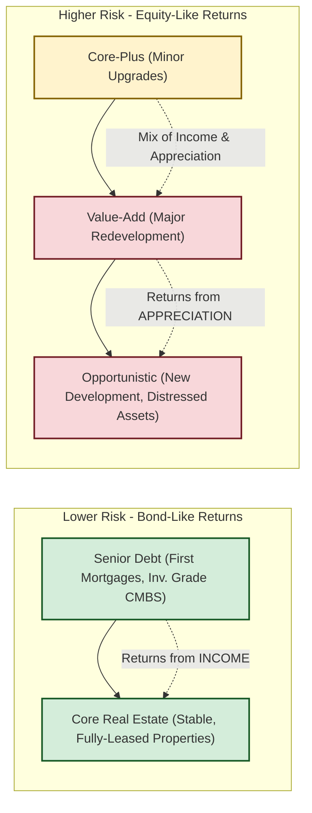

# Reading 79: Real Estate and Infrastructure 🏗️

### 🎯 Introduction

So far, we've talked about assets that are mostly entries on a   * **Real Estate's defining characteristic is heterogeneity**—no two properties are the same.
  * **REITs** are your liquid, tax-efficient, and diversified way to invest in public real estate.
  * **Real Estate Risk Spectrum:** **Core** (safe, income-driven) → **Value-Add** → **Opportunistic** (risky, appreciation-driven).
  * **Infrastructure Stages:** **Greenfield** (build new, high risk) → **Brownfield** (upgrade existing, medium risk) → **Secondary Stage** (buy mature, low risk).
  * **Infrastructure's Superpower:** Long-term, stable, inflation-linked cash flows with extremely low correlation to stocks and bonds. This makes it a top-tier diversifier.r or screen. Now, we get tangible! **Real Assets**, like Real Estate and Infrastructure, are the physical backbone of our economy. They're the offices we work in (like those in Mumbai's BKC), the roads we drive on (like the Mumbai-Pune Expressway), and the airports we fly from.

Investing in these assets is like owning a piece of the real, functioning world. It's a different game—it's often **illiquid** and requires a long-term view. But in return, it can offer stable, predictable cash flows and diversification benefits that are hard to find anywhere else. Let's lay the foundation!

-----

### Part 1: Real Estate - More Than Just Four Walls and a Roof 🏢

**Real estate** is simply land and the buildings on it. It's a massive asset class, dominated by **residential** property (homes, apartments) but also includes **commercial** property (offices, malls, warehouses).

#### What Makes Real Estate Unique?

  * **Heterogeneity** 🧩: This is a key term\! It means **no two properties are identical**. A flat in South Delhi is not the same as one in Bengaluru, even if they're the same size. Location, age, and quality make each one unique.
  * **High Cost & Illiquidity** 💰: You can't buy a commercial building for ₹500, and selling one can take months or years.
  * **Fragmented Markets** 📍: The real estate market in Pune is driven by different factors than the market in Chennai. It's a collection of local markets, not one single global market.

#### How to Invest in Real Estate

You have two main paths, each with its own pros and cons.

##### **Direct Investing**

  * **What it is**: You buy the physical property yourself. You are the landlord.
  * **Pros ✅**:
      * **Control**: You decide everything—when to sell, who the tenants are, what rent to charge.
      * **Tax Benefits**: You can often deduct expenses like interest and **depreciation** (a non-cash expense that reflects wear and tear) to lower your taxable income.
  * **Cons ❌**:
      * **Complexity**: Requires significant time, effort, and expertise.
      * **Large Capital**: You need a lot of money.
      * **Concentration Risk**: All your eggs are in one (or a few) baskets.

##### **Indirect Investing**

  * **What it is**: You pool your money with other investors. This is the most common route for most people.
  * **Key Vehicle: Real Estate Investment Trusts (REITs)** REITs are companies that own (and often operate) income-producing real estate.
      * **How they work**: They are publicly traded on stock exchanges, just like shares of a company. You can buy and sell them easily.
      * **Example 🇮🇳**: The **Brookfield India Real Estate Trust (BIRET)** is a popular REIT in India that owns prime office properties.
      * **Big Advantage**: REITs are **tax-efficient**. They are required to pay out most of their income (typically 90%) to shareholders as dividends, which allows them to avoid corporate income tax.
  * **Pros ✅**: Liquidity, diversification, and professional management.
  * **Cons ❌**: No direct control, and their prices tend to be more correlated with the overall stock market.

#### The Real Estate Risk-Return Spectrum

Not all real estate is the same. The strategy you choose determines your risk and potential return. Think of it as a spectrum from safe and steady to risky and speculative.

  * **Core Strategy (Low Risk)**: Buying high-quality, stable, fully leased buildings in prime locations. The goal is predictable rental **income**. It's like buying a high-quality government bond.
  * **Value-Add Strategy (Medium Risk)**: Buying a property that needs some work, like an old office building that needs renovating. The goal is to improve it and then increase the rents or sell it for a profit. Returns are a mix of income and **capital appreciation**.
  * **Opportunistic Strategy (High Risk)**: The riskiest end. This involves developing a new building from scratch or buying a distressed property. The returns are almost entirely dependent on **capital appreciation**. It's like investing in a high-growth tech stock.

> [!TIP]
> **CFA Exam Tip ✍️:** The **Real Estate Risk-Return Spectrum (Core -> Value-Add -> Opportunistic)** is a critical concept. Know what each strategy involves and whether its primary return driver is stable **income** or speculative **capital appreciation**. Also, remember that **REITs** are your liquid, publicly traded gateway to real estate.

-----

### Part 2: Infrastructure - The Arteries of an Economy 🌉

**Infrastructure** assets are the essential, long-lived facilities that a society needs to function. Think airports, seaports, toll roads, power grids, and data centers.

#### Key Features of Infrastructure

  * **Long Life & Capital Intensive** 🛠️: These assets cost billions and are built to last for decades.
  * **Provide Essential Services** 🔌: Society can't function without them. This leads to stable, inelastic demand.
  * **High Barriers to Entry** 🚧: You can't just decide to build a competing airport next to an existing one. This often creates a monopoly or oligopoly.
  * **Stable, Predictable Cash Flows** 💵: Often backed by long-term contracts with governments or users. These cash flows are frequently linked to inflation.

#### Categories & Development Stages

##### **Categories**

  * **Economic Infrastructure**: Assets that are critical for economic activity.
      * *Examples*: The **Delhi-Mumbai Expressway** (transportation), **Jio's 5G network** (communication), **Adani's power plants** (utility & energy).
  * **Social Infrastructure**: Assets that support social services.
      * *Examples*: Hospitals, schools, and public housing projects.

##### **Development Stages**

  * **Greenfield**: Building a brand-new project from an empty piece of land (a "green field").
      * **Analogy**: Building a house from scratch on an empty plot.
      * **Risk**: Highest risk (construction delays, cost overruns) but highest potential return.
      * **Lifecycle**: Often follows a **Build-Operate-Transfer (BOT)** model, where a private company builds and operates the asset for a period (e.g., 30 years) before transferring it back to the government.
  * **Brownfield**: Investing in an *existing* asset that needs expansion or upgrades.
      * **Analogy**: Renovating and extending an old house.
      * **Risk**: Medium risk. The asset already exists and has a performance history.
  * **Secondary Stage**: Buying a fully operational and mature infrastructure asset.
      * **Analogy**: Buying a perfectly finished, modern house that is already rented out.
      * **Risk**: Lowest risk, providing stable, predictable cash flows.

#### Why Invest in Infrastructure?

Infrastructure is a favorite of large, long-term investors like pension funds and sovereign wealth funds for several reasons:

  * **Diversification**: Infrastructure returns have a very **low correlation** with stocks and bonds. They march to the beat of their own drum.
  * **Inflation Hedge**: Contracts are often indexed to inflation, meaning revenues automatically increase as prices rise, protecting purchasing power.
  * **Stable Cash Flows**: The long-term, contracted nature of the revenue provides a steady, bond-like income stream, perfect for matching long-term liabilities like pension payments.

> [\!TIP]
> **CFA Exam Tip ✍️:** Memorize the infrastructure development stages and their associated risk levels: **Greenfield** (highest risk/return), **Brownfield** (medium risk/return), and **Secondary Stage** (lowest risk/return). Understand that the main appeal of infrastructure is its combination of **stable, inflation-linked cash flows** and **low correlation** to other asset classes.

-----

### 🧪 Formula Summary

This reading is all about the concepts! No new formulas to memorize here. ✅

-----

> [\!IMPORTANT]
>
> ### 🎯 Quick Exam-Day Pointers
>
>   * **Real Estate's defining characteristic is heterogeneity**—no two properties are the same.
>   * **REITs** are your liquid, tax-efficient, and diversified way to invest in public real estate.
>   * **Real Estate Risk Spectrum:** **Core** (safe, income-driven) → **Value-Add** → **Opportunistic** (risky, appreciation-driven).
>   * **Infrastructure Stages:** **Greenfield** (build new, high risk) → **Brownfield** (upgrade existing, medium risk) → **Secondary Stage** (buy mature, low risk).
>   * **Infrastructure's Superpower:** Long-term, stable, inflation-linked cash flows with extremely low correlation to stocks and bonds. This makes it a top-tier diversifier.