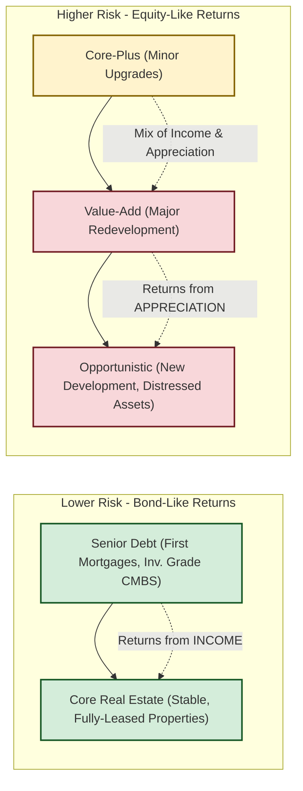

### Reading 79: Real Estate and Infrastructure 🏗️

### 🎯 Introduction

So far, we've talked about assets that are mostly entries on a balance sheet or screen. Now, we get tangible! **Real Assets**, like Real Estate and Infrastructure, are the physical backbone of our economy. They're the offices we work in (like those in Mumbai's BKC), the roads we drive on (like the Mumbai–Pune Expressway), and the airports we fly from.

Investing in these assets is like owning a piece of the real, functioning world. It's often **illiquid** and requires a long-term view, but it can provide stable, predictable cash flows and diversification benefits.

-----
### Part 1: Real Estate - More Than Just Four Walls and a Roof 🏢 (LOS 79.a)

**Real estate** is land plus the buildings on it. The class includes **residential** (homes, apartments) and **commercial** property (offices, malls, warehouses).

#### 1.1 What Makes Real Estate Unique?

  * **Heterogeneity** 🧩 → No two properties are identical (location, age, quality differ).
  * **High Cost & Illiquidity** 💰 → Large capital requirement; sales can take months or years.
  * **Fragmented Local Markets** 📍 → Local drivers (city/regional) matter more than global trends.

#### 1.2 How to Invest in Real Estate

You have two main paths, each with pros and cons.

##### 1.2.1 Direct Investing

  * **What it is:** You buy the physical property yourself and act as the landlord.
  * **Pros ✅**
    * **Control:** Decide tenants, rent, and sale timing.
    * **Tax benefits:** Deduct interest and **depreciation** to reduce taxable income.
  * **Cons ❌**
    * **Complexity:** Requires active management and expertise.
    * **Large capital & concentration risk**

##### 1.2.2 Indirect Investing

  * **What it is:** Pool capital with others (funds, listed vehicles).
  * **Key vehicle — REITs:** Publicly traded trusts that own/operate income-producing real estate.
    * **How they work:** Trade on exchanges like stocks; provide liquidity.
    * **Example (India):** **Brookfield India Real Estate Trust (BIRET)** owns prime office properties.
    * **Tax & cash flow:** Often required to distribute large portions of income as dividends.
  * **Pros ✅** Liquidity, diversification, professional management.
  * **Cons ❌** Less control; market price correlation with equities.

#### 1.3 The Real Estate Risk–Return Spectrum

Not all real estate strategies are the same:

  * **Core (Low risk):** Stable, income-focused; akin to high-quality bonds.
  * **Value-Add (Medium):** Improve assets to raise rents/value; mixed income & appreciation.
  * **Opportunistic (High):** Development/distressed plays; returns mainly from appreciation.

💡 CFA Exam Tip ✍️:The Real Estate Risk–Return Spectrum (Core → Value‑Add → Opportunistic) is critical. Know each strategy's primary return driver (income vs appreciation) and remember REITs provide a liquid way to access real estate.

#### 1.4 Global & Local Context 🌍

  * **Global:** Institutional investors (pension funds) allocate to core real estate for liability matching; development cycles differ across regions.
  * **India (Local):** Office markets in Mumbai/Bengaluru exhibit different vacancy and rent dynamics; example — Mumbai's BKC vs. secondary office markets.

-----

### Part 2: Infrastructure - The Arteries of an Economy 🌉 (LOS 79.b)

**Infrastructure** assets (airports, toll roads, power grids, data centers) provide essential services and long-lived cash flows.

#### 2.1 Key Features

  * **Long life & capital intensive** 🛠️ — built to last decades.
  * **Essential services → inelastic demand** 🔌.
  * **High barriers to entry** 🚧 → monopoly/oligopoly characteristics.
  * **Stable cash flows, often inflation-linked** 💵.

#### 2.2 Categories

  * **Economic infrastructure:** Transport, power, telecom (e.g., Delhi–Mumbai Expressway, Jio 5G, Adani power plants).
  * **Social infrastructure:** Hospitals, schools, public housing.
  * **Utilities infrastructure:** Water, waste management, .
  * **Digital infrastructure:** Data centers, fiber networks (e.g., Tata Communications' global network).
  * **Energy infrastructure:** Renewables, grids, storage (e.g., ReNew Power's wind/solar farms).

#### 2.3 Development Stages

  * **Greenfield:** New-build projects — highest risk/reward; often BOT models.
  * **Brownfield:** Upgrades/expansions of existing assets — medium risk.
  * **Secondary Stage:** Mature, operational assets — lowest risk, steady cash flows.

💡 CFA Exam Tip ✍️:Memorize development stages and their risk ordering: **Greenfield** (highest), **Brownfield** (medium), **Secondary** (lowest). Infrastructure's appeal: stable, inflation‑linked cash flows and low correlation with equities.

#### 2.4 Global & Local Context 🌍

  * **Global:** Pension funds and sovereign wealth funds favor infrastructure for long-dated liabilities and inflation protection.
  * **India (Local):** BOT roads, privatized airports, and large-scale telecom rollout (e.g., Jio) illustrate how policy and private investment interact in infrastructure financing.

-----

### 🧪 Formula Summary

This reading has no new formulas to memorize. ✅

-----

### 🎯 Quick Exam-Day Pointers

* **Heterogeneity (Real Estate):** → No two properties are the same — focus on location, quality, and local market drivers.
* **REITs:** ✅ Liquid, tax‑efficient, and an easy public way to access property income.
* **Risk–Return (Real Estate):** Core → Value‑Add → Opportunistic (income → mixed → appreciation).
* **Infrastructure stages:** Greenfield → Brownfield → Secondary (highest → medium → lowest risk).
* **Infrastructure benefits:** ⬆️ Stable, inflation‑linked cash flows; low correlation with equities; favored by long‑term institutional investors.

