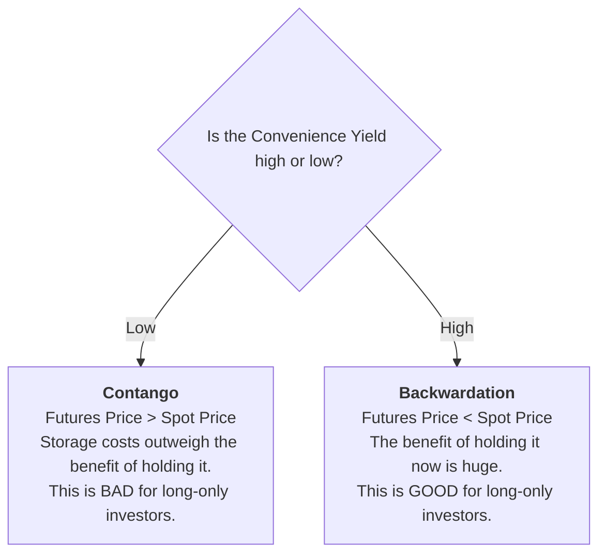

Excellent\! Let's explore Reading 80, which covers investments in natural resources like land and commodities. This reading has some very specific and testable concepts, especially around commodity futures.

-----

## 🌟 Reading 80: Natural Resources

This reading is about investing in the raw materials of the global economy. We'll cover tangible land assets first, then dive into the more complex world of commodities.

-----

###  🌳 Part 1: Land-Based Resources (Farmland & Timberland)

These are direct investments in productive land. While they might seem similar, they have one crucial difference.

  * **Farmland 🌾:**

      * **Returns from:** 1) Price appreciation of the land, 2) Income from leasing the land to farmers, and 3) Selling the crops grown.
      * **Characteristics:** Illiquid, requires specialized knowledge. **Harvesting is time-sensitive**; a farmer can't wait six months to harvest ripe wheat just because prices are low. This makes hedging with futures common.

  * **Timberland 🌲:**

      * **Returns from:** 1) Price appreciation of the land, 2) Selling the harvested timber.
      * **Characteristics:** Illiquid, requires very large capital outlays, and is mostly owned by institutions.
      * **<mark>Key Difference & EXAM TIP:</mark>** Timberland has a significant **timing flexibility option**. A timberland owner can choose *not* to harvest trees during a period of low lumber prices and let them continue to grow. This option to wait for better prices is a valuable feature not present in farmland.

  * **ESG Angle:** Both farmland and timberland are attractive to ESG-focused investors because growing crops and trees consumes carbon, helping to combat climate change. 🌍

-----

###  🛢️ Part 2: Commodities

Commodities are the raw materials themselves, like crude oil, gold, copper, and wheat.

#### How to Invest in Commodities

Directly buying and storing barrels of oil or bushels of wheat is impractical for most. Therefore, investment exposure is almost always gained **indirectly**:

  * **Derivatives (Futures Contracts):** This is the most common method.
  * **Exchange-Traded Products (ETPs):** These are ETFs or ETNs that track the price of a commodity or a commodity index.
  * **Managed Futures Funds (CTAs):** Actively managed funds specializing in commodity futures trading.

#### Commodity Valuation: Contango vs. Backwardation

**<mark>This is the most critical and challenging part of the reading. You MUST understand this for the exam.</mark>**

The price of a futures contract is determined by the spot price, the costs of holding the physical good, and the benefit of holding it.

**The Formula:**
`Futures Price ≈ Spot Price + Storage Costs + Risk-Free Rate - Convenience Yield`

Let's break that down:

  * **Spot Price:** The price for immediate delivery.
  * **Storage Costs:** The cost to warehouse, insure, and prevent spoilage.
  * **Risk-Free Rate:** The cost of tying up money to buy the commodity now (opportunity cost).
  * **Convenience Yield:** This is the key concept. It's the **non-monetary benefit** of having the physical commodity on hand for use. A high convenience yield means users are desperate to get the physical good *now*.

This leads to two possible market states:

***Real-World Example (Contango vs. Backwardation):***

  * **Backwardation (High Convenience Yield):** Think about surgical masks in India in April 2020. The benefit of having a mask *right then* (the convenience yield) was enormous. The spot price for a mask was very high, much higher than a "futures" price for delivery in three months, because the immediate need was critical. The market was in **backwardation**. This is good for a long investor who holds a futures contract, as the price will tend to rise toward the higher spot price as the contract nears expiration.

  * **Contango (Low Convenience Yield):** Think about crude oil in May 2020 when global lockdowns crushed demand. Storage tanks were full, so the cost to store an extra barrel of oil was very high, and the immediate need (convenience yield) was low. The spot price of oil actually went negative, while futures prices for delivery months later were much higher, reflecting the high storage costs. The market was in deep **contango**. This is bad for a long investor, as the futures price will tend to fall toward the lower spot price over time.

-----

###  📊 Part 3: Risk, Return, and Diversification

#### Sources of Risk and Return

  * **Volatility:** Commodity prices are notoriously volatile. This is mainly because **supply is inelastic** in the short run. It takes a long time to drill a new oil well or plant and grow a new crop. A sudden surge in demand or a supply disruption (like a bad monsoon affecting crops in India) can cause prices to spike or crash.
  * **Returns:** Historically, commodity returns have been higher than stocks or bonds, but so has their volatility. Timberland and farmland have also offered high returns but with *lower* volatility than stocks.

#### Role in a Portfolio

**<mark>EXAM TIP:</mark>** Commodities offer two powerful and unique benefits to a traditional portfolio of stocks and bonds. Memorize these\!

1.  **Diversification Benefit  düşük:** Commodity returns have a **very low correlation** with the returns of stocks and bonds. Adding them to a portfolio can significantly reduce overall risk.
2.  **Inflation Hedge 📈:** Commodity prices have a **positive correlation with inflation**. When inflation is rising, commodity prices tend to rise as well. This makes them an excellent hedge against inflation risk, something that stocks and bonds don't do as well.

-----

###  📝 Formulas and Calculations Used in This Reading

  * **Commodity Futures Pricing:**
    $$\text{Futures Price} \approx \text{Spot Price} \times (1 + R_f) + \text{Storage Costs} - \text{Convenience Yield}$$
    *You won't likely have to calculate a price, but you MUST know the relationship and how the convenience yield drives the market into contango or backwardation.*

-----

###  🚀 Quick Exam-Day Pointers

For Reading 80, lock down these key concepts:

  * **Timberland's Flexibility:** The key difference between timberland and farmland is the **option to delay harvesting** in timberland.
  * **Contango vs. Backwardation:** Know the definitions (`Contango: Futures > Spot`, `Backwardation: Futures < Spot`), what causes them (Convenience Yield\!), and who benefits (Backwardation is good for long investors).
  * **Two Key Portfolio Benefits of Commodities:** Remember them: **1) Diversification (low correlation)** and **2) Inflation Hedge (positive correlation)**.