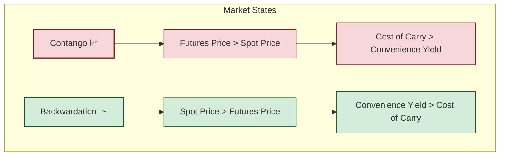

----- 

## Reading 80: Natural Resource

### 🎯 Introduction

Get ready to get your hands dirty! If stocks and bonds are the engines of a portfolio, **Natural Resources** are the raw fuel and the fertile ground beneath our feet. We're moving beyond produced assets like buildings and infrastructure to the very source of economic production: the **farmland** that grows our food, the **timberland** that provides our lumber, and the **commodities** like oil and gold that power our industries.

These are real, tangible assets with unique risks (hello, weather! ⛈️) and powerful benefits, especially as a hedge against inflation. Let's dig in!

-----

### Part 1: Investing in the Land - Farmland & Timberland 🚜 (LOS 80.a)

Investing in land like farmland and timberland is similar to real estate—it's illiquid and each parcel is unique. However, the key difference is that its value comes from its **biological, productive capacity** (soil quality, climate) rather than from physical buildings on it.

#### 1.1 Farmland vs. Timberland: Overview

* **Farmland**
  * **What it is:** Investing in land used for growing crops (wheat, corn, fruits) or for pastureland.
  * **Return Drivers:**
    * **Income:** From selling harvested crops or leasing the land to farmers.
    * **Land Appreciation:** The value of the land itself can increase over time.
  * **Key Feature:** **Inflexible Harvest Cycle** ⏰ — crops must be harvested when ripe (e.g., sugarcane in Maharashtra; wheat in Punjab).

* **Timberland**
  * **What it is:** Investing in forests harvested for lumber.
  * **Return Drivers:**
    * **Biological Growth:** Trees increase in volume and value over time.
    * **Lumber Prices:** Market price movements for timber.
    * **Land Appreciation:** Underlying land value.
  * **Key Feature:** **Flexible Harvest Cycle** ✅ — owners can delay harvest to wait for better prices; acts as both a factory (growing trees) and a warehouse (storing value on the stump).

* **Investment Vehicles:** Institutions use TIMOs (Timberland Investment Management Organizations) or farmland REITs/ETPs for exposure.

#### 1.2 Investment Characteristics & Risks

* **Liquidity:** Illiquid; transactions are infrequent and parcel-specific.
* **Valuation:** Valuations often rely on infrequent appraisals → reported volatility may be **smoothed**.
* **Major Risks:**
  * **Weather & Disease:** ⛈️ crop failure, pests.
  * **Regulatory:** Land-use changes, zoning, environmental rules.
  * **Market:** Commodity price swings for crops or lumber.

#### 1.4 Global & Local Context 🌍

* **Global Example:** U.S. farmland values often reflect mechanization and scale economies (e.g., Midwestern row-crop farms benefiting from productivity gains), while timberland in Scandinavia benefits from long-term managed forestry and stable markets.
* **India/Local Example:** Indian sugarcane farmland in Maharashtra faces rigid harvest cycles and regulatory support/prices; Indian timber investments are smaller but growing with plantation forestry and agroforestry initiatives.

-----

### Part 2: Commodities - The Building Blocks of the Economy 🛢️ (LOS 80.b)

**Commodities** are standardized raw materials. They don't generate cash flow on their own; returns come from price changes.

#### 2.1 Commodity Types

* **Hard Commodities:** Mined or extracted (e.g., crude oil, copper, gold).
* **Soft Commodities:** Grown (e.g., wheat, coffee, cotton).

#### 2.2 How to Invest in Commodities

* **Derivatives (Futures & Forwards):** Liquid and efficient exposure; common for institutional traders.
* **Exchange-Traded Products (ETPs):** ETFs/ETNs that track commodity prices (e.g., Gold ETF on the NSE).
* **Commodity Trading Advisors (CTAs):** Managed funds using trend-following strategies in futures markets.
* **Physical Holdings:** Rare for most investors due to storage and insurance costs.

#### 2.3 Contango & Backwardation

This core concept links spot and futures markets via the **cost of carry** (storage, insurance, financing) and the **convenience yield** (benefit of holding the physical).

**Convenience Yield:** Non-monetary value of having the physical commodity now — high when inventories are low or scarcity risk exists.

##### 2.3.1 Contango

* **Definition:** Futures > Spot; forward curve slopes **upward**.
* **Cause:** **Cost of carry** > **Convenience yield**.
* **Impact:** → **Negative roll yield** for long-only futures investors (selling cheap expiring contract and buying a more expensive one).

##### 2.3.2 Backwardation

* **Definition:** Spot > Futures; forward curve slopes **downward**.
* **Cause:** **Convenience yield** > **Cost of carry** (shortage or tight inventories).
* **Impact:** → **Positive roll yield** for long-only investors (rolling into a cheaper contract).

#### 2.4 Global & Local Context 🌍

* **Global Example:** Oil market backwardation during tight supply (e.g., post-supply shocks) can benefit long crude futures holders via roll yield.
* **India/Local Example:** Gold demand in India (jewelry, festivals) influences spot premiums and convenience yield; domestic storage/transport costs affect forward curves for local ETPs.

-----

### Part 3: Risk, Return & Portfolio Benefits ⚖️ (LOS 80.c)

#### 3.1 Inflation Hedging

* **Commodities:** Strong inflation hedge — commodity prices feed directly into CPI components.
* **Farmland & Timberland:** Decent hedges — hold value in inflation but less direct than commodities.

#### 3.2 Diversification

* **Farmland & Timberland:** Outstanding diversifiers — historically low correlation with stocks and bonds; note appraisal smoothing can understate true volatility.
* **Commodities:** Low-to-moderate correlation with stocks; very low with bonds.

#### 3.4 Global & Local Context 🌍

* **Global Example:** Commodities often perform well during global inflationary periods (e.g., oil and food price spikes during supply shocks), providing portfolio protection.
* **India/Local Example:** In India, agricultural commodity cycles (monsoon variability) and gold demand (festivals/weddings) materially influence local commodity prices and investment flows.

💡 CFA Exam Tip ✍️:**Contango vs. Backwardation** is core. Visual: Contango's curve goes **up** (C**up**), Backwardation goes **down**. Know drivers (cost of carry vs. convenience yield) and the impact on long futures investors. Remember: **Commodities** = best inflation hedge; **Farmland/Timberland** = best diversifiers.

----- 

### 🧪 Formula Summary

**Commodity Forward Pricing (Cost-of-Carry Model):**

$$F_0(T) = S_0 e^{(r + c - y)T}$$

### 🎯 Quick Exam-Day Pointers

* **Timberland's Unique Edge:** 
  * **→** Acts as **factory + warehouse** — delay harvest to capture higher prices.
* **Contango:** 
  * **Definition:** Forward curve slopes **UP** 📈 (Futures > Spot).
  * **Cause:** **High storage/finance costs** (Cost of carry).
  * **Impact:** ✅ **Hurts** long futures investors due to negative roll yield.
* **Backwardation:**
  * **Definition:** Forward curve slopes **DOWN** 📉 (Spot > Futures).
  * **Cause:** **High convenience yield** (scarcity).
  * **Impact:** ✅ **Helps** long futures investors via positive roll yield.
* **Inflation Hedge:** 
  * **Commodities** → **Primary inflation hedge** (prices feed CPI).
* **Diversifier:** 
  * **Farmland & Timberland** → **Outstanding diversifiers** (low correlation with stocks/bonds).

