# Reading 80: Natural Resource

### 🎯 Introduction

Get ready to get your hands dirty! If stocks and bonds are the engines of a portfolio, **Natural Resources** are the raw fuel and the fertile ground beneath our feet. We're moving beyond produced assets like buildings and infrastructure to the very source of economic production: the **farmland** that grows our food, the **timberland** that provides our lumber, and the **commodities** like oil and gold that power our industries.

These are real, tangible assets with unique risks (hello, weather! ⛈️) and powerful benefits, especially as a hedge against inflation. Let's dig in!

-----

### Part 1: Investing in the Land - Farmland & Timberland 🚜

Investing in land like farmland and timberland is similar to real estate—it's illiquid and each parcel is unique. However, the key difference is that its value comes from its **biological, productive capacity** (soil quality, climate) rather than from physical buildings on it.

#### Farmland vs. Timberland: A Tale of Two Harvests

While they seem similar, there's a crucial difference in how they generate returns, which the exam loves to test.

##### **Farmland**

  * **What it is**: Investing in land used for growing crops (like wheat, corn, fruits) or for pastureland.
  * **Return Drivers**:
    1.  **Income**: From selling harvested crops or leasing the land to farmers.
    2.  **Land Appreciation**: The value of the land itself can increase over time.
  * **Key Feature**: **Inflexible Harvest Cycle** ⏰. Crops like sugarcane in Maharashtra or wheat in Punjab must be harvested when they are ripe. You can't just wait a year for a better price.

##### **Timberland**

  * **What it is**: Investing in forests for the purpose of harvesting trees for lumber.
  * **Return Drivers**:
    1.  **Biological Growth**: Trees get bigger and more valuable every year, all on their own\!
    2.  **Lumber Prices**: The price of timber in the market.
    3.  **Land Appreciation**: The underlying land value.
  * **Key Feature**: **Flexible Harvest Cycle** ✅. This is timberland's superpower. It acts as both a **factory** (growing trees) and a **warehouse** (storing them on the stump). If lumber prices are low, the owner can simply wait, letting the trees continue to grow and become even more valuable for a future harvest.

Investment in this space is often done by large institutions through specialized vehicles like **Timberland Investment Management Organizations (TIMOs)**.

-----

### Part 2: Commodities - The Building Blocks of the Economy 🛢️

**Commodities** are standardized raw materials. They don't generate any cash flow on their own; you can't lease a barrel of oil! The investment return comes purely from price changes.

  * **Hard Commodities**: Mined or extracted. *Examples*: Crude oil, copper, gold.
  * **Soft Commodities**: Grown. *Examples*: Wheat, coffee, cotton.

#### How to Invest in Commodities

Holding physical commodities is a hassle (storage, insurance). So, most investors get exposure through financial instruments:

  * **Derivatives (Futures & Forwards)**: This is the most common way. It's liquid and efficient.
  * **Exchange-Traded Products (ETPs)**: These are ETFs and ETNs that track the price of a commodity or a basket of commodities. Investing in a Gold ETF on the NSE is a perfect example.
  * **Commodity Trading Advisors (CTAs)**: Managed funds that use trend-following strategies in the futures markets.

#### The Secret Language of Commodity Prices: Contango & Backwardation

This is a critical concept. Because commodities exist in both a physical (spot) market and a futures market, their prices are linked. The difference is driven by the **cost of carry** (storage, insurance, financing costs) and the **convenience yield**.

**Convenience Yield**: This is the non-monetary benefit of having the physical commodity *right now*. It's high when inventories are low and there's a risk of a shortage. It's like the benefit of having a backup power generator during a blackout—it's extremely valuable when you need it!

This leads to two possible market states:

```mermaid
graph TD
    subgraph "Market States"
        A["Contango 📈"] --> B["Futures Price > Spot Price"]
        B --> C["Cost of Carry > Convenience Yield"]
        
        D["Backwardation 📉"] --> E["Spot Price > Futures Price"]
        E --> F["Convenience Yield > Cost of Carry"]
    end

    style A fill:#f8d7da,stroke:#721c24,stroke-width:2px
    style D fill:#d4edda,stroke:#155724,stroke-width:2px
    style B fill:#f8d7da,stroke:#721c24,stroke-width:1px
    style C fill:#f8d7da,stroke:#721c24,stroke-width:1px
    style E fill:#d4edda,stroke:#155724,stroke-width:1px
    style F fill:#d4edda,stroke:#155724,stroke-width:1px
```

##### **Contango**

  * **What it means**: Futures prices are *higher* than the spot price. The forward curve slopes **upward**.
  * **Why it happens**: The market is saying it's expensive to store the commodity. The **cost of carry** is greater than the **convenience yield**.
  * **Impact**: **Bad for a long-only investor**. When their current futures contract is about to expire, they have to sell it and buy a new, more expensive one ("rolling" the position), which creates a drag on returns.

##### **Backwardation**

  * **What it means**: Futures prices are *lower* than the spot price. The forward curve slopes **downward**.
  * **Why it happens**: The market is signaling a shortage. The benefit of having the physical commodity now is high. The **convenience yield** is greater than the **cost of carry**.
  * **Impact**: **Good for a long-only investor**. When they roll their position, they sell their expiring contract and buy a new, cheaper one, which generates a positive "roll yield."

-----

### Part 3: Risk, Return & Portfolio Benefits ⚖️

#### Inflation Hedging: The Superpower of Commodities

This is a major reason why investors turn to natural resources.

  * **Commodities**: Are an **excellent inflation hedge** ⭐. Why? Because prices of things like energy and food are direct components of inflation indexes like the Consumer Price Index (CPI). When inflation is high, commodity returns tend to be very high.
  * **Farmland & Timberland**: Are a decent, but less direct, inflation hedge. They tend to hold their value well during inflationary periods but don't have the same direct, high correlation as commodities.

#### Diversification: The Benefit of Being Different

  * **Farmland & Timberland**: Are **outstanding diversifiers**. Their returns have historically shown near-zero correlation with stocks and bonds. They are driven by different factors like biological growth and weather, not corporate earnings or interest rates.
      * *A note on risk*: Because their values are based on infrequent appraisals, their reported volatility is often artificially low (**smoothed returns**). The real risks (weather, disease) are still significant!
  * **Commodities**: Are also a **good diversifier**. They have a low-to-moderate correlation with stocks (since both are tied to the economic cycle) and very low correlation with bonds.

> [!TIP]
> **CFA Exam Tip ✍️:** **Contango vs. Backwardation** is a core concept. Remember the visual: Contango's curve goes up (C**up**), Backwardation's curve goes down. Know what drives each state and the impact on a long investor. Also, remember: **Commodities are the best inflation hedge**, while **Farmland/Timberland are the best diversifiers**.

-----

### 🧪 Formula Summary

* **Commodity Forward Pricing (Cost-of-Carry Model):**
  This formula shows the no-arbitrage relationship between the spot price and the forward price.

  $$F_0(T) = S_0e^{(r + c - y)T}$$

  Where:
  * $F_0(T)$ = Forward price for delivery at time T
  * $S_0$ = Spot price today
  * $e$ = Base of the natural logarithm (approx. 2.718)
  * $r$ = Risk-free interest rate
  * $c$ = Storage costs (as a percentage of asset value)
  * $y$ = **Convenience yield** (as a percentage of asset value). *Note: The curriculum uses `i` here, but `y` is more standard across CFA materials.*
  * $T$ = Time to expiration of the contract, in years

-----

> [!IMPORTANT]
>
> ### 🎯 Quick Exam-Day Pointers
>
> * **Timberland's Unique Edge:** It's a factory + warehouse. You can delay harvesting to wait for better prices.
> * **Contango:** Curve slopes **UP** 📈. Futures > Spot. Driven by high storage costs. **Hurts** long futures investors.
> * **Backwardation:** Curve slopes **DOWN** 📉. Spot > Futures. Driven by high **convenience yield** (scarcity). **Helps** long futures investors.
> * **The Ultimate Inflation Hedge?** **Commodities**. Their prices are a direct input to inflation.
> * **The Ultimate Diversifier?** **Farmland & Timberland**. Their returns have almost no correlation with stocks and bonds.