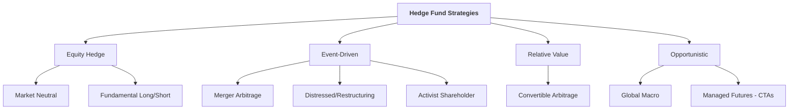

## 🌟 Reading 81: Hedge Funds

Hedge funds are one of the most talked-about but least understood types of alternative investments. Think of them as the highly specialized, lightly regulated commandos of the investment world, open only to wealthy, accredited investors.

**Key Differences from Other Fund Types:**

  * **vs. Mutual Funds:** Hedge funds are private, less regulated, charge much higher fees, are illiquid, and can use aggressive tools like short selling and high leverage.
  * **vs. Private Equity:** Hedge funds typically invest in more liquid, publicly-traded securities and have shorter investment horizons. Investors can usually redeem their money periodically (e.g., quarterly), unlike the 5-10 year lock-up in PE.

-----

###  🧠 Hedge Fund Strategies: The Four Main Playbooks

**<mark>EXAM TIP:</mark>** You must be able to identify and differentiate between the main hedge fund strategies. This is the most important part of the reading.

1.  **Equity Hedge:** The most common category. These funds take long and short positions in stocks.

      * **Market Neutral:** Tries to be immune to the overall stock market's direction by balancing long and short positions. The goal is to profit purely from good stock selection (e.g., long HDFC Bank, short a weaker private bank), regardless of whether the Nifty goes up or down.
      * **Short Bias:** A bearish strategy that maintains a net short position, betting that the market or specific stocks will fall.

2.  **Event-Driven:** These strategies seek to profit from specific corporate events.

      * **Merger Arbitrage:** When Company A announces it will buy Company B for ₹100/share, Company B's stock might trade at ₹95. The fund buys Company B at ₹95, betting the deal will close and they'll capture the ₹5 spread. **It is NOT risk-free**; the deal could fall through\!
      * **Distressed/Restructuring:** Buys the debt or equity of companies in or near bankruptcy, believing the securities are undervalued and will be worth more after a restructuring.
      * **Activist Shareholder:** Buys a large enough stake in a company to get a board seat and force changes to "unlock value," such as selling off a division or changing management.

3.  **Relative Value:** Tries to exploit small price discrepancies between related securities.

      * **Convertible Arbitrage:** A classic example. If a convertible bond is underpriced relative to the underlying stock, the fund might buy the bond and short the stock to profit from the mispricing with little market risk.

4.  **Opportunistic:** Takes a top-down view of the world.

      * **Global Macro:** The "big picture" strategy. Makes large bets on the direction of interest rates, currencies, commodities, or entire stock markets based on economic trends.
      * **Managed Futures (CTAs):** Follows trends in the futures markets, both in commodities and financial futures.

-----

###  🏗️ Investment Vehicles and Structures

  * **Master-Feeder Structure:** A common structure used to efficiently pool capital from both domestic/onshore investors and international/offshore (tax haven) investors into one central "Master Fund" where all the trading occurs.
  * **Separately Managed Account (SMA):** A "hedge fund for one" for a very large institutional investor, with customized terms.

#### Fund-of-Funds (FoFs): The Hedge Fund "Mutual Fund"

A Fund-of-Funds is an investment vehicle that doesn't pick stocks or bonds itself; instead, it invests in a portfolio of different hedge funds.

**<mark>EXAM TIP:</mark>** Know the pros and cons of FoFs. This is a classic trade-off question.

  * **Pros:** 👍

      * **Access:** Allows smaller investors to access top-tier funds they couldn't get into directly.
      * **Diversification:** Spreads money across multiple strategies and managers.
      * **Due Diligence:** The FoF manager is an expert who vets the underlying hedge funds.
      * **Better Liquidity:** Often have shorter lockup periods than direct hedge fund investments.

  * **Cons:** 👎

      * **DOUBLE FEES\!** This is the biggest drawback. The FoF charges a fee (e.g., 1% management and 10% performance fee) **ON TOP OF** the fees charged by the underlying hedge funds (e.g., 2% and 20%). This layering of fees can significantly eat into an investor's net returns.

-----

###  📊 Risk, Return, and Performance Issues

#### Sources of Hedge Fund Returns

A fund's return can be broken down into three parts:

1.  **Market Beta:** The return from just being exposed to the overall market (e.g., the Nifty 50).
2.  **Strategy Beta:** The return from the fund's specific strategy or factor exposure (e.g., the return to a "value" strategy).
3.  **Alpha:** The manager's true skill. This is the excess return that can't be explained by the beta exposures.

Hedge funds use **leverage** to magnify the returns from their Strategy Beta and Alpha.

#### Performance Biases (Again\!)

**<mark>EXAM TIP:</mark>** Hedge fund indexes are notoriously unreliable and suffer from the same biases we saw in Reading 77.

  * **Survivorship Bias:** Failed funds disappear from the data, making the average return look higher than it was.
  * **Backfill Bias:** Successful funds are added to an index, and their *past* great performance is "backfilled," artificially inflating the index's historical returns.

Because of these biases, reported hedge fund index returns are generally **overstated**, and risk is **understated**.

-----

###  📝 Formulas and Calculations Used in This Reading

This reading is descriptive; there are **no formulas** to memorize. Focus on understanding the strategy definitions, the structure of a Fund-of-Funds, and the performance biases.

-----

###  🚀 Quick Exam-Day Pointers

For Reading 81, you should be able to:

  * **Differentiate Hedge Funds** from Mutual Funds and Private Equity based on liquidity, regulation, and investment horizon.
  * **Identify Key Strategies:** Be ready for scenario questions. If a fund is buying a target and shorting an acquirer, it's **Merger Arbitrage**. If it's betting on the direction of the US Dollar, it's **Global Macro**. If it's balancing long/short stock positions, it's **Market Neutral**.
  * **Fund-of-Funds Trade-off:** The main benefit is **diversification/access**, and the main drawback is the **extra layer of fees**.
  * **Performance Biases:** Remember that **survivorship** and **backfill bias** make hedge fund returns look better than they really are.