## Reading 81: Hedge Funds 🦎

### 🎯 Introduction

Welcome to the world of hedge funds, the chameleons of the investment universe! If a traditional mutual fund is like a commercial airliner—highly regulated, flying a fixed route, and open to the public—then a **hedge fund** is like a high-performance fighter jet. 🚀

It's incredibly flexible, operated by elite pilots (managers), uses powerful tools like **leverage** and **short selling**, and is not accessible to just anyone. Its mission is to achieve superior returns, often independent of the market's direction—what's known as an **absolute return** strategy. Fasten your seatbelt!

-----

### Part 1: The Hedge Fund Playbook - Strategies Explained (LOS 81.a)

First, let's bust a myth: the name "hedge fund" is misleading. While the original funds aimed to "hedge" or protect against market downturns, today's funds employ a vast array of strategies. They are defined by their *flexible approach*, not the assets they hold.

Here are the main categories of strategies you need to know.

#### 1.1 Equity Hedge

* **What:** Classic hedge fund strategies focused on equities.
* **Examples:**
  * **Long/Short Equity:** Managers buy (**long**) stocks they believe are undervalued and sell (**short**) stocks they believe are overvalued. The goal is to profit from stock-picking skill rather than market direction.
  * **Market Neutral:** A type of long/short strategy targeting portfolio **beta ≈ 0** so returns come from **alpha** (manager skill). Often uses **leverage** to enhance returns.
  * **Short Biased:** Net short positions; profitable when markets fall but challenging in prolonged bull markets.

#### 1.2 Event-Driven

* **What:** Strategies that profit from corporate events or special situations.
* **Examples:**
  * **Merger Arbitrage:** Buy the target (Company B) and short the acquirer (Company A) to capture the deal spread; biggest risk is the deal failing.
  * **Distressed/Restructuring:** Invest in securities (often debt) of companies in/near bankruptcy, betting on turnaround or asset value in liquidation.
  * **Activist:** Acquire a stake to influence management/board and unlock shareholder value (e.g., Carl Icahn's involvement with Hertz).

#### 1.3 Relative Value

* **What:** Exploit small pricing differences between related securities; often market-neutral and highly leveraged.
* **Examples:**
  * **Convertible Bond Arbitrage:** Buy mispriced convertible bonds and short the underlying stock to profit from convergence.
  * **Fixed-Income Arbitrage:** Exploit inefficiencies between bonds (government vs. corporate) or along the yield curve.

#### 1.4 Opportunistic (Macro)

* **What:** Top-down bets on markets, economies, or currencies.
* **Examples:**
  * **Global Macro:** Large bets on rates, FX, commodities, equities based on macro views (e.g., Soros vs. the Bank of England).
  * **Managed Futures (CTAs):** Systematic, trend-following models trading futures across markets; often perform well during sustained stress when trends form.

#### 1.4 Global & Local Context 🌍

* **Global example:** Global Macro funds capitalizing on central bank policy divergence (e.g., Fed vs. ECB) by taking positions in rates and FX.
* **India example:** Indian event-driven funds may target merger arbitrage opportunities when large corporates (e.g., Tata Group acquisitions) are announced, capturing deal spreads in local equity markets.

-----

### Part 2: How to Invest - Structures and Vehicles (LOS 81.b)

You can't buy a hedge fund on an exchange. Access is private and structured to serve sophisticated investors while giving managers maximum flexibility.

#### 2.1 The Master-Feeder Structure

This is the most common legal structure for global hedge funds. It's designed for tax efficiency and to pool assets from different types of investors.

```mermaid
graph TD
      A["🌍 Non-US & Tax-Exempt Investors"] --> B["Offshore Feeder Fund<br/>(e.g., in Cayman Islands)"]
      C["🇺🇸 US Taxable Investors"] --> D["Onshore Feeder Fund<br/>(e.g., in Delaware)"]
      B --> E["MASTER FUND<br/>All assets are held and managed here"]
      D --> E

      style A fill:#cce5ff,stroke:#0056b3,stroke-width:2px
      style C fill:#cce5ff,stroke:#0056b3,stroke-width:2px
      style B fill:#fff3cd,stroke:#856404,stroke-width:2px
      style D fill:#fff3cd,stroke:#856404,stroke-width:2px
      style E fill:#d4edda,stroke:#155724,stroke-width:3px
```

* It allows the manager to run one central portfolio (the **Master Fund**) while accommodating investors from different legal/tax jurisdictions through separate **Feeder Funds**.

#### 2.2 Forms of Investment: Direct vs. Indirect

##### 2.2.1 Direct Investment

* **Who:** Large, institutional investors.
* **Structures:**
  * **Limited Partnership:** Standard model where investor is a Limited Partner (LP).
  * **Separately Managed Account (SMA):** A "fund of one" — highly customized for a very large investor.
    * **Pros ✅:** Customization, transparency, control, often lower fees.
    * **Cons ❌:** Operational complexity, high capital requirement.

##### 2.2.2 Indirect Investment

* **Who:** Smaller (but accredited) investors seeking access.
* **Options:**
  * **Fund of Hedge Funds (FoHF):**
    * **Pros ✅:** Diversification, access to closed funds.
    * **Cons ❌:** Double layer of fees (major returns drag).
  * **Hedge Fund Replication ETFs:** Use quant models and liquid assets to mimic hedge fund return patterns with lower fees and greater liquidity.

💡 CFA Exam Tip ✍️:Be able to classify strategies quickly:
* If a question mentions a corporate merger → think **Event-Driven**.
* Small pricing gap between related bonds → **Relative Value**.
* Big macro bet on a currency → **Global Macro**.
* **Fund of Funds** major drawback → **double layer of fees** (remember as a key exam phrase).

-----

### Part 3: The Real Story - Risk, Return, and Diversification (LOS 81.c)

#### 3.1 Sources of Return: The Alpha Hunt

* **Alpha (α)** 🌟: Manager skill (security selection) returns.
* **Strategy Beta:** Returns from risk factors inherent to a strategy (e.g., deal spread risk in merger arbitrage).

#### 3.2 The Problem with Performance Data: Biases

Hedge fund performance indexes often overstate returns due to biases:

* **Survivorship Bias:** Poor performers that close are removed from indexes, inflating average returns.
* **Backfill Bias:** Managers report past strong performance selectively, creating a history of winners.

#### 3.3 The Diversification Benefit

* Historically, hedge funds show **low correlation** to traditional stocks and bonds.
* Adding hedge funds to a 60/40 portfolio can **reduce volatility** and **improve Sharpe ratio**.
* Note: correlations have risen recently, but diversification benefits—especially in crises—remain a key rationale.

#### 3.4 Global & Local Context 🌍

* **Global example:** Institutional investors use hedge funds to diversify portfolios during global crises (e.g., 2008/2020), capturing uncorrelated returns from CTAs and macro funds.
* **India example:** Indian pension or endowment funds may allocate small sleeves to FoHFs or domestic long/short managers for diversification while managing regulatory and liquidity constraints.

-----

### 🧪 Formula Summary

This reading is all about strategies and structures. No new formulas to memorize! 👍

-----

### 🎯 Quick Exam-Day Pointers

* **Definition & Goal**
  * **Hedge Funds = flexible strategy**, not asset type → aim for **absolute return**. → **Focus on strategy**, not label.
* **Key Strategies**
  * **Equity Hedge:** long/short, market neutral, short-biased.
  * **Event-Driven:** merger arbitrage, distressed, activist.
  * **Relative Value:** convertible arbitrage, fixed-income arbitrage.
  * **Macro/CTAs:** top-down bets, managed futures.
* **Fund Structures & Access**
  * **Master-Feeder:** central MASTER FUND + feeder funds for tax/jurisdictional efficiency.
  * **Direct (LP, SMA):** Pros ✅ customization/fees; Cons ❌ complexity/capital.
  * **Indirect (FoHF, ETFs):** Pros ✅ diversification/access; Cons ❌ double fees (FoHF).
* **Performance Data Caveats**
  * **Survivorship Bias** → reported returns biased upward.
  * **Backfill Bias** → selective historical reporting.
* **Primary Benefit**
  * **Portfolio Diversification:** can lower overall portfolio risk and improve risk-adjusted returns (Sharpe). ✅

