# Reading 81: Hedge Funds 🦎

### 🎯 Introduction

Welcome to the world of hedge funds, the chameleons of the investment universe! If a traditional mutual fund is like a commercial airliner—highly regulated, flying a fixed route, and open to the public—then a **hedge fund** is like a high-performance fighter jet. 🚀

It's incredibly flexible, operated by elite pilots (managers), uses powerful tools like **leverage** and **short selling**, and is not accessible to just anyone. Its mission is to achieve superior returns, often independent of the market's direction—what's known as an **absolute return** strategy. Fasten your seatbelt!

-----

### Part 1: The Hedge Fund Playbook - Strategies Explained 📜

First, let's bust a myth: the name "hedge fund" is misleading. While the original funds aimed to "hedge" or protect against market downturns, today's funds employ a vast array of strategies. They are defined by their *flexible approach*, not the assets they hold.

Here are the main categories of strategies you need to know.

##### **Equity Hedge**

This is the classic hedge fund strategy, focused on the stock market.

  * **Long/Short Equity**: The bread and butter. Managers buy (**long**) stocks they believe are undervalued and sell (**short**) stocks they believe are overvalued. The goal is to profit from their stock-picking skill, not just the overall market rising.
  * **Market Neutral**: A special type of long/short strategy that aims to have a portfolio **beta** of zero. This means the fund should be insensitive to the market's overall movements. Returns are generated purely from **alpha** (manager skill). Because the net exposure is zero, these funds often use **leverage** to generate meaningful returns.
  * **Short Biased**: These funds are net short the market, betting that prices will fall. It's a tough strategy during a bull market like the one seen for much of the last decade.

##### **Event-Driven**

These strategies seek to profit from specific corporate events or "special situations."

  * **Merger Arbitrage**: When Company A announces it will buy Company B, Company B's stock price will jump but usually trade at a small discount to the deal price until the merger is finalized. The fund manager buys Company B's stock and shorts Company A's stock, aiming to capture this small "deal spread." The biggest risk is the deal falling through.
  * **Distressed/Restructuring**: Investing in the securities (usually debt) of companies that are in or near bankruptcy. The manager is betting on a successful turnaround or that the value of the company's assets in a liquidation is higher than the distressed price of its debt.
  * **Activist**: The manager buys a large enough stake in a company to get a board seat and actively push for changes—like selling off an unprofitable division or replacing the CEO—to unlock shareholder value. The text provides the classic example of Carl Icahn's involvement with Hertz.

##### **Relative Value**

These strategies try to exploit small pricing differences between related securities. They are often market-neutral and require significant leverage to make the small price differences profitable.

  * **Convertible Bond Arbitrage**: A convertible bond can be converted into common stock. Sometimes, the price of the bond gets out of sync with the price of the underlying stock. A manager might buy the "cheap" convertible bond and short the "expensive" underlying stock to profit from the price convergence.
  * **Fixed-Income Arbitrage**: Exploiting pricing inefficiencies between various bonds, such as the spread between a government bond and a corporate bond, or differences along the yield curve.

##### **Opportunistic (Macro)**

These are "top-down" strategies that make broad bets on the direction of entire markets, economies, or currencies.

  * **Global Macro**: The most famous (and riskiest) strategy. Managers make bets on interest rates, currencies, commodities, and stock markets based on their analysis of global economic trends. George Soros "breaking the Bank of England" is the legendary example.
  * **Managed Futures (CTAs)**: **Commodity Trading Advisors (CTAs)** use systematic, trend-following models to trade in futures markets across commodities, currencies, and stock indices. They are known for performing well during periods of sustained market stress when strong trends emerge.

-----

### Part 2: How to Invest - Structures and Vehicles 🏛️

You can't buy a hedge fund on an exchange. Access is private and structured to serve sophisticated investors while giving managers maximum flexibility.

#### The Master-Feeder Structure

This is the most common legal structure for global hedge funds. It's designed for tax efficiency and to pool assets from different types of investors.

```mermaid
graph TD
    A["🌍 Non-US & Tax-Exempt Investors"] --> B["Offshore Feeder Fund (e.g., in Cayman Islands)"]
    C["🇺🇸 US Taxable Investors"] --> D["Onshore Feeder Fund (e.g., in Delaware)"]
    B --> E["MASTER FUND - All assets are held and managed here"]
    D --> E

    style A fill:#cce5ff,stroke:#0056b3,stroke-width:2px
    style C fill:#cce5ff,stroke:#0056b3,stroke-width:2px
    style B fill:#fff3cd,stroke:#856404,stroke-width:2px
    style D fill:#fff3cd,stroke:#856404,stroke-width:2px
    style E fill:#d4edda,stroke:#155724,stroke-width:3px
```

  * It allows the manager to run just one central portfolio (the **Master Fund**) while accommodating investors from different legal and tax jurisdictions through separate **Feeder Funds**.

#### Forms of Investment: Direct vs. Indirect

##### **Direct Investment**

This is for large, institutional investors.

  * **Limited Partnership**: The standard model where you become a Limited Partner (LP).
  * **Separately Managed Account (SMA)**: A "fund of one." A very large investor gets a dedicated account managed by the hedge fund manager.
      * **Pros ✅**: Highly customizable, greater transparency, more control, and often lower fees.
      * **Cons ❌**: Operationally complex and requires significant capital.

##### **Indirect Investment**

This is how smaller (but still accredited) investors can get access.

  * **Fund of Hedge Funds (FoHF)**: This is a mutual fund of hedge funds. A manager of a FoHF selects a diversified portfolio of different hedge funds for you.
      * **Pros ✅**: Provides instant diversification and access to funds that might be closed to new investors.
      * **Cons ❌**: The dreaded **double layer of fees**! You pay fees to the underlying hedge funds *and* you pay a management and performance fee to the FoHF manager. This is a major drag on returns.
  * **Hedge Fund Replication ETFs**: These are publicly traded ETFs that use quantitative models and liquid assets (like stocks and futures) to try and replicate the *return patterns* of various hedge fund strategies, without the high fees and illiquidity.

> [!TIP]
> **CFA Exam Tip ✍️:** Be able to classify strategies! If a question talks about a merger, think **Event-Driven**. A small price gap between related bonds? **Relative Value**. A big bet on the Euro? **Global Macro**. Also, know that the biggest knock against a **Fund of Funds** is the **double layer of fees**.

-----

### Part 3: The Real Story - Risk, Return, and Diversification 🎯

#### Sources of Return: The Alpha Hunt

Traditional funds get most of their return from **market beta** (the market going up). Hedge funds aim to be different. They focus on generating:

  * **Alpha (α)** 🌟: Returns generated from a manager's unique skill in security selection. This is the holy grail.
  * **Strategy Beta**: Returns from the specific risk factors of the strategy itself (e.g., the "deal spread" risk in merger arbitrage).

#### The Problem with Performance Data: Biases!

Hedge fund performance indexes should be viewed with skepticism. They are often artificially inflated due to two major biases:

  * **Survivorship Bias**: Funds that perform poorly and shut down are deleted from the index. The index only shows the "survivors," making the average return look much higher than reality.
  * **Backfill Bias**: A manager starts a new fund. If it does well, they start reporting its performance to an index and "backfill" the great historical returns. If it does poorly, they never report it. The index ends up with a history full of self-selected winners.

#### The Diversification Benefit

This is the number one reason institutions invest in hedge funds today.

  * Historically, hedge funds have shown a **low correlation** to traditional stocks and bonds.
  * Adding a sleeve of hedge funds to a traditional 60/40 stock/bond portfolio has been shown to **reduce overall portfolio volatility** and **increase the Sharpe ratio** (risk-adjusted return).
  * While recent performance has been less stellar and correlations to equities have risen, their ability to provide diversification, especially during market crises, remains their key selling point.

-----

### 🧪 Formula Summary

This reading is all about the strategies and structures. No new formulas to memorize! 👍

-----

> [!IMPORTANT]
>
> ### 🎯 Quick Exam-Day Pointers
>
> * **Hedge Funds are defined by their flexible strategy**, not the assets they hold. Their goal is often **absolute return**.
> * **Key Strategies:** Equity Hedge (long/short), Event-Driven (mergers, bankruptcy), Relative Value (arbitrage), and Macro (top-down economic bets).
> * **Fund of Funds (FoHF) Key Trade-off:** You get easy diversification and access, but you pay a costly **double layer of fees**.
> * **Hedge Fund Indexes are Biased!** Remember **Survivorship Bias** and **Backfill Bias** make reported returns look better than they really are.
> * **The #1 Benefit of Hedge Funds:** **Portfolio diversification**. They can lower a portfolio's overall risk and improve its risk-adjusted return (Sharpe ratio).