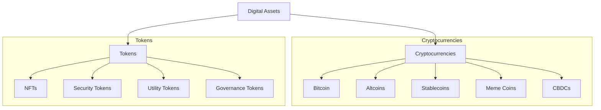

## Reading 82: Introduction to Digital Assets

### 🎯 Introduction

Welcome, future charterholder, to the new frontier of finance! Imagine the early days of the internet — a wild, unregulated space understood by only a few tech pioneers, filled with immense potential and equal amounts of risk. **Digital Assets**, powered by a revolutionary technology called **blockchain**, are in a similar phase today.

This reading is your beginner's guide to navigating this exciting digital world. We'll explore everything from "digital gold" (Bitcoin) to unique digital collectibles (NFTs). You'll learn the language of this new asset class and understand why it's capturing the attention of investors worldwide. Let's log in!

-----

### Part 1: The Engine Room: Distributed Ledger Technology (DLT) ⚙️ (LOS 82.a)

At the heart of every digital asset is **Distributed Ledger Technology (DLT)**, most commonly known as **blockchain**.

Think of it as a magical, shared notebook. 📓

* **Distributed:** Every participant on the network has an identical copy of the notebook.
* **Ledger:** It's a record of every single transaction that has ever occurred.
* **Immutable:** Once a transaction is written down and verified, it can *never* be altered or deleted. It’s secured by complex cryptography.

This technology allows for **peer-to-peer (P2P)** transactions without needing a trusted middleman like a bank.

#### 1.1 How Does the Network Agree on a Transaction?

To add a new "page" (or **block**) of transactions to the chain, the network needs to agree that it's valid. This is done through a **consensus protocol**. The two main types are:

##### 1.1.1 Proof of Work (PoW) ⛏️

* **How it works:** Powerful computers, called **miners**, race to solve a complex mathematical puzzle. The first one to solve it gets to add the next block to the chain and is rewarded with new cryptocurrency.
* **Pros:** Extremely secure. To cheat, you'd need to control over 51% of the network's massive computing power.
* **Cons:** Uses an enormous amount of energy.

##### 1.1.2 Proof of Stake (PoS) 🛡️

* **How it works:** Network participants called **validators** lock up (or **stake**) their own cryptocurrency as collateral. They are then chosen to validate transactions and add new blocks. If they act dishonestly, they can lose their stake.
* **Pros:** Much lower energy consumption.
* **Cons:** Can potentially lead to centralization, as the wealthiest stakeholders have more influence.

#### 1.4 Global & Local Context 🌍

* **Global Example:** Ethereum's transition from PoW to PoS (The Merge) reduced energy use significantly and illustrates how protocol design choices affect environmental impact and network security.
* **India Example:** The RBI's digital rupee pilot explores permissioned DLT designs and the implications for monetary policy and payment infrastructure in India.

-----

### Part 2: A Tour of the Digital Asset Zoo 🦁 (LOS 82.b)

Digital assets come in many different forms. The main two categories are cryptocurrencies and tokens.

#### 2.1 Cryptocurrencies

* **Cryptocurrencies:** These are digital currencies with their own blockchain, designed as a medium of exchange or store of value.
  * **Bitcoin:** The first and most famous, often called "digital gold" due to its limited supply.
  * **Altcoins:** Any cryptocurrency other than Bitcoin. **Ether (ETH)** is the most prominent; its Ethereum network is a platform for building applications using **smart contracts** (self-executing agreements).
  * **Stablecoins:** Cryptos that are pegged to a stable asset, usually a fiat currency like the U.S. dollar (e.g., Tether, USDC). They aim to avoid the wild volatility of other cryptos.
  * **Central Bank Digital Currencies (CBDCs):** A digital version of a country's official currency, issued and backed by the central bank.

#### 2.2 Tokens

* **Tokens:** These are digital assets built *on top of* an existing blockchain (like Ethereum).
  * **Non-Fungible Tokens (NFTs):** Unique digital certificates of ownership for a specific item, like a piece of digital art or a collectible. "Non-fungible" means each one is one-of-a-kind and cannot be replaced by another.
  * **Security Tokens:** Digital representations of ownership in a real-world asset, like a company's stock or a piece of real estate. An **Initial Coin Offering (ICO)** is an unregulated way for startups to raise capital by selling these tokens.
  * **Utility Tokens:** Give users access to a product or service on a network.
  * **Governance Tokens:** Give holders voting rights on a project's future development.

#### 2.4 Global & Local Context 🌍

* **Global Example:** China's e-CNY pilot shows how governments can issue CBDCs at scale for retail payments and cross-border trials.
* **India Example:** Indian marketplaces and artists using NFTs to reach global collectors while navigating local tax and regulatory guidance.

-----

### Part 3: Digital vs. Traditional Assets: What's the Difference? 🍎🆚🤖 (LOS 82.c)

Digital assets are fundamentally different from traditional assets like stocks and bonds.

| Feature | Traditional Assets (e.g., Stocks) | Digital Assets (e.g., Bitcoin) |
| :--- | :--- | :--- |
| **Inherent Value** | Backed by cash flows (dividends, interest) and physical assets. You can value them with a DCF. | Generally not backed by cash flows. Value comes from scarcity, utility, and market sentiment ("digital gold" story). |
| **Validation** | Transactions are recorded on a private, centralized ledger (e.g., a bank's database). | Transactions are recorded on a public, decentralized ledger (blockchain). |
| **Regulation** | Heavily regulated with clear rules and investor protections. | Largely unregulated, a "Wild West" environment where fraud and manipulation are concerns. |
| **Medium of Exchange** | Priced in globally accepted fiat currencies (USD, INR, EUR). | Used as an alternative to fiat currencies, but not yet widely accepted for mainstream payments. |

#### 3.4 Global & Local Context 🌍

* **Global Example:** Regulatory approaches vary — some jurisdictions permit broad crypto markets while others restrict or ban certain activities (exchanges, token offerings).
* **India Example:** Recent Indian regulatory discussions focus on taxation and AML/KYC for exchanges; many investors access crypto exposure via offshore platforms or by investing in listed companies with crypto-related business models.

-----

### Part 4: How to Invest: Direct vs. Indirect Exposure 💼 (LOS 82.d)

* **Direct Investment:** This means you own the asset itself. You buy it on a cryptocurrency exchange (centralized or decentralized) and store it in a **crypto wallet**. This gives you full control but also exposes you to risks like hacking, scams, and losing your passkeys.
* **Indirect Investment:** This allows you to get exposure to the price movements without holding the asset.
  * **Trusts & ETPs:** You can buy shares in a fund that holds cryptocurrency, like a Bitcoin ETF or the Grayscale Bitcoin Trust.
  * **Futures Contracts:** You can trade futures on exchanges like the CME.
  * **Stocks:** You can invest in companies in the crypto ecosystem, like exchanges (Coinbase), mining companies, or tech firms that support blockchain.
  * **Hedge Funds:** Many specialized hedge funds now focus on crypto strategies.

**Decentralized Finance (DeFi)** is a growing ecosystem of financial applications built on blockchain that aims to recreate traditional financial services (lending, trading) without centralized intermediaries.

💡 CFA Exam Tip ✍️:The main investment case for adding digital assets to a traditional portfolio is their **low correlation** with stocks and bonds. In theory, this provides a powerful diversification benefit, though this correlation can rise during times of market stress.

-----

### 🧪 Formula Summary

This reading is conceptual and focuses on the characteristics and ecosystem of digital assets. There are no mathematical formulas to memorize from this section.

-----

### 🎯 Quick Exam-Day Pointers

* **DLT (Blockchain):** **Decentralized** → **Immutable** → **Transparent**.
* **Consensus Mechanisms:** 
  * **Proof of Work (PoW):** ⛏️ **Secure**, **Energy-Intensive**.
  * **Proof of Stake (PoS):** 🛡️ **Energy-Efficient**, may favor large holders.
* **Valuation Difference:** 
  * **Traditional Assets:** Backed by **cash flows** (DCF).
  * **Digital Assets:** Value from **scarcity**, **utility**, and **sentiment** → **Difficult to value fundamentally**.
* **Investment Appeal:** **Diversification** due to historical **low correlation**, but **correlation may rise in stress** (⚠️).
* **Risks:** 
  * **Volatility:** ✅ High return potential → ❌ High downside risk.
  * **Regulatory Uncertainty:** ✅ Innovation → ❌ Legal & compliance risks.
  * **Fraud & Security:** ✅ New financial plumbing → ❌ Hacking, scams, loss of keys.
* **Practical Notes:** 
  * **Direct ownership** exposes you to custody risk → Keep keys secure.
  * **Indirect exposure** may limit custody risk but introduce **counterparty** or **tracking** risks.

