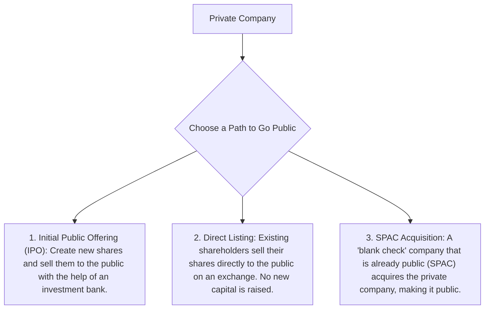

## 🚀 Reading 20: Organizational Forms, Corporate Issuer Features, and Ownership

### 🎯 Introduction

Welcome, future charterholder! Imagine you have a brilliant business idea. How do you give it a legal form? Think of it like choosing the right vehicle for a journey. 🚗 You could start with a simple bicycle (a **sole proprietorship**), which is easy to manage but leaves you exposed to the elements. Or, you could ride a tandem bike with a friend (a **partnership**), sharing the effort and the risk.

But if you want to build an empire, you'll need a massive public bus (a **corporation**), where many passengers (**shareholders**) can buy a ticket, share in the profits, and are protected from crashes (**limited liability**). This reading is your guide to understanding these different business vehicles—their legal structures, ownership features, and the pros and cons of operating in the public spotlight versus the private shadows. Let's hit the road!

-----

### Part 1: Choosing Your Business Blueprint 🏗️

The way a business is legally structured impacts everything from who is liable for its debts to how its profits are taxed. Let's compare the four main blueprints.

#### 1.1 Key Business Structures: A Head-to-Head Comparison

This table breaks down the crucial differences you need to know.

| Feature | Sole Proprietorship 🚲 | General Partnership 🛵 | Limited Partnership 🏎️ | Corporation 🚌 |
| :--- | :--- | :--- | :--- | :--- |
| **Legal Entity** | No, owner and business are one. | No, partners and business are linked. | No, but more formal than a general partnership. | Yes, a separate legal person. |
| **Owner Liability** | **Unlimited liability**! Your personal assets are at risk. | **Unlimited liability** for all partners. | **General partners** have unlimited liability; **limited partners** have **limited liability**. | **Limited liability** for all owners (**shareholders**). |
| **Taxation** | Profits are taxed once as the owner's personal income. | Profits are "passed through" and taxed as personal income for each partner. | Profits are "passed through" and taxed as personal income for each partner. | **Double taxation**: The corporation pays tax on its profits, AND shareholders pay tax on dividends received. |
| **Ownership** | One owner who runs the business. | Two or more partners who typically run the business. | General partners run it; limited partners are passive investors. | **Shareholders** are owners who elect a **board of directors**, who then hire managers. |
| **Access to Capital** | Very limited (owner's funds). | Limited (partners' funds). | More than a general partnership, as limited partners can invest. | Easiest to raise large amounts of capital by selling shares. |

#### 1.2 A Closer Look at Corporations: The Good and The Bad 🧐

The **corporation** is the dominant form for large businesses for one huge reason: **limited liability**. This means if the company goes bankrupt, the most a shareholder can lose is their initial investment. Creditors can't come after their house or personal savings.

However, this protection comes at a cost: **double taxation**.

##### 1.2.1 Theory 🧠

Here's how **double taxation** works:

* **Corporate Level Tax:** The company earns a profit and pays corporate income tax to the government.
* **Personal Level Tax:** The company then distributes some of its after-tax profit to shareholders as dividends. The shareholders must then pay personal income tax on those dividends.

The same dollar of profit gets taxed twice!

##### 1.2.2 Example 🧮

ABC Corporation has pre-tax earnings of $10 million. The corporate tax rate is 25%, and shareholders pay a 20% tax on dividends.

  * **Case 1: 100% Dividend Payout**
    * Corporate Tax = $10M × 25% = $2.5M
    * Profit After Tax = $10M - $2.5M = $7.5M
    * Dividends Paid = $7.5M
    * Shareholder Tax on Dividends = $7.5M × 20% = $1.5M
    * **Total Tax Paid** = $2.5M + $1.5M = $4.0M
    * **Effective Tax Rate** = $4.0M / $10M = **40%** 

  * **Case 2: 40% Dividend Payout**
    * Corporate Tax is the same: $2.5M
    * Dividends Paid = $7.5M × 40% = $3.0M
    * Shareholder Tax on Dividends = $3.0M × 20% = $0.6M
    * **Total Tax Paid** = $2.5M + $0.6M = $3.1M
    * **Effective Tax Rate** = $3.1M / $10M = **31%** 

Notice how reinvesting profits instead of paying them all out as dividends lowers the overall effective tax rate.

**💡 CFA Exam Tip ✍️:** The exam loves to test the trade-offs between business forms. Remember the core conflict for a corporation: you get the amazing benefit of **limited liability**, but you have to deal with the headache of **double taxation**. This is a fundamental concept.

-----

### Part 2: Public vs. Private Companies - The Spotlight or the Shadows? 🎭

Corporations can be either private or public. The biggest difference is whether their shares are available for the general public to buy and sell on a stock exchange.

#### 2.1 Public Companies 🌍

**Public limited companies**, like Apple, Google, or Reliance Industries, have their shares listed on a stock exchange.

  * **Pros:**
    * ✅ **Access to Capital:** Can raise huge amounts of money from the public.
    * ✅ **Liquidity:** Shareholders can easily buy and sell their shares.
    * ✅ **Visibility:** Higher public profile can attract talent and customers.
  * **Cons:**
    * ❌ **Heavy Regulation:** Must comply with strict rules from regulators like the SEC in the US or SEBI in India.
    * ❌ **Mandatory Disclosure:** Must publicly disclose detailed financial information, which competitors can see.
    * ❌ **Short-Term Focus:** Pressure from the market and analysts can lead to a focus on quarterly results rather than long-term strategy.

#### 2.2 Private Companies 🤫

**Private limited companies** are not listed on a public exchange. Their shares are held by a smaller group of investors (like founders, employees, and venture capitalists).

  * **Pros:**
    * ✅ **Less Regulation:** Fewer regulatory and disclosure requirements.
    * ✅ **Long-Term View:** Can focus on long-term goals without pressure from public markets.
    * ✅ **Confidentiality:** No need to disclose sensitive information to competitors.
  * **Cons:**
    * ❌ **Limited Capital:** Harder to raise large sums of money.
    * ❌ **Illiquidity:** Investors can't easily sell their shares; they often have to wait for an acquisition or for the company to go public.
    * ❌ **Fewer Investors:** Capital is typically raised through **private placements** to accredited, wealthy investors.

#### 2.3 Global & Local Context 🌍

* **Global Example:** Apple and Google are public companies with shares traded worldwide.
* **Local Example (India):** Reliance Industries is a public company listed on the NSE/BSE. Many Indian startups begin as private limited companies before going public via IPO.

#### 2.4 The Journey to Going Public

How does a private company make the leap to the public market? There are three main paths.

  * **Initial Public Offering (IPO):** This is the traditional route. The company hires an investment bank to help it issue brand new shares to the public. This process raises fresh capital for the company. The IPOs of companies like Zomato in India are great examples.
  * **Direct Listing:** In a direct listing, no new shares are created. The company simply facilitates the sale of existing shares from insiders (like founders and early investors) directly to the public on an exchange. This provides liquidity for insiders but doesn't raise capital for the company itself.
  * **Special Purpose Acquisition Company (SPAC):** A **SPAC** is a shell company that goes public with the sole purpose of finding and merging with a private company. When the SPAC acquires the private company, the private company effectively becomes public. It's often seen as a faster way to go public than a traditional IPO.

**💡 CFA Exam Tip ✍️:** Be able to clearly distinguish between an IPO, a direct listing, and a SPAC. The key difference is how capital is raised and whose shares are being sold. **IPO** = new shares, new capital. **Direct Listing** = existing shares, no new capital. **SPAC** = a merger with an already-public shell company.

-----

### 🧪 Formula Summary

While this reading is mostly conceptual, the concept of **double taxation** involves a key calculation:

**Effective Tax Rate for a Corporation:**

$$\text{Effective Tax Rate} = \frac{\text{Corporate Tax} + \text{Shareholder Dividend Tax}}{\text{Pre-Tax Profit}}$$

-----

### 🎯 Quick Exam-Day Pointers

* **Liability is Everything:**  
  * **Sole proprietorships** and **general partners** have **unlimited liability**.  
  * **Limited partners** and **corporate shareholders** have **limited liability**.
* **Remember "Double Tax":**  
  * Corporations face double taxation—once on corporate profits and again on dividends paid to shareholders. This is a key disadvantage.
* **Public vs. Private = Liquidity vs. Control:**  
  * Public companies offer liquidity to their shareholders but must deal with heavy regulation and public scrutiny.  
  * Private companies offer more control and confidentiality but are illiquid.
* **Know the 3 Paths to Public:**  
  * Memorize the key features of an **IPO** (new capital), **Direct Listing** (liquidity for insiders), and **SPAC** (merger). This is a very testable concept.

