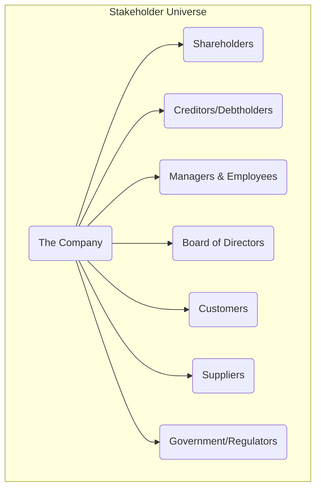

## Reading 21: Investors and Other Stakeholders

### 🎯 Introduction

Welcome, future charterholder! Think of a company as a massive ship setting sail on a grand voyage for treasure. 🚢 The **shareholders** are the ship's owners; they funded the expedition and hope to find a mountain of gold (unlimited profits). The **debtholders** are the financiers who provided a loan for the ship's supplies; they don't care about the treasure—they just want their loan repaid, with interest, on time.

But who else is on board? You have the captain and officers (**management**), the crew (**employees**), the port authorities (**government**), and the people who supplied the ship with food and cannons (**suppliers**). Everyone has a vested interest—or a "stake"—in the voyage's success. This reading is your guide to understanding the different claims, motivations, and potential conflicts among all these **stakeholders**.

-----

### Part 1: Debtholders vs. Shareholders - The Safe Harbor vs. The Grand Voyage ⛵

At the core of a company's capital structure are its two primary investors: lenders (**debtholders**) and owners (**shareholders**). Their relationship is defined by a fundamental difference in risk and reward.

| Feature | Debtholders (Lenders) 🏦 | Shareholders (Equity Owners) 📈 |
| :--- | :--- | :--- |
| **Type of Claim** | **Contractual Claim**  | **Residual Claim**  |
| **What They Get** | Fixed interest payments and principal repayment. Their upside is capped\!  | Whatever profits are left over after everyone else (including debtholders) is paid.  |
| **Priority in Bankruptcy** | Higher priority. They get paid first from the company's assets.  | Last in line. They often get nothing if the company fails.  |
| **Risk Level** | Lower risk.  | Higher risk. |
| **Reward Potential** | Limited to the promised interest and principal.  | Unlimited\! They benefit from all the company's growth. |
| **Primary Motivation** | Stability and predictable income. They want the company to avoid excessive risk. | Growth and maximizing the company's value. They are more willing to take on risk for higher returns. |

#### 1.1 The Conflict Over Risk: How Leverage Changes the Game

The main conflict between these two groups boils down to risk. Shareholders, especially when a company uses a lot of debt (**leverage**), are incentivized to take big risks. Why? Because if the bet pays off, they get all the upside. If it fails, the debtholders share in the losses.

Let's see how **Return on Equity (ROE)** is impacted by leverage.

##### 1.1.1 Example: The Good Times 😊

A company has \\$10M in assets and earns a 15% return on those assets ($1.5M profit). The cost of debt is 10%.

  * **Scenario 1: No Debt (100% Equity)**

      * Equity = $10M
      * Profit = $1.5M
      * **ROE = $1.5M / $10M = 15%**

  * **Scenario 2: 50% Debt, 50% Equity**

      * Equity = $5M, Debt = $5M
      * Profit before interest = $1.5M
      * Interest Expense = $5M × 10% = $0.5M
      * Profit for Shareholders = $1.5M - $0.5M = $1.0M
      * **ROE = $1.0M / $5M = 20%** 

Look at that\! By using debt, the shareholders juiced their return from 15% to 20%. They love leverage when things are going well. The debtholders? They still just get their 10%. 

##### 1.1.2 Example: The Bad Times 😨

Now, what if revenues decrease by 15%, reducing the return on assets to 0%?

  * **Scenario 1: No Debt (100% Equity)**

      * Profit = $0
      * **ROE = $0 / $10M = 0%** (Shareholders make nothing, but lose nothing more).

  * **Scenario 2: 50% Debt, 50% Equity**

      * Profit before interest = $0
      * Interest Expense = $0.5M
      * **Loss for Shareholders** = $0 - $0.5M = -$0.5M
      * **ROE = -$0.5M / $5M = -10%**

Leverage magnifies losses too\! Shareholders get wiped out faster, increasing the risk that debtholders might not get paid. This is why debtholders protect themselves with **covenants** (rules in the debt agreement) that limit the company's risk-taking. 

**💡 CFA Exam Tip ✍️:** The conflict between debtholders and shareholders is a classic exam topic. Remember: **Shareholders love risk** because of their unlimited upside. **Debtholders hate risk** because their upside is capped. This fundamental difference in incentives drives their behavior.

-----

### Part 2: Who's on Board? Meet the Stakeholders 🤝

While investors are crucial, they aren't the only group with a stake in the company.

  * **Shareholder Theory:** The traditional view, championed by economist Milton Friedman. It states that the one and only goal of a company is to maximize profits for its shareholders.
  * **Stakeholder Theory:** A broader view that argues a company must balance the interests of *all* its stakeholders to be successful in the long run.

<!-- end list -->

#### 2.1 Key Stakeholder Groups and Their Interests

| Stakeholder Group | Primary Interests |
| :--- | :--- |
| **Shareholders** | Profit maximization, rising stock price, dividends. |
| **Creditors** | Predictable interest payments, repayment of principal, avoiding bankruptcy. |
| **Board of Directors** | Overseeing management, ensuring long-term success, representing shareholders. The structure can be a **one-tier board** (a single board of insiders and independent directors) or a **two-tier board** (a supervisory board of outsiders overseeing a management board of insiders). , 3491] A **staggered board**, where only a fraction of directors are up for election each year, can make it harder for shareholders to make big changes quickly.  |
| **Managers & Employees** | Job security, fair compensation, good working conditions, career growth. |
| **Customers** | High-quality products/services at a fair price, reliable service. |
| **Suppliers** | Being paid on time, stable and ongoing business relationship. |
| **Government** | Collection of taxes, compliance with regulations, contributing to social welfare. |

-----

### Part 3: ESG - Navigating by a Modern Compass 🧭

In recent years, investors have started looking beyond just financial numbers. They are increasingly focused on **Environmental, Social, and Governance (ESG)** factors, which can have a real impact on a company's long-term value and risk profile.

Why do investors care about ESG?

  * **Regulatory Risk:** Governments are cracking down on issues like climate change and data privacy.
  * **Financial Impact:** A bad environmental record can lead to huge fines. Poor social practices can damage a brand's reputation and lose customers. Weak governance can lead to fraud.
  * **Investor Demand:** Many investors, especially younger ones, want their money to align with their values.

ESG analysis also considers **negative externalities**—costs that a company imposes on society but doesn't pay for itself, like pollution.

#### 3.1 The Three Pillars of ESG

| Pillar | What It Covers | Examples |
| :--- | :--- | :--- |
| **Environmental (E)** 🌳 | The company's impact on the planet.  | Carbon emissions, water usage, waste management, deforestation, use of green technology. A company like Reliance Industries investing heavily in green hydrogen is a positive E factor. |
| **Social (S)** 🧑‍🤝‍🧑 | The company's relationship with its employees, customers, and community.  | Customer privacy, data protection, employee safety, labor relations, diversity and inclusion, product safety. Tata Group's long history of community building in India is a strong S factor. |
| **Governance (G)** 🏛️ | How the company is run and who is in charge.  | Board independence, executive compensation, shareholder rights, bribery and corruption policies, internal controls. A company with an independent board chairman and a diverse board scores well on G. |

**💡 CFA Exam Tip ✍️:** For the exam, understand that ESG is not just a "feel-good" topic. It's about identifying tangible and intangible risks that can materially affect a company’s valuation and creditworthiness. A poor ESG profile can be a major red flag for long-term investors.

-----

### 🧪 Formula Summary

**Return on Equity (ROE):**

$$\text{Return on Equity (ROE)} = \frac{\text{Net Income}}{\text{Shareholders' Equity}}$$

-----

### 🎯 Quick Exam-Day Pointers

* **Debt vs. Equity is Key:**
  * **Debt = Contractual Claim** → fixed upside, higher priority
  * **Equity = Residual Claim** → unlimited upside, last priority
* **Conflict = Risk Appetite:**
  * Shareholders often want more risk
  * Debtholders want less
* **Shareholder vs. Stakeholder:**
  * **Shareholder Theory** = Maximize shareholder wealth ONLY
  * **Stakeholder Theory** = Balance the interests of ALL groups (employees, customers, etc.)
* **ESG is a Risk Framework:**
  * ESG factors are non-financial risks with real financial consequences
  * Environmental fines, social boycotts, and governance scandals can destroy value

