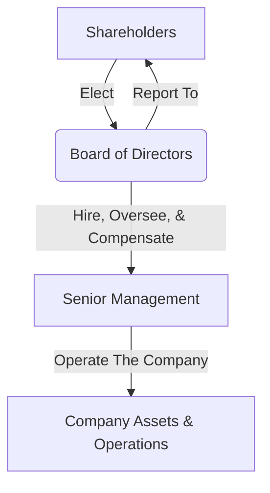

## 🚀 Reading 22: Corporate Governance: Conflicts, Mechanisms, Risks, and Benefits

### 🎯 Introduction

Welcome, future charterholder\! Think of a company as a high-performance ship. The **shareholders** are the owners who funded the voyage, and their goal is to reach a valuable destination (maximize firm value). The **managers** are the captain and crew hired to steer the ship.

But what if the captain (CEO) uses the ship for personal side-trips (empire building), enjoys lavish quarters while neglecting the engine (excessive perks), or refuses to sail in rough but profitable waters to protect their own comfortable job (risk avoidance)?

This is the core problem of **corporate governance**. It's the entire system of internal controls and procedures by which companies are managed. It's the ship's compass, the owner's rulebook, and the chain of command, all designed to ensure the crew (management) acts in the best interests of the owners (shareholders). This reading is all about that system: the potential conflicts, the mechanisms to manage them, and the high-stakes outcome of getting it right... or terribly wrong.

-----

### Part 1: The Core Conflicts 😠 (LOS 22.a)

#### 1.1 The Principal-Agent Relationship

This is the formal name for the owner-crew dynamic.

  * **Principal:** The party who hires another to act on their behalf (e.g., shareholders).
  * **Agent:** The party hired to act in the principal's interest (e.g., managers).

The **principal-agent conflict** is the natural friction that arises because the agent's personal interests may not align perfectly with the principal's.

The root cause of this problem is **information asymmetry**: The agent (manager) knows far more about the company's day-to-day operations, opportunities, and their own effort level than the principals (shareholders) do. This makes it incredibly difficult for shareholders to monitor managers effectively.

#### 1.2 Manager-Shareholder Conflicts

This is the primary conflict. Managers, if unchecked, may prioritize their own interests over maximizing shareholder value.

| Conflict Type | What the Manager Might Do (Self-Interest) | Why It Hurts Shareholders (Principal's Interest) |
| :--- | :--- | :--- |
| **Insufficient Effort** | Not putting in the hard work to find the best investment projects or run the company efficiently. | Lower profits and reduced firm value. |
| **Risk Misalignment** | Take *too little* risk to protect their job (if pay is salary-based) or *too much* risk (if pay is heavily option-based). | Either leads to missed growth opportunities or exposes the company to potential ruin. |
| **Short-Term Focus** | Pumping up quarterly earnings (e.g., by cutting R\&D) to get a bonus, even if it hurts long-term health. | Sacrifices sustainable long-term value for a short-term stock price bump. |
| **Empire Building** | Expanding the company for the sake of size and prestige, even if acquisitions are unprofitable. | Wastes shareholder capital on value-destroying projects. |
| **Excessive Perks** | Spending lavishly on corporate jets, fancy offices, and huge expense accounts. | Drains cash (shareholder profits) that could have been reinvested or paid as dividends. |

#### 1.3 Shareholder-Creditor Conflicts

A secondary conflict exists between shareholders (equity) and creditors (debtholders).

  * **Shareholders** (represented by managers) prefer *more* risk. They have limited downside (can only lose their investment) but unlimited upside. If a risky project pays off, they get all the profit.
  * **Creditors** prefer *less* risk. Their upside is capped at their interest and principal payments. They get no benefit from a risky project's success but share all the pain if it fails and the company defaults.

Actions that favor shareholders at the expense of creditors include:

1.  **Issuing new, riskier debt:** This increases the default risk for *existing* debtholders.
2.  **Increasing dividends:** This drains the company of assets, reducing the collateral that backs the creditors' loans and increasing default risk.

-----

### Part 2: The Governance "Toolkit" 🛠️ (LOS 22.b)

#### 2.1 What is Corporate Governance?

**Corporate governance** is the system of internal controls and procedures by which companies are managed. It provides a framework that defines the rights, roles, and responsibilities of all stakeholder groups, with the goal of minimizing these conflicts.

The general structure of accountability is as follows:

#### 2.2 Shareholder Mechanisms

  * **General Meetings:** The main forum for shareholders to exercise their power. This includes the **Annual General Meeting (AGM)** and **Extraordinary General Meetings** for urgent matters like a merger.
  * **Voting Rights:**
      * **Proxy Voting:** Most shareholders vote by **proxy**, delegating their vote to someone else (like management or an advisor). This is critical for allowing geographically dispersed investors to participate.
      * **Resolutions:** Shareholders vote on **ordinary resolutions** (like electing directors or approving the auditor, requiring a simple majority) and **special resolutions** (like mergers or changing the company's bylaws, often requiring a supermajority).
  * **Shareholder Activism:** **Activist shareholders** use their equity stake to pressure companies for change. Their tactics can include:
      * Proposing shareholder resolutions.
      * Seeking representation on the board.
      * Engaging with the media to build public support.
      * Initiating shareholder lawsuits.
  * **Shareholder Lawsuits:** Shareholders can sue management and the board for failing in their duties.

#### 2.3 Board of Directors Mechanisms

The **board of directors** is the primary link between shareholders and managers. An effective board has a majority of independent, non-employee directors. Boards use committees of independent experts to handle complex tasks:

| Board Committee | Primary Responsibilities 📋 |
| :--- | :--- |
| **Audit Committee** 🔍 | • Oversees financial reporting, accounting policies, and internal controls. • Recommends the independent **external auditor** and reviews their work. • Monitors the **internal audit** function. |
| **Nominating / Governance Committee** 🧑‍⚖️ | • Manages the company's corporate governance code. • Sets policies for board nominations and ensures the board has the right mix of skills and independence. • Oversees the company's code of ethics and policies on conflicts of interest. |
| **Compensation (Remuneration) Committee** 💰 | • Sets the compensation (salary, bonus, stock options) for senior executives and board members. • Aims to design compensation packages that **align** management's interests with those of shareholders. |

#### 2.4 Other Key Mechanisms

  * **Anti-Takeover Defenses (e.g., "Poison Pill"):** This is a powerful mechanism the board can use. A **poison pill** is a defensive tactic that makes a hostile takeover prohibitively expensive. It typically works by allowing all existing shareholders (except the acquirer) to buy additional shares at a steep discount once an acquirer buys a certain percentage of shares. This massively dilutes the acquirer's stake.
      * **Conflict Alert:** While this can force a bidder to negotiate with the board (potentially getting a better price for shareholders), it can also be used by entrenched, underperforming managers to protect their jobs at the expense of shareholders who might want the takeover to happen.
  * **Management Compensation:** The *structure* of pay is a key mechanism. Tying bonuses to long-term performance, rather than short-term profits, helps align incentives.
  * **Media and Public Scrutiny:** The financial press and, increasingly, **social media** can expose poor practices and hold companies accountable.
  * **Government & Regulation:**
      * Governments enact and enforce laws (e.g., via regulatory agencies).
      * Many countries use **corporate governance codes** that companies must either "adopt or explain" why they have not.
      * **Stock exchanges** have their own listing requirements, often related to board independence and financial disclosure.

💡 CFA Exam Tip ✍️: Memorize the functions of the three key board committees: **Audit** (financials & controls), **Compensation** (executive pay), and **Governance** (board structure & ethics). These are very common exam topics\!

-----

### Part 3: The Payoff - Risks & Benefits 🏆 (LOS 22.c)

#### 3.1 Risks of Poor Governance & Stakeholder Management

When governance fails, the risks are severe and real:

  * **Weak Control Systems:** If the board and audit committee are ineffective, oversight is weak. This can lead to inaccurate financial statements or even outright fraud.
  * **Ineffective Decision Making:** Some stakeholders (like managers) can gain at the expense of others (like shareholders or creditors).
  * **Legal & Reputational Risk:** Governance failures can lead to massive fines, lawsuits, and a collapse in public trust.
  * **Default Risk:** If creditor interests are ignored, the company's risk profile can increase, raising the probability of default.

#### 3.2 Benefits of Effective Governance & Stakeholder Management

This is the ultimate goal. Good governance isn't just "nice to have"; it creates tangible value.

  * **Improved Operational Efficiency:** Strong oversight and formal policies (e.g., on related-party transactions) lead to better, more efficient operations.
  * **Better Financial Performance:** When management's interests are truly **aligned** with shareholders', long-term profitability and company value tend to increase.
  * **Lower Risk:** Good governance, especially regarding creditors, reduces the company's **default risk** and can lead to a better credit rating.
  * **Lower Cost of Capital:** This is the key. A well-governed company inspires confidence in both investors and creditors. This higher trust leads to a lower perceived risk, which in turn allows the company to raise money (both debt and equity) at a lower cost.

**💡 Key Concept: The Governance Value Chain**

This is the central takeaway for the exam. Understand this flow:

Good Governance → Aligned Interests & Strong Controls → Better Performance & Lower Risk → Higher Investor Confidence → **Lower Cost of Capital** → **Higher Firm Value**

-----

### 🧪 Formula Summary

**No formulas are required for this reading.**
Your focus should be 100% on understanding the **conflicts**, the **mechanisms** to solve them, and the **risks/benefits** of governance quality.

-----

### 🎯 Quick Exam-Day Pointers

  * **It's All About Conflict:** The core of corporate governance is managing the **principal-agent conflict** between managers (agents) and shareholders (principals), which is fueled by **information asymmetry**.
  * **The Board is the Watchdog:** The **board of directors**, especially its independent members and key committees (**Audit, Compensation, Governance**), is the primary mechanism for overseeing management on behalf of shareholders.
  * **Align Interests with Incentives:** A key solution to the principal-agent problem is to structure executive **compensation** so that managers get rich *only* when shareholders get rich.
  * **Governance Affects the Bottom Line:** Don't view governance as a "soft" topic. Poor governance leads to real financial risks (like higher default risk) and a lower company valuation. Good governance creates tangible economic value by **lowering the cost of capital**.
  * **Remember All Stakeholders:** While manager-shareholder conflicts are primary, don't forget the **shareholder-creditor** conflict (risk-taking, dividends).
  * **Know Anti-Takeover Tactics:** Be aware of terms like **"poison pill"**. Understand it's a board mechanism that can either protect shareholders or entrench management.

