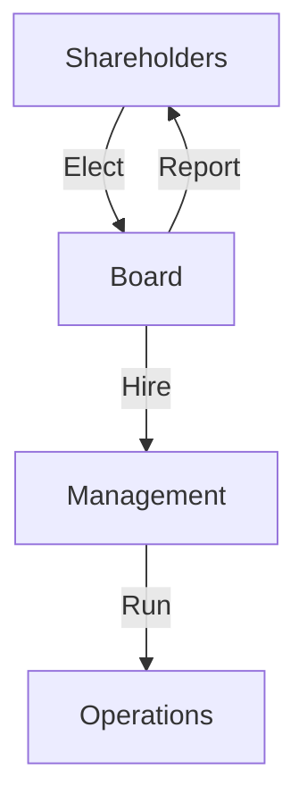

## 🚀 Reading 22: Corporate Governance: Conflicts, Mechanisms, Risks, and Benefits

### 🎯 Introduction

Welcome, future charterholder! Imagine a company is a high-performance race car. 🏎️ The **shareholders** are the owners who paid for the car, and they want it to win the championship (maximize value). The **managers** are the highly-skilled drivers they've hired to race it.

But what if the driver decides to take the car for a joyride, pushes it beyond its limits for personal glory, or just doesn't put in the effort to win? This is the core problem of **corporate governance**. It's the system of rules, controls, and procedures—the car's dashboard, the rulebook, and the radio link to the pit crew—that ensures the driver (management) acts in the best interests of the owner (shareholders). This reading is all about that system: the potential conflicts, the mechanisms to manage them, and what happens when it all goes right... or horribly wrong.

-----

### Part 1: The Driver vs. The Owner - The Principal-Agent Conflict 🏎️

#### 1.1 Principal-Agent Relationship

Whenever one person (the **principal**) hires another (the **agent**) to perform a duty, a **principal-agent relationship** is born. In a corporation, shareholders are the principals, and the managers they hire are the agents.

The **principal-agent conflict** arises because the agent's interests might not perfectly align with the principal's interests. The root cause of this is often **information asymmetry**—the driver (manager) knows far more about the car's condition, the race track, and their own effort level than the owner (shareholder) does.

#### 1.2 Common Manager-Shareholder Conflicts

| Conflict Type | What the Manager Might Do (Self-Interest) | Why It Hurts Shareholders |
| :--- | :--- | :--- |
| **Insufficient Effort** | Not putting in the hard work to find the best investment projects or run the company efficiently. | Lower profits and reduced firm value. |
| **Risk-Taking Misalignment** | Taking on *too much* risk (e.g., for a huge bonus) or *too little* risk (e.g., to protect their job). | Either exposes the company to potential ruin or leads to missed opportunities for growth. |
| **Short-Term Focus** | Pumping up quarterly earnings to get a bonus, even if it hurts the company's long-term health. | Sacrifices sustainable long-term value for a short-term stock price bump. |
| **Empire Building** | Expanding the company for the sake of size and prestige, even if the acquisitions are unprofitable. | Wastes shareholder capital on value-destroying projects. |
| **Excessive Perks** | Spending lavishly on corporate jets, fancy offices, and huge expense accounts. | Drains cash that belongs to shareholders. |

#### 1.3 Conflict Between Shareholders and Creditors

There's also a conflict between shareholders and creditors (debtholders).

  * **Shareholders** (with limited liability) might want the company to take on very risky projects. If the project succeeds, they get all the upside. If it fails, the creditors share the loss.
  * **Creditors** want the company to be safe and conservative to ensure they get their interest payments and principal back. They get no benefit from the upside of a risky project.

-----

### Part 2: The Rulebook - Mechanisms for Keeping Everyone in Line 📜

#### 2.1 Corporate Governance Overview

**Corporate governance** is the entire system of internal controls and procedures used to manage a company and minimize these conflicts. It's about accountability and making sure the right people have the right responsibilities and oversight.

#### 2.2 Mechanisms for Managing Stakeholder Relationships

  * **Shareholder Mechanisms:**
    * **Annual General Meeting (AGM):** The main forum where shareholders get to vote on key issues.
    * **Proxy Voting:** Most shareholders vote by **proxy**, allowing someone else to vote on their behalf. This is crucial for giving a voice to small investors.
    * **Shareholder Activism:** **Activist shareholders** buy a significant stake in a company to pressure management for changes they believe will unlock value. A famous global example is Carl Icahn's campaigns at various US companies.
    * **Lawsuits:** Shareholders can sue management and the board for failing in their duties.

  * **Board of Directors Mechanisms:** The **board of directors** is the most important governance mechanism. It's the direct link between shareholders and managers. To be effective, a board should have a majority of independent, non-employee directors. Boards use committees to handle specific tasks:

| Board Committee | Primary Responsibilities 📋 |
| :--- | :--- |
| **Audit Committee** 🔍 | • Oversees financial reporting and accounting policies. • Monitors the company's internal controls. • Recommends the independent external auditor and reviews their work. |
| **Nominating/Governance Committee** 🧑‍⚖️ | • Manages the company's corporate governance policies. • Sets policies for nominating board candidates and ensures the board has the right mix of skills. • Oversees the company's code of ethics. |
| **Compensation Committee** 💰 | • Sets the compensation for senior executives and board members. • Designs compensation packages (salary, bonus, stock options) to align management's interests with those of shareholders. |

  * **Other Important Mechanisms:**
    * **Management Compensation:** Well-designed pay packages that link bonuses and stock options to long-term performance can be a powerful tool to align interests.
    * **Media and Public Scrutiny:** The financial press and social media can expose poor practices and hold companies accountable.
    * **Government Regulation:** Laws and regulations from bodies like SEBI in India or the SEC in the US set the minimum standards for corporate behavior.

**💡 CFA Exam Tip ✍️:** Memorize the functions of the three key board committees: **Audit** (financials & controls), **Compensation** (executive pay), and **Governance** (board structure & ethics). These are very frequent topics for exam questions.

-----

### Part 3: The Finish Line - Risks of Bad Governance vs. Rewards of Good Governance 🏁

#### 3.1 Risks of Poor Governance 👎

  * **Weak Control Systems:** If the audit committee is asleep at the wheel, it can lead to inaccurate financial statements or even outright fraud. The Satyam Computers scandal in India is a classic case.
  * **Poor Decision-Making:** "Pet projects" of the CEO might get approved without proper analysis, destroying shareholder value.
  * **Legal and Reputational Risk:** A governance failure can lead to massive fines, lawsuits, and a loss of trust from customers and investors. The Volkswagen "Dieselgate" emissions scandal is a perfect global example.
  * **Higher Cost of Capital:** Investors and creditors will demand a higher return to compensate for the added risk of lending to or investing in a poorly governed company, making it more expensive for the company to raise funds.

#### 3.2 Benefits of Good Governance 👍

  * **Improved Operational Efficiency:** Strong oversight leads to better strategic decisions and more efficient allocation of capital.
  * **Better Financial Performance:** When management's interests are aligned with shareholders', the company's long-term profitability and value tend to increase.
  * **Lower Risk:** Good governance reduces the risk of default for creditors and the risk of nasty surprises for shareholders. This can lead to a higher credit rating.
  * **Lower Cost of Capital:** A strong governance profile inspires confidence, allowing the company to borrow money and raise equity on more favorable terms, which in turn increases the company's value.

**💡 CFA Exam Tip ✍️:** The link between governance and value is crucial. Think of it this way: Good Governance → Higher Trust → Lower Perceived Risk → Lower Cost of Capital → Higher Firm Value. The exam will test this relationship in various scenarios.

-----

### 🧪 Formula Summary

**No formulas required for this reading.**  
Focus on understanding relationships, conflicts, and mechanisms.

-----

### 🎯 Quick Exam-Day Pointers

* **It's All About Conflict:**  
  * The core of corporate governance is managing the **principal-agent conflict** between managers (agents) and shareholders (principals), which is fueled by **information asymmetry**.
* **The Board is the Watchdog:**  
  * The board of directors, especially its independent members and key committees (**Audit, Compensation, Governance**), is the primary mechanism for overseeing management on behalf of shareholders.
* **Align Interests with Incentives:**  
  * A key solution to the principal-agent problem is to structure executive compensation so that managers get rich *only* when shareholders get rich.
* **Governance Affects the Bottom Line:**  
  * Don't view governance as a "soft" topic. Poor governance leads to real financial risks and a lower company valuation. Good governance creates tangible economic value.

