## 🚀 Reading 23: Working Capital and Liquidity

### 🎯 Introduction

Welcome, future charterholder! Imagine you're running a small bakery. 🥐 Your cash is like the water you need to bake bread and keep the shop running. You buy flour and yeast (**inventory**), bake bread and sell it to cafes on credit (**receivables**), and eventually, the cafes pay you (**cash inflow**). You also have to pay your flour supplier (**payables**).

**Working Capital Management** is the art of managing this flow. How long does it take to turn your flour into cash? Are you keeping too much cash idle in the register? Do you have enough to pay your bills if a big customer pays late? This reading is your masterclass in **liquidity**, teaching you how to measure and manage the lifeblood of a company: its cash flow.

-----

### Part 1: The Cash Conversion Cycle - How Fast Does Your Money Spin?  चक्र

The **Cash Conversion Cycle (CCC)** is a key metric that tells you how long it takes, in days, for a company to turn its investments in inventory into cash. Think of it as the time from paying for your raw materials until you get cash back from selling your finished product. **A shorter CCC is better**—it's like a sports car that can do a lap in record time, meaning your money is working harder and faster.

```mermaid
graph TD
    A[Pay cash for inventory 💸] --> B[Sell inventory on credit 📦];
    B --> C[Collect cash from customers 💰];
    C --> A;

    subgraph "Cash Conversion Cycle (CCC)"
        direction LR
        B -- Days of Inventory on Hand (DOH) --> C;
        C -- Days Sales Outstanding (DSO) --> D((Cash Collected));
    end

    subgraph "Operating Cycle"
        direction LR
        A -- Days Payable Outstanding (DPO) --> E((Cash Paid));
    end
```

#### 1.1 The CCC Formula

The formula is a simple addition and subtraction of three key activity ratios:

$$\text{Cash Conversion Cycle (CCC)} = \text{DOH} + \text{DSO} - \text{DPO}$$

* **Days of Inventory on Hand (DOH):** How many days, on average, does inventory sit on the shelf before it's sold? (You want this to be low).
  * *Trade-off:* Too little inventory could lead to stock-outs and lost sales.
* **Days Sales Outstanding (DSO):** How many days, on average, does it take to collect cash from customers after a sale? (You want this to be low).
  * *Trade-off:* Tighter credit terms might scare away potential customers.
* **Days Payable Outstanding (DPO):** How many days, on average, does the company take to pay its own suppliers? (You want this to be high, as it's a source of interest-free financing!).
  * *Trade-off:* Delaying too much could damage supplier relationships or cause you to miss out on valuable early payment discounts. For example, a supplier might offer terms of "2/10 net 30," meaning you get a 2% discount if you pay in 10 days, otherwise the full amount is due in 30 days. The implicit interest cost of *not* taking that discount can be huge!

A lower CCC means the company needs less capital tied up in **working capital**.

💡 CFA Exam Tip ✍️:Memorize the CCC formula and what it represents. The exam will likely ask you to interpret a company's CCC relative to its peers or its own history. Remember: Shorter is better. DOH↓ + DSO↓ - DPO↑ = Shorter CCC.

-----

### Part 2: The Art of Staying Liquid - Are You Ready for a Rainy Day? 💧

**Liquidity** is a measure of a company's ability to meet its short-term obligations. It's about having enough cash (or assets easily converted to cash) to pay your bills on time.

#### 2.1 Sources of Liquidity

Companies have two main sources of liquidity, like having cash in your wallet versus having to run to an ATM.

##### 2.1.1 Primary Sources ✅

These are your first line of defense. They are readily available sources of cash used in normal day-to-day operations.

  * Cash on hand
  * Collections from customers (receivables)
  * Short-term borrowing capacity (like credit lines from banks such as HDFC Bank or ICICI Bank)

##### 2.1.2 Secondary Sources ⚠️

These are backup sources of cash. Using them can signal to the market that the company is experiencing financial distress.

  * Selling assets
  * Delaying capital expenditures
  * Issuing new debt or equity
  * Filing for bankruptcy protection

#### 2.2 Drags and Pulls on Liquidity

  * **Drags on Liquidity:** These slow down your cash inflows.
    * Examples: Uncollected receivables (high DSO), obsolete inventory (high DOH), bad debts.
  * **Pulls on Liquidity:** These speed up your cash outflows.
    * Examples: Early payments to suppliers (low DPO), a sharp increase in interest payments, a large legal settlement.

#### 2.3 Measuring Liquidity: The Key Ratios

Analysts use several ratios to measure a company's liquidity, each one stricter than the last.

| Ratio | Formula | What It Tells You |
| :--- | :--- | :--- |
| **Current Ratio** | 
$$\frac{\text{Current Assets}}{\text{Current Liabilities}}$$
 | The most basic test. Does the company have enough current assets to cover all its short-term bills? (Higher is generally better). |
| **Quick Ratio** (Acid-Test) | 
$$\frac{\text{Cash} + \text{Marketable Securities} + \text{Receivables}}{\text{Current Liabilities}}$$
 | A stricter test. It removes **inventory** (which can be hard to sell quickly) from the equation. |
| **Cash Ratio** | 
$$\frac{\text{Cash} + \text{Marketable Securities}}{\text{Current Liabilities}}$$
 | The most conservative test. Does the company have enough cash and cash-like assets to pay its bills *right now* without selling any inventory or collecting from customers? |

-----

### Part 3: The Balancing Act - Aggressive vs. Conservative Strategies ⚖️

**Working capital management** involves a crucial trade-off between profitability and risk. The strategy a company chooses determines how it finances its current assets.

##### 3.1 Aggressive Strategy 🐅

  * **What it is:** Using a high level of short-term debt to finance both temporary and permanent current assets.
  * **Goal:** Maximize profitability. Short-term debt is usually cheaper than long-term debt or equity.
  * **Risk:** High. If the company can't roll over its short-term debt or interest rates spike, it could face a liquidity crisis.
  * **Example:** A seasonal retailer like an Indian firecracker company financing its massive pre-Diwali inventory build-up with short-term bank loans.

##### 3.2 Conservative Strategy 🐢

  * **What it is:** Using long-term financing (debt and equity) to cover both permanent and most temporary current assets.
  * **Goal:** Minimize liquidity risk. The company has a stable, long-term funding base.
  * **Risk:** Low. Very little risk of a funding crisis.
  * **Profitability:** Lower. Long-term capital is more expensive, and excess cash may be invested in low-yielding assets.

##### 3.3 Moderate Strategy 🦉

  * **What it is:** A balanced approach. Long-term financing is used for permanent current assets, while short-term financing is used for temporary or seasonal current assets.
  * **Goal:** Find a balance between risk and profitability.
  * **This is the most common approach.**

💡 CFA Exam Tip ✍️:Understand the risk/return trade-off. **Aggressive = Higher Profitability, Higher Risk.** **Conservative = Lower Profitability, Lower Risk.** The exam may ask you to identify a company's strategy based on its financing mix.

-----

### 🧪 Formula Summary

**Cash Conversion Cycle (CCC):**

$$\text{CCC} = \text{DOH} + \text{DSO} - \text{DPO}$$

**Net Working Capital:**

$$\text{Net WC} = (\text{Accounts Receivable} + \text{Inventory}) - \text{Accounts Payable}$$

**Current Ratio:**

$$\text{Current Ratio} = \frac{\text{Current Assets}}{\text{Current Liabilities}}$$

**Quick Ratio:**

$$\text{Quick Ratio} = \frac{\text{Cash} + \text{Marketable Securities} + \text{Receivables}}{\text{Current Liabilities}}$$

**Cash Ratio:**

$$\text{Cash Ratio} = \frac{\text{Cash} + \text{Marketable Securities}}{\text{Current Liabilities}}$$

**EAR of supplier financing:**

$$ \text{EAR} = \left(1 + \frac{\text{Discount \%}}{1 - \text{Discount \%}}\right)^{\frac{365}{\text{Full Payment Days} - \text{Discount Days}}} - 1 $$

-----

### 🎯 Quick Exam-Day Pointers

* **CCC is King:** The Cash Conversion Cycle (DOH + DSO - DPO) is the most important metric in this reading. A shorter cycle is better as it frees up cash. ⬇️
* **Know Your Ratios:** Be able to calculate and interpret the Current, Quick, and Cash ratios. Remember they get progressively more conservative by excluding less liquid assets (Inventory, then Receivables).
* **The higher the current ratio, the more liquid the company.** ✅
* **Primary vs. Secondary Liquidity:** Primary sources are for normal business. Tapping into secondary sources (like selling assets) is a major red flag that signals potential financial distress. ❌
* **Aggressive vs. Conservative:** This is a classic risk/return trade-off. An aggressive strategy uses cheap, risky short-term debt. A conservative strategy uses expensive, safe long-term capital. ⚖️

