-----
### Part 1: Capital Investments and Capital Allocation (LOS 24.a)

### 🎯 Introduction

Welcome, future charterholder! Imagine you're the CEO of a company, and you have a big pile of cash. 💰 You have to decide where to spend it. Should you build a new factory? Launch a new product? Upgrade your old machines? This is the heart of <b>capital allocation</b>. It's the process of choosing long-term projects that will grow the company and create the most value for shareholders.

Think of it like being a master strategist in a game. You have limited resources, and every investment is a move that will determine your future success. This reading gives you the essential toolkit—<b>Net Present Value (NPV)</b> and <b>Internal Rate of Return (IRR)</b>—to analyze these moves, avoid common traps, and make winning decisions.

-----

### Part 1: The Analyst's Toolkit - NPV, IRR, and ROIC (LOS 24.a)

Before a company spends a single dollar on a major project, it needs a rigorous process to evaluate it. This is the <b>capital allocation process</b>.

```mermaid
graph TD
    A[1. Generate Ideas💡] --> B[2. Analyze Projects📊];
    B --> C[3. Create Firm-Wide Budget📋];
    C --> D[4. Monitor & Post-Audit🔍];
```

The "Analyze Projects" step is where we use our main tools.

#### 1.1 Net Present Value (NPV): The Gold Standard 🏆

The <b>Net Present Value (NPV)</b> is the difference between the present value of a project's future cash inflows and the present value of its cash outflows. In simple terms: <b>it's the pure dollar amount of value the project adds to the company.</b>

* **The Rule:**
  * If <b>NPV > 0</b>, ✅ Accept the project. It creates value.
  * If <b>NPV < 0</b>, ❌ Reject the project. It destroys value.

##### 1.1.1 Theory 🧠

$$NPV = \sum_{t=0}^{n} \frac{CF_t}{(1+k)^t}$$

Where:

  * <b>CFₜ</b> = After-tax cash flow in period *t* (CF₀ is usually the initial investment, a negative number)
  * <b>k</b> = The project's discount rate (the company's cost of capital)
  * <b>n</b> = The project's life

##### 1.1.2 Example 🧮

A company is considering a project that costs $10,000 today (CF₀ = -$10,000). It will generate cash flows of $5,000, $4,000, and $3,000 over the next three years. The company's cost of capital is 9%.

**Calculation on your TI BA II Plus™:**

* Press `CF`, then `2nd` `CLR WORK`.
* `CF0 = 10000 +/- ENTER`
* `↓ C01 = 5000 ENTER`
* `↓ F01 = 1 ENTER` (Frequency is 1)
* `↓ C02 = 4000 ENTER`
* `↓ F02 = 1 ENTER`
* `↓ C03 = 3000 ENTER`
* `↓ F03 = 1 ENTER`
* Press `NPV`, `I = 9 ENTER`
* `↓ CPT` → <b>$883.33</b>

Since the NPV is positive, the company should accept the project. It is expected to increase the company's value by $883.33.

#### 1.2 Internal Rate of Return (IRR): The Project's "Interest Rate" %

The <b>Internal Rate of Return (IRR)</b> is the discount rate that makes the NPV of a project equal to zero. You can think of it as the project's expected rate of return.

* **The Rule:**
  * If <b>IRR > Cost of Capital</b>, ✅ Accept the project. It earns more than it costs to fund.
  * If <b>IRR < Cost of Capital</b>, ❌ Reject the project.

Using the same example as above, after entering the cash flows, you would simply press `IRR` then `CPT` on your calculator to get <b>19.44%</b>. Since 19.44% is greater than the 9% cost of capital, you accept the project.

#### 1.3 NPV vs. IRR: The Final Showdown

For a single, standalone project, NPV and IRR will always lead to the same accept/reject decision. But for <b>mutually exclusive projects</b> (where you can only choose one), they can sometimes give conflicting rankings.

| Feature | Net Present Value (NPV) | Internal Rate of Return (IRR) |
| :--- | :--- | :--- |
| <b>What it is</b> | A dollar value. | A percentage rate. |
| <b>Key Assumption</b> | Assumes cash flows are reinvested at the <b>cost of capital</b>. (More realistic) | Assumes cash flows are reinvested at the <b>IRR itself</b>. (Often unrealistic) |
| <b>The Winner?</b> | <b>NPV is theoretically superior.</b> It directly measures the value added to the firm. | Can be misleading when comparing projects of different scales or cash flow patterns. |

#### 1.4 Return on Invested Capital (ROIC)

While NPV and IRR are for <i>projects</i>, <b>Return on Invested Capital (ROIC)</b> measures the profitability of the <i>entire company</i>. It shows how efficiently a company is using all the capital provided by both debtholders and shareholders.

* **The Rule:**
  * If <b>ROIC > WACC</b>, the company is creating value.
  * If <b>ROIC < WACC</b>, the company is destroying value.

**💡 CFA Exam Tip ✍️:** <b>NPV IS KING!</b> This is one of the most important takeaways in all of corporate finance. If a question asks you to choose between two mutually exclusive projects and NPV and IRR give different answers, <b>always choose the project with the higher NPV</b>.

-----

### Part 2: The Rules of the Game - Capital Allocation Principles & Pitfalls (LOS 24.b)

To calculate NPV and IRR correctly, you must be a detective, focusing only on the cash flows that happen <i>because</i> of the project.

#### 2.1 Core Principles of Capital Allocation

* **Use Cash Flows, Not Accounting Income:** Decisions are based on actual cash moving in and out, not on accounting numbers like net income.
* **Focus on Incremental Cash Flows:** Only include cash flows that will change <i>if</i> you accept the project.
* **Ignore Sunk Costs:** A <b>sunk cost</b> is money that's already been spent and cannot be recovered. Since you can't get it back whether you proceed or not, it's irrelevant to the decision.
* **Include Opportunity Costs:** An <b>opportunity cost</b> is the value of the next-best alternative you give up. If you use a factory you already own for a new project, the opportunity cost is the rent you could have earned by leasing it out. This must be included as a project cost.
* **Include Externalities:** Consider the project's side effects on other parts of the business. If a new product cannibalizes sales from an old one, that's a negative <b>externality</b> and a cost to the project.
* **Use After-Tax Cash Flows:** The only cash flows that matter are the ones the company gets to keep after paying the government.

#### 2.2 Common Pitfalls and Behavioral Biases

Even with the right tools, managers can make mistakes.

  * **Forgetting Working Capital:** New projects often require an initial investment in inventory and receivables (a cash outflow) that is recovered at the end (a cash inflow).
  * **Ignoring Inflation:** You must be consistent. Either use nominal cash flows with a nominal discount rate or real cash flows with a real discount rate.
  * **Behavioral Biases:**
    * **Pet Projects:** A senior manager's favorite project might get approved with overly optimistic assumptions and less scrutiny.
    * **Inertia:** Managers might anchor their new budget to last year's budget instead of starting from scratch based on the best available opportunities.

**💡 CFA Exam Tip ✍️:** The exam loves to test your understanding of what to include in your analysis. Remember this simple rule: <b>Include opportunity costs and externalities. Exclude sunk costs and financing costs</b> (interest is already captured in the discount rate).

-----

### Part 3: The Secret Levels - Unlocking Value with Real Options (LOS 24.c)

Sometimes, a project's simple NPV doesn't tell the whole story. Many projects contain <b>real options</b>—the right, but not the obligation, to make a future business decision. These options have value and can make a seemingly unprofitable project worthwhile.

| Type of Real Option | Description | Example |
| :--- | :--- | :--- |
| <b>Timing Options</b> ⏳ | The option to delay an investment, waiting for more information or better market conditions. | A real estate developer owning a piece of land can choose to build now or wait a few years to see if property values rise. |
| <b>Abandonment Options</b> 🛑 | The option to shut down a project early if it's performing poorly, allowing the company to cut its losses. | An oil company can stop production at a well if the price of oil falls below its extraction cost. |
| <b>Expansion Options</b> 📈 | The option to make additional investments to scale up a project if it proves to be successful. | A company like Tesla launching a pilot factory. If it's successful, they have the option to build a much larger "Gigafactory." |
| <b>Flexibility Options</b> ⚙️ | Options that allow the company to alter a project's operations, such as changing prices or switching inputs/outputs. | An airline ordering a new plane might pay extra for an engine that can use different types of fuel, giving them flexibility if one fuel type becomes expensive. |
| <b>Fundamental Options</b> 💎 | The project itself is the option. The entire payoff depends on an underlying asset's price. | A copper mine. The decision to open the mine is an option on the price of copper. If the price is high, you "exercise" the option and start mining. |

**💡 CFA Exam Tip ✍️:** A key insight is that real options can turn a negative NPV project into a positive one. If a project has an NPV of -$1 million but contains an expansion option valued at +$3 million, the total project value is +$2 million and it should be accepted.

-----

### 🧪 Formula Summary

<b>Net Present Value (NPV):</b>
$$NPV = \sum_{t=0}^{n} \frac{CF_t}{(1+k)^t}$$

<b>Internal Rate of Return (IRR):</b>
The discount rate 'IRR' such that:
$$0 = \sum_{t=0}^{n} \frac{CF_t}{(1+IRR)^t}$$

<b>Return on Invested Capital (ROIC):</b>
$$\text{ROIC} = \frac{\text{Net Operating Profit After Tax (NOPAT)}}{\text{Average Book Value of Invested Capital}}$$

-----

### 🎯 Quick Exam-Day Pointers

* <b>NPV is the Ultimate Decider:</b> When in doubt, trust NPV. Accept projects with NPV > 0. For competing projects, pick the one with the highest NPV.
* <b>IRR is the Project's Return:</b> The IRR is the project's percentage return. Accept if IRR > Cost of Capital. Be wary of its reinvestment assumption.
* <b>Cash Flow is King:</b> Your analysis must be based on <b>incremental, after-tax cash flows</b>. Remember to include opportunity costs and externalities but ignore sunk costs.
* <b>Don't Forget Real Options:</b> Real options (to wait, abandon, expand, or change) add hidden value to a project that a basic NPV analysis might miss. A project with a small negative NPV could be a "go" if it has a valuable real option attached.

