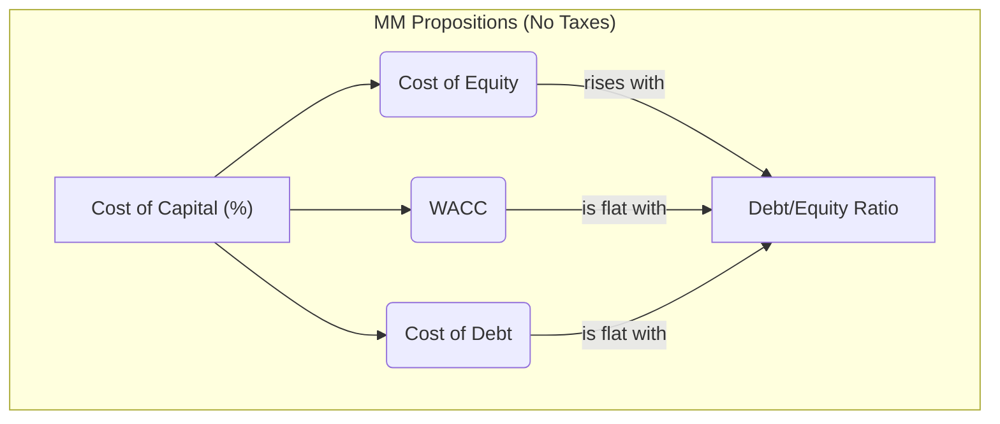
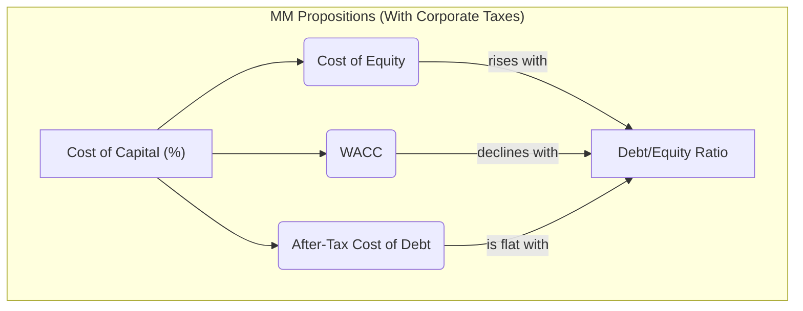
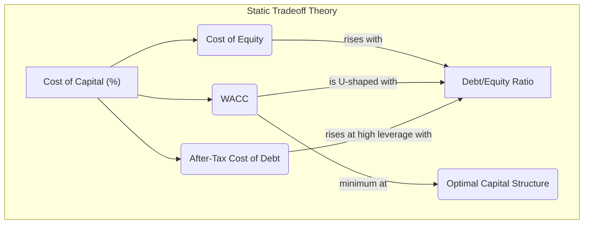

## Reading 25: Capital Structure

### 🎯 Introduction

Welcome, future charterholder! Think of a company as a high-performance engine. To make it run, you need fuel. You have two main types: Equity (think of it as clean, reliable, but expensive rocket fuel) and Debt (powerful, cheap, but explosive nitrous oxide). 🚀

A company's **capital structure** is its unique fuel mix—the proportion of debt and equity it uses to finance its operations. Getting this mix right is one of the most important decisions a company can make. Too much equity, and your engine is too expensive to run. Too much debt, and you risk blowing the whole thing up (bankruptcy!). This reading is your engineering manual for finding the perfect fuel mix to maximize power (firm value) and minimize risk.

-----

### Part 1: The Cost of Your Fuel Mix - The Weighted-Average Cost of Capital (WACC)

The **Weighted-Average Cost of Capital (WACC)** is the blended, average cost the company pays for all the capital it uses. It's the hurdle rate for new projects—if a project can't earn a return higher than the WACC, it's not worth doing.

#### 1.1 The WACC Formula

The formula looks a bit intimidating, but it's just a simple weighted average.

$$WACC = (w_d \times r_d \times (1-t)) + (w_e \times r_e)$$

Where:

  * **wₑ** = Weight of equity in the capital structure
  * **rₑ** = **Cost of equity** (the return shareholders expect)
  * **w_d** = Weight of debt in the capital structure
  * **r_d** = **Cost of debt** (the interest rate the company pays on its debt)
  * **t** = The company's corporate tax rate

Notice the special term: **(1 - t)**. This is the **tax shield**. Because interest payments on debt are usually tax-deductible, the government effectively subsidizes debt financing. The true cost of debt is its after-tax cost.

##### 1.1.1 Example 🧮

ABC, Inc., is funded with 50% debt and 50% equity. Its cost of debt is 8%, and its cost of equity is 11%. The corporate tax rate is 30%. What's the WACC?

  * w_d = 0.50
  * r_e = 11% or 0.11
  * w_d = 0.50
  * r_d = 8% or 0.08
  * t = 30% or 0.30

$$WACC = (0.50 \times 0.08 \times (1-0.30)) + (0.50 \times 0.11)$$

$$WACC = (0.028) + (0.055) = 0.083 \text{ or } 8.3\%$$

The company's blended cost of capital is 8.3%.

**💡 CFA Exam Tip ✍️:** The most common mistake on WACC questions is forgetting to adjust the cost of debt for taxes. The `(1 - t)` only applies to the debt component! The cost of equity is *not* tax-deductible. **Burn this into your memory.**

-----

### Part 2: What's the Right Mix? Factors Influencing Capital Structure

Why is a tech company like Microsoft funded almost entirely by equity, while a utility company like Tata Power uses a huge amount of debt? It depends on their ability to handle the fixed payments that come with debt.

#### 2.1 Key Factors for Debt Capacity

  * **Stable and Predictable Revenues/Cash Flows:** If you know money is coming in consistently, you can be more confident about making interest payments.
  * **Low Business Risk:** Companies in non-cyclical industries (like utilities or consumer staples) have less earnings volatility and can support more debt.
  * **Tangible Assets:** Companies with lots of property, plants, and equipment (like manufacturing firms) can use those assets as collateral to get cheaper debt.

#### 2.2 Capital Structure and the Company Life Cycle

| Stage | Characteristics | Typical Capital Structure |
| :--- | :--- | :--- |
| **Start-up Stage** 🌱 | Negative cash flows, high business risk, few tangible assets. | Almost 100% equity (from founders, venture capital). |
| **Growth Stage** 📈 | Sales and cash flows are growing but may be volatile. Business risk is decreasing. | Begins to introduce a small amount of debt, possibly **convertible debt**. |
| **Mature Stage** 🌳 | Stable cash flows, lower business risk, significant assets. | Uses a significant proportion of debt to optimize WACC. Think of large firms like Hindustan Unilever or Procter & Gamble. |

-----

### Part 3: The Professors' Perfect World - Modigliani-Miller (MM) Theory

In 1958, professors Modigliani and Miller asked a simple question: Does capital structure even matter? Their answers, developed in a "perfect world" with no taxes or other frictions, changed finance forever.

#### 3.1 MM Proposition I (No Taxes): Capital Structure Irrelevance

**The Idea:** The value of a company is determined by its assets and the cash flows they generate, NOT by how those assets are financed.  
**The Analogy:** Think of the company's value as a whole pizza. 🍕 MM says the size of the pizza doesn't change whether you slice it into 8 equity slices or 4 debt slices and 4 equity slices. The pizza is the pizza.  
**Conclusion:** In a world with no taxes, capital structure is irrelevant. **Firm Value is constant.**

#### 3.2 MM Proposition II (No Taxes): Cost of Equity and Leverage

**The Idea:** As a company adds cheaper debt, its cost of equity rises just enough to perfectly offset the benefit.  
**Why?:** As you add debt, the risk to equity holders increases because they are last in line to get paid. They demand a higher return to compensate for this extra risk.  
**Conclusion:** The **WACC remains constant** no matter how much debt you add.

#### 3.3 MM Propositions (WITH Taxes): The Game Changer

MM then added one dose of reality: interest payments on debt are tax-deductible. This creates the famous **tax shield**.

**The Idea:** The tax shield makes debt even cheaper. Every dollar of interest the company pays reduces its taxable income, saving it money that would have gone to the government. This savings adds value to the firm.  
**Conclusion:** Because of the tax shield, the WACC *continuously decreases* as you add more debt. The value of the firm is maximized at **100% debt**!

This still doesn't look like the real world, which leads us to the final piece of the puzzle.

-----

### Part 4: Back to Reality - Optimal and Target Capital Structures

#### 4.1 The Static Tradeoff Theory

The MM-with-taxes world ignores a huge risk: the more debt you take on, the higher your chance of going bankrupt. Bankruptcy is expensive! These **costs of financial distress** (lawyer fees, lost customers, etc.) start to counteract the benefits of the tax shield.

The **static tradeoff theory** says that a company's **optimal capital structure** is the point where the value added by the tax shield is exactly balanced by the value lost from the rising costs of financial distress.

This theory gives us the famous U-shaped WACC curve.

  * At this optimal point, the **WACC is minimized**, and **firm value is maximized**.

#### 4.2 Other Theories

  * **Pecking Order Theory:** This theory focuses on **asymmetric information** (managers know more than investors). It says managers prefer a "pecking order" of financing to avoid sending bad signals.
    * **Internal Funds (Retained Earnings):** The #1 choice. It sends no signal.
    * **Debt:** The #2 choice. Less of a negative signal than equity.
    * **Equity:** The last resort. Issuing new stock is often seen by the market as a sign that management thinks the stock is overvalued.

  * **Agency Costs:** This relates to the conflicts between managers and shareholders. High debt can be good because it forces managers to be disciplined (they have to make interest payments!) and reduces the free cash flow they might otherwise waste on pet projects.

**💡 CFA Exam Tip ✍️:** Understand the *evolution* of the theories:
  * **MM (No Tax):** Irrelevant.
  * **MM (With Tax):** 100% debt is optimal.
  * **Static Tradeoff:** Optimal structure balances the tax shield against bankruptcy costs. This is the most realistic and important theory for the exam.

-----

### 🧪 Formula Summary

**Weighted-Average Cost of Capital (WACC):** The blended cost of all capital sources.

$$WACC = (w_d \times r_d \times (1-t)) + (w_e \times r_e)$$

Where:
  * $w_d, w_e$ = weights of debt and equity
  * $r_d, r_e$ = costs of debt and equity
  * $t$ = corporate tax rate

**Valuing a Perpetuity (No-Growth) with WACC:** For a company with stable cash flows expected to continue indefinitely (a perpetuity), its total value can be estimated by dividing its free cash flow to the firm (FCFF) by its WACC.

$$V_L = \frac{FCFF_1}{WACC}$$

Where:
  * $V_L$ = value of the levered firm
  * $FCFF_1$ = free cash flow to the firm in the first period

**MM Proposition II (No Taxes) - Cost of Equity:** Shows how the cost of equity rises with leverage in a world without taxes.

$$r_e = r_0 + (r_0 - r_d)\frac{D}{E}$$

Where:
  * $r_e$ = cost of equity
  * $r_0$ = cost of capital for a company with no debt
  * $r_d$ = cost of debt
  * $D/E$ = debt-to-equity ratio

**MM Proposition I (With Taxes) - Value of a Levered Firm:** The value of a firm with debt is the value of an all-equity firm plus the present value of the tax shield.

$$V_L = V_U + (t \times D)$$

Where:
  * $V_L$ = value of the levered firm
  * $V_U$ = value of the unlevered (all-equity) firm
  * $t$ = tax rate
  * $D$ = market value of debt

**MM Proposition II (With Taxes) - WACC:** Shows that the WACC declines as leverage increases due to the tax shield.

$$WACC = r_0 \left[1 - \left(t \times \frac{D}{D+E}\right)\right]$$

**Static Tradeoff Theory - Value of a Levered Firm:** The value of a levered firm is the value of an all-equity firm plus the tax shield benefit, minus the present value of financial distress costs.

$$V_L = V_U + (t \times D) - PV(\text{costs of financial distress})$$

-----

### 🎯 Quick Exam-Day Pointers

* **The WACC Formula is a Must-Know:**  
  * ✅ You will almost certainly have to calculate or interpret WACC.  
  * ❌ Don't forget the tax shield `(1-t)` on debt!
* **Static Tradeoff is the Key Theory:**  
  * ⬇️ The idea of balancing the tax benefits of debt against the rising costs of financial distress to find an **optimal capital structure** is the central concept of this reading.
* **Visualize the U-Shaped Curve:**  
  * ✅ The WACC is minimized (and firm value is maximized) at the bottom of the U-shaped curve. This is the optimal capital structure.
* **Pecking Order is about Signals:**  
  * → Remember the hierarchy: **Internal Cash > Debt > Equity**. Issuing equity is the least preferred option because of the negative signal it sends.

