## 🚀 Reading 24: Capital Investments and Capital Allocation

### 🎯 Introduction

Welcome, future charterholder\! Imagine you're the CEO of a company, and you have a big pile of cash. 💰 You have to decide where to spend it. Should you build a new factory? Launch a new product? Upgrade your old machines? This is the heart of **capital allocation**. It's the process of choosing long-term projects that will grow the company and create the most value for shareholders.

Think of it like being a master strategist in a game. You have limited resources, and every investment is a move that will determine your future success. This reading gives you the essential toolkit—**Net Present Value (NPV)** and **Internal Rate of Return (IRR)**—to analyze these moves, avoid common traps, and make winning decisions.

-----

### Part 1: The Analyst's Toolkit - NPV, IRR, and ROIC 🛠️

Before a company spends a single dollar on a major project, it needs a rigorous process to evaluate it. This is the **capital allocation process**.

```mermaid
graph TD
    A[1. Generate Ideas💡] --> B[2. Analyze Projects📊];
    B --> C[3. Create Firm-Wide Budget📋];
    C --> D[4. Monitor & Post-Audit🔍];
```

The "Analyze Projects" step is where we use our main tools.

#### **Net Present Value (NPV): The Gold Standard 🏆**

The **Net Present Value (NPV)** is the difference between the present value of a project's future cash inflows and the present value of its cash outflows. In simple terms: **it's the pure dollar amount of value the project adds to the company.**

**The Rule:**

  * If **NPV \> 0**, ✅ Accept the project. It creates value.
  * If **NPV \< 0**, ❌ Reject the project. It destroys value.

##### **Theory 🧠**

$$NPV = \sum_{t=0}^{n} \frac{CF_t}{(1+k)^t}$$

Where:

  * **CFₜ** = After-tax cash flow in period *t* (CF₀ is usually the initial investment, a negative number)
  * **k** = The project's discount rate (the company's cost of capital)
  * **n** = The project's life

##### **Example 🧮**

A company is considering a project that costs $10,000 today (CF₀ = -$10,000). It will generate cash flows of $5,000, $4,000, and $3,000 over the next three years. The company's cost of capital is 9%.

**Calculation on your TI BA II Plus™:**

1.  Press `CF`, then `2nd` `CLR WORK`.
2.  `CF0 = 10000 +/- ENTER`
3.  `↓ C01 = 5000 ENTER`
4.  `↓ F01 = 1 ENTER` (Frequency is 1)
5.  `↓ C02 = 4000 ENTER`
6.  `↓ F02 = 1 ENTER`
7.  `↓ C03 = 3000 ENTER`
8.  `↓ F03 = 1 ENTER`
9.  Press `NPV`, `I = 9 ENTER`
10. `↓ CPT` → **$883.33**

Since the NPV is positive, the company should accept the project. It is expected to increase the company's value by $883.33.

#### **Internal Rate of Return (IRR): The Project's "Interest Rate" %**

The **Internal Rate of Return (IRR)** is the discount rate that makes the NPV of a project equal to zero. You can think of it as the project's expected rate of return.

**The Rule:**

  * If **IRR \> Cost of Capital**, ✅ Accept the project. It earns more than it costs to fund.
  * If **IRR \< Cost of Capital**, ❌ Reject the project.

Using the same example as above, after entering the cash flows, you would simply press `IRR` then `CPT` on your calculator to get **19.44%**. Since 19.44% is greater than the 9% cost of capital, you accept the project.

#### **NPV vs. IRR: The Final Showdown**

For a single, standalone project, NPV and IRR will always lead to the same accept/reject decision. But for **mutually exclusive projects** (where you can only choose one), they can sometimes give conflicting rankings.

| Feature | Net Present Value (NPV) | Internal Rate of Return (IRR) |
| :--- | :--- | :--- |
| **What it is** | A dollar value. | A percentage rate. |
| **Key Assumption** | Assumes cash flows are reinvested at the **cost of capital**. (More realistic) | Assumes cash flows are reinvested at the **IRR itself**. (Often unrealistic) |
| **The Winner?** | **NPV is theoretically superior.** It directly measures the value added to the firm. | Can be misleading when comparing projects of different scales or cash flow patterns. |

#### **Return on Invested Capital (ROIC)**

While NPV and IRR are for *projects*, **Return on Invested Capital (ROIC)** measures the profitability of the *entire company*. It shows how efficiently a company is using all the capital provided by both debtholders and shareholders.

**The Rule:**

  * If **ROIC \> WACC**, the company is creating value.
  * If **ROIC \< WACC**, the company is destroying value.

> [\!TIP]
> **CFA Exam Tip ✍️:** **NPV IS KING\!** This is one of the most important takeaways in all of corporate finance. If a question asks you to choose between two mutually exclusive projects and NPV and IRR give different answers, **always choose the project with the higher NPV**.

-----

### Part 2: The Rules of the Game - Capital Allocation Principles & Pitfalls 🧠

To calculate NPV and IRR correctly, you must be a detective, focusing only on the cash flows that happen *because* of the project.

#### **Core Principles of Capital Allocation**

1.  **Use Cash Flows, Not Accounting Income:** Decisions are based on actual cash moving in and out, not on accounting numbers like net income.
2.  **Focus on Incremental Cash Flows:** Only include cash flows that will change *if* you accept the project.
3.  **Ignore Sunk Costs:** A **sunk cost** is money that's already been spent and cannot be recovered. Since you can't get it back whether you proceed or not, it's irrelevant to the decision.
4.  **Include Opportunity Costs:** An **opportunity cost** is the value of the next-best alternative you give up. If you use a factory you already own for a new project, the opportunity cost is the rent you could have earned by leasing it out. This must be included as a project cost.
5.  **Include Externalities:** Consider the project's side effects on other parts of the business. If a new product cannibalizes sales from an old one, that's a negative **externality** and a cost to the project.
6.  **Use After-Tax Cash Flows:** The only cash flows that matter are the ones the company gets to keep after paying the government.

#### **Common Pitfalls and Behavioral Biases**

Even with the right tools, managers can make mistakes.

  * **Forgetting Working Capital:** New projects often require an initial investment in inventory and receivables (a cash outflow) that is recovered at the end (a cash inflow).
  * **Ignoring Inflation:** You must be consistent. Either use nominal cash flows with a nominal discount rate or real cash flows with a real discount rate.
  * **Behavioral Biases:**
      * **Pet Projects:** A senior manager's favorite project might get approved with overly optimistic assumptions and less scrutiny.
      * **Inertia:** Managers might anchor their new budget to last year's budget instead of starting from scratch based on the best available opportunities.

> [\!TIP]
> **CFA Exam Tip ✍️:** The exam loves to test your understanding of what to include in your analysis. Remember this simple rule: **Include opportunity costs and externalities. Exclude sunk costs and financing costs** (interest is already captured in the discount rate).

-----

### Part 3: The Secret Levels - Unlocking Value with Real Options ✨

Sometimes, a project's simple NPV doesn't tell the whole story. Many projects contain **real options**—the right, but not the obligation, to make a future business decision. These options have value and can make a seemingly unprofitable project worthwhile.

| Type of Real Option | Description | Example |
| :--- | :--- | :--- |
| **Timing Options** ⏳ | The option to delay an investment, waiting for more information or better market conditions. | A real estate developer owning a piece of land can choose to build now or wait a few years to see if property values rise. |
| **Abandonment Options** 🛑 | The option to shut down a project early if it's performing poorly, allowing the company to cut its losses. | An oil company can stop production at a well if the price of oil falls below its extraction cost. |
| **Expansion Options** 📈 | The option to make additional investments to scale up a project if it proves to be successful. | A company like Tesla launching a pilot factory. If it's successful, they have the option to build a much larger "Gigafactory." |
| **Flexibility Options** ⚙️ | Options that allow the company to alter a project's operations, such as changing prices or switching inputs/outputs. | An airline ordering a new plane might pay extra for an engine that can use different types of fuel, giving them flexibility if one fuel type becomes expensive. |
| **Fundamental Options** 💎 | The project itself is the option. The entire payoff depends on an underlying asset's price. | A copper mine. The decision to open the mine is an option on the price of copper. If the price is high, you "exercise" the option and start mining. |

> [\!TIP]
> **CFA Exam Tip ✍️:** A key insight is that real options can turn a negative NPV project into a positive one. If a project has an NPV of -$1 million but contains an expansion option valued at +$3 million, the total project value is +$2 million and it should be accepted.

-----

### 🧪 Formula Summary

  * **Net Present Value (NPV):**
    $$NPV = \sum_{t=0}^{n} \frac{CF_t}{(1+k)^t}$$
  * **Internal Rate of Return (IRR):**
    The discount rate 'IRR' such that: $$0 = \sum_{t=0}^{n} \frac{CF_t}{(1+IRR)^t}$$
  * **Return on Invested Capital (ROIC):**
    $$\text{ROIC} = \frac{\text{Net Operating Profit After Tax (NOPAT)}}{\text{Average Book Value of Invested Capital}}$$

-----

> [\!IMPORTANT]
>
> ### 🎯 Quick Exam-Day Pointers
>
>   * **NPV is the Ultimate Decider:** When in doubt, trust NPV. Accept projects with NPV \> 0. For competing projects, pick the one with the highest NPV.
>   * **IRR is the Project's Return:** The IRR is the project's percentage return. Accept if IRR \> Cost of Capital. Be wary of its reinvestment assumption.
>   * **Cash Flow is King:** Your analysis must be based on **incremental, after-tax cash flows**. Remember to include opportunity costs and externalities but ignore sunk costs.
>   * **Don't Forget Real Options:** Real options (to wait, abandon, expand, or change) add hidden value to a project that a basic NPV analysis might miss. A project with a small negative NPV could be a "go" if it has a valuable real option attached.