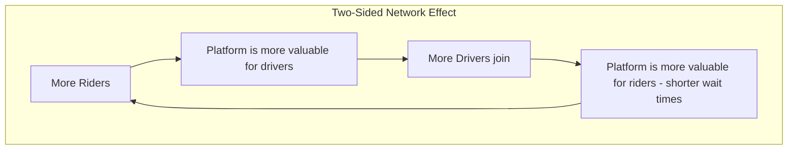

## 🚀 Reading 26: Business Models

### 🎯 Introduction

Welcome, future charterholder! What makes a company like Apple different from Dell, or Zomato different from a local restaurant? It's not just *what* they sell, but *how* they create, deliver, and capture value. This entire game plan is the company's **business model**. 📜

Think of it as the secret recipe for a Michelin-star restaurant. It details the ingredients (**value proposition**), the cooking process (**value chain**), the target diners (**customers**), the restaurant's location and delivery options (**channels**), and the price on the menu (**pricing strategy**). This reading is your tour of the kitchen, revealing the essential components of any business model and the most common recipes for success in the modern economy.

-----

### Part 1: The Anatomy of a Business Model - The 5 Key Questions 🗺️

A solid **business model** provides clear answers to five fundamental questions. It's the blueprint that explains how a company intends to operate and make a profit.

| Key Question | What It Asks | Core Concepts & Examples |
| :--- | :--- | :--- |
| **1. WHO?** 🎯 | Who are your target customers? | • **B2C (Business-to-Consumer):** Selling directly to individuals (e.g., Netflix, Amazon). • **B2B (Business-to-Business):** Selling to other companies (e.g., Salesforce, Tata Consultancy Services). |
| **2. WHAT?** 🎁 | What product/service are you offering and why is it valuable? | • **Value Proposition:** The unique value a company promises to deliver. Why should customers choose you? (e.g., Apple's is design, ecosystem, and premium experience). • **Value Chain:** All the activities (R\&D, production, marketing, service) the firm undertakes to deliver on its value proposition. |
| **3. HOW?** ⚙️ | How do you create and deliver your product/service? | • This involves the company's key resources, assets, and organizational structure. |
| **4. WHERE?** 🚚 | How do you reach your customers? | • **Channel Strategy:** The plan for getting the product to the customer. This can be through **direct sales** (like Tesla's showrooms), retail partners (like Hindustan Unilever's network of `kirana` stores), or online platforms. |
| **5. HOW MUCH?** 💰 | What is your pricing strategy? | • **Price Takers:** Commodity producers (e.g., oil & gas) with no pricing power. • **Price Makers:** Companies with differentiated products (e.g., patented drugs) that have pricing power. |

#### **A Closer Look at Pricing Strategies**

  * **Price Discrimination:** Charging different prices to different customers for the same product. Examples include student discounts or peak/off-peak airline ticket prices.
  * **Dynamic Pricing:** Prices change in real-time based on demand. Uber's "surge pricing" during rush hour is a classic example.

> [!TIP]
> **CFA Exam Tip ✍️:** The **value proposition** is the heart and soul of any business model. For the exam, always ask yourself, "What fundamental problem is this company solving for its customer, and why is its solution better than the competition's?"

-----

### Part 2: Common Business Model Blueprints 🏗️

While every company is unique, most business models fall into several common patterns. Understanding these blueprints will help you quickly analyze how a company operates.

| Business Model | How It Works | Real-World Examples |
| :--- | :--- | :--- |
| **Direct Sales & Distribution** | The company sells its products directly to the end customer, bypassing retailers or other middlemen. | Tesla (sells through its own showrooms and website), Dell (historically sold PCs directly online). |
| **Licensing & Franchising** | The company gets paid by others who use its brand, process, or intellectual property. | **Franchising:** McDonald's, Domino's Pizza. **Licensing:** A biotech firm licensing its new drug patent to a large pharmaceutical company for production and sales. |
| **Subscription Model** 📺 | Customers pay a recurring fee (monthly or yearly) for continuous access to a product or service. | Netflix, Spotify, Amazon Prime. |
| **Freemium Model** | A basic version of the service is offered for free to attract a large user base, while a premium version with more features is sold. | LinkedIn (free profile, paid "Premium" for advanced features), Spotify (free with ads, paid for ad-free listening). |
| **Razors-and-Blades Model** | The core product (the "razor") is sold at a low price, sometimes even at a loss, to lock in customers who then have to buy high-margin, proprietary consumables (the "blades"). | Gillette (cheap razor handles, expensive blades), Video game consoles (cheap console, expensive games), Printers (cheap printer, expensive ink cartridges). |
| **Network Effects Model** 🔗 | The value of the service increases for every new user that joins. This creates a powerful competitive advantage. | Social Media (Facebook, Instagram), Ride-sharing apps (Uber, Ola), Professional Networks (LinkedIn). The more people on the platform, the more useful it is for everyone. |
| **Crowdsourcing Model** 🙌 | The business relies on contributions from a large community of users to create its content or value. | Wikipedia (content from volunteers), Waze (traffic data from drivers), Open-source software (code from a community of developers). |

> [!TIP]
> **CFA Exam Tip ✍️:** Expect scenario-based questions where you'll be given a short description of a company and asked to identify its business model. For example, "A company gives away its software for free but charges for customer support and advanced features." You should immediately recognize this as the **Freemium** model.

-----

### 🧪 Formula Summary

This reading is entirely conceptual. There are **no formulas** you need to memorize. Your focus should be on understanding the definitions, frameworks, and different types of business models.

-----

> [!IMPORTANT]
>
> ### 🎯 Quick Exam-Day Pointers
>
>   * **The 5 Questions:** Every business model must answer: WHO are the customers? WHAT is the value? HOW is it created? WHERE is it delivered? and HOW MUCH does it cost?
>   * **Value Proposition is Core:** It's the "why" behind a customer's choice.
>   * **Know Your Models (Quick Reference):**
>       * **Subscription:** Pay-as-you-go access (Netflix).
>       * **Freemium:** Free basic, pay for pro (LinkedIn).
>       * **Razors-and-Blades:** Sell the razor cheap, make money on the blades (Gillette, HP Printers).
>       * **Network Effect:** More users = more value (Facebook, Uber).
>       * **Crowdsourcing:** Value is created by the users (Wikipedia, Waze).
>   * **B2B vs. B2C:** Instantly identify if the company's primary customer is another business or an individual consumer. This is a fundamental starting point for analysis.