### **Price vs. Value of Forward and Futures Contracts (LOS 71.a) ⚖️**

It's crucial to distinguish between the **price** and the **value** of a derivative contract. The **price** is the agreed-upon rate for the transaction at a future date, while the **value** is what the contract is worth today.

#### **Forward Contracts**

  * **Price:** The forward price is **fixed** at the beginning of the contract and remains unchanged throughout its life 🗓️.
  * **Value:** A forward contract is structured to have a **value of zero** at initiation. However, as the spot price of the underlying asset changes, the value of the forward contract fluctuates. It becomes positive for one party and negative for the other. The entire gain or loss is settled only at expiration.

**🇮🇳 Indian Example:** Imagine a cotton farmer in Gujarat enters a forward contract to sell 100 bales of cotton in 3 months at a price of ₹50,000 per bale. The forward **price** is fixed at ₹50,000. If, after one month, the market price for cotton jumps to ₹52,000, the **value** of the contract becomes positive for the buyer and negative for the farmer. However, no money changes hands until the settlement date.

#### **Futures Contracts**

Futures contracts operate differently due to the **Mark-to-Market (MTM)** process 🔄.

  * **Price and Value:** Both the price and value of a futures contract change daily.
  * **Mark-to-Market:** At the end of each trading day, the contract is settled based on the day's **settlement price**, 3149].
      * Gains are added to the winner's **margin account** 💰.
      * Losses are deducted from the loser's margin account.
  * After the daily settlement, the contract is effectively repriced to the new settlement price. This process resets the contract's **value back to zero** at the end of every day.

<!-- end list -->

**🇮🇳 Indian Example:** An investor buys one Nifty 50 futures contract on the National Stock Exchange (NSE) at a price of 19,500. The lot size is 50.

  * **Day 1:** The Nifty futures settlement price is 19,600. The investor has a gain of 100 points.
      * *Gain:* $100 \times 50 = 5000$. This amount is credited to their margin account.
      * The contract's value is reset to zero, and the new price for the next day is 19,600.
  * **Day 2:** The settlement price falls to 19,550. The investor has a loss of 50 points from the new price.
      * *Loss:* $50 \times 50 = 2500$. This amount is debited from their margin account.
      * The contract's value is again reset to zero, and the new price is 19,550.

#### **Interest Rate Futures**

Interest rate futures, like those based on the Mumbai Interbank Offered Rate (MIBOR), are quoted differently.

  * **Price Quotation:** The price is quoted as `100 - Annualized Interest Rate (%)`. A price of 96.50 implies an interest rate of $100 - 96.50 = 3.50%$.
  * **Basis Point Value (BPV):** This is a critical concept that measures the change in a contract's value for a one-basis-point (0.01%) change in the interest rate. It quantifies the contract's sensitivity.

> **💡 <mark>EXAM TIP:</mark>:** Remember the inverse relationship for interest rate futures: as interest rates go **up** 📈, the futures price goes **down** 📉, and vice-versa.

-----

### **Why Futures Prices Differ from Forward Prices (LOS 71.b) 🤔**

While similar, futures and forward prices are not always identical, primarily due to the MTM process and its interaction with interest rates.

#### **The Mark-to-Market Effect**

The daily cash settlement of futures gains and losses is the key.

  * **If futures prices are positively correlated with interest rates:**
      * When prices rise, you receive a cash gain. You can reinvest this cash at a *higher* interest rate.
      * When prices fall, you have a cash loss. You can borrow to fund this loss at a *lower* interest rate.
      * This is an advantageous situation 👍. Therefore, the **futures contract is more valuable, and its price will be higher than the forward price.**
  * **If futures prices are negatively correlated with interest rates:**
      * The opposite occurs. Gains are reinvested at lower rates, and losses are funded at higher rates.
      * This is disadvantageous 👎. Therefore, the **futures price will be lower than the forward price.**

```mermaid
graph TD
    A[Scenario: Prices & Rates are Positively Correlated] --> B{Futures Price Moves};
    B --> C[Price Rises 📈];
    C --> D[Receive MTM Cash Gain];
    D --> E[Reinvest Gain at <br> HIGHER Interest Rates ✅];
    B --> F[Price Falls 📉];
    F --> G[Pay MTM Cash Loss];
    G --> H[Borrow to Fund Loss at <br> LOWER Interest Rates ✅];
    E & H --> I((Overall Advantage for Futures Holder));
```

<!-- end list -->

> ⭐ **Exam Highlight:** For the exam, you can generally assume that for most underlying assets (like equities and bonds), there is a **positive correlation** between their prices and interest rates, so **Futures Price > Forward Price**. For interest rate futures themselves, the correlation is **negative**, so **Futures Price < Forward Price**.

#### **Convexity Bias**

This is a specific issue related to **interest rate forwards (FRAs) and futures**.

  * **FRAs:** The payoff on an FRA is based on the *present value* of the interest differential. This discounting creates a non-linear (**convex**) relationship with interest rates, similar to a bond's price-yield curve. This means a long FRA position benefits more from a rate decrease than it loses from an equivalent rate increase.
  * **Interest Rate Futures:** The payoff is **linear**, calculated simply using the BPV.

This difference in payoff structure is called **convexity bias**. The attractive convexity feature of an FRA means investors are willing to pay a premium for it.

> ⭐ **Exam Highlight:** Due to convexity bias, the interest rate on a **forward contract (FRA) will be slightly higher than the rate on an equivalent futures contract**. This difference is more pronounced for longer-term contracts.

-----

### **Formulas Used in This Reading 🧮**

1.  **Interest Rate Futures Price:**
    $$\text{Price} = 100 - \text{Annualized Interest Rate} (\%)$$
    

2.  **Basis Point Value (BPV):**
    $$\text{BPV} = \text{Notional Principal} \times \text{Period} \times 0.0001$$
    
    *Note: The 'Period' is expressed in years (e.g., for a 3-month contract, the period is 3/12 or 0.25).*

-----

### **Quick Exam-Day Pointer ✅**

  * **Futures = Daily MTM.** Forwards = Settle at expiry.
  * The MTM process resets the **value** of a futures contract to zero every day.
  * **Futures Price vs. Forward Price:** It's all about the correlation with interest rates.
      * **Positive Correlation (most assets):** Futures Price > Forward Price.
      * **Negative Correlation (interest rates):** Futures Price < Forward Price.
  * **Convexity Bias:** Applies only to interest rate derivatives. It makes the **Forward Rate > Futures Rate**.