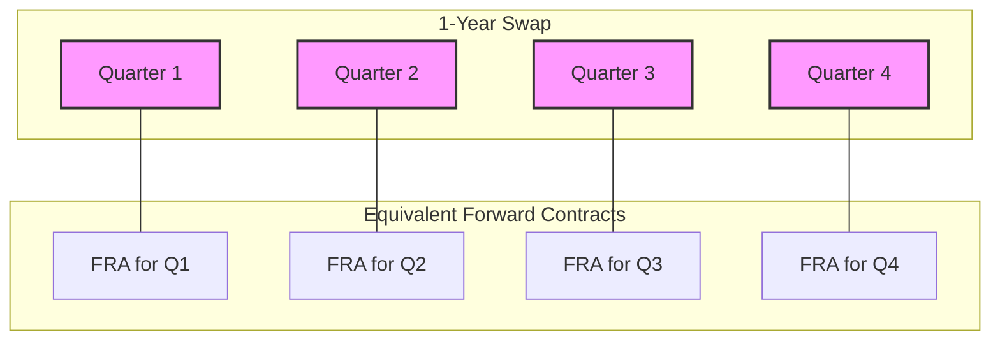

-----
## Reading 72: Swaps—Valuation and Pricing

### 🎯 Introduction
Swaps can be understood as a series of forward contracts or as a combination of two bonds. This reading covers both perspectives and the critical distinction between swap price and value.

-----
### Part 1: Swaps vs. a Series of Forward Contracts (LOS 72.a)

#### 1.1 A Swap as a Bundle of Forwards
Think of an interest rate swap as a series of Forward Rate Agreements (FRAs) bundled together. In a swap, you exchange a fixed interest payment for a floating one over multiple periods—economically equivalent to entering a separate FRA for each period, all with the same fixed rate.

**🇮🇳 Indian Example:**  
Imagine Infosys enters a 1-year swap to pay a fixed rate and receive the floating MIBOR quarterly on a notional amount of ₹50 crore. This is like simultaneously entering into four separate FRAs:
  * An FRA that settles in 3 months.
  * An FRA that settles in 6 months.
  * An FRA that settles in 9 months.
  * An FRA that settles in 12 months.

All four FRAs would be based on the same fixed rate agreed upon in the swap.

#### 1.2 A Swap as a Combination of Bonds
This is the most intuitive way to think about swap valuation. A swap is equivalent to buying one type of bond and selling another.

  * **Fixed-Rate Payer (Receives Floating):**  
    * Same as being **short a fixed-rate bond** (obligation to make fixed payments) and **long a floating-rate note (FRN)** (entitled to receive floating payments).
  * **Floating-Rate Payer (Receives Fixed):**  
    * Same as being **long a fixed-rate bond** and **short an FRN**.

💡 CFA Exam Tip ✍️: 
This bond analogy is the key to understanding swap valuation on the exam. If you remember that a swap is just a portfolio of two bonds, the valuation logic becomes much simpler.

-----
### Part 2: The Price vs. The Value of a Swap (LOS 72.b)

#### 2.1 Price of a Swap
The **price** of a swap is simply the **fixed interest rate** specified in the contract. This rate, often called the **par swap rate**, is carefully calculated at the start to ensure the contract is fair for both parties.

#### 2.2 Value of a Swap
The **value** of a swap is its net worth at any given point in time.

  * **At Initiation:**  
    * The swap rate is set so that the present value of the fixed payments equals the present value of the expected floating payments.  
    * Therefore, the initial value of a swap is **zero**.
  * **During its Life:**  
    * As market interest rates change, the expected future floating payments will change, causing the value of the swap to move away from zero.
      * If interest rates **rise**, the floating payments will be higher than originally expected.  
        * ✅ Benefits the person receiving floating (the fixed-rate payer), and the swap will have a **positive value** for them.
      * If interest rates **fall**, the floating payments will be lower.  
        * ❌ Hurts the fixed-rate payer, and the swap will have a **negative value** for them.

Valuing the swap is straightforward using the bond analogy:

$$\text{Value of the Swap} = \text{Value of the Asset You Own} - \text{Value of the Liability You Owe}$$

For a **fixed-rate payer**:

$$\text{Value} = \text{Value of the FRN} - \text{Value of the Fixed-Rate Bond}$$

### 🎯 Quick Exam-Day Pointers

* **Key Shortcut:**  
  * On any coupon reset date, the value of a floating-rate note (FRN) is always equal to its par value (e.g., ₹10 crore).
  * So, on a reset date, the valuation for a fixed-rate payer simplifies to:
    * $$\text{Value} = \text{Par Value} - \text{Current Market Value of the Fixed-Rate Bond}$$

-----
### Part 3: Formulas Used in This Reading 🧮

#### 3.1 Swap Valuation Formulas

**Swap Value (Fixed-Rate Payer's Perspective):**

$$V_{swap} = PV(\text{Expected Floating Payments}) - PV(\text{Fixed Payments})$$

**Swap Value using Bond Analogy (Fixed-Rate Payer's Perspective):**

$$V_{swap} = V_{FRN} - V_{Fixed}$$

**Where:**
  * $V_{swap}$ = Value of the swap
  * $V_{FRN}$ = Value of the floating-rate note
  * $V_{Fixed}$ = Value of the fixed-rate bond
  * $PV$ = Present value

-----
### 3.2 Global & Local Context 🌍

**Global Example:**  
A multinational corporation enters into an interest rate swap to hedge exposure to USD LIBOR.  
**Local Example (India):**  
Infosys uses a swap to manage exposure to MIBOR for INR-denominated debt.

-----
### Part 4: Quick Exam-Day Pointer ✅

### 🎯 Quick Exam-Day Pointers

* **Price of a swap:** The **fixed rate**.
* **Value of a swap:** Starts at **zero**.
* **Valuation Secret:** A swap is just a portfolio of two bonds (one long, one short).
* For a fixed-rate payer:  
  * $$\text{Value} = \text{Value(FRN)} - \text{Value(Fixed Bond)}$$
* **Shortcut:** On a reset date, $$\text{Value(FRN)} = \text{Par}$$. This makes calculations much faster!

