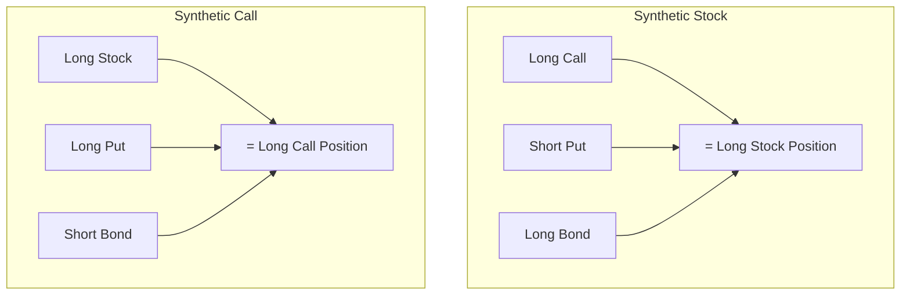

## Summary of Reading 74: Option Replication Using Put–Call Parity

### 🎯 Introduction

Welcome to one of the most elegant concepts in finance\! Think of financial assets like LEGO® bricks. You can build the exact same model in different ways using different combinations of bricks. **Put-Call Parity** shows us how we can build the exact same financial payoff using two different sets of "bricks": one combination using a call option, and another using a put option. Because they build the same thing, they must cost the same. If they don't, there's a risk-free profit opportunity, and in finance, those don't last long\! This reading unlocks the magic of how options, stocks, and bonds are all mathematically linked. 🔗

### Part 1: The Master Equation: What is Put-Call Parity? ⚖️ (LOS 74.a)

**Put-Call Parity** is a fundamental relationship that links the prices of European call options, put options, the underlying stock, and a risk-free bond. It's built on the principle of **no-arbitrage**—meaning no risk-free lunch\! 🥪

To understand it, let's create two special portfolios that have the *exact same payoff* at expiration.

1.  **Portfolio A: The Fiduciary Call** 📞+ 🏦

      * **What it is:** A long **call option** combined with a long position in a **risk-free zero-coupon bond** that pays the exercise price (X) at expiration.
      * **Analogy:** You have the *right to buy* a stock at price X, and you also have the *cash (X)* ready from the bond to make the purchase if you decide to.

2.  **Portfolio B: The Protective Put** 🛡️+ 📈

      * **What it is:** A long **put option** combined with a long position in one share of the **underlying stock**.
      * **Analogy:** You *own the stock*, but you also have an *insurance policy* (the put) that lets you sell it for at least price X, protecting you from any downside.

#### Why They Are Equal: The Payoff Showdown

Since these two portfolios have identical payoffs no matter what happens to the stock price, their initial costs must be the same.

-----

##### **Payoff at Expiration**

Let's see what each portfolio is worth at expiration (Time T), where **ST** is the stock price at expiration and **X** is the exercise price.

| Scenario | Payoff of Fiduciary Call (Call + Bond) | Payoff of Protective Put (Stock + Put) | Result |
| :--- | :--- | :--- | :--- |
| **Stock price is high (ST ≥ X)** | (ST - X) + X = **ST** | ST + 0 = **ST** | Identical\! ✅ |
| **Stock price is low (ST < X)** | 0 + X = **X** | ST + (X - ST) = **X** | Identical\! ✅ |

-----

Because their payoffs are always the same, the Law of One Price says their values today must be equal. This gives us the famous **Put-Call Parity equation**:

$$c_0 + X(1+R_f)^{-T} = S_0 + p_0$$

Where:

  * **c0** = Price of the European call option today
  * **X(1+Rf)-T** = Price of the risk-free bond today (PV of X)
  * **S0** = Price of the underlying stock today
  * **p0** = Price of the European put option today

#### Building Synthetic Assets 🤖

The real power of this equation is that if you know the prices of any three of these assets, you can solve for the fourth. You can create a **synthetic** version of any asset using the other three.

**Synthetic Stock:** `Long Call + Short Put + Long Bond` = `A share of stock`

> [\!TIP]
> **CFA Exam Tip ✍️:** Memorize the core put-call parity formula: **c + PV(X) = S + p**. A simple mnemonic is "cops," but with the stock and put together: **c + bond = Stock + p**. You will be tested on your ability to rearrange this formula to solve for any of the four components or to identify arbitrage opportunities if the equation doesn't hold.

### Part 2: The Forward Twist: What is Put-Call-Forward Parity? ⏩ (LOS 74.b)

This is a neat variation of the main formula. What if instead of dealing with the actual stock, we use a **forward contract** on the stock?

Remember, a long position in a stock (**S0**) can be replicated by:

1.  Entering a **long forward contract** (which costs nothing today).
2.  Buying a **risk-free bond** that will be worth the forward price (**F0(T)**) at expiration. The cost of this bond today is the present value of the forward price.

So, we can replace the stock (**S0**) in our original parity formula with the cost of its synthetic equivalent: **F0(T)(1 + Rf)-T**.

This gives us the **Put-Call-Forward Parity equation**:

$$F_0(T)(1+R_f)^{-T} + p_0 = c_0 + X(1+R_f)^{-T}$$

This relationship links the prices of puts, calls, and risk-free bonds to the **forward price** of the underlying, rather than its spot price. It's incredibly useful for pricing options on assets that primarily trade in the forward or futures markets, like commodities or currencies.

### 🧪 Formula Summary

  * **Put-Call Parity:**
    $$c_0 + X(1+R_f)^{-T} = S_0 + p_0$$

  * **Put-Call-Forward Parity:**
    $$F_0(T)(1+R_f)^{-T} + p_0 = c_0 + X(1+R_f)^{-T}$$

> [\!IMPORTANT]
>
> ### 🎯 Quick Exam-Day Pointers
>
>   * **European Options Only:** This parity relationship *only* holds for **European options** because they can only be exercised at expiration. American options, with their early exercise feature, break this simple equivalence.
>   * **It's All About No-Arbitrage:** The entire concept is built on the idea that two portfolios with identical future payoffs must have the same price today. If they don't, you can buy the cheap one, sell the expensive one, and lock in a risk-free profit.
>   * **Know Your Synthetics:** Be ready to identify the combination of assets needed to replicate a stock, a bond, a call, or a put. Rearranging the main formula is a key exam skill.
>   * **Same X, Same T:** For the parity to hold, the call and put must have the **same exercise price (X)** and the **same expiration date (T)**.