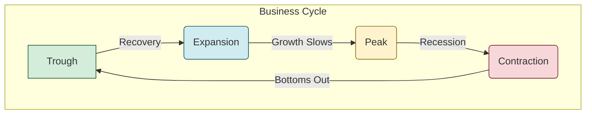

Of course\! Here is a detailed summary of Reading 13, crafted according to the "Global Gold Standard" template.

## 🚀 Reading 13: Understanding Business Cycles

### 🎯 Introduction

Welcome, future charterholder\! Think of the economy as a rollercoaster 🎢. It has thrilling climbs (expansions), breathtaking peaks, stomach-lurching drops (recessions), and moments at the bottom (troughs) before it starts climbing again. This natural rhythm of ups and downs is what we call the **business cycle**. This reading is your guide to understanding this rollercoaster ride. We'll explore each phase, learn how different parts of the economy react during the ride, and discover the secret signals economists use to predict the next big turn\!

-----

### The Four Phases of the Economic Rollercoaster 🎢

The **business cycle** is the ongoing fluctuation in economic activity. Economists have identified four distinct phases. It's important to remember that these cycles don't happen at perfectly regular intervals, but they do follow a consistent pattern.

There are a few ways to look at these cycles:

  * **Classical Cycle**: This looks at the absolute level of real GDP. Is the economy's total output going up or down?
  * **Growth Cycle**: This compares the economy's actual growth to its long-term trend. Are we growing faster or slower than our average potential?
  * **Growth Rate Cycle**: This focuses on the change in the GDP growth rate itself. Is the *pace* of our growth speeding up or slowing down?

<!-- end list -->

Here’s a breakdown of each phase:

1.  **Expansion (The Climb Up 📈):** This is the good part\!

      * **What's happening:** Real GDP is growing. Businesses are confident and investing in new equipment and factories.
      * **Jobs:** Unemployment falls as companies hire more workers. You might even see wages start to rise.
      * **Spending:** Consumers feel good about the economy and start buying big-ticket items like cars and new homes (**durable goods**).
      * **Inflation:** Inflation is usually stable at first but can start to creep up as demand outstrips supply.

2.  **Peak (The Top of the Hill ⛰️):** The highest point before things turn.

      * **What's happening:** The economy has reached its maximum output. GDP growth starts to slow down.
      * **Jobs:** Hiring slows, but unemployment is at its lowest point.
      * **Spending:** Business investment and consumer spending growth rates slow down.
      * **Inflation:** This is often when inflation is at its highest.

3.  **Contraction / Recession (The Drop 📉):** A period of economic decline.

      * **What's happening:** Real GDP is falling. A common rule of thumb for a **recession** is two consecutive quarters of negative GDP growth.
      * **Jobs:** Unemployment starts to rise as businesses lay off workers.
      * **Spending:** Consumers and businesses become cautious. They cut back on spending, especially on durables and investments.
      * **Inflation:** Inflationary pressures ease up and may even fall.

4.  **Trough (The Bottom  đáy):** The lowest point of the cycle.

      * **What's happening:** The economy stops shrinking and prepares for a new expansion. GDP growth goes from negative back to positive.
      * **Jobs:** Unemployment is at its highest, but companies might start hiring temporary workers as they anticipate a recovery.
      * **Spending:** Spending on housing and durable goods often starts to pick up as lower interest rates make them more affordable.
      * **Inflation:** Inflation is typically at its lowest point.

-----

### Key Economic Sectors and Their Behavior

Different parts of the economy behave differently throughout the cycle. Paying attention to them gives you clues about where we are and where we're going.

#### **Resource Use & Inventories 📦**

This is a super important, and often misunderstood, part of the cycle. The **inventory-sales ratio** is a key indicator.

  * **Approaching a Peak:** Sales growth slows down, but companies are still producing a lot. Unsold goods pile up in warehouses, and the inventory-sales ratio **rises**. This is a warning sign\! To fix this, firms cut production, which can trigger a contraction.
  * **Approaching a Trough:** During the recession, firms cut production way back. As recovery begins, sales pick up unexpectedly. Inventories get depleted quickly, and the inventory-sales ratio **falls**. To meet demand, firms ramp up production, fueling the expansion.

> [\!TIP]
> **CFA Exam Tip ✍️:** The exam loves testing the inventory-sales ratio. An analyst looking only at rising GDP might think the economy is strong. But if that GDP growth is from an *unplanned* buildup of inventories (a high inventory-sales ratio), it's actually a sign of weakness ahead\!

#### **Consumer and Business Activity 🛍️🏢**

  * **Durable Goods:** Spending on items that last a long time (cars, appliances, furniture) is **highly sensitive** to the cycle. People postpone these big purchases when they're worried about their jobs.
  * **Non-Durable Goods & Services:** Spending on necessities like food, household products, and healthcare is **less sensitive**. People need to buy groceries whether the economy is booming or busting.
  * **Business Investment:** Companies spend heavily on new equipment and factories during expansions but cut back sharply during contractions.

#### **Housing Sector Activity 🏠**

The housing market is very cyclical and is influenced by:

  * **Mortgage Rates:** Lower rates make homes more affordable and boost activity.
  * **Income Levels:** When people's incomes are rising, they are more likely to buy houses.
  * **Speculation:** If home prices have been rising quickly, people might buy houses purely as an investment, which can create a bubble.

#### **External Trade 🚢**

A country's imports and exports are also tied to business cycles.

  * **Imports:** When a country's economy is expanding, its citizens have more income to spend, so they buy more foreign goods (**imports increase**).
  * **Exports:** A country's exports depend on the economies of *other* countries. If the U.S. is in an expansion, it will import more goods from India, boosting India's exports.

-----

### The Credit Cycle 💳

The **credit cycle** is closely related to the business cycle and refers to the expansion and contraction of access to credit.

  * **Expansion:** When the economy is strong, lenders are more willing to lend money. Credit is easy to get, which fuels more spending and investment.
  * **Contraction:** When the economy weakens, lenders get nervous. They tighten their lending standards, making it harder to get loans. This credit crunch can make a recession worse. Sectors that rely heavily on credit, like **construction**, are very sensitive to the credit cycle.

-----

### Economic Indicators: The Dashboard Gauges 🚦

Economists use specific data points, called **economic indicators**, to track the business cycle. They fall into three categories based on their timing relative to the overall economy.

#### **Indicator Types**

| Indicator Type | Definition | Examples |
| :--- | :--- | :--- |
| **Leading Indicators** 🚥 | Change *before* the overall economy. They are used to predict the future. | - S\&P 500 stock index   - Building permits   - Average weekly manufacturing hours |
| **Coincident Indicators** ↔️ | Change *at the same time* as the overall economy. They show the current state. | - Industrial production   - Manufacturing and trade sales |
| **Lagging Indicators** 🐢 | Change *after* the overall economy. They are used to confirm a pattern. | - Average prime rate   - Unemployment rate   - Inventory-sales ratio |

> [\!TIP]
> **CFA Exam Tip ✍️:** Be ready to classify indicators\! The CFA exam will likely ask you to identify whether an indicator is leading, lagging, or coincident. The unemployment rate is a classic *lagging* indicator—companies wait until they are sure a recovery is solid before they start hiring again in large numbers.

-----

### 🧪 Formula Summary

This reading is primarily conceptual; no specific formulas are required. Your focus should be on understanding the relationships and characteristics of each phase of the business cycle.

-----

> [\!IMPORTANT]
>
> ### 🎯 Quick Exam-Day Pointers
>
>   * **Know the 4 Phases:** **Expansion** (GDP 📈, jobs 📈), **Peak** (growth slows), **Contraction** (GDP 📉, jobs 📉), and **Trough** (bottoming out).
>   * **Watch Inventories:** A rising **inventory-sales ratio** is a red flag at the top of a cycle; a falling ratio is a green light at the bottom.
>   * **Sector Sensitivity:** Spending on **durable goods** and **housing** is very cyclical. Spending on **non-durables** and services is not.
>   * **Indicators are Key:** **Leading** indicators predict, **Coincident** indicators describe the present, and **Lagging** indicators confirm the past. Remember that the stock market is a *leading* indicator, while the unemployment rate is a *lagging* one.
>   * **Credit Matters:** The **credit cycle** can amplify the business cycle. Easy credit fuels booms, and tight credit worsens busts.