## 🚀 Reading 13: Understanding Business Cycles

### 🎯 Introduction

Welcome, future charterholder\! Think of the economy like the weather. ☀️ It doesn't stay sunny forever, and a stormy day doesn't last forever either. There are seasons of growth, periods of decline, and turning points in between. This is the **business cycle**.

This reading is your guide to economic weather forecasting. You'll learn to identify the four seasons of the economy—**expansion**, **peak**, **contraction**, and **trough**—and understand how different parts of the economy, from housing to consumer spending, behave during each phase. Mastering this will help you see the big picture and make smarter investment decisions, whether the forecast calls for sunshine or storms.

-----

### Part 1: The Four Seasons of the Economy ☀️🌧️

The **business cycle** describes the natural fluctuations in economic activity. We measure this activity primarily by looking at changes in real Gross Domestic Product (GDP). There are four distinct phases.

```mermaid
graph TD
    subgraph The Business Cycle
        A(Trough 📉) -- Recovery --> B(Expansion 📈);
        B -- Slowing Growth --> C(Peak ⛰️);
        C -- Recession --> D(Contraction 📉);
        D -- Bottoming Out --> A;
    end
    style B fill:#90ee90,stroke:#333,stroke-width:2px
    style D fill:#ffcccb,stroke:#333,stroke-width:2px
```

1.  **Expansion (Spring/Summer):** The economy is growing. Real GDP is increasing, companies are hiring, and consumer spending is strong. It's a period of optimism and growth.
2.  **Peak (Late Summer):** The economy hits its maximum output. Growth starts to slow down, inflation often picks up, and businesses become more cautious. It's the high point just before things turn.
3.  **Contraction / Recession (Autumn/Winter):** The economy is shrinking. Real GDP is decreasing, unemployment starts to rise, and both businesses and consumers cut back on spending. A common rule of thumb is that two consecutive quarters of declining real GDP signal a recession.
4.  **Trough (Late Winter):** The economy hits rock bottom. The decline stops, and the stage is set for a new recovery and expansion.

-----

### Part 2: The Ebb and Flow of Credit - The Credit Cycle 🌊

Running parallel to the business cycle is the **credit cycle**. This describes the changing availability and willingness of lenders to provide credit.

  * **When Times Are Good (Expansion):** Lenders become more optimistic and loosen their standards, making it easier for businesses and consumers to borrow money. This fuels more spending and investment, pushing the business cycle even higher.
  * **When Times Are Bad (Contraction):** Lenders get nervous. They tighten their standards, making it harder and more expensive to borrow. This "credit crunch" can worsen a recession as businesses can't get the loans they need to operate or invest.

The credit cycle often has a powerful influence on the business cycle, especially in sectors that rely heavily on financing, like housing and construction.

-----

### Part 3: How Different Parts of the Economy Behave 🏠💼🌍

Different sectors of the economy react differently to the business cycle. Understanding these patterns is crucial for an analyst.

#### **Inventories: The Canary in the Coal Mine 🐦**

The **inventory-sales ratio** is a critical, often early, indicator of a turning point in the cycle.

  * **Approaching a Peak:** Sales growth slows down, but companies are still producing at a high rate. Unsold goods pile up, and the inventory-sales ratio **rises**. This is an unplanned inventory build-up and a sign that firms will soon cut production, triggering a contraction.
  * **Approaching a Trough:** Sales start to pick up, catching businesses by surprise. Inventories get depleted quickly, and the inventory-sales ratio **falls**. This is a signal that firms will soon need to ramp up production, kicking off an expansion.

#### **Consumer and Business Spending**

  * **Durable Goods (Cars, Appliances):** Spending on these big-ticket items is highly sensitive to the cycle. People postpone these purchases when they are worried about their jobs.
  * **Non-Durable Goods (Food, Soap):** Spending here is very stable. You buy groceries whether the economy is booming or in a recession.
  * **Services (Haircuts, Netflix):** Spending is somewhat sensitive, but less so than for durable goods.

Businesses behave similarly. They cut back on big investments in new machinery and factories (**physical capital**) during a contraction and ramp up spending during an expansion.

#### **The Housing Sector 🏡**

Housing is extremely cyclical and is heavily influenced by:

  * **Interest Rates:** Low mortgage rates make homes more affordable and boost activity.
  * **Income Levels:** When incomes are high and rising, people are more confident about buying a home.
  * **Demographics:** Population growth and household formation trends are long-term drivers.

#### **External Trade (Imports and Exports) 🚢**

  * **Imports** tend to rise when the domestic economy is expanding (people have more money to spend on foreign goods).
  * **Exports** depend on the economies of *other* countries. If India's economy is booming but Europe is in a recession, India's imports will likely rise while its exports to Europe fall.

#### **Summary of a Typical Cycle**

| Phase | GDP Growth | Unemployment | Spending/Investment | Inflation |
| :--- | :--- | :--- | :--- | :--- |
| **Expansion** | Increasing | Decreasing | Strong (especially durables) | May increase |
| **Peak** | Decreasing | Low, but hiring slows | Slowing down | Increasing |
| **Contraction** | Negative | Increasing | Weak (especially durables) | Decreasing |
| **Trough** | Changes to positive | High | Starts to pick up | Moderate/Decreasing |

> [\!TIP]
> **CFA Exam Tip ✍️:** Pay close attention to the **inventory-sales ratio**. An unexpected *increase* in this ratio is a classic warning sign that a peak is near, while an unexpected *decrease* suggests a trough may have been reached. The exam loves to test these turning-point indicators.

-----

### 🧪 Formula Summary

This reading is conceptual. There are **no formulas** you need to memorize. Your focus should be on understanding the characteristics and sequence of the business cycle phases.

-----

> [\!IMPORTANT]
>
> ### 🎯 Quick Exam-Day Pointers
>
>   * **Know the 4 Phases in Order:** Trough → Expansion → Peak → Contraction → Trough.
>   * **Durables vs. Non-Durables:** Spending on durable goods (cars, washing machines) is **highly cyclical**. Spending on non-durables (food, toothpaste) is **stable**. This is a very common exam topic.
>   * **Inventories Signal Turns:** An unplanned **increase** in the inventory-to-sales ratio often signals an upcoming **peak**. An unplanned **decrease** signals an upcoming **trough**.
>   * **Credit Fuels the Fire:** The credit cycle can amplify the business cycle. Easy credit makes booms bigger, and tight credit makes contractions worse.