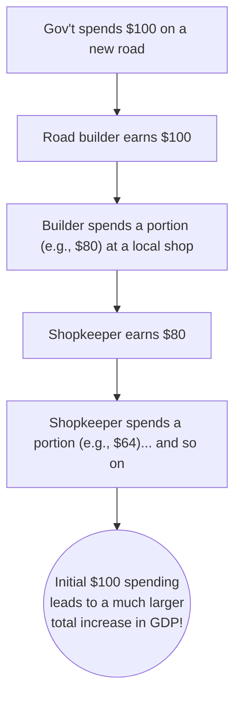

## 🚀 Reading 14: Fiscal Policy

### 🎯 Introduction

Welcome, future charterholder! Think of the economy as a car. Sometimes it's going too slow (a recession), and sometimes it's going too fast and overheating (high inflation). The government has two main controls to manage this speed: **Monetary Policy** (the central bank controlling the fuel supply/interest rates) and **Fiscal Policy**.

**Fiscal Policy** is the government itself using the accelerator (government spending) and the brake (taxes) to steer the economy. Need to speed up? The government can spend more on infrastructure or cut taxes to give people more money to spend. Need to cool things down? It can cut spending or raise taxes. This reading is your driver's manual for understanding how the government uses these powerful tools to manage economic growth, and the challenges it faces along the way. 🚗💨

-----

### Part 1: The Two Levers of Power - Fiscal vs. Monetary Policy ⚖️

While both policies aim to achieve economic targets like stable growth and low inflation, they are operated by different drivers and work in different ways.

| Feature | Fiscal Policy (The Government) 🏛️ | Monetary Policy (The Central Bank) 🏦 |
| :--- | :--- | :--- |
| **Who's in Charge?** | The national government (e.g., the Ministry of Finance in India, the U.S. Treasury). | The central bank (e.g., the Reserve Bank of India, the U.S. Federal Reserve). |
| **Primary Tools** | • Government Spending • Taxation | • Policy Interest Rates • Reserve Requirements • Open Market Operations |
| **How it Works** | Directly impacts **aggregate demand** through spending and indirectly through taxes affecting consumer spending. | Influences the supply of money and credit to affect interest rates, which then influences private spending and investment. |
| **Political Process** | Often slow and subject to political debate and compromise. | Generally independent and can act much more quickly. |

  * **Expansionary Policy:** Aims to boost the economy.
      * Fiscal: Cut taxes or increase spending. This leads to a larger **budget deficit** (spending \> revenue) or a smaller **budget surplus** (revenue \> spending).
      * Monetary: Cut interest rates or increase the money supply.
  * **Contractionary Policy:** Aims to slow the economy down.
      * Fiscal: Raise taxes or decrease spending.
      * Monetary: Raise interest rates or decrease the money supply.

> [\!TIP]
> **CFA Exam Tip ✍️:** The exam will definitely test your ability to distinguish between fiscal and monetary policy. Remember: **Fiscal = Government (Spending/Taxes)**. **Monetary = Central Bank (Money Supply/Interest Rates)**. It's a fundamental distinction.

-----

### Part 2: The Government's Game Plan - Roles & Objectives of Fiscal Policy 🎯

Beyond just managing the business cycle, fiscal policy serves several key functions in an economy.

**Primary Objectives:**

1.  **Influence Aggregate Demand:** This is the main cyclical role—stimulating the economy during a recession and reining it in during an inflationary boom.
2.  **Redistribute Wealth and Income:** Through progressive taxation (taxing the rich at a higher rate) and social spending (like unemployment benefits or healthcare), governments can aim to reduce inequality.
3.  **Allocate Resources:** Governments can direct funds towards specific sectors they want to promote, such as green energy, defense, or infrastructure.

#### **The National Debt: A Ticking Time Bomb or Just an IOU? 💣**

When a government runs a budget deficit, it has to borrow money, adding to the **national debt**. There's a huge debate about whether a large national debt is a problem.

##### **Arguments that Debt is a Problem 😟**

  * **Higher Future Taxes:** Today's debt must be paid back by tomorrow's taxpayers, which could dampen future growth.
  * **Crowding-Out Effect:** Heavy government borrowing can drive up interest rates, making it more expensive for private companies to borrow and invest. The government "crowds out" private investment.
  * **Market Instability:** If debt levels become too high, investors might lose confidence and refuse to lend to the government, triggering a financial crisis.

##### **Arguments that Debt is NOT a Big Deal 😎**

  * **It's Owed to Ourselves:** If the debt is primarily held by the country's own citizens, it's like a transfer from one group (taxpayers) to another (bondholders).
  * **It Funds Growth:** If the borrowed money is used for productive investments (like building highways or high-speed rail), the resulting economic growth can easily pay for the debt.
  * **Ricardian Equivalence:** A clever theory that says people are smart. When the government runs a deficit, they know taxes will have to rise in the future, so they save more today. This private saving perfectly offsets the government borrowing, and there is no net effect on aggregate demand.
  * **It's Only a Problem at Full Employment:** If the economy has lots of unemployed resources, government spending doesn't crowd out private investment; it puts those idle resources to work.

-----

### Part 3: The Tools of the Trade and The Multiplier Magic ✨

The government has two types of tools in its fiscal toolbox.

#### **Fiscal Policy Tools**

1.  **Spending Tools:**

      * **Current Spending:** On goods and services (e.g., defense, government worker salaries).
      * **Capital Spending:** On long-term infrastructure projects.
      * **Transfer Payments:** Payments to individuals (e.g., unemployment benefits, social security). These are *not* included in GDP directly but work by increasing household income.

2.  **Revenue Tools (Taxes):**

      * **Direct Taxes:** Levied on income or wealth (e.g., income tax, corporate tax).
      * **Indirect Taxes:** Levied on goods and services (e.g., GST in India, VAT in Europe, sales taxes).

#### **The Fiscal Multiplier: A Ripple Effect 🌊**

A key Keynesian concept is the **fiscal multiplier**. It says that an initial change in government spending has a magnified final impact on the economy.

The size of this ripple effect is determined by the formula:

$$\text{Fiscal Multiplier} = \frac{1}{1 - MPC(1-t)}$$

Where:

  * **MPC** = **Marginal Propensity to Consume** (the fraction of each new dollar of disposable income that people spend).
  * **t** = The tax rate.

A $1 cut in taxes also has a multiplier effect, but it's smaller than the spending multiplier because people will save a portion of the tax cut. This leads to the **balanced budget multiplier** concept: if the government increases spending and taxes by the same amount, it still has a net expansionary effect on the economy.

-----

### Part 4: The Real World - Why Fiscal Policy is So Hard 🚧

In theory, fiscal policy is a powerful tool. In practice, its implementation is plagued with challenges.

  * **Recognition Lag:** It takes time for policymakers to recognize that the economy is in a recession or a boom.
  * **Action Lag:** The political process of debating, passing, and implementing a new spending bill or tax law can take months or even years.
  * **Impact Lag:** Once a policy is in place, it takes time for its full effects to ripple through the economy via the multiplier.

By the time a fiscal stimulus package actually starts working, the recession might already be over, and the stimulus could end up just causing inflation\!

> [\!TIP]
> **CFA Exam Tip ✍️:** The three lags (**Recognition, Action, Impact**) are a classic exam topic. Understand that these long and variable lags are the biggest argument against using discretionary fiscal policy to fine-tune the economy.

-----

### 🧪 Formula Summary

  * **Fiscal Multiplier:**
    $$\text{Multiplier} = \frac{1}{1 - MPC(1-t)}$$
  * **Change in Aggregate Demand (from Gov't Spending):**
    $$\Delta AD = \text{Multiplier} \times \Delta G$$

-----

> [\> IMPORTANT]
>
> ### 🎯 Quick Exam-Day Pointers
>
>   * **Accelerator & Brake:** Think of fiscal policy this way: **Spending is the accelerator. Taxes are the brake.**
>   * **The Multiplier is Key:** Government spending has a bigger "bang for the buck" than a tax cut of the same size because a portion of any tax cut will be saved.
>   * **Crowding Out:** Remember that expansionary fiscal policy (more government borrowing) can lead to higher interest rates, which "crowds out" private investment. This is a key disadvantage.
>   * **Know the Lags:** The **Recognition, Action, and Impact lags** make fiscal policy a blunt and slow instrument, often making it difficult to use effectively for short-term economic management.
>   * **Automatic Stabilizers:** Don't forget these\! Things like unemployment benefits automatically kick in during a recession, providing stimulus without any new political action. They are a crucial, built-in feature of modern fiscal policy.