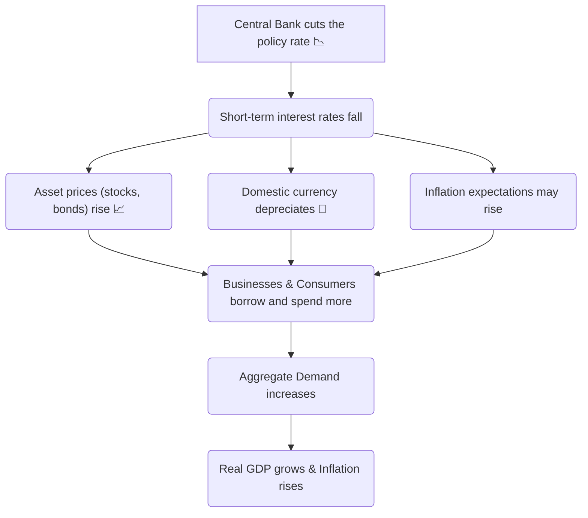

## 🚀 Reading 15: Monetary Policy

### 🎯 Introduction

Welcome, future charterholder! If fiscal policy is the government using the accelerator and brake, **monetary policy** is the work of the economy's master mechanic: the **central bank**. 🧑‍🔧 Think of the Reserve Bank of India (RBI) or the U.S. Federal Reserve (the Fed). Their job isn't to drive the car, but to fine-tune the engine.

They control the flow of fuel (the **money supply**) and regulate the engine's temperature (**interest rates**) to keep the economy running smoothly—not too hot (high inflation) and not too cold (recession). This reading is your look under the hood. We'll explore the central bank's tools, its goals, and the challenges it faces in keeping the economic engine humming.

-----

### Part 1: The Central Bank's Job Description 📋

Central banks are the powerful, independent guardians of a country's financial system. They have several key roles, but one primary mission.

**Key Roles of a Central Bank:**

  * **Sole Supplier of Currency:** The central bank is the only entity that can print money. This money, not backed by a physical commodity like gold, is called **fiat money**.
  * **Banker to the Government and Other Banks:** It manages the government's accounts and provides banking services to commercial banks.
  * **Lender of Last Resort:** If a commercial bank is in trouble and can't get funds elsewhere, the central bank can step in to provide emergency loans, preventing a wider financial crisis.
  * **Regulator of the Payments System:** It ensures the smooth and secure functioning of payment systems, from checks to digital transfers.

#### **The \#1 Objective: Price Stability 🎯**

While some central banks have multiple goals (like the U.S. Fed's "dual mandate" of maximum employment *and* stable prices), the single most important objective for most is **price stability**. This means keeping inflation low, stable, and predictable.

Why not aim for zero inflation? Because that gets dangerously close to **deflation** (falling prices), which can be disastrous for an economy. Most developed countries target an inflation rate of around **2% to 3%**.

-----

### Part 2: The Three Magic Wands of Monetary Policy ✨

How does a central bank actually control the economy? It has three primary tools to either inject money and stimulate growth (**expansionary policy**) or drain money and slow things down (**contractionary policy**).

| Tool | Expansionary Action ("Loosening") ✅ | Contractionary Action ("Tightening") ❌ |
| :--- | :--- | :--- |
| **1. The Policy Rate** | **Decrease** the rate | **Increase** the rate |
| **2. Reserve Requirements** | **Decrease** the requirement | **Increase** the requirement |
| **3. Open Market Operations** | **Buy** government securities | **Sell** government securities |

1.  **The Policy Rate:** This is the interest rate the central bank charges commercial banks for short-term loans. In India, this is the **Repo Rate**. In the U.S., the Fed targets the **federal funds rate**. Lowering this rate makes it cheaper for banks to borrow, encouraging them to lend more, which lowers interest rates throughout the economy.
2.  **Reserve Requirements:** This is the percentage of deposits that commercial banks are legally required to hold in reserve and cannot lend out. Lowering this frees up more cash for banks to lend. This tool is powerful but used infrequently.
3.  **Open Market Operations (OMOs):** **This is the most important and frequently used tool.**
      * To expand the money supply, the central bank **buys** government bonds from commercial banks. It pays for these bonds by crediting the banks' reserve accounts, injecting new money into the system.
      * To contract the money supply, it **sells** bonds to banks, draining money out of the system.

#### **The Monetary Transmission Mechanism: The Ripple Effect 🌊**

A change in the policy rate doesn't just stay at the central bank. It ripples through the entire economy. This is the **monetary transmission mechanism**.

> [\!TIP]
> **CFA Exam Tip ✍️:** **Open Market Operations are the star of the show.** The exam will almost certainly test your understanding of how OMOs work. Remember: **Buy = Bigger** (money supply). **Sell = Smaller** (money supply).

-----

### Part 3: The Art of Central Banking - Credibility and Limitations 🧑‍🎨

For monetary policy to work, a central bank needs to be more than just powerful; it needs to be effective. This requires three key qualities.

1.  **Independence:** It must be free from political interference. If politicians could force the central bank to print money to fund their projects, it would lead to hyperinflation.
2.  **Credibility:** The public and the markets must believe that the central bank will do what it says it will do. If the RBI says it is committed to a 4% inflation target, its credibility makes that target a self-fulfilling prophecy.
3.  **Transparency:** It must clearly communicate its policies, goals, and economic outlook. This helps manage expectations and reduces market uncertainty.

#### **Limitations of Monetary Policy**

Even the best central banker can't solve every problem.

  * **The Zero Lower Bound & Liquidity Traps:** Interest rates can't be lowered below zero. If the economy is very weak and the policy rate is already at or near zero, the central bank is "out of ammo." This is a **liquidity trap**. In this situation, central banks may turn to unconventional policies like **Quantitative Easing (QE)**—large-scale purchases of bonds to inject massive amounts of liquidity into the system.
  * **Banks Won't Lend:** The central bank can give banks more reserves, but it can't force them to lend if they are too risk-averse.
  * **Inflation Expectations:** Sometimes long-term rates can move opposite to the policy rate if the market believes a central bank's actions will lead to high inflation in the future.

-----

### Part 4: The Policy Dance - Fiscal and Monetary Interaction 💃🕺

The economy's direction depends on the combined moves of fiscal and monetary policy. Think of it as two people dancing—they can move together, or they can pull in opposite directions.

| Policy Mix | Fiscal Policy | Monetary Policy | Likely Outcome |
| :--- | :--- | :--- | :--- |
| **Scenario 1** | **Expansionary** (Spending ↑, Taxes ↓) | **Expansionary** (Rates ↓) | **Maximum Growth.** Aggregate demand surges. Interest rates are low. Both public and private sectors expand. |
| **Scenario 2** | **Contractionary** (Spending ↓, Taxes ↑) | **Contractionary** (Rates ↑) | **Maximum Slowdown.** Aggregate demand falls sharply. Interest rates are high. Both sectors contract. |
| **Scenario 3** | **Expansionary** (Spending ↑, Taxes ↓) | **Contractionary** (Rates ↑) | **Crowding Out.** High interest rates from tight monetary policy and government borrowing curb private investment. The public sector grows at the expense of the private sector. |
| **Scenario 4** | **Contractionary** (Spending ↓, Taxes ↑) | **Expansionary** (Rates ↓) | **Private Sector Boom.** Low interest rates stimulate private investment and consumption. The private sector grows while the public sector shrinks. |

> [\!TIP]
> **CFA Exam Tip ✍️:** The four policy mix scenarios are a classic topic. The most interesting (and most tested) are scenarios 3 and 4, where the policies are working against each other. Understand who wins and who loses in these situations (e.g., in scenario 3, the government crowds out private companies).

-----

### 🧪 Formula Summary

This reading is highly conceptual. There are **no key formulas** you need to memorize. The focus is on understanding the roles, tools, and effects of central bank actions.

-----

> [\!IMPORTANT]
>
> ### 🎯 Quick Exam-Day Pointers
>
>   * **Know the Tools:** **Policy Rate**, **Reserve Requirements**, and **Open Market Operations**. OMOs are the most important.
>   * **Buy vs. Sell:** Central bank **buying** securities is **expansionary**. **Selling** securities is **contractionary**.
>   * **The 3 Virtues:** An effective central bank is **Independent**, **Credible**, and **Transparent**.
>   * **Beware the Zero Lower Bound:** Monetary policy loses its power when interest rates hit zero. This is when unconventional tools like **Quantitative Easing (QE)** come into play.
>   * **The Policy Mix Matters:** The final impact on the economy depends on how fiscal and monetary policies are working together—or against each other.